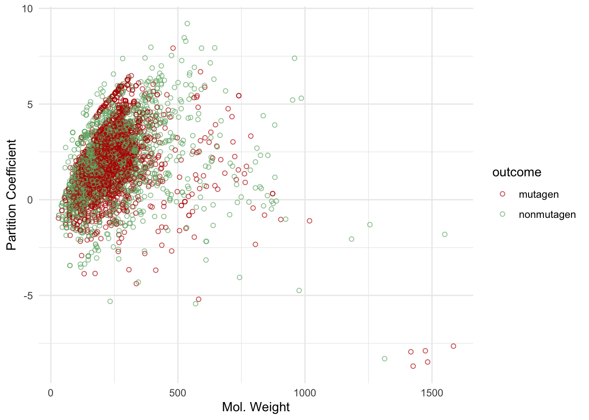

# Part 2 -- Machine Learning with R


## Learning objectives

After this lesson:

- You will be able to explore data suited for training a machine learning algorithm
- Perform a number of unsupervised exploratory analysis (PCA, t-SNE, k-Means)
- Build a predictive toxicity model, based on chemical fingerprints
- Build a model to predict the partition coefficient (LogP), based on fingerprints
- Enrich your data using an external data source (Tox21 dataset)
- (Perform a biological read across, based on compound similarity)

## Machine Learning
The term machine learning refers to a field of computational science and applications, where methods are used and developed that can 'learn' from data to solve specific tasks. In classicial machine learning these tasks are mostly related to classification. Machine Learning, of short ML, is considered a subfield of Artificial Intelligence and is considered as methods (or models / algorithms) that are trained on (sample) data to to make predictions or or decisions, without explicitly being programmed to do so. The following figure tries to convey the difference between classical problem solving using a rule based approach and modern ML.
For a gently introduction see [this wiki page](https://en.wikipedia.org/wiki/Machine_learning)

## Learning more; TAME
If after this course you would like to learn more about applying ML in Toxicology, the [The TAME Toolkit](https://github.com/UNCSRP/Data-Analysis-Training-Modules) for Introductory Data Science, Chemical-Biological Analyses, Predictive Modeling, and Database Mining for Environmental Health Research is a good place to start learning. Some of the examples in this lesson were taken from [chapter 2.2 of the TAME Bookdown project](https://uncsrp.github.io/Data-Analysis-Training-Modules/machine-learning-and-predictive-modeling.html#machine-learning-and-predictive-modeling)

[Reference:](https://doi.org/10.3389/ftox.2022.893924) Roell, K., Koval, L. E., Boyles, R., Patlewicz, G., Ring, C., Rider, C. V., Ward-Caviness, C., Reif, D. M., Jaspers, I., Fry, R. C., & Rager, J. E. (2022). Development of the InTelligence And Machine LEarning (TAME) Toolkit for Introductory Data Science, Chemical-Biological Analyses, Predictive Modeling, and Database Mining for Environmental Health Research. Frontiers in toxicology, 4, 893924. https://doi.org/10.3389/ftox.2022.893924

## Tidymodels
The Tidymodels framework is an extension of the `{tidyverse}` suite. It is especially focused towards providing a generalized way to define, run and optimize models in R. To get started we will walk you though the 'getting started' part of the [Tidymodels documentation](https://www.tidymodels.org/start/)

To learn more on Tidymodels, there is a very elaborate [bookdown project](https://www.tmwr.org)

## Packages

```r
library(tidymodels)
```

```
## ── Attaching packages ────────────────────────────────────── tidymodels 1.1.0 ──
```

```
## ✔ broom        1.0.4     ✔ recipes      1.0.6
## ✔ dials        1.2.0     ✔ rsample      1.1.1
## ✔ dplyr        1.1.2     ✔ tibble       3.2.1
## ✔ ggplot2      3.4.2     ✔ tidyr        1.3.0
## ✔ infer        1.0.4     ✔ tune         1.1.1
## ✔ modeldata    1.1.0     ✔ workflows    1.1.3
## ✔ parsnip      1.1.0     ✔ workflowsets 1.0.1
## ✔ purrr        1.0.1     ✔ yardstick    1.2.0
```

```
## ── Conflicts ───────────────────────────────────────── tidymodels_conflicts() ──
## ✖ purrr::discard() masks scales::discard()
## ✖ dplyr::filter()  masks stats::filter()
## ✖ dplyr::lag()     masks stats::lag()
## ✖ recipes::step()  masks stats::step()
## • Learn how to get started at https://www.tidymodels.org/start/
```

```r
library(tidyverse)
```

```
## ── Attaching core tidyverse packages ──────────────────────── tidyverse 2.0.0 ──
## ✔ forcats   1.0.0          ✔ readr     2.1.4.9000
## ✔ lubridate 1.9.2          ✔ stringr   1.5.0.9000
```

```
## ── Conflicts ────────────────────────────────────────── tidyverse_conflicts() ──
## ✖ readr::col_factor() masks scales::col_factor()
## ✖ purrr::discard()    masks scales::discard()
## ✖ dplyr::filter()     masks stats::filter()
## ✖ stringr::fixed()    masks recipes::fixed()
## ✖ dplyr::lag()        masks stats::lag()
## ✖ readr::spec()       masks yardstick::spec()
## ℹ Use the conflicted package (<http://conflicted.r-lib.org/>) to force all conflicts to become errors
```

```r
library(broom.mixed) # for converting bayesian models to tidy tibbles
library(dotwhisker)  #
```

## Data 
For this lesson we will use a number of different datasets. Because we need datasets that include somewhat larger volumes of data, we also download data on the fly.

Let's get the datasets 

### Mutagen
A dataset from [Github](https://github.com/simonpcouch/mutagen)

```r
load(
  here::here(
    base_folder,
    "data",
    "mutagen",
    "data",
    "mutagen_tbl.Rda"
  )
)
```

### Chemical_Lists_PFAS-Statins from the EPA
This datset was curated and povided in the TAME project mentioned above
It can be directly downloaded from Github

```r
url <- "https://raw.githubusercontent.com/UNCSRP/Data-Analysis-Training-Modules/main/Chapter%202/2.2%20ML%20Predictive%20Modeling/Module2_2_Chemical_Lists_PFAS-Statins.csv"

data_tame <- read_csv(
    url, 
    locale = readr::locale(encoding ="UTF-8")
    )
```

```
## Rows: 144 Columns: 14
## ── Column specification ────────────────────────────────────────────────────────
## Delimiter: ","
## chr  (4): List, Substance Name, CASRN, DTXSID
## dbl (10): Molecular Weight, OPERA, Boiling Point, OPERA, Henry's Law Constan...
## 
## ℹ Use `spec()` to retrieve the full column specification for this data.
## ℹ Specify the column types or set `show_col_types = FALSE` to quiet this message.
```

### Tox21 end Chembl, using the [biobricks.ai bricks](https://biobricks.ai/) 
Biobricks.ai is developed by researcher Dr. Tom Luechtefeld as a 'data-as-dependency' approach. By integrating large public databases into so-called bricks, the database data can be accessed through a standardized api and downloaded to a local machine or Virtual Machine. The bricks are version controlled, so this enables a reproducible workflow.
We will not use this data in this lesson, but it will get you started in finding and downloading data for your own modelling purposes. To get started on Biobricks, the code below will get you the 'tox21' brick.


```r
devtools::install_github("biobricks-ai/bricktools")
## Tip, set you Github token in your RStudio sessionusing 'credentials::set_github_pat(), enter a token at the prompt

tox21_tbls  <- purrr::imap_dfr(tbls,~ tibble(tbl=.y,rows=nrow(.x))) |> arrange(desc(rows))
tox21_names <- purrr::imap_dfr(tbls,~ tibble(tbl=.y,name=names(.x)))

ids <- tox21_names |> filter(grepl("ID$",name))
ids <- ids |> split(ids$name) |> discard(~nrow(.)<2) 
names(ids)
tox21_names 

## look at one table
x <- tbls$`tox21-ache-p3.aggregrated.parquet` |> dplyr::collect()
x

data_all <- 
  map(
    .x = tbls,
    .f = dplyr::collect
  )
```


### QSAR data

An example dataset that contains classical chemical fingerprints.
[From the UCL repository](https://archive.ics.uci.edu/ml/datasets/QSAR+oral+toxicity)

Metadata:
Attribute Information:

1024 binary molecular fingerprints and 1 experimental class:
1-1024) binary molecular fingerprint
1025) experimental class: positive (very toxic) and negative (not very toxic)

Relevant Papers:

[D. Ballabio, F. Grisoni, V. Consonni, R. Todeschini (2019), Integrated QSAR models to predict acute oral systemic toxicity, Molecular Informatics, 38, 180012; doi: 10.1002/minf.201800124](https://doi.org/10.1002/minf.201800124)

Files `ID.txt`,`class.csv` and `X.csv` in folder `./data/lesson5/qsar` were obtained from the author of the paper above via personal communication. Orinal sources files (Matlab scripts and matrix files can be downloaded from the paper's DOI as supplemental data). They are included here for reproducibility reasons in `./data/lesson5/qsar/oral_toxicity_data.rar`

The code below downloads the data to a the `./data` folder and unzips the file in a temporary folder. We read the file into R from that temp file.

```r
path <- here::here(
  base_folder,
  "data",
  "qsar_oral_toxicity.zip"
)

download.file(url = "https://archive.ics.uci.edu/ml/machine-learning-databases/00508/qsar_oral_toxicity.zip", destfile = path)

unzip(zipfile = path, exdir = here::here(
  base_folder, "data")
)

## load the data
```

## Tidymodels - overview

### Tidymodels core packages
[The core Tidymodels collection of packages consists of](https://www.tidymodels.org/packages/)

 - `{rsample}` - for splitting and resampling data
 - `{parsnip}` - provides an unified interface for different models
 - `{recipes}` - for pre-processing data
 - `{workflows}` - 
 - `{tune}`
 - `{yardstick}`

The tidymodels packages allow you to specify, run, fine tune and evaluate models in a consistent way. They provide a workflow for defining and updating modelling approaches and take away the effort of accomodating syntactical differences between different model implementations, so that you can focus on the stuf that is really important. 

To my experience, the overall workflow is a little hard to get your head around initially, but putting in the effort to really understand it, pays off in the long run. Certainly, I am finding myself less busy with diving into the specific documentation of a model engine, but focussing more on the actual modelling part of the job!   

The steps we need to walk though are:

 1. Generate a training and a testing partition of the data. This can be done in several ways: Splitting into a single test and training set or genrating multiple so-called `folds`, that contain multiple (random) splits. It is crucial to understand the data before splitting. For example, you need to be able to provide answer to the question whrther the 'thing' you are trying to predict is present equally in the data, or that (e.g. in a binary classification, there are many more instances of one class, compared to the other) 
 1. Define a `{recipe}` for which variables and which dataset we would like to use for modelling. The recipe also holds so called `steps` that include any preprocessing we would need for the model we would like to fit. Different models have diffenrent requirements for preprocessing. See: for an overview [the Tidymodels Bookdown](https://www.tmwr.org/pre-proc-table.html) 
 1. A model `specification`, that contains the details on which model to run and which values to set for the hyperparameters of a model. Hyperparameters can be viewed as the dials with which you tune the model. They regulate e.g. overfitting or number of interactions. Tuning a models is an important aspect of modelling and can be done in several ways. A very structured way to find the most optimal hyperparameters is `grid tuning`. The `{tune}` package is facilitating this in the tidymodels suite.   
 1. Definition of the model `metrics` that will help decide how well the fit of the model is for the data 
 1. A `workflow` where the recipe and the model specification come together. This is the 'wedding planner' of the tidymodels. It can be considered as the plan for the model (without actually running the model) 
 1. A model `fit`. This is the step where actually run out model, or models, and _fit_ the model to our data. From the fit we can extract the metrics, predictions, statistics and other valuable information that tells us how the model to the data.

### Getting started with `{tidymodels}`

If we put the complete `{tidymodels}` workflow together we can define all the models and run them on our `mutagen` data. Here we will focus on just one model to see all the step described above in sequence 
The complete code for running all the models shown in the plot above can be found in the mutagen repo: https://raw.githubusercontent.com/simonpcouch/mutagen/main/source/fit.R

See also: [`{tidymodels}`] getting started documentation](https://www.tidymodels.org/start/) 

### Build our first model with Tidymodels for mutagens
Clean up the names. As a convention, I like to put everything in lowercase. This saves brainpower by not having to ever worry about catitals. Same thing for `snake_case`. I like that best for readability. 

The code for modelling the `mutagen` data was adapted from https://github.com/simonpcouch/mutagen.

### Clean names mutagen data

```r
mutagen_tbl <- mutagen_tbl |> janitor::clean_names()
```

### Load processed modelling results
The `mutagen` data was already fitted with a number of models. The Github repo contains the fitting results, which we load here.

```r
load(
  here::here(
    base_folder,
    "data",
    "mutagen",
    "data",
    "metrics_wf_set.Rda"))
load(here::here(
    base_folder,
    "data",
    "mutagen",
    "data",
    "metrics_xgb.Rda"))
load(here::here(
    base_folder,
    "data",
    "mutagen",
    "data",
    "xgb_final_fit.Rda"))
load(here::here(
    base_folder,
    "data",
    "mutagen",
    "data",
    "final_fit.Rda"))
```

### Plotting the data
As a first step in modeling, it’s always a good idea to plot the data.
Here we plot two important determining attributes for chemicals: the `Molecular Weight` and the `Partition Coefficient`


```r
ggplot(mutagen_tbl) +
  aes(x = mw, y = mlogp, color = outcome) +
  geom_point(shape = 1, alpha = 0.7) +
  labs(x = "Mol. Weight", y = "Partition Coefficient") +
  theme_minimal() +
  scale_color_manual(values = c("#ba0600", "#71b075"))
```



You could repeat this visualization step with using different sets of variables. Then you will probably learn that no two variables can easily split the data into mutagens and non-mutagens. In order to build a predictive model that can predict the class of a compound (mutagen or non-mutagen), we need a more advanced method. Below we will build a logistic regression prediction model to illustrate all the steps in the tidymodels workflow. We choose logistic regression here as the model that does not have the lowest performance of all the models tested, and it the more simpler model of the ones that have a good performance. Depending on the nature and intended use of the prediction model, it may not always be feasible to choose the most complex and lesser explainable model. The following section shows the performance results of six different models that were run on the `mutagen` data. 

### Evaluating multiple models
The previously run modelling results (model performance) experiments with the `mutagen` dataset can be visualized, using the dataframe containing the model metrics. Which model is best? Which is worst?


### Tidymodels workflow illustration on the `mutagen` data
Let's put all the pieces of the complete tidymodels workflow together and run a logistic model on a single split (1-fold cross validation) of the `mutagen` data.

Here is how the steps look in a diagram

```r
knitr::include_graphics(
  here::here(
    base_folder,
    "images",
    "tidymodels-pkgs.png"
  )
)
```


