# Part 1 -- Introduction to R and RStudio


## Contents day 1

 - Intro to R and RStudio
 - </mark>Getting the materials from Github XXX</mark>
 - R-syntax, objects, data types and classes
 - RMarkdown


**Make sure you code along with the examples.** Try to replicate what the reader is doing!

## Starting to work within a project

 - **In the preparation for this course, you made a project. Open this project.**

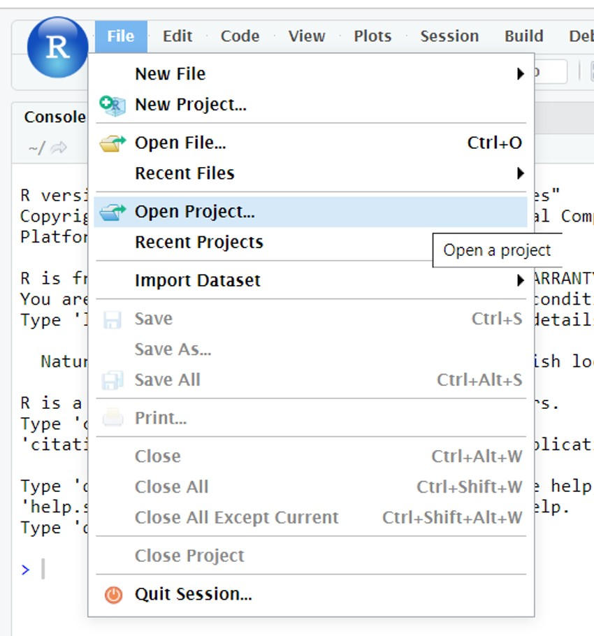

<mark>Do you have _some_ coding experience? You will probably know vectors and basic console use then. Skip to [the section on more complicated data structures (click)](#secondstart)</mark>

### Running code in Rstudio

To execute R functions / code there are two options:

 * Directly in the R console  (the code is not saved)
 * Write a script. (the code can be saved)

The preferred method is to enter the code in a script. Writing and executing R code by using a script has several  advantages: 

1 The code can be saved and therefore is reproducible. 
2 The code can be shared between researchers
3 The code can be made clear by adding comments using the # sign
4 The code can be re-used for other purposes

In contrast to R script, your code will be lost if you directly enter and execute the code in the R console. 

**To create an R script: click on the "green" plus sign and select R script (see Figure \@ref(fig:openscript))**

<div class="figure">
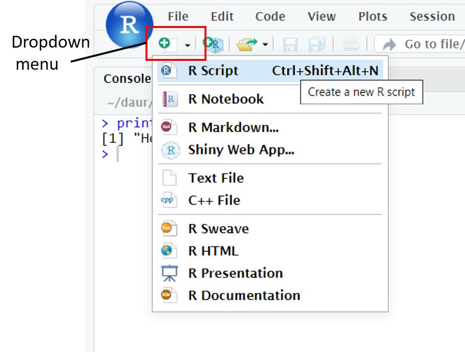
<p class="caption">(\#fig:openscript)creating a new R script in Rstudio</p>
</div>

A new script has opened in the upper left part of the screen.

**Try typing `2+2` in your new script**

To execute this command: **Put the cursor on the line of code of interest and press Ctrl + enter**

alternatively:

 - Make a selection of lines of code and press Ctrl + enter.
 - To source the entire script press ctrl + shift + s  
 - To run the entire script, click the green arrow with "run" next to it on the top right corner of your script.


The **OUTPUT** of the line of code will be visible in the R Console or if making a graph in the Plots panel in the lower right window (see Figure \@ref(fig:examplescript))**

<div class="figure">
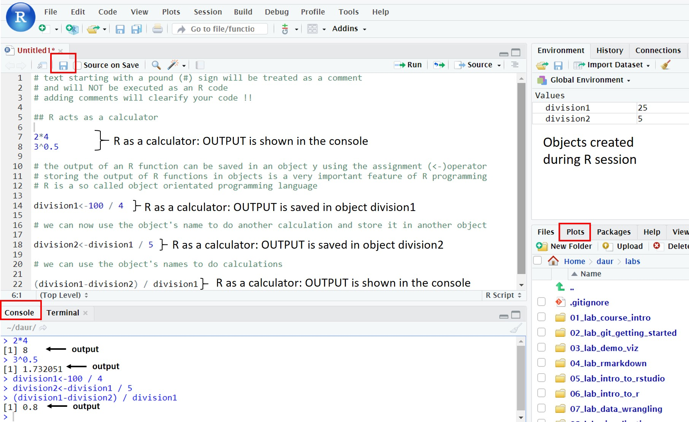
<p class="caption">(\#fig:examplescript)Example of an R script</p>
</div>

**Read the code + comments in figure  \@ref(fig:examplescript) carefully to understand the principle of an R script. Two object were created and saved in the Environment panel in the top right.

Importantly, within an R script any text starting with a # sign will be treated as text only. This is very useful to write comments on why you're using a particular code. The actual lines of code are:


```{.r .Rchunk}
2*4
3^0.5                          ## ^ sign means to the power to
division1 <- 100 / 4           ## create an object named  division1
division2 <- division1  /  5   ## create an object named  division2 based on object division1
(division1 - division2) / division1 ## you can use brackets
```

To save an R script simply press Ctrl+S or click on file and click on the **save** or **save as** options. The code will be saved in your RProject folder 

### Variables

**Copy and paste the lines in the grey block above into a new script and run the script (select the lines and press ctrl+enter OR click on "Run" on the top right above your script).**

We have made two variables in the 5 lines of code (or objects, anything in R is an object. On the internet, you will see "variable" and "object" used interchangeably when talking about R:. What are known as objects in R are known as variables in many other programming languages). You can find all objects created in a session in the upper right window, within the "environment" tab. **(find the environment tab)** If you ran the script correctly, division1 and division2 should be visible there (see also figure  \@ref(fig:examplescript) above).

Objects are created with the assignment operator 
`<-`
It assigns the stuff on the right to an object on the left. So, after running `division1 <- 100 / 4` , the value of division1 is 25. We will dive into this in lesson 2. 

**Type division1 into the console window to see its contents.**


<div class="question">
##### Exercise 1 {-} 

Write an R **script** (so not in the console) that calculates the 95% confidence interval from a sample  with 60 datapoints (n) with a given sample mean and sample standarddeviation. Follow the steps below.

The equation for a 95% confidence interval is:

$xgem \pm 1,96 * \frac{s}{\sqrt{n}}$

with: **$xgem$** : sample mean, **$s$**: sample standard deviation, **$n$** : amount of measurements

Do the following:

 - open a new R script
 - first make 3 objects, on 3 separate lines:
   - `xgem` contains the number 50
   - `s` contains the number 4
   - `n` contains the number 60
 - on the fourth line, make an object that contains the square root of n (remember that ${\sqrt{n} = n^{0.5}}$)
 - on the fifth and sixth line, write the equations for the lower and upper boundary of the 95% confidence interval. Use the objects you made. Don't forget the brackets () !

</div>

<details><summary>Click for the answer</summary>

```{.r .Rchunk}
xgem <- 50
s <- 4
n <- 60
sqrootn <- n^0.5
xgem - (1.96*(s/sqrootn)) # lower
```

```{.Rout}
## [1] 48.98786
```

```{.r .Rchunk}
xgem + (1.96*(s/sqrootn)) # upper
```

```{.Rout}
## [1] 51.01214
```
</details>

### Functions

<div class="question">
##### Exercise 1 {-} 
**Make a new variable called length_myname, which contains a number representing the length of your first name. For example, type in the script: `length_myname <- 7`**
</div>

<details><summary>Click for the answer</summary>

```{.r .Rchunk}
# for example if your name is "Bas" :
length_myname <- 3
```
</details>

We can actually ask R: to calculate the length if we want.

**Type in the script (replace my name with yours) and run the lines (select them and press Ctrl + enter):**


```{.r .Rchunk}
myname <- "alyanne"
nchar(myname)
```

The number of characters in your name should appear in the console.

We have just used a **function**. Functions allow you to automate common tasks, such as count the characters in a word, or calculate the mean of a series of numbers. Functions generally want some input (such as the word or the numbers), which is placed between round brackets: 
`function_name(input)`

For instance, there is a function to calculate the square root of something, called `sqrt()`:


```{.r .Rchunk}
sqrt(25)
```

```{.Rout}
## [1] 5
```

### Packages and libraries

R has many build in functions, but you add more by writing them yourself (we won't cover that in this course) or by installing *packages* with functions other people have written. The R: community is very active, and also very open-source. There are a lot (!) of packages available online for free.
 In this course we have already preinstalled most packages you need.

A package needs to be loaded in R though, by the function `library()`. 

<div class="tip">
A package only needs to be installed once but needs to be loaded every time you have closed Rstudio.

Start all our scripts with loading the packages you are going to use.
</div>

A package that we will extensively use during this course is named "tidyverse". 

**So start your scripts within this course with:**

```{.r .Rchunk}
library(tidyverse)
```

### The help function

Each function in R operates with a set of arguments. To check how a function in R operates, type a question mark in the console followed by the name of the function. For example to generate a sequence of numbers we use the function seq(). **To see how it works type:**


```{.r .Rchunk}
?seq()
```

<!-- The OUTPUT of the help function will be displayed at the Help panel in the lower right corner of the screen. Often the text is a generic and technical description of the function and its arguments. It can be very hard to read and understand. (see Figure  \@ref(fig:seqhelp)). -->

<!-- ```{r seqhelp, echo=FALSE, message=FALSE, out.width = "60%",fig.cap = "Output of ?seq() in Rstudio"} -->
<!-- knitr::include_graphics("images/01_16_seq_help.JPG") -->
<!-- ``` -->

<!-- The Arguments section describes the default values of the arguments. If the value of an argument =NULL, the argument is not used by default unless you invoke the argument by providing a value -->

<!-- We note that the seq() function minimally takes three arguments: -->

<!-- * The start of the sequence: from= -->

<!-- * The end of the sequence: to= -->

<!-- * The stepsize: by=  -->

<!-- The most useful part of the Help panel is to Scroll down to the Examples section (see Figure \@ref(fig:seqhelp2)).  -->

<!-- ```{r seqhelp2, echo=FALSE, message=FALSE, out.width = "60%",fig.cap = "Examples of how to use the seq() function "} -->
<!-- knitr::include_graphics("images/01_17_seq_help2.JPG") -->
<!-- ``` -->

<!-- Alternatively in google (or your favorite search engine), type,  "r seq function example" and select a page with examples. It takes a bit of practice to use the internet to search for good examples but it will certainly pay off in the long run. -->

<!-- ### DIY -->
<!-- As a reminder: -->

<!-- We expect you to try things yourself during this course. When reading the lessons, try all the examples in R. So open Rstudio on the server, copy-paste the examples in a script and run them. *Play around with the code.* You will not learn R: by watching someone else write it, or by reading about it. This is a skill that you will need to practice.  -->

<!-- So in the following example, first copy-paste the example (hoover and click in right corner) to your script and run the lines of code (select them and press ctrl-enter). R will print the characters in alphabetical order in the console window. What would you need to type to get the reverse order? type ?sort in the console or Google it and try it! -->

<!-- ###### Example -->
<!-- ```{r eval=F} -->
<!-- sesamstraat <- c("ernie", "bert", "elmo", "pino", "grover", "kermit", "ms piggy", "koekiemonster") -->
<!-- sort(sesamstraat) -->
<!-- ```  -->

<!-- Often, we will show you what the output should look like in lighter gray. You can also recognise code output by the ## in front of the lines: -->


<!-- ###### Example -->
<!-- ```{r} -->
<!-- sesamstraat <- c("ernie", "bert", "elmo", "pino", "grover", "kermit", "ms piggy", "koekiemonster") -->
<!-- sort(sesamstraat) -->
<!-- ``` -->

<!-- If your output looks different, such as: -->
<!-- `Error in sort(sesamstrat) : object 'sesamstrat' not found`  -->

<!-- you know something is going wrong. -->

<!-- The following code will give you an error. Do you see why? -->

<!-- ```{r, eval=F} -->
<!-- my_variable <- 10 -->
<!-- my_varıable -->
<!-- #> Error in eval(expr, envir, enclos): object 'my_varıable' not found -->
<!-- ``` -->

<!-- This may seem a bit annoying, now that we are all used to Googles machine learning algorithms fixing things like this for us. But R doesn't do that. In fact, it's the other way around:  you can build those machine learning algorithms with R. So we will have to keep an eye on the details ourselves! -->

<!-- **can you fix the code above?** -->

## Data types and structures in R

Now that you have met Rstudio, we can begin working with data!

<!-- ### Creating objects and assigning values -->

<!-- **Data types in R** -->

<!-- Depending on the experiment and type of measurement, a scientist will encounter different types of data. The most important **data types** in R are: -->

<!-- - character (text string of any length);   -->
<!-- - double (numeric: real or decimal);   -->
<!-- - integer (whole number);                           -->
<!-- - logical (TRUE or FALSE);                             -->
<!-- - and complex (imaginary numbers).  -->


**Data structures in R**

Data needs to be stored and therefore must be organized in (complex) data structures. The most important **data structures** in R are:

- vector; collection of values of the same data type.
- factors; a vector with **categorical** data, can contain only predefined values. 
- list; elements in lists can be of any type, including lists. 
- dataframes & tibbles : sort of like a table in excel. Tt has rows and columns (variables).


<div class="tip">
objects are created with the assignment operator: **<-**.


```{.r .Rchunk}
name_of_object <- what_you_want_to_store_in_it
```

</div>

**Object names** must start with a **letter** and can only contain letters, numbers, '_' (an underscore) and '.' (a dot). Object names must be **informative** so that you remember what kind of data is stored in the R object. A convention is to use **snake_case** where you separate lowercase words with underscores. For example, a possible object name for a gene expression dataset in stem cells could be 'rnaseq_mouse_24hrs_stemcells'.

<!-- In this lesson we will create some R objects with different data types and structures. -->

<!-- ### Vectors (part 1) -->

<!-- A **vector** is a collection of values of the same data type. You can make them with a function: `c()`. -->

<!-- ###### Example -->

<!-- ```{r} -->
<!-- # Create a vector with 5 numeric elements -->
<!-- vector_1 <- c(1, 2, 3, 4, 5)  -->
<!-- # use typeof() to check the data type of the values in the vector -->
<!-- typeof(vector_1) -->
<!-- # use length() to check the number of values in a vector -->
<!-- length(vector_1) -->
<!-- ``` -->

<!-- Vectors can contain other data than numbers: -->
<!-- ```{r} -->
<!-- # Create a vector with 4 character elements -->
<!-- vector_2 <- c("one", "two", "three", "four")  -->
<!-- typeof(vector_2) -->
<!-- # Display the number of characters of each element of the vector -->
<!-- nchar(vector_2)  -->
<!-- ``` -->

<!-- But a vector can contain only one type of data. Vectors = with different data types will be converted to a common data type. This conversion is called **coercion**. Values are converted to the simplest type required to represent all information. The ordering is roughly: logical < integer < numeric < complex < character.  -->
<!-- ```{r} -->
<!-- vector_3 <- c(1,2,3,4,"one", "two", "three", "four")  -->
<!-- vector_3 -->
<!-- typeof(vector_3) -->
<!-- ``` -->

<!-- A special type of vectors are sequences. To generate sequences we can use the `:` operator and the function `seq()` (see examples below).  -->

<!-- ###### Example -->

<!-- ```{r} -->
<!-- # Create a numeric sequence with step size of 1 -->
<!-- vector_3 <- 2:15   -->
<!-- vector_3 -->

<!-- # Create a numeric vector from 2 to 20 with step size of 2 -->
<!-- vector_4 <- seq(2, 20, by = 2)  -->
<!-- vector_4 -->
<!-- ``` -->


<!-- ### Pasting vectors with text together -->

<!-- To combine vectors we can use the `paste()` function or `paste0()` function. These two functions are very similar; the only difference is that the `paste0()` function does not introduce spaces when pasting together the vector elements (see examples below).  -->

<!-- ###### Example -->

<!-- ```{r} -->
<!-- # Paste the two vectors together separated by spaces -->
<!-- vector_5 <- letters[1:10]   -->
<!-- vector_6 <- paste(vector_4, vector_5) -->
<!-- vector_6 -->

<!-- # Paste the two vectors together separated by dashes -->
<!-- vector_6 <- paste(vector_4, vector_5, sep = "-")  -->
<!-- vector_6 -->

<!-- # Paste the two vectors together without spaces -->
<!-- vector_6 <- paste0(vector_4, vector_5)  -->
<!-- vector_6 -->
<!-- ``` -->

<!-- ### Sorting vectors -->

<!-- You may want to sort the vector alphabetically, numerically or both. Vectors can be sorted using the `sort()` function.  -->

<!-- ###### Example -->

<!-- ```{r} -->
<!-- sesamstraat <- c("ernie", "bert", "elmo", "pino", "grover",  -->
<!--                  "kermit", "ms piggy", "koekiemonster") -->
<!-- sort(sesamstraat) -->
<!-- ``` -->

<!-- <div class="question"> -->
<!-- ##### Exercise 1 {-}  -->

<!-- Write an R code to create three vectors: -->

<!-- - vector1 contains "Hello" -->
<!-- - vector2 contains ","  -->
<!-- - vector3 contains "World" -->

<!-- Combine the three vectors with white spaces into a new vector4 to create "Hello , World" -->
<!-- </div> -->

<!-- <details><summary>Click for the answer</summary> -->
<!-- ```{r} -->
<!-- vector_h <- c("Hello") -->
<!-- vector_k <- c(",") -->
<!-- vector_w <- c("World") -->
<!-- vector_all <- paste(vector_h, vector_k, vector_w, sep=" ") -->
<!-- vector_all -->
<!-- ``` -->
<!-- </details> -->

<!-- ##### Exercise 1 {-}  -->

<!-- <div class="question"> -->
<!-- Create the following vector: -->
<!-- ```{r} -->
<!-- vector_numeric <- c(1:10, "11") -->
<!-- ``` -->
<!-- (a) What is the data type of vector_numeric? -->
<!-- (b) Can you explain the answer of (a)? -->
<!-- </div> -->

<!-- <details><summary>Click for the answer</summary> -->

<!-- (a) -->
<!-- ```{r} -->
<!-- typeof(vector_numeric) -->
<!-- ``` -->

<!-- (b)     -->
<!-- "11" is a character and not a number, as it is between quotes. -->
<!-- </details> -->

##### Exercise 1 {-} 

<div class="question">

Now that you know how to assign things to an object ( `<-` ) and use a function (`functionname(input)`), let's try the following: 

Write R code to calculate: 

(a) the sum of even numbers between 30 and 58.
(b) the square (power of 2) of the numbers 1 till 50.
Note: the power function in R is written as a^b meaning a to the power of b. For example 2^3 = 2x2x2 = 8.
(c) the square (power of 2) of the odd number between 50 and 100.
</div>

<details><summary>Click for the answer</summary>

(a)

```{.r .Rchunk}
sum(seq(30,58,2))
```

```{.Rout}
## [1] 660
```
(b)

```{.r .Rchunk}
(1:50)^2
```

```{.Rout}
##  [1]    1    4    9   16   25   36   49   64   81  100  121  144  169  196  225
## [16]  256  289  324  361  400  441  484  529  576  625  676  729  784  841  900
## [31]  961 1024 1089 1156 1225 1296 1369 1444 1521 1600 1681 1764 1849 1936 2025
## [46] 2116 2209 2304 2401 2500
```
(c)

```{.r .Rchunk}
odd_numbers <-seq(51, 100, by=2)
odd_numbers^2
```

```{.Rout}
##  [1] 2601 2809 3025 3249 3481 3721 3969 4225 4489 4761 5041 5329 5625 5929 6241
## [16] 6561 6889 7225 7569 7921 8281 8649 9025 9409 9801
```
</details>

<!-- <div class="question"> -->
<!-- ##### Exercise 1 {-}  -->

<!-- Write R code to create a vector containing "26:z", "25:y", "24:x", "23:w" and so on untill "1:a" by combining two vectors.  -->

<!-- Make use of the `paste()` and the `sort()` function. To look up the options for the sort() function use `?sort()`. -->
<!-- </div> -->

<!-- <details><summary>Click for the answer</summary> -->
<!-- ```{r} -->
<!-- vector_numeric <- c(26:1) -->
<!-- vector_letters <- letters[1:26] -->
<!-- vector_letters_z_a <- sort(vector_letters, decreasing = TRUE) -->
<!-- vector_combined <- paste(vector_numeric, vector_letters_z_a, sep = ":") -->
<!-- ``` -->
<!-- </details> -->

## Indexing

Quite often, you will want to use a subset of a vector for further analysis. You can select elements from a vector by using an index inside a single square bracket "[]" operator. This index can be numbers (the positions of the elements to be selected), the first element of an vector has index 1 and so on. But it can also be for instance a function or logicals.

###### Example

```{.r .Rchunk}
long_vector <- c(1:15,5,6,5,6)
long_vector
```

```{.Rout}
##  [1]  1  2  3  4  5  6  7  8  9 10 11 12 13 14 15  5  6  5  6
```

```{.r .Rchunk}
# Positional indexing: Display the second to fifth element of long_vector
long_vector[2:5]
```

```{.Rout}
## [1] 2 3 4 5
```

```{.r .Rchunk}
# Take the sum of the second to fifth element of long_vector
sum(long_vector[2:5])
```

```{.Rout}
## [1] 14
```

```{.r .Rchunk}
# Positional indexing: Display element 2, 6 and 8 of the built-in object letters
letters[c(2,6,8)]  
```

```{.Rout}
## [1] "b" "f" "h"
```

```{.r .Rchunk}
# function: Display the last element in long_vector
long_vector[length(long_vector)]
```

```{.Rout}
## [1] 6
```

```{.r .Rchunk}
# Logical: Display the elements in long_vector that are equal to 5
long_vector[long_vector==5]
```

```{.Rout}
## [1] 5 5 5
```

<!-- <div class="question"> -->
<!-- ##### Exercise 1 {-}  -->

<!-- Write R code to select the 3rd item from long_vector.  -->

<!-- And write a line to select the second-last item from long_vector.  -->

<!-- </div> -->

<!-- <details><summary>Click for the answer</summary> -->
<!-- ```{r} -->
<!-- long_vector <- c(1:15,5,6,5,6) -->
<!-- # third element of long_vector -->
<!-- long_vector[3] -->
<!-- # second-last of long_vector -->
<!-- long_vector[length(long_vector)-1] -->
<!-- ``` -->
<!-- </details> -->

Most R functions are **vectorized**. That means that the functions can take vectors as input: the function operations are applied to all vector elements.

###### Example


```{.r .Rchunk}
vector_1 <- c(1, 2, 3, 4, 5) 
vector_1 + 10
```

```{.Rout}
## [1] 11 12 13 14 15
```

```{.r .Rchunk}
vector_1 * vector_1
```

```{.Rout}
## [1]  1  4  9 16 25
```

```{.r .Rchunk}
sum(vector_1)
```

```{.Rout}
## [1] 15
```

```{.r .Rchunk}
mean(vector_1)
```

```{.Rout}
## [1] 3
```

To select elements of a vector based on a condition we can use indices `[]` and the function `subset()`. 
###### Example


```{.r .Rchunk}
# Create a vector with the seq() function
# NB: length.out determines the number of elements
reeks <- seq(0, 10, length.out = 6) 

# Select the elements larger than 5
reeks[reeks > 5] 
```

```{.Rout}
## [1]  6  8 10
```

```{.r .Rchunk}
reeks2 <- seq(100, -100, -10)

# Extract the vector elements smaller or equal to 30
subset(reeks2, reeks2 <= 30) 
```

```{.Rout}
##  [1]   30   20   10    0  -10  -20  -30  -40  -50  -60  -70  -80  -90 -100
```

```{.r .Rchunk}
# Extract the vector elements between -30 and 30
# NB: '&' means 'and'
subset(reeks2, reeks2 >= -30 & reeks2 <= 30) 
```

```{.Rout}
## [1]  30  20  10   0 -10 -20 -30
```

```{.r .Rchunk}
# Extract the vector elements smaller or equal to -50 or 
# larger or equal to 50
# NB: '|' means 'or'
subset(reeks2, reeks2 <= -50 | reeks2 >= 50)
```

```{.Rout}
##  [1]  100   90   80   70   60   50  -50  -60  -70  -80  -90 -100
```


To replace elements of a vector we use the square brackets []. 

###### Example


```{.r .Rchunk}
# Create a new vector called sesamstraat_1
sesamstraat_1 <- c("pino", "elmo", "bert", "ernie") 
sesamstraat_1
```

```{.Rout}
## [1] "pino"  "elmo"  "bert"  "ernie"
```

```{.r .Rchunk}
# Replace the first element "pino" with "gonzo"
sesamstraat_1[1] <- "gonzo"
sesamstraat_1
```

```{.Rout}
## [1] "gonzo" "elmo"  "bert"  "ernie"
```

```{.r .Rchunk}
# Replace element 3 ("bert") to 4 ("ernie") with "groover" and "kermit"
sesamstraat_1[3:4] <- c("groover", "kermit")   
sesamstraat_1
```

```{.Rout}
## [1] "gonzo"   "elmo"    "groover" "kermit"
```

To add elements to a vector, we use the function `append()`. 


```{.r .Rchunk}
# Add the elements "ernie" en "ms piggy" to the end of the vector
append(sesamstraat_1, c("ernie", "ms piggy"))
```

```{.Rout}
## [1] "gonzo"    "elmo"     "groover"  "kermit"   "ernie"    "ms piggy"
```

```{.r .Rchunk}
# Add the elements ernie" en "ms piggy" after the 3rd element of the vector
append(sesamstraat_1, c("ernie", "ms piggy"), after = 3) 
```

```{.Rout}
## [1] "gonzo"    "elmo"     "groover"  "ernie"    "ms piggy" "kermit"
```

To delete elements of a vector, we use the square brackets [] in combination with the minus sign (-).


```{.r .Rchunk}
sequence1 <- 1:10

# Delete the 3rd element of the vector (using minus sign)
sequence1[-3]
```

```{.Rout}
## [1]  1  2  4  5  6  7  8  9 10
```

```{.r .Rchunk}
sequence2 <- seq(10, 100, 10)

# Delete elements 6 and 10 of the vector
sequence2[-c( 6,10 )]  
```

```{.Rout}
## [1] 10 20 30 40 50 70 80 90
```

<div class="question">
##### Exercise 1 {-} 

Write R code to select the vowels from the R content LETTERS. 
(type `LETTERS` in the console to see what is in this object.)

Use `subset()` and the bolean operator '|' .
</div>

<details><summary>Click for the answer</summary>

```{.r .Rchunk}
subset(LETTERS, LETTERS =="A" | LETTERS =="E" | LETTERS =="I" | LETTERS =="O" | LETTERS =="U")
```

```{.Rout}
## [1] "A" "E" "I" "O" "U"
```
</details>


## Missing values

Most often you will import data in R containing missing values. Missing values are important to recognize because they interfere with arithmetic calculations. Missing values are generally denoted as NA in R objects.

###### Example


```{.r .Rchunk}
# Create a vector containing 1 missing value (NA)
vector_with_na <- c(1, 2, 3, 4, 5, 6, 7, 8, 9, 10, NA) 

# The sum and median of the vector will be NA 
# (because there is an NA in the vector)
sum(vector_with_na) 
```

```{.Rout}
## [1] NA
```

```{.r .Rchunk}
median(vector_with_na) 
```

```{.Rout}
## [1] NA
```

```{.r .Rchunk}
# The summary of the vector will have NA as part of the output
summary(vector_with_na) 
```

```{.Rout}
##    Min. 1st Qu.  Median    Mean 3rd Qu.    Max.    NA's 
##    1.00    3.25    5.50    5.50    7.75   10.00       1
```

There are several ways of dealing with [missing data](https://en.wikipedia.org/wiki/Missing_data) and which one is best will depend on why the data is missing. This is beyond the scope of the current course. The most common method is to just ignore the missing values. This can be a reasonable strategy.

There are several solutions to ignore missing values in R objects:

- Create a vector without the missing values.
- Ignoring the NA values during the calculation.

###### Example


```{.r .Rchunk}
# Create a new vector without NA values
# NB1: we use the square brackets to select a part of vector_with_na[] 
# NB2: is.na() searches for NA values 
# NB3: the exclamation mark ! in front of is.na() means "not" 
# !is.na() searches for non NA values (of the vector vector_with_na)
vector_without_na <- vector_with_na[!is.na(vector_with_na)] 
mean(vector_without_na)
```

```{.Rout}
## [1] 5.5
```

```{.r .Rchunk}
# Use the na.omit() function to remove NA values from a vector
vector_without_na <- na.omit(vector_with_na)  
median(vector_without_na)
```

```{.Rout}
## [1] 5.5
```

```{.r .Rchunk}
# Use the na.rm option within the sum() function to ignore the NA values
sum(vector_with_na, na.rm = TRUE)  
```

```{.Rout}
## [1] 55
```

## More complicated data {#secondstart}
Usually, our datasets are more complicated than just a vector. 

## Lists 

Many datasets in R are stored as lists. A **list** is a collection of vectors and lists of any length and data type. Lists can contain:

- Single values of different types (single values are actually vectors with 1 element).
- A combination of vectors each with a different data type and length.
- Other lists (which may contain vectors and other lists).
- Any combination of the above. 

Lists provide a way of storing hierarchical complex data (like the folder/subfolder structure on your computer with combinations of different file types and the number of files in each folder/subfolder). A list is created with the function `list()`. 
The structure of a list can be checked by the function `str()`. To check if an object is a list use `is.list()` or `class()`. 

###### Example


```{.r .Rchunk}
# Create a list composed of a numeric, character, vector, and  logical element
list_1 <- list(1, "bert", c( 1:10 ), TRUE)
class(list_1)
```

```{.Rout}
## [1] "list"
```

```{.r .Rchunk}
is.list(list_1)
```

```{.Rout}
## [1] TRUE
```

```{.r .Rchunk}
# Show for each element of the list the type of data
str(list_1)
```

```{.Rout}
## List of 4
##  $ : num 1
##  $ : chr "bert"
##  $ : int [1:10] 1 2 3 4 5 6 7 8 9 10
##  $ : logi TRUE
```

```{.r .Rchunk}
# Add object list_1 as an element to list_2
list_2 <- list(2, "ernie", c( 11:20 ), FALSE, list_1) 
str(list_2)
```

```{.Rout}
## List of 5
##  $ : num 2
##  $ : chr "ernie"
##  $ : int [1:10] 11 12 13 14 15 16 17 18 19 20
##  $ : logi FALSE
##  $ :List of 4
##   ..$ : num 1
##   ..$ : chr "bert"
##   ..$ : int [1:10] 1 2 3 4 5 6 7 8 9 10
##   ..$ : logi TRUE
```

### Selecting list elements

To select element(s) of an R list we use square brackets for indexing: [index]. Element(s) that are subtracted from a list using the square brackets are returned as a separate list. 

###### Example


```{.r .Rchunk}
# Select 2 elements (elements 1 and 2) from list_2
list_2_element_1_2 <- list_2[c( 1,2 )] 
str(list_2_element_1_2)
```

```{.Rout}
## List of 2
##  $ : num 2
##  $ : chr "ernie"
```

```{.r .Rchunk}
typeof(list_2_element_1_2)  
```

```{.Rout}
## [1] "list"
```

To select element(s) of an R list we can also use double square brackets for indexing: [[index]]. Element(s) that are subtracted from a list using double square brackets are not returned as a separate list. In other words the returned element is not part of a list anymore. This way we can easily substract elements of an element from a list (to get deeper in the hierarchical data structure).

###### Example


```{.r .Rchunk}
# Use single square brackets [index]
list_2_element3 <- list_2[3]                   
typeof(list_2_element3)
```

```{.Rout}
## [1] "list"
```

```{.r .Rchunk}
# Use double square brackets [[index]]
list_2_element3 <-list_2[[ 3 ]]                  
typeof(list_2_element3)
```

```{.Rout}
## [1] "integer"
```

```{.r .Rchunk}
list_2[[3]][5]   
```

```{.Rout}
## [1] 15
```

<div class="question">
##### Exercise 1 {-} 

Write R code to create a list containing the following 5 elements:
     
- a vector containing the sequence 1 to 360 with stepsize 1;
- a vector containing the alphabet in capital letters;
- a vector containing 2pi / divided by each element of the sequence 1 to 360 with stepsize 1;
- a vector containing the first 20 numbers of the exponential sequence 2n (2, 4, 8, 16 and so on);
- and a list containing the following 3 elements:
  * a vector containing "Hello,";
  * a vector containing "World";
  * and a vector containing the log10 values of the sequence 1 to 100 with stepsize 1.
</div>

<details><summary>Click for the answer</summary>

```{.r .Rchunk}
list_4.1 <-list(1:360,
                LETTERS,
                2*pi/1:360,
                2^(1:20),
                list("Hello,",
                     "World",
                     log10(1:100)
                     )
                )
```
</details> 

<div class="question">
##### Exercise 1 {-} 

(a) Extract the value of 2^10 from the list of the previous exercise using indices.
(b) Extract the value of log10(99) from the list of the previous exercise using indices.
</div>

<details><summary>Click for the answer</summary>

(a)

```{.r .Rchunk}
list_4.1[[4]][10]
```

```{.Rout}
## [1] 1024
```
(b)

```{.r .Rchunk}
list_4.1[[5]][[3]][99]
```

```{.Rout}
## [1] 1.995635
```
</details> 

### Headers

It is good practice to name the different elements of a list with headers. The headers are very useful in referring to the different elements in the list by using indexing as shown for the vectors.

###### Example


```{.r .Rchunk}
# Create a list with named elements "a", "b", "c", "d" and "e"
list_3 <- list(a = 2, b = "ernie", c = c(11:20), 
               d = FALSE, e = list_1) 

# Extract an element by refering to the name of the element
list_3[["a"]] 
```

```{.Rout}
## [1] 2
```

```{.r .Rchunk}
# Check if elements of a list have names
names(list_3) 
```

```{.Rout}
## [1] "a" "b" "c" "d" "e"
```

```{.r .Rchunk}
# Change the name of the 4th element of list_3 to "pino"
names(list_3)[4] <- "pino" 
names(list_3)
```

```{.Rout}
## [1] "a"    "b"    "c"    "pino" "e"
```

An alternative way of extracting elements of a "named" list is to directly refer to the name of an element using the $ sign. It works similar as the double square brackets [[index]] but without the quotes.

###### Example


```{.r .Rchunk}
# Use the $ sign to extract a named element from a list
list_3$a 
```

```{.Rout}
## [1] 2
```

```{.r .Rchunk}
list_3$e[[3]][10]
```

```{.Rout}
## [1] 10
```


## Dataframes

Experimental data is often organized into a **dataframe**: rows represent  all the **observations** of a single unique "entity". Each column represents a variable and the data values of each column are stored as a vector of equal length (in contrast to the list structure which can contain vectors or list of any length). You will have encoutered this 2-dimensional format before when using Excel or SPSS. Separate columns can store different kinds of values such as numeric or characters, but within a column the values are of the same type.  

Below you can see an example of a dataframe:


|sample |treatment | weight|blood_pressure | cholesterol|
|:------|:---------|------:|:--------------|-----------:|
|human1 |control   |     80|80/120         |          20|
|human2 |control   |     82|85/110         |          25|
|human3 |control   |     78|78/115         |          32|
|human4 |50 ng/mg  |     76|90/125         |          45|
|human5 |50 ng/mg  |     83|92/120         |          43|
|human6 |50 ng/mg  |     81|87/119         |          NA|

In R, several functions for dataframes are available:

- `data.frame()` is used to create a dataframe.
- `str()` is used to check the structure of a dataframe.
- You can check if an R object is a dataframe using `is.data.frame()` or `class()`.
- `dim()` can be used to check the dimensions of the dataframe.
- `names()` can be used to check to column names (names of the variables).
- `View()` can be used to see the contents of a dataframe as a spreadsheet in R studio.
- You can see the first part of the dataframe using `head()`; similarly, you can see the last part of the dataframe using `tail()`. 

###### Example


```{.r .Rchunk}
df1 <-data.frame(var1 = 1:5, var2 = c("a", "b", "c", "d", "e"), var3 = c(rep("bert", 3) , rep("ernie", 2)))
df1
```

```{.Rout}
##   var1 var2  var3
## 1    1    a  bert
## 2    2    b  bert
## 3    3    c  bert
## 4    4    d ernie
## 5    5    e ernie
```

```{.r .Rchunk}
# R has some built-in datasets, like mtcars, which are dataframes
mtcars 
```

```{.Rout}
##                      mpg cyl  disp  hp drat    wt  qsec vs am gear carb
## Mazda RX4           21.0   6 160.0 110 3.90 2.620 16.46  0  1    4    4
## Mazda RX4 Wag       21.0   6 160.0 110 3.90 2.875 17.02  0  1    4    4
## Datsun 710          22.8   4 108.0  93 3.85 2.320 18.61  1  1    4    1
## Hornet 4 Drive      21.4   6 258.0 110 3.08 3.215 19.44  1  0    3    1
## Hornet Sportabout   18.7   8 360.0 175 3.15 3.440 17.02  0  0    3    2
## Valiant             18.1   6 225.0 105 2.76 3.460 20.22  1  0    3    1
## Duster 360          14.3   8 360.0 245 3.21 3.570 15.84  0  0    3    4
## Merc 240D           24.4   4 146.7  62 3.69 3.190 20.00  1  0    4    2
## Merc 230            22.8   4 140.8  95 3.92 3.150 22.90  1  0    4    2
## Merc 280            19.2   6 167.6 123 3.92 3.440 18.30  1  0    4    4
## Merc 280C           17.8   6 167.6 123 3.92 3.440 18.90  1  0    4    4
## Merc 450SE          16.4   8 275.8 180 3.07 4.070 17.40  0  0    3    3
## Merc 450SL          17.3   8 275.8 180 3.07 3.730 17.60  0  0    3    3
## Merc 450SLC         15.2   8 275.8 180 3.07 3.780 18.00  0  0    3    3
## Cadillac Fleetwood  10.4   8 472.0 205 2.93 5.250 17.98  0  0    3    4
## Lincoln Continental 10.4   8 460.0 215 3.00 5.424 17.82  0  0    3    4
## Chrysler Imperial   14.7   8 440.0 230 3.23 5.345 17.42  0  0    3    4
## Fiat 128            32.4   4  78.7  66 4.08 2.200 19.47  1  1    4    1
## Honda Civic         30.4   4  75.7  52 4.93 1.615 18.52  1  1    4    2
## Toyota Corolla      33.9   4  71.1  65 4.22 1.835 19.90  1  1    4    1
## Toyota Corona       21.5   4 120.1  97 3.70 2.465 20.01  1  0    3    1
## Dodge Challenger    15.5   8 318.0 150 2.76 3.520 16.87  0  0    3    2
## AMC Javelin         15.2   8 304.0 150 3.15 3.435 17.30  0  0    3    2
## Camaro Z28          13.3   8 350.0 245 3.73 3.840 15.41  0  0    3    4
## Pontiac Firebird    19.2   8 400.0 175 3.08 3.845 17.05  0  0    3    2
## Fiat X1-9           27.3   4  79.0  66 4.08 1.935 18.90  1  1    4    1
## Porsche 914-2       26.0   4 120.3  91 4.43 2.140 16.70  0  1    5    2
## Lotus Europa        30.4   4  95.1 113 3.77 1.513 16.90  1  1    5    2
## Ford Pantera L      15.8   8 351.0 264 4.22 3.170 14.50  0  1    5    4
## Ferrari Dino        19.7   6 145.0 175 3.62 2.770 15.50  0  1    5    6
## Maserati Bora       15.0   8 301.0 335 3.54 3.570 14.60  0  1    5    8
## Volvo 142E          21.4   4 121.0 109 4.11 2.780 18.60  1  1    4    2
```

```{.r .Rchunk}
class(mtcars)
```

```{.Rout}
## [1] "data.frame"
```


```{.r .Rchunk}
# Check the first 6 lines of the dataframe
head(mtcars)
```

### Data analysis using dataframes

After the initial inspection of the dataframe, we start with the actual data analysis and ask interesting questions. For example, for the mtcars dataset, we can ask the following questions:

- What is the average of the mpg?
- What is the min / max value of the hp?
- What is the correlation between hp and mpg?
- What is the difference in mpg between cars with different gears (using a boxplot)?

We can also calculate for each variable in the dataset a summary (see example below).

###### Example


```{.r .Rchunk}
# Use the $ sign to select a variable
mean(mtcars$mpg)
```

```{.Rout}
## [1] 20.09062
```

```{.r .Rchunk}
max(mtcars$hp)
```

```{.Rout}
## [1] 335
```

```{.r .Rchunk}
# Load the package tidyverse to use the ggplot() function
# (NB: we will explain ggplot() in the next lessons)
library(tidyverse) 
mtcars %>% ggplot(aes(x = hp, y = mpg)) +   
           geom_point() +  
           geom_smooth(se = FALSE)
```

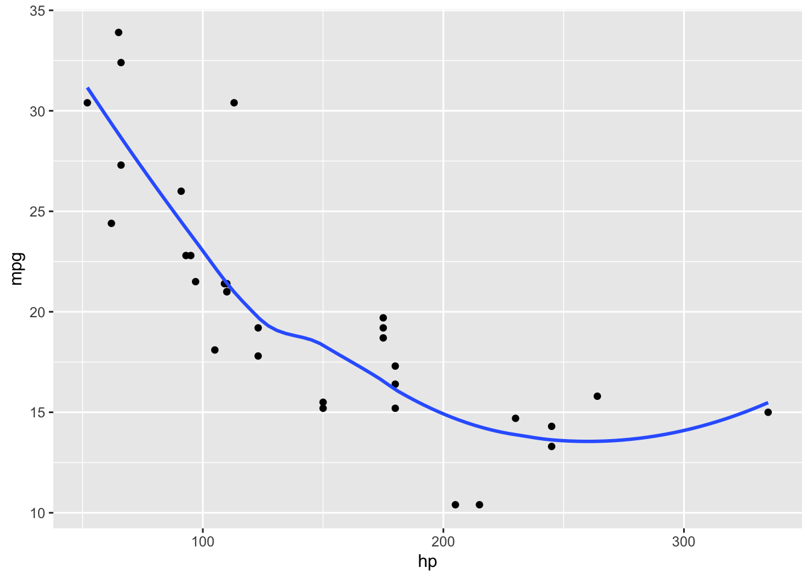

```{.r .Rchunk}
summary(mtcars)
```

```{.Rout}
##       mpg             cyl             disp             hp       
##  Min.   :10.40   Min.   :4.000   Min.   : 71.1   Min.   : 52.0  
##  1st Qu.:15.43   1st Qu.:4.000   1st Qu.:120.8   1st Qu.: 96.5  
##  Median :19.20   Median :6.000   Median :196.3   Median :123.0  
##  Mean   :20.09   Mean   :6.188   Mean   :230.7   Mean   :146.7  
##  3rd Qu.:22.80   3rd Qu.:8.000   3rd Qu.:326.0   3rd Qu.:180.0  
##  Max.   :33.90   Max.   :8.000   Max.   :472.0   Max.   :335.0  
##       drat             wt             qsec             vs        
##  Min.   :2.760   Min.   :1.513   Min.   :14.50   Min.   :0.0000  
##  1st Qu.:3.080   1st Qu.:2.581   1st Qu.:16.89   1st Qu.:0.0000  
##  Median :3.695   Median :3.325   Median :17.71   Median :0.0000  
##  Mean   :3.597   Mean   :3.217   Mean   :17.85   Mean   :0.4375  
##  3rd Qu.:3.920   3rd Qu.:3.610   3rd Qu.:18.90   3rd Qu.:1.0000  
##  Max.   :4.930   Max.   :5.424   Max.   :22.90   Max.   :1.0000  
##        am              gear            carb      
##  Min.   :0.0000   Min.   :3.000   Min.   :1.000  
##  1st Qu.:0.0000   1st Qu.:3.000   1st Qu.:2.000  
##  Median :0.0000   Median :4.000   Median :2.000  
##  Mean   :0.4062   Mean   :3.688   Mean   :2.812  
##  3rd Qu.:1.0000   3rd Qu.:4.000   3rd Qu.:4.000  
##  Max.   :1.0000   Max.   :5.000   Max.   :8.000
```


<!--  ```{r echo = FALSE} -->
<!--  knitr::kable(df) -->
<!--  ``` -->

<!-- <div class="question"> -->
<!-- ##### Exercise 1 {-}  {#dataframe_question} -->

<!-- Make the example dataframe (see above; the dataset with the blood values for different humans) in R.  -->
<!-- </div> -->

<!-- <details><summary>Click for the answer</summary> -->
<!-- ```{r} -->
<!-- df <- data.frame( -->
<!--   sample = paste0('human', 1:6), -->
<!--   treatment = c(rep('control', 3), rep('50 ng/mg', 3)),  -->
<!--   weight = c(80, 82, 78, 76, 83, 81),  -->
<!--   blood_pressure = c('80/120', '85/110', '78/115', '90/125', '92/120', '87/119'), -->
<!--   cholesterol = c(20, 25, 32, 45, 43, NA) -->
<!-- ) -->
<!-- ``` -->
<!-- </details> -->

<!-- <div class="question"> -->
<!-- ##### Exercise 1 {-}  -->

<!-- (a) What are the data types in each column of the dataframe of the previous exercise? -->
<!-- (b) Are the data types of each column similar to what you expect? -->
<!-- </div> -->

<!-- <details><summary>Click for the answer</summary> -->

<!-- (a): -->
<!-- ```{r} -->
<!-- str(df) -->
<!-- typeof(df) -->
<!-- ``` -->
<!-- </details> -->

## Tibbles

Dataframes are part of base R and have some typical behaviors which are not always useful. During this course, we will extensively work with the tidyverse package. To make dataframes compatible with the tidyverse package, we have to change an R base dataframe to a tibble. A **tibble** is also a dataframe but with different behavior. 

There are several useful functions when working with tibbles:

- `tibble()` can be used to create tibbles from scratch. 
- `as_tibble()` can be used to convert an existing dataframe to a tibble. By default, the function removes rownames, if they were present. Tibbles do not support rownames: all values, including rownames, are stored in vectors of equal length as variables.
- You can check if an object is a tibble using `is_tibble()` or `class()`.

###### Example


```{.r .Rchunk}
library(tidyverse)
```

```{.r .Rchunk}
# Create a new tibble object with three columns
tibble_1 <- tibble(number = 1:10, letters = letters[1:10], random = runif(10))  
is_tibble(tibble_1)
```

```{.Rout}
## [1] TRUE
```


```{.r .Rchunk}
# Show Rstudio spreadsheet of the mtcars dataframe including rows
View(mtcars) 
```


```{.r .Rchunk}
# Check the data structure of the object
class(mtcars)  
```

```{.Rout}
## [1] "data.frame"
```

```{.r .Rchunk}
# Convert an existing R dataframe to a tibble
tibble_2 <- as_tibble(mtcars)  
class(tibble_2)
```

```{.Rout}
## [1] "tbl_df"     "tbl"        "data.frame"
```

```{.r .Rchunk}
# Show first rows of the tibble structure
tibble_2 
```

```{.Rout}
## # A tibble: 32 × 11
##      mpg   cyl  disp    hp  drat    wt  qsec    vs    am  gear  carb
##    <dbl> <dbl> <dbl> <dbl> <dbl> <dbl> <dbl> <dbl> <dbl> <dbl> <dbl>
##  1  21       6  160    110  3.9   2.62  16.5     0     1     4     4
##  2  21       6  160    110  3.9   2.88  17.0     0     1     4     4
##  3  22.8     4  108     93  3.85  2.32  18.6     1     1     4     1
##  4  21.4     6  258    110  3.08  3.22  19.4     1     0     3     1
##  5  18.7     8  360    175  3.15  3.44  17.0     0     0     3     2
##  6  18.1     6  225    105  2.76  3.46  20.2     1     0     3     1
##  7  14.3     8  360    245  3.21  3.57  15.8     0     0     3     4
##  8  24.4     4  147.    62  3.69  3.19  20       1     0     4     2
##  9  22.8     4  141.    95  3.92  3.15  22.9     1     0     4     2
## 10  19.2     6  168.   123  3.92  3.44  18.3     1     0     4     4
## # ℹ 22 more rows
```

```{.r .Rchunk}
# select a specific variable of the tibble with the $ sign
tibble_2$gear
```

```{.Rout}
##  [1] 4 4 4 3 3 3 3 4 4 4 4 3 3 3 3 3 3 4 4 4 3 3 3 3 3 4 5 5 5 5 5 4
```

It is possible for a tibble to have column names that are not valid R variable names, a.k.a. non-syntactic names. For example, they might not start with a letter, or they might contain unusual characters like a space. *To refer to these variables, you need to surround them with backticks:* `. You will use it later in the course.

###### Example


```{.r .Rchunk}
weird_column_names <- tibble(`0` = 1:10, `@` = seq(102, 120, 2), `&*(` = letters[1:10])
colnames(weird_column_names)
```

```{.Rout}
## [1] "0"   "@"   "&*("
```

```{.r .Rchunk}
weird_column_names$`&*(`
```

```{.Rout}
##  [1] "a" "b" "c" "d" "e" "f" "g" "h" "i" "j"
```

<!-- By using tibbles we can apply functions of the tidyverse packages. These functions will be further explained in lesson 5. For example, we can calculate the average "mpg" based on the number of gears in the cars (see example below). -->

<!-- ###### Example -->

<!-- ```{r} -->
<!-- tibble_2 %>% group_by(gear) %>% summarize(average = mean(mpg, na.rm = TRUE)) -->
<!-- ``` -->

<!-- <div class="question"> -->
<!-- ##### Exercise 1 {-}  -->

<!-- (a) Make a tibble of the example dataframe in the section 'Dataframes' (see also [this dataframe exercise](#dataframe_question)). -->
<!-- (b) What are now the data types in each column of the tibble? -->
<!-- </div> -->

<!-- <details><summary>Click for the answer</summary> -->

<!-- (a) -->
<!-- ```{r} -->
<!-- ex7_tbl <- tibble( -->
<!--   sample = paste0('human', 1:6), -->
<!--   treatment = c(rep('control', 3), rep('50 ng/mg', 3)),  -->
<!--   weight = c(80, 82, 78, 76, 83, 81),  -->
<!--   blood_pressure = c('80/120', '85/110', '78/115', '90/125', '92/120', '87/119'), -->
<!--   cholesterol = c(20, 25, 32, 45, 43, NA) -->
<!-- ) -->
<!-- ``` -->
<!-- (b) -->
<!-- ```{r} -->
<!-- ex7_tbl -->
<!-- ``` -->
<!-- </details> -->

## Factors

Experimental research involves "entities" that are measured. What is being measured (the variable) depends on the research question: what do we want to know of the "entity"? Many variables are continuous variables: the value is obtained by measurement and can be any value within a certain range (e.g. blood pressure, weight,concentration of bacterial toxins etc.).  

Variables can also be **categorical**. Categorical variables take on values (**levels**) that are names. The names have a fixed number of possibilities such as gender (male, female), political party, type of car, color. 

When dealing with categorical data, you could use vectors with "character" elements to describe the different levels of categorical data, like you would for example in Excel. However in R, **factors** can be used to describe the different levels of categorical data. To work with factors, we will use the forcats package (which is regrettably not about cats but about categorical data):


```{.r .Rchunk}
# first load the package (and tidyverse too for good measure)
library(tidyverse)
library(forcats)
```

With factors, we can:

- control the sorting behavior of the categorical levels;
- modify categorical levels;
- and prevent typos in the categorical levels. 

Let's demonstrate the behavior of factors with an example. A researcher wants to know which month has the highest flu incidence rate in the Netherlands and counts for each month the number of registered people with flu.  


```{.r .Rchunk}
flu_month <- tibble(patient = paste0(c("patient"), 1:16),
                    month = c("jan", "jam", "mar", "nov", "nov", "dec", "feb", 
                              "apr", "jun", "sept", "dec", "feb", "aug", "may", 
                              "jul", "sep"))
flu_month
```

```{.Rout}
## # A tibble: 16 × 2
##    patient   month
##    <chr>     <chr>
##  1 patient1  jan  
##  2 patient2  jam  
##  3 patient3  mar  
##  4 patient4  nov  
##  5 patient5  nov  
##  6 patient6  dec  
##  7 patient7  feb  
##  8 patient8  apr  
##  9 patient9  jun  
## 10 patient10 sept 
## 11 patient11 dec  
## 12 patient12 feb  
## 13 patient13 aug  
## 14 patient14 may  
## 15 patient15 jul  
## 16 patient16 sep
```

There are three problems with this dataset:

1. If we want to summarize the data, the variable "month" is ordered alphabetically. 
2. One month is misspelled as "jam".
3. One month is spelled as "sep" or "sept".

Let's summarise the data with the function `count()`.


```{.r .Rchunk}
flu_month %>% count(month)
```

```{.Rout}
## # A tibble: 13 × 2
##    month     n
##    <chr> <int>
##  1 apr       1
##  2 aug       1
##  3 dec       2
##  4 feb       2
##  5 jam       1
##  6 jan       1
##  7 jul       1
##  8 jun       1
##  9 mar       1
## 10 may       1
## 11 nov       2
## 12 sep       1
## 13 sept      1
```

The `count()` function returns the month in alphabetical order which is not useful. Also, there are two levels for January: "jam" and "jan" each with a value. In addition, there are two levels for September: "sep" and "sept" each with a value.

To prevent these issues, we can create a factor data structure. On forehand, levels of the categorical variable are defined with a character vector. To view the values in the dataset that are not part of the predefined level list, we can use the function `parse_factor()`. This function comes with two arguments:

- a character vector to be analyzed; 
- and the levels of the categorical value.


```{.r .Rchunk}
# Create a vector containing the level definition
month_levels <- c("jan", "feb", "mar", "apr", "may" ,"jun", 
                  "jul", "aug", "sep", "oct", "nov", "dec") 
parse_factor(flu_month$month, levels = month_levels)
```

```{.Rout}
##  [1] jan  <NA> mar  nov  nov  dec  feb  apr  jun  <NA> dec  feb  aug  may  jul 
## [16] sep 
## attr(,"problems")
## # A tibble: 2 × 4
##     row   col expected           actual
##   <int> <int> <chr>              <chr> 
## 1     2    NA value in level set jam   
## 2    10    NA value in level set sept  
## Levels: jan feb mar apr may jun jul aug sep oct nov dec
```

```{.r .Rchunk}
# Correct the misspellings
flu_month$month[flu_month$month=="jam"] <- c("jan") 
flu_month$month[flu_month$month=="sept"] <- c("sep") 
```

We can now convert the character variable "month" to a factor variable:


```{.r .Rchunk}
# Convert the variable 'month' to a factor
flu_month$month <- factor(flu_month$month, levels = month_levels) 
flu_month
```

```{.Rout}
## # A tibble: 16 × 2
##    patient   month
##    <chr>     <fct>
##  1 patient1  jan  
##  2 patient2  jan  
##  3 patient3  mar  
##  4 patient4  nov  
##  5 patient5  nov  
##  6 patient6  dec  
##  7 patient7  feb  
##  8 patient8  apr  
##  9 patient9  jun  
## 10 patient10 sep  
## 11 patient11 dec  
## 12 patient12 feb  
## 13 patient13 aug  
## 14 patient14 may  
## 15 patient15 jul  
## 16 patient16 sep
```

To view the levels of a "factor" variable use the function `levels()`:


```{.r .Rchunk}
levels(flu_month$month)
```

```{.Rout}
##  [1] "jan" "feb" "mar" "apr" "may" "jun" "jul" "aug" "sep" "oct" "nov" "dec"
```

Let's summarise the data again with the function `count()`:


```{.r .Rchunk}
flu_month %>% count(month)
```

```{.Rout}
## # A tibble: 11 × 2
##    month     n
##    <fct> <int>
##  1 jan       2
##  2 feb       2
##  3 mar       1
##  4 apr       1
##  5 may       1
##  6 jun       1
##  7 jul       1
##  8 aug       1
##  9 sep       2
## 10 nov       2
## 11 dec       2
```

The months are now in the right order. Note that October is omitted because no values were recorded for this month. 

<div class="tip">
Tip: If R is absolutely refusing to cooperate, make sure you defined your variables correctly as categorical (factor), numbers or text.
</div>

<div class="question">
##### Exercise 1 {-} 

Use the built-in dataset gss_cat from the forcats package to answer the following questions. gss_cat is a sample of data from the General Social Survey, which is a long-running US survey conducted by the independent research organization NORC at the University of Chicago.

(a) Which variables are factors?
(b) What are the levels of the "marital" variable?
</div>

<details><summary>Click for the answer</summary>

(a)

```{.r .Rchunk}
library(forcats)
gss_cat
```

```{.Rout}
## # A tibble: 21,483 × 9
##     year marital         age race  rincome        partyid    relig denom tvhours
##    <int> <fct>         <int> <fct> <fct>          <fct>      <fct> <fct>   <int>
##  1  2000 Never married    26 White $8000 to 9999  Ind,near … Prot… Sout…      12
##  2  2000 Divorced         48 White $8000 to 9999  Not str r… Prot… Bapt…      NA
##  3  2000 Widowed          67 White Not applicable Independe… Prot… No d…       2
##  4  2000 Never married    39 White Not applicable Ind,near … Orth… Not …       4
##  5  2000 Divorced         25 White Not applicable Not str d… None  Not …       1
##  6  2000 Married          25 White $20000 - 24999 Strong de… Prot… Sout…      NA
##  7  2000 Never married    36 White $25000 or more Not str r… Chri… Not …       3
##  8  2000 Divorced         44 White $7000 to 7999  Ind,near … Prot… Luth…      NA
##  9  2000 Married          44 White $25000 or more Not str d… Prot… Other       0
## 10  2000 Married          47 White $25000 or more Strong re… Prot… Sout…       3
## # ℹ 21,473 more rows
```
(b)

```{.r .Rchunk}
levels(gss_cat$marital)
```

```{.Rout}
## [1] "No answer"     "Never married" "Separated"     "Divorced"     
## [5] "Widowed"       "Married"
```
</details>

<div class="question">
##### Exercise 1 {-} 

Run this code in R to create a tibble with categorical data:

(Make sure your .rds file is in a folder named "data" in your working directory. If you are working in a project, this will be the project folder containing the .rproj file. If it doesn't work, ask a teacher!)


```{.r .Rchunk}
marital_status <- readRDS("data/lesson1_exercise_8.2.rds")
```


The levels of this dataset are: "No answer", "Never married", "Separated", "Divorced", "Widowed" and "Married". Use this dataset and the levels to answer the following questions.

(a) Search for data values that are not in the level list.
(b) Correct the misspellings using fct_collapse() from the forcats package. 
(c) How many data values are in each of the categorical levels?
</div>

<details><summary>Click for the answer</summary>

(a)

```{.r .Rchunk}
marital_levels <- c("No answer", "Never married", "Separated", "Divorced", "Widowed", "Married")
parse_factor(marital_status$marital, levels = marital_levels)
```

```{.Rout}
##     [1] Never married Divorced      Widowed       Never married Divorced     
##     [6] Married       Never married Divorced      Married       Married      
##    [11] Married       Married       Married       Married       Divorced     
##    [16] Married       Widowed       Never married Married       Married      
##    [21] Married       Married       Never married Widowed       Widowed      
##    [26] Widowed       Widowed       Widowed       Divorced      Widowed      
##    [31] Widowed       Married       Married       Never married Married      
##    [36] Never married Never married Never married Never married Never married
##    [41] Married       Married       Divorced      Never married Never married
##    [46] Never married Married       Married       Married       Married      
##    [51] Never married Married       Married       Married       Married      
##    [56] Divorced      Divorced      Divorced      Never married Never married
##    [61] Married       Married       Never married Divorced      Never married
##    [66] Widowed       Divorced      Married       Never married Never married
##    [71] Widowed       Widowed       Widowed       Widowed       Widowed      
##    [76] Never married Widowed       Never married Married       Never married
##    [81] Married       Married       Widowed       Married       Married      
##    [86] Divorced      Never married Separated     Never married Widowed      
##    [91] Widowed       Married       Divorced      Never married Never married
##    [96] Never married Married       Married       Widowed       Divorced     
##   [101] Married       Married       Married       Married       Widowed      
##   [106] Married       Divorced      Divorced      Married       Never married
##   [111] Married       Married       Separated     Married       Never married
##   [116] Divorced      Divorced      Separated     Married       Widowed      
##   [121] Separated     Divorced      Married       Divorced      Never married
##   [126] Divorced      Divorced      Married       Never married Never married
##   [131] Never married Married       Married       Divorced      Widowed      
##   [136] Never married Widowed       Divorced      Separated     Widowed      
##   [141] Never married Widowed       Widowed       Widowed       Widowed      
##   [146] Never married Never married Never married Never married Never married
##   [151] Never married Never married Married       Married       Separated    
##   [156] Never married Widowed       Widowed       Married       Married      
##   [161] Married       Married       Married       Never married Married      
##   [166] Divorced      Never married Married       Married       Married      
##   [171] Never married Never married Married       Married       Married      
##   [176] Married       Married       Married       Married       Married      
##   [181] Married       Widowed       Widowed       Married       Married      
##   [186] Married       Divorced      Married       Married       Never married
##   [191] Never married Never married Divorced      Never married Never married
##   [196] Married       Never married Separated     Never married Never married
##   [201] Divorced      Widowed       Separated     Married       Married      
##   [206] Separated     Divorced      Divorced      Never married Married      
##   [211] Married       Married       Married       Married       Never married
##   [216] Never married Never married Married       Married       Separated    
##   [221] Married       Never married Married       Never married Divorced     
##   [226] Never married Never married Never married Married       Married      
##   [231] Never married Married       Widowed       Married       Never married
##   [236] Divorced      Married       Separated     Married       Married      
##   [241] Married       Widowed       Married       Widowed       Married      
##   [246] Never married Married       Married       Married       Widowed      
##   [251] Married       Married       Married       Divorced      Never married
##   [256] Married       Married       Divorced      Married       Never married
##   [261] Separated     Divorced      Widowed       Married       Separated    
##   [266] Widowed       Married       Never married Never married Married      
##   [271] Married       Never married Never married Never married Divorced     
##   [276] Widowed       Separated     Divorced      Widowed       Never married
##   [281] Never married Never married Married       Married       Never married
##   [286] Never married Never married Divorced      Never married Divorced     
##   [291] Married       Never married Separated     Separated     Never married
##   [296] Married       Never married Divorced      Never married Never married
##   [301] Never married Never married Divorced      Divorced      Married      
##   [306] Married       Married       Married       Married       Divorced     
##   [311] Married       Married       Married       Never married Married      
##   [316] Never married Never married Married       Married       Married      
##   [321] Divorced      Never married Never married Married       Married      
##   [326] Married       Never married Never married Never married Married      
##   [331] Widowed       Married       Married       Widowed       Married      
##   [336] Married       Married       Never married Never married Married      
##   [341] Married       Married       Married       Married       Never married
##   [346] Married       Married       Never married Never married Widowed      
##   [351] Married       Married       Married       Never married Married      
##   [356] Married       Never married Married       Divorced      Married      
##   [361] Married       Separated     Never married Never married Married      
##   [366] Married       Divorced      Married       Married       Never married
##   [371] Never married Never married Never married Divorced      Married      
##   [376] Married       Divorced      Never married Never married Married      
##   [381] Never married Widowed       Married       Married       Divorced     
##   [386] Married       Married       Separated     Married       Married      
##   [391] Married       Widowed       Divorced      Married       Married      
##   [396] Married       Divorced      Married       Divorced      Never married
##   [401] Married       Married       Never married Separated     Separated    
##   [406] Never married Divorced      Married       Married       Married      
##   [411] Married       Married       Never married Married       Married      
##   [416] Married       Married       Never married Married       Married      
##   [421] Married       Married       Divorced      Divorced      Married      
##   [426] Married       Married       Married       Never married Married      
##   [431] Never married Married       Never married Divorced      Divorced     
##   [436] Divorced      Never married Married       Separated     Divorced     
##   [441] Widowed       Divorced      Divorced      Never married Divorced     
##   [446] Widowed       Divorced      Divorced      Divorced      Never married
##   [451] Divorced      Widowed       Widowed       Married       Married      
##   [456] Never married Never married Never married Married       Married      
##   [461] Married       Widowed       Divorced      Never married Married      
##   [466] Married       Married       Never married Married       Married      
##   [471] Married       Widowed       Never married Married       Divorced     
##   [476] Divorced      Married       Widowed       Married       Married      
##   [481] Married       Married       Married       Never married Divorced     
##   [486] Married       Never married Separated     Widowed       Divorced     
##   [491] Married       Married       Never married Separated     Never married
##   [496] Married       Married       Married       Married       Never married
##   [501] Married       Married       Never married Divorced      Married      
##   [506] Married       Married       Never married Never married Never married
##   [511] Never married Never married Never married Never married Never married
##   [516] Never married Never married Married       Separated     Married      
##   [521] Never married Divorced      Married       Widowed       Married      
##   [526] Never married Married       Married       Never married Widowed      
##   [531] Never married Never married Married       Married       Separated    
##   [536] Never married Never married Married       Married       Married      
##   [541] Married       Divorced      Married       Married       Married      
##   [546] Married       Married       Widowed       Separated     Separated    
##   [551] Never married Widowed       Widowed       Divorced      Never married
##   [556] Separated     Divorced      Never married Never married Never married
##   [561] Married       Married       Never married Married       Married      
##   [566] Married       Divorced      Married       Married       Never married
##   [571] Married       Married       Divorced      Never married Married      
##   [576] Married       Married       Never married Married       Never married
##   [581] Never married Married       Married       Separated     Never married
##   [586] Never married Widowed       Married       Married       Divorced     
##   [591] Married       Married       Married       Married       Married      
##   [596] Married       Married       Widowed       Never married Divorced     
##   [601] Married       Married       Married       Never married Never married
##   [606] Never married Never married Never married Never married Married      
##   [611] Married       Never married Married       Married       Married      
##   [616] Married       Never married Separated     Married       Never married
##   [621] Never married Married       Married       Never married Married      
##   [626] Never married Divorced      Married       Divorced      Widowed      
##   [631] Married       Never married Married       Never married Separated    
##   [636] Divorced      Never married Widowed       Separated     Married      
##   [641] Never married Married       Never married Never married Never married
##   [646] Divorced      Divorced      Never married Never married Married      
##   [651] Divorced      Never married Married       Married       Widowed      
##   [656] Never married Separated     Divorced      Divorced      Divorced     
##   [661] Never married Married       Divorced      Married       Separated    
##   [666] Never married Married       Married       Married       Married      
##   [671] Married       Married       Married       Never married Widowed      
##   [676] Never married Never married Divorced      Never married Married      
##   [681] Never married Never married Married       Married       Married      
##   [686] Married       Married       Never married Divorced      Separated    
##   [691] Divorced      Married       Married       Married       Married      
##   [696] Married       Married       Married       Married       Never married
##   [701] Divorced      Married       Divorced      Never married Never married
##   [706] Never married Never married Widowed       Married       Married      
##   [711] Never married Never married Married       Divorced      Married      
##   [716] Married       Married       Widowed       Never married Never married
##   [721] Divorced      Married       Married       Married       Divorced     
##   [726] Divorced      Married       Widowed       Never married Widowed      
##   [731] Married       Widowed       Divorced      Married       Married      
##   [736] Widowed       Widowed       Divorced      Separated     Widowed      
##   [741] Married       Married       Married       Never married Married      
##   [746] Married       Married       Married       Married       Married      
##   [751] Married       Married       Married       Married       Married      
##   [756] Married       Never married Never married Married       Divorced     
##   [761] Married       Married       Never married Never married Widowed      
##   [766] Married       Widowed       Married       Married       Never married
##   [771] Never married Never married Divorced      Divorced      Never married
##   [776] Divorced      Never married Never married Never married Married      
##   [781] Divorced      Married       Widowed       Married       Married      
##   [786] Never married Married       Divorced      Divorced      Never married
##   [791] Never married Divorced      Divorced      Married       Married      
##   [796] Never married Married       Separated     Married       Married      
##   [801] Married       Never married Never married Married       Married      
##   [806] Married       Never married Widowed       Widowed       Widowed      
##   [811] Widowed       Married       Married       Widowed       Married      
##   [816] Married       Never married Widowed       Widowed       Never married
##   [821] Divorced      Divorced      Married       Divorced      Separated    
##   [826] Married       Married       Widowed       Never married Married      
##   [831] Never married Married       Married       Never married Married      
##   [836] Married       Married       Widowed       Married       Widowed      
##   [841] Married       Never married Separated     Widowed       Married      
##   [846] Widowed       Never married Widowed       Widowed       Widowed      
##   [851] Married       Married       Widowed       Separated     Married      
##   [856] Married       Separated     Married       Widowed       Married      
##   [861] Divorced      Never married Widowed       Never married Never married
##   [866] Divorced      Married       Never married Married       Divorced     
##   [871] Married       Married       Never married Divorced      Never married
##   [876] Divorced      Widowed       Divorced      Married       Divorced     
##   [881] Divorced      Widowed       Widowed       Never married Married      
##   [886] Divorced      Married       Married       Divorced      Married      
##   [891] Widowed       Married       Married       Married       Married      
##   [896] Married       Married       Married       Married       Married      
##   [901] Never married Married       Never married Divorced      Married      
##   [906] Widowed       Divorced      Divorced      Married       Divorced     
##   [911] Married       Married       Never married Divorced      Separated    
##   [916] Married       Never married Divorced      Never married Never married
##   [921] Widowed       Never married Married       Married       Divorced     
##   [926] Separated     Separated     Married       Divorced      Divorced     
##   [931] Married       Divorced      Married       Divorced      Never married
##   [936] Divorced      Divorced      Never married Never married Never married
##   [941] Married       Widowed       Married       Married       Divorced     
##   [946] Married       Divorced      Divorced      Married       Married      
##   [951] Married       Married       Never married Divorced      Divorced     
##   [956] Never married Separated     Never married Married       Married      
##   [961] Married       Married       Married       Never married Married      
##   [966] Never married Married       Divorced      Married       Married      
##   [971] Never married Never married Married       Divorced      Widowed      
##   [976] Divorced      Never married Married       Married       Divorced     
##   [981] Married       Never married Never married Never married Separated    
##   [986] Never married Divorced      Married       Divorced      Married      
##   [991] Married       Married       Married       Married       Married      
##   [996] Married       Never married Married       Married       Married      
##  [1001] <NA>          Never married Married       Married       Married      
##  [1006] Married       Married       Married       Married       Married      
##  [1011] Divorced      Separated     Married       Widowed       Married      
##  [1016] Never married Separated     Married       Never married Never married
##  [1021] Never married Divorced      Married       Married       Separated    
##  [1026] Married       Married       Never married Married       Married      
##  [1031] Married       Married       Divorced      Never married Married      
##  [1036] Married       Married       Divorced      Divorced      Married      
##  [1041] Married       Married       Married       Married       Separated    
##  [1046] Married       Married       Separated     Divorced      Married      
##  [1051] Married       Married       Separated     Married       Never married
##  [1056] Married       Never married Never married Married       Married      
##  [1061] Married       Married       Married       Married       Divorced     
##  [1066] Married       Married       Married       Married       Married      
##  [1071] Never married Married       Married       Married       Married      
##  [1076] Divorced      Married       Married       Married       Never married
##  [1081] Never married Never married Never married Divorced      Divorced     
##  [1086] Divorced      Married       Married       Divorced      Never married
##  [1091] Married       Married       Divorced      Divorced      Married      
##  [1096] Married       Separated     Never married Married       Never married
##  [1101] Married       Never married Divorced      Never married Married      
##  [1106] Married       Married       Married       Married       Married      
##  [1111] Married       Married       Never married Never married Widowed      
##  [1116] Never married Divorced      Married       Never married Married      
##  [1121] Married       Never married Never married Never married Married      
##  [1126] Never married Married       Never married Widowed       Married      
##  [1131] Never married Married       Never married Never married Separated    
##  [1136] Widowed       Never married Married       Married       Divorced     
##  [1141] Divorced      Divorced      Married       Married       Married      
##  [1146] Married       Married       Married       Married       Married      
##  [1151] Widowed       Never married Never married Never married Never married
##  [1156] Never married Never married Married       Widowed       Married      
##  [1161] Married       Married       Widowed       Married       Married      
##  [1166] Widowed       Never married Married       Divorced      Widowed      
##  [1171] Married       Married       Married       Divorced      Married      
##  [1176] Never married Divorced      Married       Married       Married      
##  [1181] Divorced      Widowed       Never married Divorced      Divorced     
##  [1186] Separated     Divorced      Separated     Married       Separated    
##  [1191] Divorced      Married       Never married Never married Widowed      
##  [1196] Never married Never married Divorced      Separated     Married      
##  [1201] Divorced      Divorced      Divorced      Married       Married      
##  [1206] Divorced      Never married Never married Married       Married      
##  [1211] Married       Widowed       Widowed       Divorced      Never married
##  [1216] Married       Married       Married       Married       Married      
##  [1221] Divorced      Never married Married       Married       Divorced     
##  [1226] Divorced      Divorced      Married       Divorced      Married      
##  [1231] Married       Divorced      Divorced      Married       Separated    
##  [1236] Married       Married       Divorced      Divorced      Divorced     
##  [1241] Married       Never married Married       Never married Widowed      
##  [1246] Married       Never married Divorced      Never married Married      
##  [1251] Married       Never married Divorced      Widowed       Never married
##  [1256] Married       Married       Never married Never married Married      
##  [1261] Married       Married       Married       Widowed       Married      
##  [1266] Married       Divorced      Married       Married       Married      
##  [1271] Married       Married       Married       Divorced      Married      
##  [1276] Never married Married       Married       Married       Never married
##  [1281] Married       Divorced      Widowed       Married       Widowed      
##  [1286] Widowed       Never married Married       Married       Married      
##  [1291] Married       Never married Divorced      Divorced      Married      
##  [1296] Never married Never married Divorced      Never married Never married
##  [1301] Divorced      Divorced      Never married Never married Married      
##  [1306] Divorced      Married       Divorced      Married       Married      
##  [1311] Separated     Never married Married       Never married Divorced     
##  [1316] Married       Married       Never married Divorced      Divorced     
##  [1321] Married       Married       Divorced      Widowed       Never married
##  [1326] Married       Married       Married       Never married Never married
##  [1331] Never married Divorced      Divorced      Divorced      Never married
##  [1336] Never married Never married Married       Never married Never married
##  [1341] Never married Divorced      Married       Married       Married      
##  [1346] Never married Divorced      Married       Married       Never married
##  [1351] Never married Married       Married       Separated     Married      
##  [1356] Married       Married       Married       Married       Divorced     
##  [1361] Divorced      Never married Married       Never married Never married
##  [1366] Never married Divorced      Divorced      Never married Widowed      
##  [1371] Never married Widowed       Separated     Never married Divorced     
##  [1376] Never married Widowed       Widowed       Never married Never married
##  [1381] Widowed       Never married Separated     Married       Divorced     
##  [1386] Separated     Married       Divorced      Divorced      Never married
##  [1391] Never married Married       Married       Married       Married      
##  [1396] Married       Divorced      Widowed       Married       Married      
##  [1401] Never married Never married Never married Married       Married      
##  [1406] Never married Married       Widowed       Married       Married      
##  [1411] Married       Divorced      Married       Divorced      Married      
##  [1416] Married       Never married Married       Married       Divorced     
##  [1421] Never married Married       Married       Divorced      Married      
##  [1426] Married       Widowed       Never married Married       Divorced     
##  [1431] Separated     Married       Never married Married       Never married
##  [1436] Married       Married       Separated     Never married Divorced     
##  [1441] Married       Married       Divorced      Never married Never married
##  [1446] Never married Married       Divorced      Widowed       Married      
##  [1451] Divorced      Never married Separated     Divorced      Married      
##  [1456] Never married Never married Never married Never married Never married
##  [1461] Never married Married       Married       Divorced      Never married
##  [1466] Never married Married       Married       Never married Never married
##  [1471] Married       Married       Married       Married       Divorced     
##  [1476] Never married Married       Never married Never married Separated    
##  [1481] Divorced      Never married Never married Never married Separated    
##  [1486] Married       Married       Divorced      Married       Married      
##  [1491] Married       Married       Married       Separated     Divorced     
##  [1496] Never married Divorced      Married       Divorced      Married      
##  [1501] Divorced      Never married Married       Never married Married      
##  [1506] Never married Married       Married       Never married Widowed      
##  [1511] Widowed       Never married Married       Separated     Married      
##  [1516] Married       Married       Married       Married       Widowed      
##  [1521] Never married Married       Married       Divorced      Married      
##  [1526] Married       Never married Married       Widowed       Married      
##  [1531] Widowed       Widowed       Married       Married       Widowed      
##  [1536] Married       Married       Widowed       Married       Never married
##  [1541] Separated     Married       Married       Married       Never married
##  [1546] No answer     Never married Never married Married       Married      
##  [1551] Married       Never married Never married Married       Divorced     
##  [1556] Married       Married       Married       Married       Married      
##  [1561] Divorced      Never married Never married Never married Never married
##  [1566] Never married Divorced      Divorced      Divorced      Married      
##  [1571] Never married Divorced      Never married Never married Never married
##  [1576] Married       Married       Never married Married       Never married
##  [1581] Divorced      Married       Married       Never married Never married
##  [1586] Divorced      Married       Never married Divorced      Divorced     
##  [1591] Divorced      Married       Divorced      Never married Married      
##  [1596] Never married Divorced      Separated     Married       Married      
##  [1601] Married       Married       Married       Married       Never married
##  [1606] Married       Married       Never married Never married Never married
##  [1611] Widowed       Never married Separated     Divorced      Married      
##  [1616] Married       Married       Married       Married       Married      
##  [1621] Married       Never married Never married Never married Married      
##  [1626] Never married Divorced      Married       Married       Never married
##  [1631] Married       Married       Married       Married       Never married
##  [1636] Married       Married       Married       Married       Married      
##  [1641] Never married Never married Widowed       Never married Never married
##  [1646] Divorced      Never married Divorced      Never married Never married
##  [1651] Divorced      Married       Married       Never married Married      
##  [1656] Divorced      Never married Married       Married       Married      
##  [1661] Divorced      Divorced      Married       Divorced      Widowed      
##  [1666] Divorced      Never married Divorced      Married       Divorced     
##  [1671] Never married Separated     Married       Divorced      Widowed      
##  [1676] Never married Married       Widowed       Married       Married      
##  [1681] Married       Married       Married       Married       Married      
##  [1686] Married       Divorced      Widowed       Divorced      Never married
##  [1691] Divorced      Never married Never married Married       Never married
##  [1696] Married       Divorced      Divorced      Divorced      Married      
##  [1701] Divorced      Never married Divorced      Married       Separated    
##  [1706] Married       Married       Married       Married       Married      
##  [1711] Married       Divorced      Never married Never married Married      
##  [1716] Never married Widowed       Divorced      Separated     Married      
##  [1721] Never married Never married Married       Widowed       Never married
##  [1726] Never married Never married Never married Never married Divorced     
##  [1731] Never married Never married Never married Never married Never married
##  [1736] Married       Married       Divorced      Married       Married      
##  [1741] Never married Separated     Married       Married       Married      
##  [1746] Widowed       Married       Widowed       Married       Widowed      
##  [1751] Widowed       Married       Never married Divorced      Divorced     
##  [1756] Married       Married       Never married Married       Widowed      
##  [1761] Married       Married       Married       Never married Divorced     
##  [1766] Never married Never married Never married Never married Married      
##  [1771] Widowed       Widowed       Separated     Divorced      Widowed      
##  [1776] Divorced      Never married Divorced      Widowed       Divorced     
##  [1781] Divorced      Married       Married       Never married Married      
##  [1786] Divorced      Divorced      Never married Married       Married      
##  [1791] Never married Never married Never married Never married Married      
##  [1796] Never married Married       Married       Married       Married      
##  [1801] Married       Married       Married       Married       Widowed      
##  [1806] Widowed       Married       Married       Married       Divorced     
##  [1811] Never married Never married Married       Married       Widowed      
##  [1816] Divorced      Divorced      Never married Married       Widowed      
##  [1821] Separated     Married       Widowed       Widowed       Married      
##  [1826] Never married Never married Divorced      Married       Divorced     
##  [1831] Never married Separated     Widowed       Separated     Never married
##  [1836] Divorced      Divorced      Married       Never married Never married
##  [1841] Never married Married       Never married Never married Divorced     
##  [1846] Divorced      Separated     Never married Never married Never married
##  [1851] Married       Married       Married       Divorced      Married      
##  [1856] Married       Separated     Never married Never married Married      
##  [1861] Married       Married       Divorced      Married       Never married
##  [1866] Married       Never married Divorced      Never married Married      
##  [1871] Married       Never married Never married Married       Married      
##  [1876] Never married Never married Married       Divorced      Married      
##  [1881] Divorced      Divorced      Widowed       Married       Widowed      
##  [1886] Married       Never married Married       Married       Married      
##  [1891] Married       Never married Never married Never married Never married
##  [1896] Never married Never married Never married Never married Never married
##  [1901] Divorced      Never married Never married Never married Married      
##  [1906] Never married Never married Never married Never married Never married
##  [1911] Never married Never married Never married Never married Divorced     
##  [1916] Married       Never married Never married Never married Never married
##  [1921] Never married Married       Married       Married       Married      
##  [1926] Never married Never married Widowed       Never married Widowed      
##  [1931] Never married Never married Never married Never married Never married
##  [1936] Widowed       Separated     Married       Never married Never married
##  [1941] Separated     Married       Widowed       Widowed       Divorced     
##  [1946] Divorced      Divorced      Married       Married       Married      
##  [1951] Married       Married       Married       Divorced      Divorced     
##  [1956] Married       Married       Married       Married       Married      
##  [1961] Married       Married       Never married Married       Divorced     
##  [1966] Divorced      Married       Never married Married       Married      
##  [1971] Married       Never married Married       Divorced      Married      
##  [1976] Divorced      Widowed       Married       Married       Separated    
##  [1981] Separated     Married       Never married Separated     Widowed      
##  [1986] Separated     Married       Divorced      Divorced      Widowed      
##  [1991] Divorced      Married       Married       Married       Married      
##  [1996] Never married Never married Married       Never married Married      
##  [2001] Never married Married       Married       Never married Married      
##  [2006] Married       Married       Divorced      Divorced      Divorced     
##  [2011] Married       Married       Married       Married       Never married
##  [2016] Married       Married       Widowed       Widowed       Widowed      
##  [2021] Widowed       Never married Widowed       Married       Married      
##  [2026] Widowed       Married       Married       Married       Widowed      
##  [2031] Separated     Never married Never married Divorced      Married      
##  [2036] Married       Married       Married       Separated     Never married
##  [2041] Never married Married       Divorced      Never married Never married
##  [2046] Married       Divorced      Married       Never married Separated    
##  [2051] Married       Married       Widowed       Never married Widowed      
##  [2056] Never married Never married Divorced      Married       Divorced     
##  [2061] Divorced      Never married Married       Never married Divorced     
##  [2066] Married       Married       Divorced      Never married Married      
##  [2071] Married       Separated     Married       Never married Married      
##  [2076] Married       Never married Never married Divorced      Married      
##  [2081] Divorced      Divorced      Never married Divorced      Never married
##  [2086] Separated     Widowed       Never married Married       Married      
##  [2091] Divorced      Divorced      Never married Widowed       Married      
##  [2096] Never married Widowed       Widowed       Married       Married      
##  [2101] Widowed       Divorced      Widowed       Divorced      Separated    
##  [2106] Widowed       Married       Married       Never married Married      
##  [2111] Widowed       Married       Divorced      Married       Never married
##  [2116] Never married Never married Married       Married       Never married
##  [2121] Never married Divorced      Married       Divorced      Never married
##  [2126] Divorced      Never married Never married Divorced      Never married
##  [2131] Divorced      Never married Married       Divorced      Never married
##  [2136] Married       Married       Widowed       Married       Married      
##  [2141] Never married Never married Married       Married       Married      
##  [2146] Married       Widowed       Married       Married       Never married
##  [2151] Divorced      Never married Married       Never married Never married
##  [2156] Divorced      Married       Never married Married       Married      
##  [2161] Widowed       Married       Married       Married       Divorced     
##  [2166] Never married Never married Married       Never married Never married
##  [2171] Married       Never married Married       Married       Married      
##  [2176] Divorced      Married       Married       Married       Married      
##  [2181] Never married Married       Married       Widowed       Married      
##  [2186] Married       Divorced      Never married Divorced      Married      
##  [2191] Married       Married       Married       Married       Widowed      
##  [2196] Married       Married       Married       Married       Married      
##  [2201] Married       Never married Married       Widowed       Married      
##  [2206] Married       Married       Divorced      Divorced      Married      
##  [2211] Married       Married       Never married Married       Divorced     
##  [2216] Married       Married       Married       Married       Never married
##  [2221] Married       Never married Married       Married       Married      
##  [2226] Married       Married       Married       Never married Widowed      
##  [2231] Widowed       Married       Married       Married       Divorced     
##  [2236] Married       Married       Married       Divorced      Widowed      
##  [2241] Married       Married       Divorced      Married       Never married
##  [2246] Married       Divorced      Married       Married       Married      
##  [2251] Widowed       Divorced      Widowed       Married       Married      
##  [2256] Widowed       Married       Married       Married       Married      
##  [2261] Widowed       Widowed       Married       Divorced      Divorced     
##  [2266] Married       Married       Widowed       Divorced      Never married
##  [2271] Never married Never married Divorced      Married       Widowed      
##  [2276] Widowed       Never married Never married Never married Divorced     
##  [2281] Divorced      Never married Never married Married       Never married
##  [2286] Divorced      Never married Married       Never married Never married
##  [2291] Never married Married       Never married Never married Married      
##  [2296] Divorced      Married       Married       Married       Separated    
##  [2301] Never married Married       Married       Married       Married      
##  [2306] Widowed       Married       Married       Divorced      Divorced     
##  [2311] Widowed       Divorced      Married       Divorced      Married      
##  [2316] Married       Married       Widowed       Married       Married      
##  [2321] Divorced      Married       Married       Married       Married      
##  [2326] Never married Separated     Never married Never married Never married
##  [2331] Never married Divorced      Never married Never married Widowed      
##  [2336] Never married Married       Separated     Married       Married      
##  [2341] Never married Never married Never married Widowed       Married      
##  [2346] Married       Married       Divorced      Married       Divorced     
##  [2351] Married       Married       Married       Married       Married      
##  [2356] Married       Married       Married       Divorced      Never married
##  [2361] Widowed       Married       Married       Married       Married      
##  [2366] Married       Married       Widowed       Married       Married      
##  [2371] Married       Married       Widowed       Never married Married      
##  [2376] Married       Divorced      Divorced      Married       Married      
##  [2381] Married       Married       Married       Married       Widowed      
##  [2386] Married       Married       Married       Married       Married      
##  [2391] Never married Married       Married       Married       Married      
##  [2396] Married       Widowed       Married       Married       Never married
##  [2401] Widowed       Never married Never married Married       Widowed      
##  [2406] Married       Married       Married       Married       Married      
##  [2411] Divorced      Married       Married       Married       Divorced     
##  [2416] Married       Divorced      Divorced      Married       Married      
##  [2421] Widowed       Married       Widowed       Widowed       Married      
##  [2426] Married       Divorced      Divorced      Married       Married      
##  [2431] Married       Married       Married       Married       Married      
##  [2436] Divorced      Married       Never married Married       Married      
##  [2441] Married       Married       Married       Married       Widowed      
##  [2446] Never married Married       Married       Never married Widowed      
##  [2451] Married       Widowed       Married       Married       Never married
##  [2456] Never married Married       Widowed       Married       Married      
##  [2461] Divorced      Married       Widowed       Divorced      Married      
##  [2466] Divorced      Separated     Divorced      Separated     Married      
##  [2471] Divorced      Never married Separated     Married       Never married
##  [2476] Never married Married       Married       Widowed       Married      
##  [2481] Never married Divorced      Separated     Never married Never married
##  [2486] Divorced      Married       Married       Separated     Widowed      
##  [2491] Married       Married       Widowed       Never married Married      
##  [2496] Never married Married       Separated     Married       Never married
##  [2501] Divorced      Never married Married       Never married Married      
##  [2506] Married       Married       Married       Married       Divorced     
##  [2511] Married       Separated     Married       Divorced      Never married
##  [2516] Married       Never married Married       Divorced      Never married
##  [2521] Widowed       Married       Married       Never married Married      
##  [2526] Married       Married       Married       Divorced      Married      
##  [2531] Married       Never married Widowed       Widowed       Widowed      
##  [2536] Married       Widowed       Divorced      Married       Married      
##  [2541] Married       Married       Married       Divorced      Never married
##  [2546] Separated     Never married Married       Divorced      Married      
##  [2551] Married       Divorced      Widowed       Widowed       Divorced     
##  [2556] Divorced      Married       Married       Never married Never married
##  [2561] Never married Divorced      Never married Never married Never married
##  [2566] Never married Never married Never married Married       Married      
##  [2571] Married       Married       Never married Married       Never married
##  [2576] Married       Married       Married       Divorced      Widowed      
##  [2581] Married       Married       Divorced      Married       Divorced     
##  [2586] Married       Divorced      Divorced      Widowed       Married      
##  [2591] Divorced      Married       Never married Married       Married      
##  [2596] Never married Widowed       Married       Never married Widowed      
##  [2601] Married       Married       Married       Married       Married      
##  [2606] Married       Widowed       Married       Married       Married      
##  [2611] Never married Never married Widowed       Married       Divorced     
##  [2616] Married       Married       Married       Widowed       Married      
##  [2621] Widowed       Married       Never married Married       Married      
##  [2626] Widowed       Married       Divorced      Married       Divorced     
##  [2631] Married       Married       Married       Widowed       Widowed      
##  [2636] Never married Never married Divorced      Separated     Married      
##  [2641] Married       Never married Widowed       Married       Never married
##  [2646] Widowed       Never married Married       Married       Married      
##  [2651] Divorced      Married       Widowed       Never married Never married
##  [2656] Married       Separated     Divorced      Never married Married      
##  [2661] Married       Married       Married       Widowed       Widowed      
##  [2666] Married       Married       Never married Never married Married      
##  [2671] Married       Never married Married       Married       Married      
##  [2676] Married       Divorced      Divorced      Divorced      Married      
##  [2681] Married       Married       Married       Widowed       Never married
##  [2686] Divorced      Widowed       Never married Widowed       Divorced     
##  [2691] Never married Married       Divorced      Divorced      Widowed      
##  [2696] Divorced      Widowed       Never married Separated     Married      
##  [2701] Married       Never married Married       Never married Married      
##  [2706] Never married Married       Married       Married       Divorced     
##  [2711] Married       Married       Divorced      Married       Married      
##  [2716] Widowed       Married       Married       Married       Married      
##  [2721] Married       Never married Married       Married       Married      
##  [2726] Divorced      Married       Married       Married       Married      
##  [2731] Married       Widowed       Married       Married       Married      
##  [2736] Married       Married       Divorced      Widowed       Divorced     
##  [2741] Married       Divorced      Married       Divorced      Widowed      
##  [2746] Married       Married       Married       Divorced      Widowed      
##  [2751] Separated     Married       Never married Never married Divorced     
##  [2756] Divorced      Never married Never married Married       Married      
##  [2761] Married       Married       Married       Married       Married      
##  [2766] Married       Widowed       Married       Divorced      Widowed      
##  [2771] Widowed       Widowed       Married       Never married Married      
##  [2776] Never married Widowed       Never married Married       Divorced     
##  [2781] Married       Separated     Never married Divorced      Married      
##  [2786] Widowed       Married       Never married Married       Divorced     
##  [2791] Married       Married       Married       Married       Married      
##  [2796] Widowed       Widowed       Widowed       Married       Married      
##  [2801] Divorced      Divorced      Married       Married       Divorced     
##  [2806] Married       Never married Married       Married       Never married
##  [2811] Never married Married       Married       Divorced      Married      
##  [2816] Married       Divorced      Divorced      Married       Separated    
##  [2821] Divorced      Divorced      Divorced      Married       Married      
##  [2826] Divorced      Never married Married       Married       Married      
##  [2831] Divorced      Married       Married       Divorced      Never married
##  [2836] Divorced      Never married Never married Separated     Married      
##  [2841] Married       Married       Widowed       Widowed       Divorced     
##  [2846] Never married Never married Divorced      Married       Never married
##  [2851] Never married Never married Widowed       Married       Never married
##  [2856] Divorced      Divorced      Never married Separated     Divorced     
##  [2861] Divorced      Married       Never married Never married Married      
##  [2866] Divorced      Married       Married       Married       Divorced     
##  [2871] Married       Divorced      Married       Widowed       Divorced     
##  [2876] Widowed       Divorced      Married       Never married Widowed      
##  [2881] Married       Married       Widowed       Widowed       Widowed      
##  [2886] Widowed       Widowed       Widowed       Divorced      Widowed      
##  [2891] Married       Separated     Married       Divorced      Never married
##  [2896] Married       Married       Divorced      Married       Married      
##  [2901] Divorced      Widowed       Widowed       Never married Divorced     
##  [2906] Widowed       Widowed       Married       Married       Never married
##  [2911] Never married Married       Divorced      Divorced      Never married
##  [2916] Married       Divorced      Never married Divorced      Divorced     
##  [2921] Divorced      Never married Married       Separated     Never married
##  [2926] Divorced      Married       Never married Married       Separated    
##  [2931] Married       Divorced      Never married Divorced      Divorced     
##  [2936] Widowed       Separated     Never married Widowed       Divorced     
##  [2941] Married       Widowed       Widowed       Married       Separated    
##  [2946] Never married Married       Married       Divorced      Never married
##  [2951] Married       Never married Married       Separated     Married      
##  [2956] Married       Married       Divorced      Married       Married      
##  [2961] Married       Never married Married       Widowed       Married      
##  [2966] Married       Widowed       Never married Never married Never married
##  [2971] Married       Widowed       Married       Married       Never married
##  [2976] Married       Married       Never married Never married Married      
##  [2981] Widowed       Widowed       Never married Married       Separated    
##  [2986] Widowed       Married       Married       Divorced      Married      
##  [2991] Separated     Married       Never married Married       Married      
##  [2996] Married       Married       Divorced      Never married Married      
##  [3001] Never married Divorced      Never married Never married Divorced     
##  [3006] Divorced      Never married Never married Divorced      Married      
##  [3011] Married       Married       Married       Married       Divorced     
##  [3016] Never married Married       Married       Married       Never married
##  [3021] Divorced      Married       Never married Never married Divorced     
##  [3026] Divorced      Married       Divorced      Never married Divorced     
##  [3031] Married       Married       Widowed       Married       Married      
##  [3036] Married       Married       Never married Married       Married      
##  [3041] Married       Divorced      Divorced      Married       Married      
##  [3046] Widowed       Separated     Married       Never married Widowed      
##  [3051] Married       Married       Married       Never married Married      
##  [3056] Married       Married       Never married Never married Never married
##  [3061] Never married Widowed       Married       Married       Separated    
##  [3066] Divorced      Never married Married       Married       Never married
##  [3071] Married       Never married Never married Never married Never married
##  [3076] Divorced      Never married Never married Married       Never married
##  [3081] Widowed       Married       Never married Never married Never married
##  [3086] Never married Never married Never married Never married Never married
##  [3091] Married       Married       Married       Married       Never married
##  [3096] Married       Separated     Married       Married       Never married
##  [3101] Married       Married       Married       Married       Divorced     
##  [3106] Never married Married       Divorced      Married       Never married
##  [3111] Married       Married       Widowed       Divorced      Divorced     
##  [3116] Never married Married       Divorced      Married       Married      
##  [3121] Married       Married       Married       Married       Never married
##  [3126] Married       Married       Married       Never married Married      
##  [3131] Married       Married       Married       Never married Married      
##  [3136] Divorced      Married       Never married Never married Married      
##  [3141] Married       Married       Widowed       Separated     Divorced     
##  [3146] Never married Never married Married       Never married Never married
##  [3151] Never married Never married Never married Never married Married      
##  [3156] Separated     Married       Married       Married       Never married
##  [3161] Never married Married       Never married Married       Never married
##  [3166] Married       Married       Never married Never married Divorced     
##  [3171] Separated     Married       Divorced      Never married Married      
##  [3176] Never married Married       Divorced      Married       Married      
##  [3181] Married       Divorced      Married       Married       Never married
##  [3186] Married       Widowed       Married       Married       Married      
##  [3191] Never married Never married Never married Married       Married      
##  [3196] Married       Separated     Separated     Married       Divorced     
##  [3201] Married       Separated     Divorced      Married       Divorced     
##  [3206] Married       Married       Never married Widowed       Divorced     
##  [3211] Married       Married       Separated     Married       Never married
##  [3216] Married       Married       Married       Separated     Never married
##  [3221] Married       Separated     Married       Never married Married      
##  [3226] Never married Never married Divorced      Divorced      Never married
##  [3231] Never married Married       Married       Never married Never married
##  [3236] Divorced      Divorced      Never married Never married Never married
##  [3241] Never married Separated     Separated     Never married Never married
##  [3246] Never married Married       Never married Married       Never married
##  [3251] Never married Widowed       Divorced      Divorced      Married      
##  [3256] Never married Separated     Never married Married       Married      
##  [3261] Never married Married       Never married Divorced      Never married
##  [3266] Divorced      Never married Married       Married       Widowed      
##  [3271] Married       Divorced      Never married Married       Never married
##  [3276] Widowed       Widowed       Never married Never married Separated    
##  [3281] Divorced      Widowed       Married       Married       Married      
##  [3286] Married       Married       Divorced      Never married Married      
##  [3291] Widowed       Widowed       Married       Never married Married      
##  [3296] Married       Separated     Widowed       Married       Separated    
##  [3301] Never married Never married Separated     Married       Never married
##  [3306] Widowed       Never married Widowed       Married       Never married
##  [3311] Widowed       Married       Married       Married       Married      
##  [3316] Married       Married       Married       Married       Married      
##  [3321] Married       Never married Married       Never married Married      
##  [3326] Married       Married       Divorced      Married       Widowed      
##  [3331] Married       Never married Divorced      Never married Married      
##  [3336] Divorced      Never married Married       Married       Never married
##  [3341] Married       Married       Never married Married       Married      
##  [3346] Married       Married       Married       Married       Married      
##  [3351] Never married Married       Married       Married       Married      
##  [3356] Divorced      Never married Divorced      Married       Married      
##  [3361] Married       Married       Married       Widowed       Married      
##  [3366] Married       Married       Divorced      Widowed       Married      
##  [3371] Never married Widowed       Married       Divorced      Married      
##  [3376] Married       Never married Divorced      Married       Married      
##  [3381] Married       Divorced      Never married Divorced      Never married
##  [3386] Never married Widowed       Never married Divorced      Never married
##  [3391] Divorced      Separated     Separated     Married       Never married
##  [3396] Married       Never married Separated     Divorced      Never married
##  [3401] Divorced      Widowed       Widowed       Never married Married      
##  [3406] Married       Married       Divorced      Never married Divorced     
##  [3411] Married       Never married Never married Never married Separated    
##  [3416] Married       Married       Married       Married       Married      
##  [3421] Married       Married       Married       Married       Separated    
##  [3426] Never married Widowed       Divorced      Married       Divorced     
##  [3431] Married       Married       Married       Married       Married      
##  [3436] Divorced      Married       Married       Married       Married      
##  [3441] Widowed       Married       Never married Married       Never married
##  [3446] Never married Separated     Never married Divorced      Separated    
##  [3451] Divorced      Married       Married       Never married Married      
##  [3456] Widowed       Married       Widowed       Never married Never married
##  [3461] Never married Separated     Married       Divorced      Never married
##  [3466] Divorced      Married       Married       Married       Married      
##  [3471] Married       Married       Married       Married       Never married
##  [3476] Married       Widowed       Divorced      Widowed       Widowed      
##  [3481] Widowed       Married       Widowed       Widowed       Married      
##  [3486] Married       Never married Never married Never married Divorced     
##  [3491] Never married Married       Divorced      Widowed       Married      
##  [3496] Never married Married       Divorced      Widowed       Married      
##  [3501] Married       Married       Married       Divorced      Married      
##  [3506] Never married Married       Never married Divorced      Never married
##  [3511] Never married Never married Never married Divorced      Married      
##  [3516] Widowed       Married       Married       Divorced      Never married
##  [3521] Married       Never married Married       Married       Married      
##  [3526] Married       Never married Divorced      Married       Never married
##  [3531] Married       Married       Never married Never married Never married
##  [3536] Never married Widowed       Never married Married       Married      
##  [3541] Married       Married       Married       Widowed       Never married
##  [3546] Separated     Widowed       Widowed       Widowed       Never married
##  [3551] Never married Married       Married       Married       Married      
##  [3556] Married       Divorced      Married       Divorced      Divorced     
##  [3561] Married       Married       Married       Never married Divorced     
##  [3566] Divorced      Married       Widowed       Divorced      Married      
##  [3571] Married       Married       Never married Married       Married      
##  [3576] Divorced      Divorced      Divorced      Divorced      Married      
##  [3581] Married       Widowed       Widowed       Never married Widowed      
##  [3586] Married       Married       Married       Married       Married      
##  [3591] Married       Widowed       Married       Divorced      Married      
##  [3596] Married       Never married Widowed       Married       Never married
##  [3601] Married       Married       Married       Never married Married      
##  [3606] Married       Divorced      Never married Never married Married      
##  [3611] Widowed       Widowed       Widowed       Widowed       Widowed      
##  [3616] Never married Widowed       Divorced      Married       Widowed      
##  [3621] Divorced      Married       Married       Married       Never married
##  [3626] Married       Married       Divorced      Never married Divorced     
##  [3631] Divorced      Widowed       Never married Divorced      Married      
##  [3636] Separated     Married       Married       Married       Married      
##  [3641] Married       Never married Married       Widowed       Never married
##  [3646] Never married Married       Divorced      Divorced      Married      
##  [3651] Married       Married       Married       Married       Separated    
##  [3656] Married       Divorced      Never married Never married Married      
##  [3661] Married       Divorced      Never married Never married Married      
##  [3666] Never married Divorced      Divorced      Divorced      Divorced     
##  [3671] Separated     Married       Married       Married       Never married
##  [3676] Married       Divorced      Divorced      Divorced      Married      
##  [3681] Divorced      Never married Never married Married       Married      
##  [3686] Married       Married       Divorced      Married       Never married
##  [3691] Married       Married       Married       Never married Married      
##  [3696] Divorced      Married       Married       Married       Married      
##  [3701] Married       Married       Married       Never married Married      
##  [3706] Divorced      Married       Married       Married       Married      
##  [3711] Married       Married       Married       Divorced      Never married
##  [3716] Married       Married       Married       Married       Married      
##  [3721] Never married Never married Divorced      Married       Widowed      
##  [3726] Married       Never married Never married Married       Married      
##  [3731] Divorced      Married       Widowed       Divorced      Married      
##  [3736] Never married Never married Married       Never married Married      
##  [3741] Widowed       Married       Never married Married       Divorced     
##  [3746] Married       Never married Widowed       Never married Married      
##  [3751] Married       Married       Separated     Divorced      Divorced     
##  [3756] Divorced      Married       Never married Widowed       Widowed      
##  [3761] Widowed       Divorced      Divorced      Never married Never married
##  [3766] Divorced      Married       Divorced      Divorced      Widowed      
##  [3771] Married       Married       Married       Married       Married      
##  [3776] Married       Married       Never married Never married Divorced     
##  [3781] Married       Never married Never married Married       Never married
##  [3786] Married       Married       Married       Never married Divorced     
##  [3791] Never married Divorced      Divorced      Never married Married      
##  [3796] Married       Married       Never married Never married Never married
##  [3801] Married       Divorced      Divorced      Married       Married      
##  [3806] Never married Never married Divorced      Never married Never married
##  [3811] Married       Divorced      Married       Widowed       Divorced     
##  [3816] Never married Never married Married       Divorced      Married      
##  [3821] Never married Married       Widowed       Never married Married      
##  [3826] Widowed       Married       Divorced      Never married Married      
##  [3831] Married       Divorced      Never married Married       Married      
##  [3836] Married       Married       Married       Married       Never married
##  [3841] Never married Divorced      Married       Never married Never married
##  [3846] Never married Divorced      Divorced      Married       Married      
##  [3851] Divorced      Married       Married       Married       Widowed      
##  [3856] Married       Divorced      Separated     Widowed       Married      
##  [3861] Married       Married       Married       Widowed       Married      
##  [3866] Married       Divorced      Married       Widowed       Divorced     
##  [3871] Married       Divorced      Married       Married       Divorced     
##  [3876] Married       Married       Never married Divorced      Never married
##  [3881] Never married Never married Separated     Never married Never married
##  [3886] Separated     Never married Married       Married       Married      
##  [3891] Married       Married       Married       Married       Widowed      
##  [3896] Married       Married       Divorced      Married       Never married
##  [3901] Married       Married       Divorced      Married       Married      
##  [3906] Married       Married       Married       Married       Married      
##  [3911] Married       Married       Married       Married       Married      
##  [3916] Married       Married       Married       Widowed       Divorced     
##  [3921] Never married Never married Divorced      Widowed       Married      
##  [3926] Divorced      Divorced      Divorced      Never married Divorced     
##  [3931] Married       Widowed       Divorced      Never married Never married
##  [3936] Married       Divorced      Married       Never married Never married
##  [3941] Married       Never married Never married Married       Married      
##  [3946] Never married Married       Married       Married       Married      
##  [3951] Married       Married       Married       Married       Married      
##  [3956] Married       Married       Divorced      Married       Never married
##  [3961] Never married Widowed       Widowed       Never married Never married
##  [3966] Never married Never married Never married Married       Never married
##  [3971] Married       Never married Never married Divorced      Married      
##  [3976] Married       Widowed       Widowed       Married       Widowed      
##  [3981] Married       Widowed       Never married Widowed       Married      
##  [3986] Widowed       Never married Married       Married       Never married
##  [3991] Married       Married       Married       Married       Divorced     
##  [3996] Separated     Never married Widowed       Married       Widowed      
##  [4001] Never married Married       Married       Never married Married      
##  [4006] Married       Never married Married       Divorced      Widowed      
##  [4011] Widowed       Never married Divorced      Never married Never married
##  [4016] Married       Widowed       Married       Divorced      Never married
##  [4021] Never married Married       Widowed       Separated     Married      
##  [4026] Married       Married       Married       Never married Married      
##  [4031] Married       Married       Never married Married       Divorced     
##  [4036] Never married Married       Married       Never married Never married
##  [4041] Separated     Married       Married       Married       Married      
##  [4046] Widowed       Married       Married       Married       Divorced     
##  [4051] Divorced      Married       Married       Never married Never married
##  [4056] Divorced      Never married Married       Married       Never married
##  [4061] Married       Married       Married       Married       Married      
##  [4066] Divorced      Married       Separated     Divorced      Married      
##  [4071] Never married Divorced      Divorced      Married       Never married
##  [4076] Married       Never married Divorced      Married       Divorced     
##  [4081] Never married Divorced      Divorced      Divorced      Widowed      
##  [4086] Widowed       Married       Never married Widowed       Married      
##  [4091] Married       Never married Never married Separated     Divorced     
##  [4096] Never married Never married Never married Married       Never married
##  [4101] Widowed       Married       Never married Never married Never married
##  [4106] Never married Married       Never married Married       Divorced     
##  [4111] Divorced      Never married Married       Never married Separated    
##  [4116] Married       Married       Separated     Divorced      Married      
##  [4121] Married       Married       Married       Married       Divorced     
##  [4126] Married       Never married Never married Married       Never married
##  [4131] Married       Separated     Never married Divorced      Never married
##  [4136] Never married Married       Married       Never married Married      
##  [4141] Never married Never married Never married Divorced      Never married
##  [4146] Divorced      Divorced      Married       Never married Married      
##  [4151] Never married Divorced      Divorced      Married       Married      
##  [4156] Widowed       Never married Married       Divorced      Never married
##  [4161] Never married Divorced      Married       Never married Never married
##  [4166] Never married Never married Never married Separated     Married      
##  [4171] Married       Married       Widowed       Married       Married      
##  [4176] Widowed       Married       Married       Married       Divorced     
##  [4181] Married       Divorced      Widowed       Divorced      Married      
##  [4186] Married       Married       Divorced      Divorced      Married      
##  [4191] Divorced      Married       Widowed       Married       Married      
##  [4196] Married       Married       Never married Widowed       Never married
##  [4201] Married       Widowed       Married       Never married Divorced     
##  [4206] Married       Married       Married       Married       Never married
##  [4211] Married       Never married Never married Never married Married      
##  [4216] Never married Married       Divorced      Married       Married      
##  [4221] Married       Divorced      Married       Never married Married      
##  [4226] Widowed       Never married Never married Never married Married      
##  [4231] Never married Married       Never married Never married Married      
##  [4236] Widowed       Widowed       Married       Never married Never married
##  [4241] Never married Married       Divorced      Married       Never married
##  [4246] Never married Never married Divorced      Married       Divorced     
##  [4251] Married       Never married Married       Never married Never married
##  [4256] Divorced      Never married Divorced      Married       Never married
##  [4261] Married       Widowed       Widowed       Never married Widowed      
##  [4266] Married       Never married Married       Divorced      Never married
##  [4271] Married       Never married Married       Married       Married      
##  [4276] Widowed       Separated     Married       Never married Divorced     
##  [4281] Widowed       Divorced      Widowed       Married       Married      
##  [4286] Divorced      Married       Married       Divorced      Divorced     
##  [4291] Married       Married       Married       Widowed       Married      
##  [4296] Widowed       Married       Divorced      Divorced      Married      
##  [4301] Married       Married       Separated     Never married Divorced     
##  [4306] Never married Divorced      Married       Divorced      Never married
##  [4311] Married       Never married Widowed       Divorced      Never married
##  [4316] Never married Divorced      Never married Divorced      Never married
##  [4321] Never married Married       Married       Married       Married      
##  [4326] Widowed       Never married Never married Never married Divorced     
##  [4331] Married       Separated     Never married Never married Separated    
##  [4336] Divorced      Married       Married       Never married Divorced     
##  [4341] Divorced      Married       Never married Married       Married      
##  [4346] Married       Married       Married       Married       Married      
##  [4351] Married       Married       Married       Never married Never married
##  [4356] Widowed       Married       Married       Never married Never married
##  [4361] Never married Never married Widowed       Married       Married      
##  [4366] Married       Separated     Married       Married       Separated    
##  [4371] Never married Widowed       Divorced      Married       Divorced     
##  [4376] Divorced      Married       Married       Never married Divorced     
##  [4381] Widowed       Married       Divorced      Never married Never married
##  [4386] Widowed       Divorced      Widowed       Never married Married      
##  [4391] Never married Married       Separated     Never married Widowed      
##  [4396] Never married Divorced      Divorced      Never married Separated    
##  [4401] Never married Married       Married       Never married Divorced     
##  [4406] Never married Never married Married       Divorced      Never married
##  [4411] Married       Divorced      Married       Never married Widowed      
##  [4416] Divorced      Married       Never married Married       Married      
##  [4421] Married       Never married Married       Married       Married      
##  [4426] Married       Married       Never married Married       Married      
##  [4431] Married       Separated     Never married Divorced      Married      
##  [4436] Never married Married       Married       Widowed       Never married
##  [4441] Never married Married       Widowed       Never married Divorced     
##  [4446] Never married Married       Married       Never married Married      
##  [4451] Never married Never married Divorced      Never married Divorced     
##  [4456] Divorced      Never married Never married Never married Married      
##  [4461] Married       Never married Married       Married       Married      
##  [4466] Married       Married       Divorced      Married       Married      
##  [4471] Married       Married       Married       Divorced      Never married
##  [4476] Divorced      Married       Widowed       Never married Never married
##  [4481] Never married Married       Divorced      Married       Married      
##  [4486] Married       Never married Married       Never married Married      
##  [4491] Never married Married       Married       Never married Married      
##  [4496] Never married Divorced      Never married Never married Never married
##  [4501] Never married Never married Never married Married       Married      
##  [4506] Divorced      Married       Never married Never married Married      
##  [4511] Married       Married       Married       Married       Widowed      
##  [4516] Divorced      Separated     Widowed       Married       Never married
##  [4521] Married       Divorced      Married       Divorced      Married      
##  [4526] Married       Married       Married       Never married Married      
##  [4531] Never married Divorced      Divorced      Never married Never married
##  [4536] Married       Divorced      Married       Never married Divorced     
##  [4541] Married       Divorced      Divorced      Never married Never married
##  [4546] Never married Never married Never married Divorced      Married      
##  [4551] Married       Never married Never married Never married Never married
##  [4556] Never married Never married Never married Married       Never married
##  [4561] Married       Never married Never married Divorced      Never married
##  [4566] Never married Never married Divorced      Married       Divorced     
##  [4571] Never married Married       Never married Married       Never married
##  [4576] Never married Never married Widowed       Never married Never married
##  [4581] Divorced      Divorced      Never married Married       Never married
##  [4586] Never married Married       Divorced      Widowed       Widowed      
##  [4591] Divorced      Married       Married       Divorced      Never married
##  [4596] Divorced      Never married Never married Married       Married      
##  [4601] Married       Married       Married       Married       Married      
##  [4606] Married       Divorced      Married       Divorced      Widowed      
##  [4611] Married       Widowed       Married       Married       Married      
##  [4616] Married       Separated     Never married Divorced      Married      
##  [4621] Divorced      Married       Divorced      Divorced      Never married
##  [4626] Married       Married       Married       Widowed       Widowed      
##  [4631] Widowed       Never married Never married Married       Divorced     
##  [4636] Married       Married       Married       Married       Married      
##  [4641] Married       Married       Married       Married       Married      
##  [4646] Married       Married       Divorced      Married       Never married
##  [4651] Divorced      Married       Never married Married       Married      
##  [4656] Divorced      Married       Married       Married       Married      
##  [4661] Married       Married       Divorced      Separated     Separated    
##  [4666] Never married Married       Never married Never married Married      
##  [4671] Married       Married       Widowed       Married       Married      
##  [4676] Divorced      Divorced      Never married Never married Married      
##  [4681] Never married Married       Married       Never married Married      
##  [4686] Married       Married       Never married Divorced      Married      
##  [4691] Never married Married       Married       Widowed       Married      
##  [4696] Married       Married       Married       Married       Never married
##  [4701] Divorced      Never married Never married Married       Never married
##  [4706] Married       Married       Divorced      Divorced      Married      
##  [4711] Married       Divorced      Never married Married       Never married
##  [4716] Married       Never married Never married Never married Never married
##  [4721] Divorced      Never married Married       Never married Widowed      
##  [4726] Separated     Widowed       Married       Married       Never married
##  [4731] Married       Never married Never married Divorced      Never married
##  [4736] Divorced      Never married Divorced      Never married Married      
##  [4741] Married       Married       Separated     Never married Married      
##  [4746] Divorced      Divorced      Divorced      Married       Married      
##  [4751] Widowed       Married       Widowed       Divorced      Married      
##  [4756] Never married Never married Married       Never married Never married
##  [4761] Married       Divorced      Divorced      Never married Married      
##  [4766] Married       Married       Married       Married       Married      
##  [4771] Married       Married       Married       Married       Married      
##  [4776] Married       Married       Married       Never married Separated    
##  [4781] Divorced      Divorced      Married       Divorced      Never married
##  [4786] Married       Never married Married       Widowed       Married      
##  [4791] Married       Married       Married       Married       Never married
##  [4796] Widowed       Married       Divorced      Widowed       Married      
##  [4801] Divorced      Married       Widowed       Married       Divorced     
##  [4806] Divorced      Married       Married       Never married Married      
##  [4811] Never married Married       Separated     Divorced      Widowed      
##  [4816] Divorced      Married       Never married Never married Divorced     
##  [4821] Never married Divorced      Married       Married       Married      
##  [4826] Separated     Never married Never married Married       Married      
##  [4831] Married       Married       Never married Married       Separated    
##  [4836] Married       Widowed       Married       Widowed       Married      
##  [4841] Married       Divorced      Divorced      Widowed       Never married
##  [4846] Never married Divorced      Divorced      Divorced      Never married
##  [4851] Never married Married       Widowed       Married       Married      
##  [4856] Married       Married       Married       Married       Married      
##  [4861] Married       Married       Married       Divorced      Married      
##  [4866] Married       Married       Married       Married       Never married
##  [4871] Divorced      Married       Married       Married       Married      
##  [4876] Married       Divorced      Married       Married       Married      
##  [4881] Married       Divorced      Divorced      Married       Married      
##  [4886] Married       Divorced      Married       Married       Married      
##  [4891] Never married Married       Never married Never married Married      
##  [4896] Widowed       Married       Divorced      Married       Married      
##  [4901] Never married Married       Married       Never married Widowed      
##  [4906] Married       Never married Never married Married       Divorced     
##  [4911] Married       Never married Married       Never married Married      
##  [4916] Divorced      Married       Divorced      Never married Married      
##  [4921] Never married Married       Never married Widowed       Married      
##  [4926] Married       Divorced      Divorced      Divorced      Married      
##  [4931] Married       Never married Never married Divorced      Married      
##  [4936] Married       Married       Widowed       Married       Married      
##  [4941] Married       Married       Widowed       Never married Married      
##  [4946] Married       Married       Married       Married       Married      
##  [4951] Married       Married       Married       Married       Married      
##  [4956] Married       Married       Married       Married       Never married
##  [4961] Married       Married       Married       Married       Married      
##  [4966] Divorced      Married       Widowed       Married       Married      
##  [4971] Married       Married       Married       Married       Divorced     
##  [4976] Divorced      Never married Never married Widowed       Married      
##  [4981] Married       Married       Married       Married       Divorced     
##  [4986] Widowed       Never married Married       Married       Married      
##  [4991] Never married Married       Divorced      Married       Married      
##  [4996] Married       Divorced      Divorced      Widowed       Married      
##  [5001] <NA>          Divorced      Never married Married       Married      
##  [5006] Widowed       Married       Never married Widowed       Divorced     
##  [5011] Married       Married       Never married Married       Married      
##  [5016] Widowed       Married       Married       Never married Never married
##  [5021] Separated     Married       Married       Never married Never married
##  [5026] Married       Never married Never married Married       Divorced     
##  [5031] Widowed       Divorced      Married       Married       Never married
##  [5036] Married       Married       Married       Married       Never married
##  [5041] Married       Never married Married       Married       Married      
##  [5046] Married       Never married Separated     Separated     Married      
##  [5051] Married       Separated     Never married Never married Separated    
##  [5056] Separated     Widowed       Married       Married       Divorced     
##  [5061] Never married Married       Married       Married       Married      
##  [5066] Never married Divorced      Separated     Never married Widowed      
##  [5071] Divorced      Never married Never married Married       Divorced     
##  [5076] Never married Never married Divorced      Married       Married      
##  [5081] Married       Divorced      Married       Never married Married      
##  [5086] Married       Married       Married       Married       Married      
##  [5091] Married       Married       Married       Never married Married      
##  [5096] Divorced      Never married Never married Divorced      Never married
##  [5101] Divorced      Married       Divorced      Never married Divorced     
##  [5106] Widowed       Widowed       Never married Never married Married      
##  [5111] Never married Never married Married       Separated     Never married
##  [5116] Married       Never married Never married Divorced      Never married
##  [5121] Never married Widowed       Married       Never married Married      
##  [5126] Married       Married       Never married Divorced      Never married
##  [5131] Married       Never married Widowed       Married       Married      
##  [5136] Never married Married       Married       Married       Never married
##  [5141] Married       Married       Married       Married       Married      
##  [5146] Married       Widowed       Married       Never married Married      
##  [5151] Married       Married       Married       Married       Divorced     
##  [5156] Married       Widowed       Divorced      Married       Never married
##  [5161] Married       Divorced      Married       Married       Married      
##  [5166] Never married Divorced      Divorced      Married       Separated    
##  [5171] Married       Never married Married       Married       Never married
##  [5176] Never married Married       Divorced      Married       Widowed      
##  [5181] Widowed       Married       Married       Never married Married      
##  [5186] Divorced      Never married Never married Married       Married      
##  [5191] Married       Never married Married       Widowed       Separated    
##  [5196] Widowed       Married       Married       Married       Widowed      
##  [5201] Widowed       Married       Divorced      Married       Divorced     
##  [5206] Never married Married       Divorced      Never married Never married
##  [5211] Never married Married       Never married Married       Separated    
##  [5216] Never married Never married Never married Never married Widowed      
##  [5221] Married       Widowed       Divorced      Married       Never married
##  [5226] Divorced      Married       Widowed       Divorced      Married      
##  [5231] Married       Widowed       Widowed       Widowed       Widowed      
##  [5236] Never married Married       Never married Divorced      Married      
##  [5241] Married       Married       Married       Divorced      Divorced     
##  [5246] Married       Divorced      Widowed       Married       Married      
##  [5251] Married       Married       Separated     Married       Married      
##  [5256] Married       Married       Married       Divorced      Married      
##  [5261] Married       Married       Married       Married       Divorced     
##  [5266] Married       Never married Married       Married       Married      
##  [5271] Married       Married       Married       Married       Married      
##  [5276] Married       Married       Married       Married       Divorced     
##  [5281] Married       Married       Married       Separated     Widowed      
##  [5286] Married       Widowed       Married       Divorced      Widowed      
##  [5291] Widowed       Divorced      Widowed       Married       Divorced     
##  [5296] Divorced      Never married Married       Married       Married      
##  [5301] Married       Married       Never married Never married Married      
##  [5306] Never married Widowed       Married       Married       Married      
##  [5311] Divorced      Married       Widowed       Separated     Never married
##  [5316] Married       Divorced      Married       Never married Never married
##  [5321] Married       Married       Married       Married       Married      
##  [5326] Divorced      Married       Married       Married       Married      
##  [5331] Married       Never married Married       Married       Widowed      
##  [5336] Widowed       Married       Widowed       Married       Never married
##  [5341] Widowed       Married       Married       Divorced      Never married
##  [5346] Married       Widowed       Widowed       Divorced      Divorced     
##  [5351] Never married Never married Married       Married       Never married
##  [5356] Married       Married       Never married Never married Married      
##  [5361] Divorced      Divorced      Married       Never married Married      
##  [5366] Never married Married       Divorced      Never married Never married
##  [5371] Never married Married       Divorced      Never married Never married
##  [5376] Never married Never married Separated     Married       Never married
##  [5381] Widowed       Married       Married       Divorced      Married      
##  [5386] Married       Married       Married       Married       Never married
##  [5391] Married       Married       Separated     Married       Married      
##  [5396] Widowed       Married       Married       Divorced      Never married
##  [5401] Divorced      Divorced      Divorced      Widowed       Never married
##  [5406] Never married Never married Never married Married       Married      
##  [5411] Never married Divorced      Never married Divorced      Married      
##  [5416] Divorced      Divorced      Married       Married       Divorced     
##  [5421] Never married Married       Married       Married       Widowed      
##  [5426] Married       Divorced      Married       Married       Divorced     
##  [5431] Widowed       Married       Never married Never married Widowed      
##  [5436] Married       Married       Never married Married       Married      
##  [5441] Never married Divorced      Married       Married       Never married
##  [5446] Married       Married       Married       Married       Divorced     
##  [5451] Married       Widowed       Married       Married       Widowed      
##  [5456] Widowed       Widowed       Married       Married       Married      
##  [5461] Married       Never married Never married Married       Never married
##  [5466] Divorced      Married       Married       Married       Married      
##  [5471] Divorced      Separated     Never married Separated     Never married
##  [5476] Never married Widowed       Married       Never married Married      
##  [5481] Divorced      Never married Never married Married       Never married
##  [5486] Widowed       Never married Divorced      Married       Divorced     
##  [5491] Divorced      Divorced      Married       Married       Never married
##  [5496] Married       Married       Married       Divorced      Never married
##  [5501] Married       Married       Married       Married       Married      
##  [5506] Never married Never married Never married Divorced      Never married
##  [5511] Never married Never married Married       Married       Divorced     
##  [5516] Married       Married       Married       Married       Separated    
##  [5521] Married       Divorced      Widowed       Divorced      Widowed      
##  [5526] Married       Married       Married       Never married Never married
##  [5531] Married       Never married Married       Married       Divorced     
##  [5536] Never married Never married Divorced      Never married Never married
##  [5541] Never married Married       Married       Divorced      Divorced     
##  [5546] Widowed       Never married Divorced      Never married Never married
##  [5551] Separated     Married       Married       Married       Married      
##  [5556] Widowed       Separated     Separated     Married       Never married
##  [5561] Married       Never married Married       Widowed       Never married
##  [5566] Widowed       Married       Married       Married       Married      
##  [5571] Never married Divorced      Married       Married       Divorced     
##  [5576] Never married Divorced      Never married Married       Married      
##  [5581] Never married Married       Married       Married       Never married
##  [5586] Divorced      Never married Never married Never married Never married
##  [5591] Never married Never married Divorced      Widowed       Married      
##  [5596] Married       Never married Separated     Never married Never married
##  [5601] Married       Never married Never married Married       Married      
##  [5606] Never married Never married Married       Married       Never married
##  [5611] Widowed       Never married Divorced      Never married Married      
##  [5616] Never married Married       Married       Never married Married      
##  [5621] Never married Never married Married       Married       Married      
##  [5626] Married       Never married Divorced      Never married Never married
##  [5631] Never married Married       Divorced      Married       Separated    
##  [5636] Married       Married       Never married Never married Married      
##  [5641] Married       Married       Married       Married       Married      
##  [5646] Married       Married       Married       Widowed       Married      
##  [5651] Married       Divorced      Never married Never married Married      
##  [5656] Married       Divorced      Never married Never married Married      
##  [5661] Divorced      Widowed       Separated     Married       Married      
##  [5666] Married       Never married Never married Never married Never married
##  [5671] Married       Married       Never married Married       Married      
##  [5676] Married       Married       Never married Married       Divorced     
##  [5681] Married       Separated     Never married Married       Married      
##  [5686] Married       Married       Married       Married       Married      
##  [5691] Married       Married       Separated     Divorced      Widowed      
##  [5696] Widowed       Married       Married       Married       Married      
##  [5701] Separated     Never married Never married Married       Married      
##  [5706] Married       Divorced      Never married Married       Divorced     
##  [5711] Married       Divorced      Married       Married       Never married
##  [5716] Divorced      Married       Married       Married       Never married
##  [5721] Divorced      Never married Married       Divorced      Married      
##  [5726] Never married Never married Married       Married       Never married
##  [5731] Never married Divorced      Never married Divorced      Married      
##  [5736] Married       Married       Married       Married       Divorced     
##  [5741] Married       Married       Never married Married       Married      
##  [5746] Married       Married       Never married Divorced      Divorced     
##  [5751] Divorced      Married       Married       Divorced      Married      
##  [5756] Never married Never married Never married Married       Married      
##  [5761] Divorced      Married       Divorced      Widowed       Married      
##  [5766] Divorced      Married       Divorced      Married       Divorced     
##  [5771] Separated     Divorced      Widowed       Married       Married      
##  [5776] Married       Married       Never married Married       Never married
##  [5781] Divorced      Married       Married       Never married Married      
##  [5786] Married       Divorced      Never married Never married Married      
##  [5791] Never married Never married Never married Married       Never married
##  [5796] Married       Married       Divorced      Married       Never married
##  [5801] Never married Married       Never married Divorced      Married      
##  [5806] Divorced      Never married Married       Married       Never married
##  [5811] Married       Divorced      Married       Never married Never married
##  [5816] Never married Married       Married       Never married Married      
##  [5821] Married       Married       Married       Married       Married      
##  [5826] Never married Never married Married       Divorced      Separated    
##  [5831] Divorced      Married       Married       Divorced      Married      
##  [5836] Widowed       Never married Married       Divorced      Divorced     
##  [5841] Married       Never married Never married Never married Never married
##  [5846] Divorced      Married       Never married Widowed       Never married
##  [5851] Married       Never married Never married Married       Married      
##  [5856] Married       Divorced      Divorced      Never married Widowed      
##  [5861] Never married Never married Never married Never married Never married
##  [5866] Married       Married       Married       Married       Married      
##  [5871] Married       Married       Married       Married       Married      
##  [5876] Married       Married       Never married Never married Married      
##  [5881] Never married Never married Married       Never married Married      
##  [5886] Widowed       Married       Married       Married       Married      
##  [5891] Married       Never married Widowed       Married       Divorced     
##  [5896] Never married Married       Married       Married       Married      
##  [5901] Married       Married       Married       Married       Married      
##  [5906] Married       Never married Divorced      Married       Married      
##  [5911] Never married Married       Never married Never married Never married
##  [5916] Married       Married       Never married Never married Married      
##  [5921] Married       Widowed       Married       Married       Married      
##  [5926] Separated     Divorced      Married       Married       Married      
##  [5931] Widowed       Divorced      Married       Married       Married      
##  [5936] Married       Married       Married       Married       Married      
##  [5941] Married       Married       Married       Divorced      Separated    
##  [5946] Married       Married       Married       Married       Married      
##  [5951] Married       Married       Married       Divorced      Married      
##  [5956] Divorced      Married       Married       Married       Widowed      
##  [5961] Never married Married       Married       Married       Widowed      
##  [5966] Never married Married       Married       Married       Married      
##  [5971] Divorced      Married       Never married Married       Married      
##  [5976] Married       Married       Divorced      Married       Married      
##  [5981] Divorced      Never married Married       Never married Never married
##  [5986] Married       Never married Never married Married       Divorced     
##  [5991] Divorced      Married       Never married Never married Never married
##  [5996] Never married Never married Separated     Married       Never married
##  [6001] Married       Married       Married       Married       Never married
##  [6006] Married       Divorced      Married       Never married Divorced     
##  [6011] Married       Never married Married       Widowed       Married      
##  [6016] Married       Married       Widowed       Married       Divorced     
##  [6021] Married       Married       Married       Widowed       Married      
##  [6026] Married       Married       Married       Married       Never married
##  [6031] Never married Never married Divorced      Married       Never married
##  [6036] Divorced      Never married Divorced      Never married Divorced     
##  [6041] Widowed       Divorced      Never married Never married Divorced     
##  [6046] Never married Married       Never married Married       Divorced     
##  [6051] Divorced      Divorced      Divorced      Divorced      Married      
##  [6056] Married       Divorced      Married       Married       Never married
##  [6061] Separated     Separated     Married       Divorced      Widowed      
##  [6066] Married       Never married Divorced      Divorced      Never married
##  [6071] Married       Separated     Never married Widowed       Never married
##  [6076] Never married Separated     Divorced      Never married Never married
##  [6081] Widowed       Never married Never married Never married Married      
##  [6086] Divorced      Married       Never married Divorced      Widowed      
##  [6091] Never married Married       Married       Never married Never married
##  [6096] Divorced      Never married Never married Never married Never married
##  [6101] Married       Never married Divorced      Married       Never married
##  [6106] Widowed       Married       Married       Never married Never married
##  [6111] Married       Married       Married       Divorced      Married      
##  [6116] Never married Married       Never married Never married Married      
##  [6121] Married       Married       Widowed       Divorced      Married      
##  [6126] Married       Married       Married       Married       Married      
##  [6131] Married       Divorced      Divorced      Married       Separated    
##  [6136] Married       Married       Married       Married       Married      
##  [6141] Married       Married       Never married Married       Married      
##  [6146] Divorced      Never married Married       Married       Never married
##  [6151] Married       Never married Never married Married       Never married
##  [6156] Never married Widowed       Married       Married       Never married
##  [6161] Married       Divorced      Separated     Divorced      Separated    
##  [6166] Married       Never married Married       Married       Separated    
##  [6171] Never married Divorced      Never married Married       Never married
##  [6176] Married       Never married Married       Married       Never married
##  [6181] Widowed       Never married Divorced      Married       Married      
##  [6186] Widowed       Divorced      Never married Married       Married      
##  [6191] Divorced      Married       Never married Married       Married      
##  [6196] Married       Married       Married       Divorced      Married      
##  [6201] Never married Separated     Separated     Married       Never married
##  [6206] Married       Married       Never married Divorced      Divorced     
##  [6211] Married       Married       Married       Married       Married      
##  [6216] Divorced      Married       Married       Married       Never married
##  [6221] Married       Married       Married       Married       Divorced     
##  [6226] Married       Married       Never married Never married Married      
##  [6231] Widowed       Never married Married       Married       Married      
##  [6236] Married       Widowed       Married       Never married Married      
##  [6241] Divorced      Never married Never married Never married Never married
##  [6246] Never married Married       Married       Never married Married      
##  [6251] Married       Married       Divorced      Never married Married      
##  [6256] Married       Married       Married       Married       Married      
##  [6261] Married       Never married Married       Divorced      Never married
##  [6266] Married       Widowed       Married       Never married Married      
##  [6271] Married       Married       Married       Widowed       Widowed      
##  [6276] Married       Never married Married       Married       Divorced     
##  [6281] Divorced      Never married Never married Divorced      Divorced     
##  [6286] Never married Separated     Never married Married       Married      
##  [6291] Never married Never married Never married Married       Married      
##  [6296] Divorced      Married       Married       Married       Married      
##  [6301] Married       Never married Married       Married       Never married
##  [6306] Married       Married       Divorced      Married       Married      
##  [6311] Divorced      Divorced      Married       Married       Married      
##  [6316] Never married Divorced      Divorced      Never married Never married
##  [6321] Never married Separated     Divorced      Divorced      Never married
##  [6326] Married       Married       Married       Married       Married      
##  [6331] Married       Married       Married       Never married Married      
##  [6336] Never married Married       Married       Married       Married      
##  [6341] Married       Divorced      Divorced      Married       Divorced     
##  [6346] Married       Never married Separated     Never married Married      
##  [6351] Never married Divorced      Never married Never married Married      
##  [6356] Married       Married       Married       Married       Married      
##  [6361] Married       Married       Married       Never married Married      
##  [6366] Married       Married       Married       Divorced      Married      
##  [6371] Married       Married       Never married Married       Married      
##  [6376] Never married Divorced      Married       Married       Married      
##  [6381] Widowed       Married       Married       Married       Divorced     
##  [6386] Divorced      Married       Married       Separated     Married      
##  [6391] Married       Married       Married       Divorced      Married      
##  [6396] Married       Never married Never married Married       Never married
##  [6401] Married       Never married Never married Married       Never married
##  [6406] Never married Never married Married       Separated     Divorced     
##  [6411] Married       Never married Divorced      Divorced      Divorced     
##  [6416] Divorced      Married       Never married Never married Never married
##  [6421] Never married Married       Married       Married       Married      
##  [6426] Married       Widowed       Never married Divorced      Married      
##  [6431] Divorced      Married       Widowed       Married       Married      
##  [6436] Married       Married       Widowed       Married       Married      
##  [6441] Divorced      Married       Never married Divorced      Never married
##  [6446] Married       Divorced      Widowed       Married       Married      
##  [6451] Divorced      Married       Married       Married       Divorced     
##  [6456] Married       Married       Separated     Married       Married      
##  [6461] Married       Never married Married       Never married Never married
##  [6466] Widowed       Separated     Divorced      Married       Separated    
##  [6471] Separated     Divorced      Married       Never married Married      
##  [6476] Never married Widowed       Never married Never married Married      
##  [6481] Married       Never married Never married Widowed       Divorced     
##  [6486] Married       Married       Married       Married       Married      
##  [6491] Divorced      Married       Married       Never married Never married
##  [6496] Never married Married       Married       Married       Married      
##  [6501] Divorced      Married       Married       Married       Never married
##  [6506] Married       Never married Never married Married       Never married
##  [6511] Never married Married       Married       Divorced      Divorced     
##  [6516] Married       Never married Never married Married       Separated    
##  [6521] Divorced      Married       Never married Divorced      Never married
##  [6526] Married       Married       Never married Married       Never married
##  [6531] Separated     Divorced      Married       Married       Married      
##  [6536] Married       Widowed       Never married Never married Divorced     
##  [6541] Never married Married       Never married Never married Never married
##  [6546] Married       Never married Married       Never married Married      
##  [6551] Married       Married       Married       Separated     Married      
##  [6556] Widowed       Married       Divorced      Divorced      Married      
##  [6561] Married       Married       Never married Married       Divorced     
##  [6566] Divorced      Widowed       Married       Married       Married      
##  [6571] Married       Married       Divorced      Married       Married      
##  [6576] Never married Never married Separated     Never married Never married
##  [6581] Never married Married       Married       Never married Married      
##  [6586] Married       Married       Married       Married       Married      
##  [6591] Never married Widowed       Never married Married       Married      
##  [6596] Widowed       Separated     Married       Widowed       Never married
##  [6601] Never married Married       Divorced      Never married Never married
##  [6606] Never married Married       Never married Never married Divorced     
##  [6611] Never married Never married Married       Married       Widowed      
##  [6616] Married       Divorced      Married       Never married Never married
##  [6621] Never married Divorced      Divorced      Never married Married      
##  [6626] Never married Never married Divorced      Never married Never married
##  [6631] Divorced      Never married Never married Widowed       Married      
##  [6636] Married       Married       Married       Married       Married      
##  [6641] Widowed       Divorced      Married       Widowed       Married      
##  [6646] Married       Married       Divorced      Married       Married      
##  [6651] Widowed       Married       Never married Never married Married      
##  [6656] Married       Married       Widowed       Married       Married      
##  [6661] Married       Never married Married       Never married Never married
##  [6666] Separated     Married       Widowed       Married       Married      
##  [6671] Divorced      Never married Widowed       Married       Married      
##  [6676] Never married Married       Never married Married       Married      
##  [6681] Never married Separated     Married       Married       Married      
##  [6686] Married       Married       Married       Divorced      Married      
##  [6691] Married       Never married Never married Married       Widowed      
##  [6696] Never married Married       Married       Divorced      Separated    
##  [6701] Married       Married       Divorced      Never married Never married
##  [6706] Married       Widowed       Married       Widowed       Divorced     
##  [6711] Never married Married       Married       Divorced      Divorced     
##  [6716] Divorced      Married       Married       Married       Widowed      
##  [6721] Married       Married       Married       Married       Never married
##  [6726] Never married Divorced      Married       Divorced      Married      
##  [6731] Widowed       Never married Widowed       Married       Married      
##  [6736] Married       Married       Divorced      Married       Never married
##  [6741] Never married Never married Married       Married       Married      
##  [6746] Never married Divorced      Married       Divorced      Divorced     
##  [6751] Married       Widowed       Widowed       Divorced      Widowed      
##  [6756] Never married Married       Married       Divorced      Never married
##  [6761] Never married Married       Married       Married       Divorced     
##  [6766] Divorced      Never married Married       Never married Never married
##  [6771] Divorced      Never married Married       Divorced      Never married
##  [6776] Divorced      Married       Divorced      Married       Married      
##  [6781] Married       Never married Married       Married       Divorced     
##  [6786] Married       Married       Divorced      Separated     Married      
##  [6791] Married       Married       Married       Married       Married      
##  [6796] Divorced      Divorced      Married       Never married Married      
##  [6801] Never married Widowed       Married       Never married Married      
##  [6806] Married       Divorced      Married       Never married Married      
##  [6811] Never married Married       Separated     Never married Divorced     
##  [6816] Married       Married       Married       Never married Never married
##  [6821] Separated     Never married Divorced      Married       Divorced     
##  [6826] Married       Married       Married       Married       Married      
##  [6831] Never married Widowed       Married       Married       Never married
##  [6836] Divorced      Married       Married       Married       Married      
##  [6841] Married       Married       Married       Widowed       Married      
##  [6846] Widowed       Married       Widowed       Married       Married      
##  [6851] Divorced      Married       Never married Married       Never married
##  [6856] Divorced      Widowed       Married       Divorced      Married      
##  [6861] Married       Married       Never married Married       Divorced     
##  [6866] Never married Divorced      Married       Married       Divorced     
##  [6871] Never married Never married Married       Widowed       Married      
##  [6876] Married       Married       Married       Married       Never married
##  [6881] Never married Divorced      Married       Widowed       Widowed      
##  [6886] Separated     Widowed       Married       Widowed       Never married
##  [6891] Married       Never married Married       Married       Married      
##  [6896] Married       Never married Married       Married       Married      
##  [6901] Married       Widowed       Married       Divorced      Never married
##  [6906] Married       Married       Married       Married       Married      
##  [6911] Never married Married       Married       Married       Married      
##  [6916] Married       Married       Married       Married       Divorced     
##  [6921] Married       Separated     Married       Never married Married      
##  [6926] Never married Never married Never married Never married Never married
##  [6931] Never married Never married Never married Widowed       Divorced     
##  [6936] Married       Divorced      Married       Married       Widowed      
##  [6941] Never married Divorced      Married       Married       Married      
##  [6946] Married       Married       Married       Married       Married      
##  [6951] Married       Married       Married       Divorced      Married      
##  [6956] Married       Married       Married       Married       Divorced     
##  [6961] Never married Never married Married       Divorced      Never married
##  [6966] Never married Divorced      Never married Separated     Never married
##  [6971] Divorced      Married       Never married Divorced      Never married
##  [6976] Divorced      Married       Married       Separated     Married      
##  [6981] Married       Married       Married       Divorced      Married      
##  [6986] Married       Married       Married       Never married Married      
##  [6991] Never married Never married Married       Married       Married      
##  [6996] Widowed       Never married Never married Never married Divorced     
##  [7001] Married       Divorced      Separated     Never married Separated    
##  [7006] Never married Divorced      Separated     Married       Divorced     
##  [7011] Married       Widowed       Married       Married       Married      
##  [7016] Married       Married       Never married Married       Married      
##  [7021] Divorced      Married       Married       Married       Widowed      
##  [7026] Never married Married       Married       Married       Married      
##  [7031] Married       Married       Never married Never married Divorced     
##  [7036] Never married Divorced      Never married Separated     Never married
##  [7041] Never married Never married Never married Never married Married      
##  [7046] Married       Married       Married       Married       Married      
##  [7051] Married       Never married Married       Never married Never married
##  [7056] Widowed       Never married Married       Married       Widowed      
##  [7061] Never married Divorced      Married       Never married Married      
##  [7066] Never married Widowed       Separated     Separated     Never married
##  [7071] Widowed       Divorced      Married       Married       Married      
##  [7076] Married       Widowed       Widowed       Married       Married      
##  [7081] Married       Married       Married       Married       Married      
##  [7086] Married       Never married Never married Never married Married      
##  [7091] Divorced      Separated     Married       Widowed       Married      
##  [7096] Married       Married       Widowed       Married       Divorced     
##  [7101] Divorced      Widowed       Married       Married       Married      
##  [7106] Married       Married       Married       Married       Married      
##  [7111] Divorced      Married       Married       Married       Married      
##  [7116] Divorced      Never married Separated     Separated     Widowed      
##  [7121] Separated     Married       Married       Married       Separated    
##  [7126] Married       Widowed       Married       Never married Divorced     
##  [7131] Married       Never married Widowed       Widowed       Separated    
##  [7136] Never married Widowed       Never married Never married Married      
##  [7141] Never married Never married Never married Divorced      Married      
##  [7146] Divorced      Married       Divorced      Divorced      Divorced     
##  [7151] Married       Married       Married       Divorced      Divorced     
##  [7156] Married       Never married Divorced      Divorced      Never married
##  [7161] Never married Never married Divorced      Never married Widowed      
##  [7166] Never married Married       Divorced      Widowed       Never married
##  [7171] Married       Married       Married       Never married Divorced     
##  [7176] Married       Never married Never married Widowed       Divorced     
##  [7181] Separated     Separated     Never married Never married Married      
##  [7186] Divorced      Never married Never married Never married Never married
##  [7191] Married       Never married Married       Widowed       Married      
##  [7196] Divorced      Never married Married       Married       Never married
##  [7201] Divorced      Never married Never married Never married Never married
##  [7206] Widowed       Never married Divorced      Married       Never married
##  [7211] Married       Married       Never married Separated     Separated    
##  [7216] Separated     Married       Never married Divorced      Married      
##  [7221] Married       Married       Never married Widowed       Divorced     
##  [7226] Married       Separated     Separated     Never married Married      
##  [7231] Married       Married       Married       Never married Never married
##  [7236] Never married Married       Divorced      Married       Married      
##  [7241] Never married Married       Never married Never married Never married
##  [7246] Never married Divorced      Married       Married       Never married
##  [7251] Divorced      Married       Married       Married       Never married
##  [7256] Married       Married       Married       Married       Married      
##  [7261] Divorced      Married       Married       Divorced      Separated    
##  [7266] Never married Married       Divorced      Separated     Married      
##  [7271] Never married Never married Never married Never married Married      
##  [7276] Married       Married       Never married Married       Married      
##  [7281] Married       Married       Divorced      Never married Married      
##  [7286] Never married Married       Married       Separated     Married      
##  [7291] Married       Married       Married       Married       Married      
##  [7296] Never married Divorced      Never married Separated     Never married
##  [7301] Married       Married       Married       Married       Divorced     
##  [7306] Separated     Married       Widowed       Married       Married      
##  [7311] Married       Married       Never married Never married Married      
##  [7316] Separated     Married       Separated     Married       Married      
##  [7321] Divorced      Never married Never married Married       Widowed      
##  [7326] Married       Married       Married       Divorced      Never married
##  [7331] Married       Married       Divorced      Married       Married      
##  [7336] Never married Married       Married       Married       Married      
##  [7341] Married       Married       Married       Married       Married      
##  [7346] Married       Divorced      Divorced      Married       Married      
##  [7351] Never married Married       Never married Married       Never married
##  [7356] Married       Never married Never married Separated     Divorced     
##  [7361] Never married Divorced      Married       Married       Widowed      
##  [7366] Married       Married       Widowed       Married       Widowed      
##  [7371] Married       Married       Never married Never married Married      
##  [7376] Never married Married       Never married Never married Married      
##  [7381] Never married Divorced      Married       Married       Widowed      
##  [7386] Married       Married       Married       Married       Widowed      
##  [7391] Married       Married       Married       Married       Widowed      
##  [7396] Never married Never married Divorced      Married       Married      
##  [7401] Married       Married       Married       Married       Married      
##  [7406] Married       Married       Married       Divorced      Never married
##  [7411] Married       Divorced      Married       Never married Never married
##  [7416] Never married Widowed       Divorced      Widowed       Married      
##  [7421] Married       Widowed       Never married Married       Married      
##  [7426] Married       Divorced      Married       Never married Divorced     
##  [7431] Married       Separated     Divorced      Divorced      Separated    
##  [7436] Married       Married       Never married Married       Married      
##  [7441] Married       Married       Married       Widowed       Married      
##  [7446] Never married Divorced      Married       Never married Widowed      
##  [7451] Married       Never married Married       Married       Divorced     
##  [7456] Married       Married       Divorced      Widowed       Married      
##  [7461] Never married Divorced      Divorced      Married       Never married
##  [7466] Widowed       Widowed       Married       Widowed       Widowed      
##  [7471] Married       Never married Never married Married       Divorced     
##  [7476] Married       Never married Never married Married       Widowed      
##  [7481] Married       Divorced      Never married Divorced      Divorced     
##  [7486] Never married Divorced      Married       Never married Never married
##  [7491] Divorced      Married       Married       Divorced      Married      
##  [7496] Divorced      Divorced      Married       Married       Divorced     
##  [7501] Divorced      Married       Divorced      Married       Married      
##  [7506] Married       Never married Never married Divorced      Never married
##  [7511] Never married Married       Divorced      Never married Never married
##  [7516] Widowed       Never married Married       Married       Married      
##  [7521] Divorced      Married       Never married Married       Never married
##  [7526] Separated     Never married Married       Never married Married      
##  [7531] Divorced      Married       Married       Divorced      Divorced     
##  [7536] Divorced      Widowed       Divorced      Never married Widowed      
##  [7541] Married       Widowed       Married       Divorced      Divorced     
##  [7546] Widowed       Widowed       Married       Married       Widowed      
##  [7551] Married       Never married Married       Never married Divorced     
##  [7556] Married       Widowed       Widowed       Married       Married      
##  [7561] Married       Married       Married       Married       Married      
##  [7566] Married       Married       Married       Never married Married      
##  [7571] Married       Married       Married       Married       Married      
##  [7576] Married       Married       Married       Married       Divorced     
##  [7581] Married       Married       Married       Married       Never married
##  [7586] Never married Married       Married       Married       Married      
##  [7591] Married       Widowed       Married       Married       Married      
##  [7596] Divorced      Widowed       Divorced      Married       Widowed      
##  [7601] Never married Widowed       Widowed       Married       Married      
##  [7606] Married       Married       Married       Married       Married      
##  [7611] Married       Married       Married       Married       Married      
##  [7616] Married       Married       Married       Never married Married      
##  [7621] Married       Never married Married       Married       Married      
##  [7626] Married       Never married Married       Married       Never married
##  [7631] Married       Never married Married       Separated     Widowed      
##  [7636] Never married Married       Married       Divorced      Never married
##  [7641] Never married Widowed       Married       Married       Divorced     
##  [7646] Married       Widowed       Married       Married       Married      
##  [7651] Married       Divorced      Divorced      Divorced      Divorced     
##  [7656] Divorced      Divorced      Divorced      Divorced      Widowed      
##  [7661] Never married Divorced      Never married Married       Married      
##  [7666] Divorced      Married       Married       Married       Married      
##  [7671] Never married Married       Married       Married       Married      
##  [7676] Never married Married       Married       Never married Married      
##  [7681] Married       Married       Married       Married       Married      
##  [7686] Married       Divorced      Married       Married       Married      
##  [7691] Married       Married       Widowed       Married       Married      
##  [7696] Married       Married       Widowed       Married       Married      
##  [7701] Divorced      Married       Married       Married       Widowed      
##  [7706] Married       Divorced      Divorced      Divorced      Never married
##  [7711] Never married Never married Widowed       Married       Married      
##  [7716] Never married Married       Married       Married       Married      
##  [7721] Married       Married       Married       Widowed       Divorced     
##  [7726] Divorced      Married       Divorced      Married       Married      
##  [7731] Married       Widowed       Divorced      Married       Married      
##  [7736] Married       Married       Married       Married       Married      
##  [7741] Separated     Divorced      Married       Married       Married      
##  [7746] Widowed       Divorced      Widowed       Never married Separated    
##  [7751] Married       Divorced      Divorced      Widowed       Widowed      
##  [7756] Married       Married       Married       Divorced      Married      
##  [7761] Married       Divorced      Married       Never married Married      
##  [7766] Married       Married       Married       Married       Married      
##  [7771] Married       Married       Widowed       Married       Never married
##  [7776] Married       Married       Widowed       Married       Married      
##  [7781] Widowed       Married       Divorced      Divorced      Separated    
##  [7786] Married       Divorced      Never married Divorced      Married      
##  [7791] Married       Widowed       Married       Married       Married      
##  [7796] Married       Divorced      Married       Married       Never married
##  [7801] Married       Divorced      Separated     Married       Divorced     
##  [7806] Married       Married       Widowed       Married       Married      
##  [7811] Married       Married       Never married Married       Married      
##  [7816] Married       Married       Married       Married       Married      
##  [7821] Married       Married       Married       Married       Married      
##  [7826] Divorced      Married       Married       Married       Married      
##  [7831] Married       Married       Never married Married       Never married
##  [7836] Married       Married       Married       Married       Married      
##  [7841] Married       Married       Widowed       Married       Married      
##  [7846] Married       Married       Married       Widowed       Married      
##  [7851] Married       Married       Divorced      Married       Married      
##  [7856] Married       Divorced      Married       Married       Married      
##  [7861] Married       Married       Married       Married       Never married
##  [7866] Married       Married       Married       Married       Widowed      
##  [7871] Married       Divorced      Married       Never married Married      
##  [7876] Widowed       Married       Married       Married       Married      
##  [7881] Married       Married       Married       Married       Married      
##  [7886] Divorced      Married       Separated     Married       Never married
##  [7891] Divorced      Separated     Never married Married       Divorced     
##  [7896] Never married Married       Never married Married       Married      
##  [7901] Married       Never married Married       Married       Widowed      
##  [7906] Married       Married       Married       Divorced      Married      
##  [7911] Married       Widowed       Divorced      Widowed       Divorced     
##  [7916] Married       Married       Separated     Divorced      Married      
##  [7921] Married       Married       Married       Married       Married      
##  [7926] Divorced      Married       Married       Married       Widowed      
##  [7931] Never married Widowed       Married       Married       Married      
##  [7936] Divorced      Married       Never married Married       Divorced     
##  [7941] Married       Married       Married       Widowed       Married      
##  [7946] Never married Divorced      Married       Married       Married      
##  [7951] Married       Never married Divorced      Married       Married      
##  [7956] Married       Divorced      Married       Married       Married      
##  [7961] Married       Married       Married       Divorced      Married      
##  [7966] Married       Married       Married       Divorced      Married      
##  [7971] Widowed       Widowed       Married       Married       Never married
##  [7976] Married       Divorced      Married       Married       Married      
##  [7981] Widowed       Married       Married       Never married Never married
##  [7986] Married       Married       Separated     Married       Divorced     
##  [7991] Married       Widowed       Married       Married       Married      
##  [7996] Married       Married       Never married Married       Married      
##  [8001] Married       Widowed       Never married Widowed       Widowed      
##  [8006] Married       Married       Married       Married       Married      
##  [8011] Widowed       Divorced      Never married Married       Never married
##  [8016] Married       Married       Divorced      Married       Never married
##  [8021] Divorced      Married       Widowed       Separated     Married      
##  [8026] Married       Never married Never married Married       Married      
##  [8031] Never married Never married Married       Married       Never married
##  [8036] Married       Divorced      Never married Divorced      Divorced     
##  [8041] Married       Never married Married       Married       Married      
##  [8046] Married       Married       Never married Married       Divorced     
##  [8051] Married       Married       Married       Married       Married      
##  [8056] Married       Never married Married       Widowed       Married      
##  [8061] Married       Never married Never married Divorced      Married      
##  [8066] Married       Married       Never married Married       Married      
##  [8071] Widowed       Married       Widowed       Widowed       Widowed      
##  [8076] Never married Never married Never married Divorced      Separated    
##  [8081] Never married Married       Separated     Widowed       Never married
##  [8086] Never married Divorced      Married       Widowed       Married      
##  [8091] Married       Married       Divorced      Married       Widowed      
##  [8096] Divorced      Widowed       Married       Never married Separated    
##  [8101] Married       Divorced      Married       Divorced      Never married
##  [8106] Married       Married       Divorced      Never married Married      
##  [8111] Separated     Never married Married       Married       Married      
##  [8116] Married       Married       Widowed       Married       Divorced     
##  [8121] Married       Widowed       Married       Divorced      Never married
##  [8126] Never married Divorced      Married       Married       Married      
##  [8131] Separated     Married       Married       Married       Divorced     
##  [8136] Married       Married       Married       Never married Married      
##  [8141] Married       Separated     Married       Divorced      Divorced     
##  [8146] Married       Married       Married       Married       Married      
##  [8151] Married       Married       Married       Married       Married      
##  [8156] Married       Married       Married       Married       Married      
##  [8161] Married       Married       Married       Married       Divorced     
##  [8166] Married       Married       Widowed       Divorced      Married      
##  [8171] Married       Divorced      Divorced      Married       Never married
##  [8176] Married       Widowed       Married       Married       Never married
##  [8181] Never married Divorced      Married       Never married Married      
##  [8186] Never married Never married Widowed       Married       Divorced     
##  [8191] Married       Divorced      Married       Widowed       Married      
##  [8196] Never married Never married Married       Married       Married      
##  [8201] Married       Married       Divorced      Married       Divorced     
##  [8206] Married       Married       Married       Married       Never married
##  [8211] Married       Widowed       Never married Never married Divorced     
##  [8216] Divorced      Never married Divorced      Widowed       Never married
##  [8221] Married       Divorced      Married       Widowed       Never married
##  [8226] Married       Married       Divorced      Married       Never married
##  [8231] Married       Married       Never married Married       Married      
##  [8236] Never married Divorced      Never married Married       Married      
##  [8241] Married       Married       Married       Married       Married      
##  [8246] Married       Divorced      Married       Married       Widowed      
##  [8251] Widowed       Married       Married       Married       Married      
##  [8256] Married       Married       Married       Married       Divorced     
##  [8261] Widowed       Divorced      Married       Married       Widowed      
##  [8266] Married       Married       Married       Married       Widowed      
##  [8271] Married       Divorced      Never married Widowed       Married      
##  [8276] Divorced      Divorced      Never married Married       Married      
##  [8281] Married       Never married Widowed       Never married Married      
##  [8286] Never married Divorced      Married       Married       Married      
##  [8291] Divorced      Married       Divorced      Separated     Divorced     
##  [8296] Divorced      Married       Married       Married       Married      
##  [8301] Married       Married       Married       Married       Married      
##  [8306] Never married Married       Never married Widowed       Never married
##  [8311] Never married Married       Divorced      Married       Married      
##  [8316] Married       Married       Never married Widowed       Never married
##  [8321] Divorced      Divorced      Married       Married       Married      
##  [8326] Married       Married       Married       Divorced      Married      
##  [8331] Married       Never married Married       Divorced      Married      
##  [8336] Divorced      Widowed       Never married Never married Married      
##  [8341] Divorced      Divorced      Married       Married       Married      
##  [8346] Married       Married       Married       Divorced      Married      
##  [8351] Divorced      Married       Married       Married       Married      
##  [8356] Married       Married       Divorced      Married       Divorced     
##  [8361] Never married Married       Widowed       Married       Divorced     
##  [8366] Married       Married       Married       Divorced      Divorced     
##  [8371] Separated     Never married Married       Never married Never married
##  [8376] Married       Married       Never married Widowed       Never married
##  [8381] Married       Separated     Married       Separated     Married      
##  [8386] Divorced      Divorced      Married       Married       Never married
##  [8391] Married       Married       Married       Married       Never married
##  [8396] Never married Divorced      Never married Never married Married      
##  [8401] Widowed       Never married Never married Never married Widowed      
##  [8406] Never married Never married Divorced      Married       Never married
##  [8411] Never married Never married Never married Never married Never married
##  [8416] Never married Never married Never married Never married Never married
##  [8421] Married       Never married Married       Separated     Divorced     
##  [8426] Separated     Married       Divorced      Married       Divorced     
##  [8431] Married       Married       Never married Separated     Never married
##  [8436] Married       Married       Widowed       Never married Divorced     
##  [8441] Married       Married       Never married Married       Never married
##  [8446] Widowed       Married       Never married Never married Widowed      
##  [8451] Never married Married       Never married Never married Never married
##  [8456] Divorced      Married       Married       Married       Married      
##  [8461] Divorced      Married       Married       Divorced      Married      
##  [8466] Widowed       Divorced      Married       Married       Married      
##  [8471] Married       Married       Divorced      Separated     Married      
##  [8476] Married       Never married Married       Widowed       Married      
##  [8481] Widowed       Married       Never married Never married Widowed      
##  [8486] Married       Married       Married       Married       Married      
##  [8491] Married       Never married Married       Married       Never married
##  [8496] Never married Never married Never married Never married Married      
##  [8501] Never married Divorced      Married       Married       Married      
##  [8506] Never married Never married Married       Married       Married      
##  [8511] Never married Never married Widowed       Widowed       Widowed      
##  [8516] Divorced      Never married Widowed       Widowed       Never married
##  [8521] Separated     Married       Married       Married       Separated    
##  [8526] Married       Married       Divorced      Married       Divorced     
##  [8531] Married       Divorced      Married       Married       Married      
##  [8536] Married       Married       Married       Widowed       Never married
##  [8541] Married       Married       Never married Never married Married      
##  [8546] Never married Married       Married       Never married Married      
##  [8551] Married       Never married Married       Never married Never married
##  [8556] Married       Married       Never married Never married Never married
##  [8561] Never married Never married Married       Separated     Widowed      
##  [8566] Married       Divorced      Married       Never married Married      
##  [8571] Never married Married       Married       Married       Married      
##  [8576] Widowed       Married       Separated     Divorced      Married      
##  [8581] Married       Married       Never married Never married Married      
##  [8586] Married       Married       Married       Married       Married      
##  [8591] Never married Married       Married       Married       Married      
##  [8596] Divorced      Never married Married       Widowed       Married      
##  [8601] Married       Widowed       Married       Married       Separated    
##  [8606] Widowed       Married       Married       Widowed       Never married
##  [8611] Married       Divorced      Divorced      Married       Married      
##  [8616] Married       Married       Never married Married       Married      
##  [8621] Married       Married       Married       Separated     Married      
##  [8626] Married       Divorced      Never married Divorced      Married      
##  [8631] Married       Married       Married       Married       Married      
##  [8636] Never married Never married Widowed       Never married Widowed      
##  [8641] Married       Widowed       Married       Widowed       Married      
##  [8646] Divorced      Married       Divorced      Married       Married      
##  [8651] Married       Married       Divorced      Married       Divorced     
##  [8656] Never married Married       Married       Divorced      Married      
##  [8661] Married       Married       Married       Never married Married      
##  [8666] Married       Divorced      Divorced      Married       Separated    
##  [8671] Divorced      Never married Never married Married       Married      
##  [8676] Separated     Never married Married       Married       Never married
##  [8681] Married       Married       Married       Never married Divorced     
##  [8686] Never married Married       Married       Never married Married      
##  [8691] Never married Never married Divorced      Married       Married      
##  [8696] Married       Married       Married       Never married Never married
##  [8701] Married       Divorced      Married       Never married Divorced     
##  [8706] Divorced      Married       Married       Separated     Never married
##  [8711] Never married Never married Never married Married       Married      
##  [8716] Married       Divorced      Married       Married       Widowed      
##  [8721] Married       Never married Married       Married       Widowed      
##  [8726] Never married Married       Never married Never married Divorced     
##  [8731] Married       Never married Never married Widowed       Never married
##  [8736] Divorced      Divorced      Never married Never married Never married
##  [8741] Never married Divorced      Never married Separated     Divorced     
##  [8746] Never married Never married Never married Divorced      Never married
##  [8751] Never married Married       Never married Divorced      Never married
##  [8756] Married       Married       Married       Never married Never married
##  [8761] Married       Never married Married       Married       Married      
##  [8766] Divorced      Never married Married       Married       Widowed      
##  [8771] Widowed       Married       Married       Never married Never married
##  [8776] Married       Married       Never married Married       Never married
##  [8781] Married       Married       Married       Married       Married      
##  [8786] Married       Divorced      Married       Divorced      Married      
##  [8791] Never married Separated     Divorced      Never married Married      
##  [8796] Married       Married       Never married Never married Never married
##  [8801] Never married Separated     Never married Divorced      Married      
##  [8806] Married       Divorced      Married       Married       Married      
##  [8811] Married       Married       Married       Married       Married      
##  [8816] Widowed       Married       Married       Married       Widowed      
##  [8821] Married       Married       Divorced      Married       Widowed      
##  [8826] Married       Widowed       Married       Married       Never married
##  [8831] Married       Divorced      Never married Married       Married      
##  [8836] Widowed       Married       Married       Divorced      Widowed      
##  [8841] Married       Divorced      Married       Married       Divorced     
##  [8846] Married       Married       Married       Never married Married      
##  [8851] Never married Married       Married       Never married Married      
##  [8856] Married       Divorced      Married       Married       Never married
##  [8861] Never married Never married Married       Never married Divorced     
##  [8866] Married       Never married Divorced      Married       Widowed      
##  [8871] Married       Divorced      Married       Never married Never married
##  [8876] Married       Divorced      Married       Married       Never married
##  [8881] Married       Widowed       Married       Widowed       Never married
##  [8886] Married       Divorced      Widowed       Married       Married      
##  [8891] Never married Married       Married       Divorced      Married      
##  [8896] Married       Married       Married       Never married Married      
##  [8901] Married       Never married Divorced      Married       Married      
##  [8906] Married       Married       Married       Married       Never married
##  [8911] Married       Married       Married       Never married Divorced     
##  [8916] Married       Married       Widowed       Divorced      Never married
##  [8921] Divorced      Never married Married       Married       Divorced     
##  [8926] Never married Married       Never married Never married Married      
##  [8931] Never married Married       Divorced      Married       Divorced     
##  [8936] Married       Never married Married       Married       Married      
##  [8941] Divorced      Never married Never married Widowed       Married      
##  [8946] Married       Married       Married       Widowed       Divorced     
##  [8951] Never married Married       Married       Married       Married      
##  [8956] Divorced      Never married Married       Married       Widowed      
##  [8961] Married       Married       Married       Married       Married      
##  [8966] Divorced      Never married Married       Never married Never married
##  [8971] Married       Married       Never married Separated     Divorced     
##  [8976] Married       Married       Divorced      Never married Never married
##  [8981] Never married Married       Never married Divorced      Never married
##  [8986] Married       Widowed       Married       Divorced      Never married
##  [8991] Married       Married       Married       Married       Never married
##  [8996] Married       Married       Divorced      Divorced      Married      
##  [9001] Never married Married       Married       Never married Married      
##  [9006] Married       Widowed       Married       Married       Married      
##  [9011] Divorced      Separated     Never married Divorced      Divorced     
##  [9016] Never married Never married Never married Married       Never married
##  [9021] Never married Divorced      Never married Married       Never married
##  [9026] Married       Never married Married       Separated     Married      
##  [9031] Divorced      Never married Widowed       Never married Married      
##  [9036] Separated     Never married Divorced      Married       Married      
##  [9041] Married       Married       Married       Separated     Married      
##  [9046] Married       Married       Married       Never married Separated    
##  [9051] Never married Never married Married       Never married Never married
##  [9056] Never married Never married Married       Never married Widowed      
##  [9061] Divorced      Married       Widowed       Widowed       Married      
##  [9066] Never married Widowed       Married       Widowed       Married      
##  [9071] Married       Married       Divorced      Married       Divorced     
##  [9076] Married       Married       Married       Married       Married      
##  [9081] Married       Never married Married       Never married Widowed      
##  [9086] Married       Married       Never married Married       Married      
##  [9091] Divorced      Never married Married       Married       Widowed      
##  [9096] Divorced      Married       Never married Never married Never married
##  [9101] Married       Never married Never married Married       Never married
##  [9106] Never married Never married Married       Separated     Never married
##  [9111] Separated     Married       Divorced      Married       Married      
##  [9116] Never married Never married Widowed       Married       Never married
##  [9121] Never married Never married Never married Never married Never married
##  [9126] Never married Never married Separated     Never married Never married
##  [9131] Married       Never married Married       Married       Married      
##  [9136] Never married Married       Never married Married       Never married
##  [9141] Never married Divorced      Divorced      Married       Married      
##  [9146] Married       Divorced      Separated     Never married Married      
##  [9151] Married       Widowed       Married       Married       Divorced     
##  [9156] Never married Married       Never married Never married Married      
##  [9161] Never married Married       Separated     Married       Widowed      
##  [9166] Married       Married       Married       Married       Divorced     
##  [9171] Widowed       Never married Married       Widowed       Separated    
##  [9176] Divorced      Divorced      Widowed       Never married Never married
##  [9181] Divorced      Never married Divorced      Never married Never married
##  [9186] Widowed       Never married Married       Widowed       Divorced     
##  [9191] Married       Divorced      Never married Never married Married      
##  [9196] Married       Married       Married       Married       Divorced     
##  [9201] Never married Never married Never married Divorced      Married      
##  [9206] Married       Never married Married       Never married Married      
##  [9211] Divorced      Never married Married       Married       Widowed      
##  [9216] Married       Separated     Married       Married       Divorced     
##  [9221] Never married Widowed       Divorced      Divorced      Married      
##  [9226] Never married Married       Divorced      Divorced      Divorced     
##  [9231] Married       Married       Divorced      Divorced      Married      
##  [9236] Divorced      Never married Married       Married       Married      
##  [9241] Married       Married       Married       Divorced      Married      
##  [9246] Married       Divorced      Never married Never married Divorced     
##  [9251] Married       Married       Married       Separated     Never married
##  [9256] Married       Separated     Divorced      Widowed       Married      
##  [9261] Married       Married       Married       Married       Divorced     
##  [9266] Never married Never married Never married Divorced      Divorced     
##  [9271] Divorced      Never married Married       Married       Divorced     
##  [9276] Divorced      Married       Never married Never married Widowed      
##  [9281] Never married Divorced      Never married Never married Married      
##  [9286] Married       Divorced      Married       Divorced      Never married
##  [9291] Never married Divorced      Married       Married       Married      
##  [9296] Married       Married       Separated     Divorced      Never married
##  [9301] Married       Never married Widowed       Never married Never married
##  [9306] Never married Never married Never married Widowed       Never married
##  [9311] Never married Never married Never married Divorced      Never married
##  [9316] Never married Married       Married       Separated     Widowed      
##  [9321] Married       Married       Married       Divorced      Divorced     
##  [9326] Married       Separated     Divorced      Never married Married      
##  [9331] Never married Never married Widowed       Never married Widowed      
##  [9336] Married       Never married Never married Widowed       Never married
##  [9341] Never married Married       Married       Never married Widowed      
##  [9346] Married       Married       Never married Separated     Divorced     
##  [9351] Separated     Never married Married       Married       Married      
##  [9356] Married       Married       Married       Never married Married      
##  [9361] Married       Married       Married       Married       Married      
##  [9366] Never married Never married Married       Married       Married      
##  [9371] Married       Married       Married       Married       Married      
##  [9376] Married       Married       Divorced      Married       Married      
##  [9381] Married       Never married Married       Married       Divorced     
##  [9386] Never married Married       Married       Divorced      Divorced     
##  [9391] Widowed       Never married Never married Married       Married      
##  [9396] Married       Divorced      Married       Divorced      Married      
##  [9401] Married       Divorced      Married       Married       Married      
##  [9406] Divorced      Married       Divorced      Married       Married      
##  [9411] Never married Married       Separated     Married       Married      
##  [9416] Married       Married       Married       Married       Married      
##  [9421] Married       Married       Never married Divorced      Married      
##  [9426] Married       Married       Married       Married       Married      
##  [9431] Married       Never married Married       Never married Married      
##  [9436] Married       Never married Divorced      Married       Married      
##  [9441] Widowed       Separated     Separated     Never married Divorced     
##  [9446] Never married Never married Separated     Never married Married      
##  [9451] Married       Married       Married       Divorced      Married      
##  [9456] Never married Married       Married       Never married Married      
##  [9461] Never married Never married Separated     Married       Never married
##  [9466] Never married Never married Never married Never married Divorced     
##  [9471] Married       Never married Never married Married       Never married
##  [9476] Separated     Widowed       Never married Never married Separated    
##  [9481] Divorced      Married       Married       Married       Never married
##  [9486] Married       Married       Divorced      Married       Widowed      
##  [9491] Divorced      Married       Never married Married       Widowed      
##  [9496] Never married Married       Widowed       Divorced      Married      
##  [9501] Widowed       Married       Married       Married       Married      
##  [9506] Divorced      Never married Married       Divorced      Married      
##  [9511] Married       Married       Never married Married       Married      
##  [9516] Married       Never married Married       Never married Married      
##  [9521] Divorced      Married       Married       Never married Never married
##  [9526] Never married Never married Married       Married       Never married
##  [9531] Never married Widowed       Married       Married       Married      
##  [9536] Married       Married       Divorced      Married       Divorced     
##  [9541] Never married Never married Widowed       Married       Married      
##  [9546] Married       Never married Married       Married       Married      
##  [9551] Married       Married       Never married Married       Never married
##  [9556] Married       Never married Married       Married       Divorced     
##  [9561] Divorced      Divorced      Divorced      Married       Married      
##  [9566] Married       Married       Married       Married       Married      
##  [9571] Married       Married       Married       Never married Married      
##  [9576] Married       Never married Divorced      Never married Never married
##  [9581] Never married Never married Divorced      Married       Married      
##  [9586] Separated     Never married Never married Never married Never married
##  [9591] Married       Never married Divorced      Divorced      Married      
##  [9596] Married       Married       Married       Married       Married      
##  [9601] Married       Married       Married       Widowed       Divorced     
##  [9606] Divorced      Married       Married       Never married Never married
##  [9611] Married       Divorced      Never married Married       Married      
##  [9616] Divorced      Married       Widowed       Married       Married      
##  [9621] Married       Never married Separated     Married       Married      
##  [9626] Widowed       Divorced      Never married Never married Never married
##  [9631] Divorced      Separated     Never married Divorced      Married      
##  [9636] Divorced      Divorced      Divorced      Married       Separated    
##  [9641] Married       Married       Married       Never married Never married
##  [9646] Married       Married       Married       Divorced      Separated    
##  [9651] Never married Never married Never married Married       Never married
##  [9656] Married       Married       Never married Divorced      Divorced     
##  [9661] Married       Never married Married       Married       Widowed      
##  [9666] Married       Separated     Married       Married       Never married
##  [9671] Divorced      Divorced      Married       Married       Married      
##  [9676] Married       Married       Never married Never married Married      
##  [9681] Divorced      Married       Never married Never married Widowed      
##  [9686] Married       Married       Never married Separated     Married      
##  [9691] Married       Never married Married       Married       Married      
##  [9696] Married       Married       Married       Never married Married      
##  [9701] Married       Married       Married       Never married Married      
##  [9706] Divorced      Widowed       Widowed       Never married Married      
##  [9711] Married       Never married Married       Married       Married      
##  [9716] Divorced      Divorced      Never married Divorced      Never married
##  [9721] Married       Divorced      Married       Widowed       Divorced     
##  [9726] Separated     Married       Never married Married       Divorced     
##  [9731] Married       Separated     Divorced      Never married Never married
##  [9736] Married       Divorced      Married       Never married Married      
##  [9741] Never married Never married Never married Never married Divorced     
##  [9746] Married       Married       Married       Never married Never married
##  [9751] Married       Married       Never married Married       Married      
##  [9756] Never married Married       Married       Divorced      No answer    
##  [9761] Widowed       Married       Never married Widowed       Married      
##  [9766] Never married Widowed       Divorced      Married       Married      
##  [9771] Married       Married       Married       Never married Separated    
##  [9776] Married       Married       Married       Married       Married      
##  [9781] Married       Married       Married       Never married Married      
##  [9786] Never married Never married Married       Married       Never married
##  [9791] Never married Divorced      Never married Married       Married      
##  [9796] Married       Married       Never married Never married Never married
##  [9801] Widowed       Divorced      Married       Married       Married      
##  [9806] Married       Married       Married       Divorced      Married      
##  [9811] Divorced      Never married Married       Married       Divorced     
##  [9816] Married       Divorced      Divorced      Divorced      Never married
##  [9821] Never married Married       Married       Married       Married      
##  [9826] Married       Widowed       Married       Married       Married      
##  [9831] Married       Married       Widowed       Married       Married      
##  [9836] Divorced      Never married Never married Never married Separated    
##  [9841] Never married Divorced      Never married Separated     Never married
##  [9846] Married       Married       Never married Married       Widowed      
##  [9851] Married       Divorced      Married       Married       Divorced     
##  [9856] Never married Married       Never married Married       Divorced     
##  [9861] Married       Divorced      Divorced      Divorced      Married      
##  [9866] Married       Married       Never married Married       Married      
##  [9871] Married       Married       Married       Never married Married      
##  [9876] Married       Never married Married       Never married Married      
##  [9881] Married       Divorced      Married       Married       Never married
##  [9886] Never married Married       Married       Married       Divorced     
##  [9891] Married       Widowed       Married       Divorced      Married      
##  [9896] Divorced      Never married Never married Never married Never married
##  [9901] Separated     Never married Married       Never married Widowed      
##  [9906] Never married Never married Married       Married       Never married
##  [9911] Separated     Never married Never married Married       Married      
##  [9916] Married       Married       Married       Never married Married      
##  [9921] Married       Married       Never married Widowed       Divorced     
##  [9926] Widowed       Married       Never married Married       Married      
##  [9931] Never married Married       Never married Married       Married      
##  [9936] Widowed       Married       Never married Married       Married      
##  [9941] Never married Divorced      Married       Married       Married      
##  [9946] Never married Never married Married       No answer     Widowed      
##  [9951] Never married Widowed       Never married Married       Divorced     
##  [9956] Never married Never married Married       Married       Divorced     
##  [9961] Married       Married       Married       Married       Separated    
##  [9966] Never married Married       Divorced      Married       Married      
##  [9971] Divorced      Never married Married       Married       Married      
##  [9976] Divorced      Never married Married       Divorced      Never married
##  [9981] Widowed       Married       Divorced      Never married Never married
##  [9986] Married       Never married Divorced      Divorced      Divorced     
##  [9991] Divorced      Married       Never married Separated     Never married
##  [9996] Divorced      Never married Married       Divorced      Married      
## [10001] <NA>          Married       Never married Widowed       Married      
## [10006] Divorced      Widowed       Married       Divorced      Never married
## [10011] Married       Married       Married       Married       Married      
## [10016] Widowed       Never married Divorced      Married       Married      
## [10021] Never married Widowed       Separated     Married       Never married
## [10026] Married       Widowed       Divorced      Widowed       Never married
## [10031] Married       Married       Never married Divorced      Divorced     
## [10036] Divorced      Never married Divorced      Married       Never married
## [10041] Widowed       Widowed       Never married Never married Married      
## [10046] Never married Married       Never married Never married Never married
## [10051] Widowed       Never married Married       Widowed       Never married
## [10056] Divorced      Never married Divorced      Married       Married      
## [10061] Married       Divorced      Married       Married       Divorced     
## [10066] Married       Married       Married       Widowed       Married      
## [10071] Divorced      Married       Married       Divorced      Widowed      
## [10076] Married       Never married Widowed       Never married Separated    
## [10081] Never married Widowed       Divorced      Divorced      Divorced     
## [10086] Never married Married       Married       Never married Widowed      
## [10091] Widowed       Widowed       Married       Never married Never married
## [10096] Married       Married       Widowed       Never married Married      
## [10101] Married       Widowed       Never married Divorced      Divorced     
## [10106] Divorced      Divorced      Never married Never married Divorced     
## [10111] Widowed       Divorced      Divorced      Separated     Separated    
## [10116] Widowed       Never married Married       Married       Married      
## [10121] Married       Married       Married       Never married Never married
## [10126] Married       Married       Married       Married       Married      
## [10131] Married       Married       Married       Never married Married      
## [10136] Widowed       Divorced      Married       Never married Married      
## [10141] Widowed       Married       Married       Divorced      Married      
## [10146] Never married Divorced      Never married Married       Never married
## [10151] Married       Married       Never married Divorced      Married      
## [10156] Never married Separated     Married       Divorced      Never married
## [10161] Never married Divorced      Married       Married       Never married
## [10166] Never married Never married Never married Married       Never married
## [10171] Never married Married       Widowed       Married       Never married
## [10176] Never married Never married Married       Married       Separated    
## [10181] Widowed       Widowed       Married       Widowed       Never married
## [10186] Married       Married       Married       Never married Widowed      
## [10191] Separated     Married       Married       Married       Widowed      
## [10196] Never married Divorced      Never married Married       Widowed      
## [10201] Never married Married       Widowed       Never married Married      
## [10206] Married       Never married Married       Married       Married      
## [10211] Never married Never married Divorced      Married       Never married
## [10216] Divorced      Married       Married       Never married Never married
## [10221] Never married Married       Married       Widowed       Widowed      
## [10226] Married       Never married Never married Separated     Married      
## [10231] Married       Married       Married       Married       Widowed      
## [10236] Never married Divorced      Divorced      Separated     Separated    
## [10241] Widowed       Never married Married       Never married Widowed      
## [10246] Never married Married       Married       Never married Widowed      
## [10251] Never married Separated     Never married Married       Never married
## [10256] Divorced      Married       Married       Married       Divorced     
## [10261] Divorced      Never married Married       Widowed       Widowed      
## [10266] Widowed       Widowed       Divorced      Married       Never married
## [10271] Never married Widowed       Widowed       Married       Widowed      
## [10276] Widowed       Married       Married       Widowed       Married      
## [10281] Married       Married       Married       Married       Married      
## [10286] Married       Married       Married       Divorced      Widowed      
## [10291] Married       Never married Divorced      Never married Married      
## [10296] Married       Married       Married       Divorced      Divorced     
## [10301] Never married Never married Divorced      Married       Widowed      
## [10306] Married       Married       Never married Never married Never married
## [10311] Never married Divorced      Married       Married       Never married
## [10316] Separated     Divorced      Widowed       Never married Married      
## [10321] Married       Divorced      Never married Divorced      Married      
## [10326] Never married Divorced      Never married Never married Married      
## [10331] Never married Married       Married       Married       Married      
## [10336] Divorced      Divorced      Never married Widowed       Never married
## [10341] Never married Divorced      Married       Married       Married      
## [10346] Married       Married       Never married Widowed       Married      
## [10351] Never married Divorced      Divorced      Married       Married      
## [10356] Never married Never married Married       Never married Married      
## [10361] Married       Married       Married       Married       Never married
## [10366] Married       Married       Divorced      Married       Married      
## [10371] Married       Divorced      Married       Married       Married      
## [10376] Married       Married       Married       Never married Never married
## [10381] Divorced      Married       Widowed       Married       Married      
## [10386] Married       Married       Married       Married       Married      
## [10391] Married       Married       Married       Widowed       Married      
## [10396] Married       Never married Divorced      Married       Married      
## [10401] Married       Divorced      Married       Widowed       Married      
## [10406] Married       Widowed       Widowed       Widowed       Married      
## [10411] Never married Divorced      Married       Never married Married      
## [10416] Divorced      Widowed       Never married Never married Divorced     
## [10421] Divorced      Married       Divorced      Married       Widowed      
## [10426] Widowed       Divorced      Divorced      Never married Never married
## [10431] Never married Divorced      Never married Divorced      Divorced     
## [10436] Divorced      Never married Married       Never married Widowed      
## [10441] Married       Never married Widowed       Divorced      Married      
## [10446] Married       Married       Never married Never married Never married
## [10451] Never married Married       Married       Married       Married      
## [10456] Married       Married       Married       Married       Married      
## [10461] Divorced      Never married Never married Divorced      Married      
## [10466] Divorced      Married       Married       Married       Married      
## [10471] Divorced      Never married Married       Married       Never married
## [10476] Divorced      Married       Married       Married       Married      
## [10481] Married       Married       Married       Married       Married      
## [10486] Divorced      Married       Married       Married       Divorced     
## [10491] Married       Married       Married       Married       Divorced     
## [10496] Married       Divorced      Married       Widowed       Separated    
## [10501] Divorced      Married       Never married Separated     Never married
## [10506] Married       Married       Widowed       Married       Divorced     
## [10511] Married       Never married Married       Married       Married      
## [10516] Married       Divorced      Married       Married       Married      
## [10521] Married       Married       Married       Married       Married      
## [10526] Married       Never married Divorced      Never married Married      
## [10531] Married       Separated     Married       Never married Married      
## [10536] Married       Divorced      Married       Married       Married      
## [10541] Married       Married       Never married Never married Divorced     
## [10546] Divorced      Married       Married       Married       Widowed      
## [10551] Never married Married       Married       Married       Married      
## [10556] Widowed       Married       Never married Married       Married      
## [10561] Married       Married       Married       Divorced      Never married
## [10566] Never married Never married Never married Never married Never married
## [10571] Divorced      Separated     Divorced      Married       Married      
## [10576] Never married Never married Never married Divorced      Married      
## [10581] Never married Never married Married       Divorced      Divorced     
## [10586] Married       Never married Never married Divorced      Divorced     
## [10591] Never married Married       Divorced      Never married Married      
## [10596] Married       Never married Divorced      Married       Never married
## [10601] Married       Divorced      Married       Married       Married      
## [10606] Married       Married       Married       Married       Married      
## [10611] Married       Separated     Married       Married       Never married
## [10616] Married       Divorced      Never married Never married Divorced     
## [10621] Married       Married       Married       Married       Married      
## [10626] Married       Married       Never married Never married Never married
## [10631] Separated     Married       Never married Never married Never married
## [10636] Married       Divorced      Divorced      Widowed       Married      
## [10641] Married       Never married Married       Married       Married      
## [10646] Widowed       Never married Separated     Married       Never married
## [10651] Married       Married       Widowed       Married       Never married
## [10656] Never married Widowed       Divorced      Married       Married      
## [10661] Married       Widowed       Divorced      Widowed       Married      
## [10666] Married       Never married Never married Never married Divorced     
## [10671] Married       Never married Married       Married       Married      
## [10676] Married       Never married Divorced      Never married Never married
## [10681] Married       Never married Never married Separated     Married      
## [10686] Married       Divorced      Divorced      Never married Married      
## [10691] Married       Divorced      Married       Divorced      Married      
## [10696] Divorced      Married       Never married Divorced      Married      
## [10701] Divorced      Separated     Separated     Never married Married      
## [10706] Married       Divorced      Married       Married       Never married
## [10711] Widowed       Never married Married       Married       Married      
## [10716] Never married Married       Never married Divorced      Divorced     
## [10721] Widowed       Married       Divorced      Widowed       Married      
## [10726] Widowed       Divorced      Divorced      Married       Married      
## [10731] Divorced      Married       Married       Married       Married      
## [10736] Never married Married       Never married Married       Married      
## [10741] Married       Never married Married       Never married Married      
## [10746] Widowed       Never married Never married Never married Never married
## [10751] Divorced      Never married Married       Married       Never married
## [10756] Married       Married       Married       Divorced      Never married
## [10761] Married       Divorced      Married       Never married Widowed      
## [10766] Widowed       Never married Divorced      Separated     Never married
## [10771] Never married Never married Never married Married       Widowed      
## [10776] Never married Married       Never married Widowed       Never married
## [10781] Separated     Widowed       Separated     Divorced      Separated    
## [10786] Married       Widowed       Widowed       Widowed       Married      
## [10791] Separated     Married       Divorced      Married       Never married
## [10796] Married       Divorced      Never married Married       Never married
## [10801] Married       Never married Married       Divorced      Divorced     
## [10806] Divorced      Divorced      Married       Divorced      Divorced     
## [10811] Widowed       Married       Never married Married       Married      
## [10816] Married       Married       Never married Married       Never married
## [10821] Never married Married       Married       Divorced      Married      
## [10826] Married       Married       Married       Widowed       Widowed      
## [10831] Married       Divorced      Divorced      Married       Married      
## [10836] Never married Married       Married       Never married Divorced     
## [10841] Married       Divorced      Married       Divorced      Never married
## [10846] Married       Married       Married       Married       Married      
## [10851] Divorced      Married       Divorced      Married       Married      
## [10856] Divorced      Married       Married       Married       Married      
## [10861] Divorced      Married       Divorced      Married       Divorced     
## [10866] Married       Married       Married       Widowed       Married      
## [10871] Never married Never married Divorced      Married       Married      
## [10876] Married       Widowed       Never married Married       Widowed      
## [10881] Married       Married       Divorced      Never married Never married
## [10886] Divorced      Divorced      Widowed       Never married Divorced     
## [10891] Divorced      Married       Widowed       Married       Married      
## [10896] Never married Married       Divorced      Married       Never married
## [10901] Married       Never married Divorced      Married       Married      
## [10906] Married       Married       Divorced      Married       Never married
## [10911] Never married Never married Never married Never married Married      
## [10916] Married       Married       Never married Divorced      Widowed      
## [10921] Never married Divorced      Married       Married       Married      
## [10926] Married       Married       Married       Never married Never married
## [10931] Divorced      Married       Divorced      Married       Separated    
## [10936] Married       Married       Married       Separated     Married      
## [10941] Divorced      Never married Married       Widowed       Divorced     
## [10946] Separated     Divorced      Widowed       Married       Married      
## [10951] Never married Never married Widowed       Widowed       Married      
## [10956] Married       Married       Never married Married       Married      
## [10961] Married       Married       Never married Married       Never married
## [10966] Divorced      Widowed       Never married Married       Never married
## [10971] Never married Divorced      Never married Married       Never married
## [10976] Never married Never married Divorced      Widowed       Widowed      
## [10981] Divorced      Never married Married       Married       Married      
## [10986] Married       Never married Never married Widowed       Never married
## [10991] Never married Never married Never married Never married Never married
## [10996] Married       Married       Married       Married       Married      
## [11001] Never married Married       Widowed       Never married Divorced     
## [11006] Never married Married       Married       Separated     Married      
## [11011] Never married Never married Never married Never married Married      
## [11016] Never married Married       Married       Widowed       Never married
## [11021] Married       Divorced      Divorced      Widowed       Married      
## [11026] Divorced      Divorced      Married       Never married Married      
## [11031] Divorced      Divorced      Married       Married       Married      
## [11036] Never married Divorced      Married       Never married Married      
## [11041] Married       Married       Married       Married       Married      
## [11046] Married       Never married Never married Never married Never married
## [11051] Married       Married       Married       Never married Divorced     
## [11056] Married       Divorced      Married       Never married Never married
## [11061] Divorced      Never married Divorced      Widowed       Married      
## [11066] Divorced      Divorced      Divorced      Married       Widowed      
## [11071] Married       Married       Married       Married       Separated    
## [11076] Married       Divorced      Married       Married       Married      
## [11081] Divorced      Married       Married       Married       Never married
## [11086] Married       Married       Married       Never married Married      
## [11091] Married       Married       Never married Married       Widowed      
## [11096] Married       Separated     Never married Divorced      Never married
## [11101] Widowed       Married       Married       Married       Married      
## [11106] Married       Married       Separated     Never married Married      
## [11111] Married       Married       Married       Married       Married      
## [11116] Never married Never married Divorced      Divorced      Widowed      
## [11121] Married       Married       Married       Married       Never married
## [11126] Divorced      Divorced      Never married Married       Married      
## [11131] Married       Married       Divorced      Separated     Married      
## [11136] Married       Married       Married       Married       Married      
## [11141] Never married Divorced      Married       Married       Married      
## [11146] Married       Married       Married       Divorced      Married      
## [11151] Married       Married       Married       Never married Divorced     
## [11156] Never married Married       Married       Married       Married      
## [11161] Divorced      Married       Married       Married       Married      
## [11166] Never married Married       Never married Married       Married      
## [11171] Never married Married       Married       Married       Married      
## [11176] Divorced      Married       Married       Divorced      Married      
## [11181] Married       Married       Divorced      Married       Divorced     
## [11186] Married       Married       Divorced      Widowed       Married      
## [11191] Married       Widowed       Married       Never married Married      
## [11196] Married       Married       Married       Married       Separated    
## [11201] Married       Divorced      Married       Married       Married      
## [11206] Married       Married       Married       Married       Never married
## [11211] Married       Married       Divorced      Married       Never married
## [11216] Married       Divorced      Married       Widowed       Divorced     
## [11221] Married       Never married Married       Married       Married      
## [11226] Widowed       Married       Married       Married       Divorced     
## [11231] Married       Never married Never married Married       Widowed      
## [11236] Married       Divorced      Divorced      Married       Married      
## [11241] Married       Married       Never married Married       Married      
## [11246] Divorced      Married       Never married Divorced      Married      
## [11251] Married       Married       Married       Married       Divorced     
## [11256] Married       Married       Divorced      Married       Married      
## [11261] Never married Divorced      Separated     Never married Separated    
## [11266] Separated     Never married Never married Never married Never married
## [11271] Married       Never married Widowed       Married       Divorced     
## [11276] Married       Widowed       Married       Never married Married      
## [11281] Married       Married       Divorced      Divorced      Widowed      
## [11286] Divorced      Married       Never married Never married Never married
## [11291] Married       Married       Divorced      Never married Married      
## [11296] Married       Married       Married       Married       Married      
## [11301] Married       Divorced      Never married Divorced      Divorced     
## [11306] Married       Married       Widowed       Married       Never married
## [11311] Married       Divorced      Married       Never married Widowed      
## [11316] Never married Married       Divorced      Divorced      Never married
## [11321] Married       Never married Married       Widowed       Never married
## [11326] Married       Divorced      Married       Married       Married      
## [11331] Never married Married       Widowed       Married       Married      
## [11336] Married       Never married Married       Divorced      Married      
## [11341] Married       Never married Married       Divorced      Married      
## [11346] Married       Married       Never married Married       Never married
## [11351] Widowed       Married       Married       Divorced      Widowed      
## [11356] Never married Married       Widowed       Never married Married      
## [11361] Married       Divorced      Married       Widowed       Married      
## [11366] Widowed       Married       Married       Widowed       Never married
## [11371] Divorced      Divorced      Never married Married       Married      
## [11376] Divorced      Married       Married       Separated     Married      
## [11381] Divorced      Married       Married       Married       Married      
## [11386] Married       Married       Divorced      Never married Widowed      
## [11391] Widowed       Divorced      Divorced      Widowed       Divorced     
## [11396] Widowed       Married       Married       Widowed       Married      
## [11401] Married       Married       Divorced      Married       Married      
## [11406] Married       Married       Never married Never married Widowed      
## [11411] Divorced      Separated     Married       Separated     Married      
## [11416] Never married Divorced      Divorced      Never married Never married
## [11421] Widowed       Married       Widowed       Married       Divorced     
## [11426] Never married Widowed       Married       Divorced      Married      
## [11431] Married       Divorced      Married       Divorced      Divorced     
## [11436] Divorced      Never married Never married Married       Never married
## [11441] Divorced      Married       Never married Widowed       Widowed      
## [11446] Married       Divorced      Married       Married       Married      
## [11451] Married       Married       Married       Married       Married      
## [11456] Married       Married       Married       Divorced      Married      
## [11461] Divorced      Divorced      Divorced      Never married Married      
## [11466] Never married Married       Divorced      Married       Married      
## [11471] Married       Widowed       Married       Never married Married      
## [11476] Married       Married       Never married Divorced      Never married
## [11481] Divorced      Divorced      Divorced      Married       Never married
## [11486] Widowed       Married       Married       Married       Married      
## [11491] Married       Married       Never married Married       Never married
## [11496] Married       Married       Married       Married       Divorced     
## [11501] Married       Divorced      Divorced      Married       Never married
## [11506] Divorced      Married       Married       Divorced      Never married
## [11511] Married       Married       Divorced      Married       Never married
## [11516] Married       Never married Married       Divorced      Married      
## [11521] Never married Never married Married       Never married Married      
## [11526] Never married Married       Divorced      No answer     Never married
## [11531] Never married Married       Divorced      Never married Widowed      
## [11536] Never married Never married Divorced      Never married Married      
## [11541] Widowed       Never married Widowed       Divorced      Never married
## [11546] Divorced      Married       Widowed       Married       Married      
## [11551] Divorced      Never married Married       Married       Married      
## [11556] Married       Never married Never married Married       Married      
## [11561] Separated     Married       Married       Married       Never married
## [11566] Divorced      Married       Married       Never married Married      
## [11571] Never married Married       Married       Never married Married      
## [11576] Married       Divorced      Divorced      Widowed       Married      
## [11581] Married       Never married Never married Married       Married      
## [11586] Married       Divorced      Never married Married       Married      
## [11591] Divorced      Divorced      Married       Never married Widowed      
## [11596] Married       Married       Divorced      Married       Never married
## [11601] Never married Divorced      Never married Never married No answer    
## [11606] Married       Separated     Never married Separated     Separated    
## [11611] Never married Divorced      Never married Married       Never married
## [11616] Married       Divorced      Never married Divorced      Never married
## [11621] Married       Married       Married       Married       Never married
## [11626] Married       Never married Never married Married       Never married
## [11631] Never married Married       Married       Married       Separated    
## [11636] Married       Married       Married       Married       Never married
## [11641] Divorced      Married       Married       Married       Married      
## [11646] Married       Married       Never married Married       Married      
## [11651] Married       Married       Married       Married       Married      
## [11656] Married       Married       Married       Divorced      Married      
## [11661] Never married Never married Married       Married       Widowed      
## [11666] Never married Married       Married       Married       Widowed      
## [11671] Married       Divorced      Married       Never married Never married
## [11676] Married       Married       Married       Separated     Married      
## [11681] Widowed       Married       Never married Married       Widowed      
## [11686] Divorced      Divorced      Divorced      Widowed       Married      
## [11691] Widowed       Separated     Never married Divorced      Married      
## [11696] Divorced      Married       Never married Never married Never married
## [11701] Divorced      Married       Never married Never married Divorced     
## [11706] Married       Never married Married       Never married Married      
## [11711] Married       Divorced      Widowed       Married       Married      
## [11716] Divorced      Divorced      Widowed       Married       Married      
## [11721] Married       Married       Married       Married       Married      
## [11726] Married       Married       Married       Married       Married      
## [11731] Never married Divorced      Widowed       Never married Married      
## [11736] Divorced      Married       Married       Separated     Married      
## [11741] Married       Married       Married       Married       Married      
## [11746] Married       Never married Married       Married       Married      
## [11751] Never married Married       Married       Married       Never married
## [11756] Never married Never married Married       Never married Married      
## [11761] Divorced      Married       Married       Married       Never married
## [11766] Married       Married       Divorced      Widowed       Widowed      
## [11771] Married       Divorced      Widowed       Never married Married      
## [11776] Never married Never married Married       Married       Separated    
## [11781] Married       Divorced      Married       Married       Married      
## [11786] Divorced      Married       Never married Never married Divorced     
## [11791] Married       Never married Married       Divorced      Married      
## [11796] Married       Never married Married       Never married Never married
## [11801] Divorced      Widowed       Married       Married       Separated    
## [11806] Divorced      Widowed       Never married Divorced      Married      
## [11811] Never married Never married Married       Never married Married      
## [11816] Married       Married       Married       Divorced      Never married
## [11821] Divorced      Never married Married       Divorced      Divorced     
## [11826] Married       Married       Married       Married       Married      
## [11831] Married       Married       Married       Married       Never married
## [11836] Married       Never married Married       Married       Divorced     
## [11841] Never married Widowed       Never married Married       Married      
## [11846] Divorced      Divorced      Widowed       Widowed       Married      
## [11851] Married       Never married Divorced      Divorced      Never married
## [11856] Never married Never married Divorced      Married       Married      
## [11861] Widowed       Never married Divorced      Married       Married      
## [11866] Married       Never married Married       Married       Widowed      
## [11871] Married       Married       Married       Married       Never married
## [11876] Divorced      Widowed       Divorced      Married       Married      
## [11881] Married       Married       Married       Never married Never married
## [11886] Married       Married       Widowed       Married       Married      
## [11891] Never married Separated     Never married Divorced      Married      
## [11896] Widowed       Never married Married       Married       Divorced     
## [11901] Divorced      Never married Divorced      Divorced      Married      
## [11906] Married       Married       Married       Never married Married      
## [11911] Separated     Married       Married       Married       Separated    
## [11916] Married       Married       Married       Separated     Divorced     
## [11921] Married       Divorced      Married       Married       Married      
## [11926] Divorced      Married       Divorced      No answer     Divorced     
## [11931] Divorced      Never married Divorced      Widowed       Divorced     
## [11936] Divorced      Divorced      Divorced      Married       Widowed      
## [11941] Married       Married       Married       Separated     Widowed      
## [11946] Married       Married       Never married Married       Divorced     
## [11951] Married       Married       Divorced      Married       Married      
## [11956] Divorced      Never married Married       Married       Married      
## [11961] Never married Separated     Married       Married       Married      
## [11966] Widowed       Married       Married       Married       Married      
## [11971] Married       Married       Married       Divorced      Married      
## [11976] Married       Married       Married       Married       Married      
## [11981] Never married Married       Divorced      Divorced      Married      
## [11986] Divorced      Married       Married       Divorced      Married      
## [11991] Married       Divorced      Never married Married       Married      
## [11996] Married       Married       Never married Never married Married      
## [12001] Divorced      Married       Married       Never married Never married
## [12006] Married       Married       Married       Married       Married      
## [12011] Married       Married       Married       Divorced      Married      
## [12016] Married       Married       Married       Married       Married      
## [12021] Married       Married       Never married Married       Never married
## [12026] Married       Divorced      Married       Married       Married      
## [12031] Never married Never married Never married Married       Never married
## [12036] Divorced      Married       Married       Divorced      Widowed      
## [12041] Divorced      Widowed       Married       Never married Married      
## [12046] Married       Never married Married       Married       Married      
## [12051] Divorced      Married       Never married Never married Never married
## [12056] Married       Married       Divorced      Married       Married      
## [12061] Separated     Married       Divorced      Never married Separated    
## [12066] Never married Married       Widowed       Married       Married      
## [12071] Married       Divorced      Widowed       Married       Married      
## [12076] Married       Married       Never married Married       Never married
## [12081] Married       Never married Never married Married       Never married
## [12086] Never married Married       Married       Married       Widowed      
## [12091] Widowed       Married       Divorced      Divorced      Never married
## [12096] Never married Divorced      Married       Divorced      Separated    
## [12101] Never married Never married Married       Never married Divorced     
## [12106] Divorced      Separated     Married       Never married Separated    
## [12111] Divorced      Never married Married       Married       Divorced     
## [12116] Widowed       Separated     Married       Married       Married      
## [12121] Married       Never married Married       Married       Never married
## [12126] Divorced      Married       Married       Divorced      Divorced     
## [12131] Divorced      Widowed       Married       Married       Divorced     
## [12136] Married       Married       Divorced      Married       Married      
## [12141] Married       Divorced      Divorced      Never married Married      
## [12146] Married       Married       Widowed       Never married Married      
## [12151] Divorced      Widowed       Married       Divorced      Never married
## [12156] Widowed       Married       Married       Married       Divorced     
## [12161] Never married Separated     Married       Married       Divorced     
## [12166] Never married Divorced      Widowed       Divorced      Widowed      
## [12171] Never married Never married Divorced      Married       Divorced     
## [12176] Divorced      Married       Divorced      Widowed       Divorced     
## [12181] Married       Married       Married       Married       Married      
## [12186] Married       Married       Married       Married       Divorced     
## [12191] Divorced      Divorced      Widowed       Married       Married      
## [12196] Never married Widowed       Widowed       Married       Widowed      
## [12201] Married       Divorced      Divorced      Married       Married      
## [12206] Married       Separated     Never married Married       Separated    
## [12211] Married       Married       Divorced      Married       Married      
## [12216] Divorced      Never married Divorced      Married       Never married
## [12221] Divorced      Never married Married       Married       Married      
## [12226] Married       Married       Widowed       Divorced      Widowed      
## [12231] Married       Married       Married       Married       Married      
## [12236] Married       Divorced      Married       Married       Married      
## [12241] Widowed       Married       Never married Married       Married      
## [12246] Married       Never married Married       Married       Married      
## [12251] Divorced      Married       Married       Divorced      Married      
## [12256] Widowed       Divorced      Widowed       Married       Married      
## [12261] Widowed       Divorced      Divorced      Never married Widowed      
## [12266] Married       Married       Divorced      Never married Never married
## [12271] Married       Never married Married       Never married Married      
## [12276] Married       Married       Widowed       Married       Married      
## [12281] Never married Divorced      Married       Never married Married      
## [12286] Widowed       Married       Never married Never married Married      
## [12291] Married       Separated     Divorced      Never married Never married
## [12296] Widowed       Divorced      Divorced      Married       Never married
## [12301] Married       Widowed       Never married Widowed       Never married
## [12306] Married       Married       Married       Divorced      Married      
## [12311] Married       Never married Never married Divorced      Married      
## [12316] Married       Widowed       Never married Married       Married      
## [12321] Married       Widowed       Never married Married       Married      
## [12326] Married       Married       Married       Never married Widowed      
## [12331] Never married Married       Married       Never married Married      
## [12336] Separated     Divorced      Never married Divorced      Married      
## [12341] Married       Married       Married       Married       Divorced     
## [12346] Married       Married       Married       Married       Married      
## [12351] Widowed       Married       Married       Divorced      Separated    
## [12356] Widowed       Never married Widowed       Never married Never married
## [12361] Never married Never married Married       Divorced      Married      
## [12366] Married       Never married Widowed       Married       Married      
## [12371] Married       Married       Never married Never married Divorced     
## [12376] Married       Married       Divorced      Never married Never married
## [12381] Married       Married       Never married Never married Married      
## [12386] Never married Never married Never married Never married Never married
## [12391] Widowed       Never married Married       Never married Married      
## [12396] Divorced      Never married Never married Never married Never married
## [12401] Married       Divorced      Married       Divorced      Married      
## [12406] Married       Never married Divorced      Separated     Married      
## [12411] Never married Widowed       Separated     Married       Married      
## [12416] Married       Never married Widowed       Married       Married      
## [12421] Never married Married       Married       Never married Separated    
## [12426] Never married Married       Married       Married       Married      
## [12431] Separated     Never married Married       Married       Never married
## [12436] Divorced      Married       Widowed       Married       Widowed      
## [12441] Married       Married       Married       Widowed       Divorced     
## [12446] Never married Married       Divorced      Widowed       Never married
## [12451] Divorced      Widowed       Separated     Widowed       Widowed      
## [12456] Never married Married       Divorced      Married       Married      
## [12461] Married       Widowed       Widowed       Divorced      Widowed      
## [12466] Married       Widowed       Widowed       Married       Married      
## [12471] Married       Separated     Divorced      Never married Married      
## [12476] Divorced      Never married Widowed       Never married Divorced     
## [12481] Married       Never married Married       Married       Never married
## [12486] Never married Never married Married       Married       Widowed      
## [12491] Married       Divorced      Divorced      Never married Married      
## [12496] Never married Married       Married       Married       Married      
## [12501] Divorced      Never married Divorced      Married       Divorced     
## [12506] Divorced      Divorced      Never married Married       Married      
## [12511] Divorced      Married       Married       Widowed       Never married
## [12516] Divorced      Married       Never married Married       Married      
## [12521] Divorced      Separated     Never married Divorced      Divorced     
## [12526] Married       Married       Married       Married       Divorced     
## [12531] Divorced      Married       Married       Married       Married      
## [12536] Divorced      Married       Divorced      Married       Never married
## [12541] Married       Divorced      Married       Married       Divorced     
## [12546] Married       Married       Widowed       Married       Married      
## [12551] Never married Married       Married       Married       Married      
## [12556] Married       Married       Married       Married       Never married
## [12561] Divorced      Married       Married       Divorced      Married      
## [12566] Divorced      Separated     Divorced      Married       Divorced     
## [12571] Never married Married       Married       Married       Divorced     
## [12576] Married       Never married Never married Married       Married      
## [12581] Divorced      Widowed       Separated     Married       Married      
## [12586] Divorced      Divorced      Divorced      Separated     Widowed      
## [12591] Never married Divorced      Married       Married       Divorced     
## [12596] Married       Widowed       Married       Divorced      Never married
## [12601] Married       Married       Never married Married       Separated    
## [12606] Separated     Widowed       Widowed       Married       Married      
## [12611] Married       Married       Never married Widowed       Married      
## [12616] Married       Married       Divorced      Married       Never married
## [12621] Separated     Married       Never married Married       Never married
## [12626] Divorced      Never married Married       Divorced      Never married
## [12631] Never married Married       Married       Divorced      Divorced     
## [12636] Separated     Separated     Never married Married       Married      
## [12641] Never married Divorced      Divorced      Married       Separated    
## [12646] Widowed       Never married Married       Never married Married      
## [12651] Widowed       Divorced      Married       Married       Married      
## [12656] Never married Married       Never married Married       Married      
## [12661] Never married Married       Never married Married       Never married
## [12666] Never married Never married Divorced      Divorced      Never married
## [12671] Never married Married       Married       Married       Separated    
## [12676] Married       Widowed       Never married Never married Married      
## [12681] Married       Married       Married       Married       Never married
## [12686] Married       Married       Divorced      Divorced      Never married
## [12691] Never married Married       Married       Married       Married      
## [12696] Married       Never married Married       Married       Married      
## [12701] Married       Married       Divorced      Married       Never married
## [12706] Divorced      Separated     Married       Married       Widowed      
## [12711] Married       Divorced      Married       Widowed       Married      
## [12716] Divorced      Divorced      Divorced      Married       Married      
## [12721] Divorced      Married       Never married Widowed       Married      
## [12726] Married       Married       Separated     Widowed       Married      
## [12731] Divorced      Married       Divorced      Married       Married      
## [12736] Married       Married       Married       Married       Married      
## [12741] Married       Married       Divorced      Married       Married      
## [12746] Divorced      Never married Married       Never married Divorced     
## [12751] Divorced      Never married Married       Married       Married      
## [12756] Divorced      Divorced      Married       Widowed       Married      
## [12761] Never married Married       Never married Divorced      Divorced     
## [12766] Never married Married       Married       Widowed       Divorced     
## [12771] Never married Widowed       Married       Married       No answer    
## [12776] Married       Married       Married       Divorced      Widowed      
## [12781] Married       Never married Never married Married       Widowed      
## [12786] Never married Widowed       Never married Widowed       Married      
## [12791] Separated     Never married Married       Never married Never married
## [12796] Married       Never married Widowed       Separated     Married      
## [12801] Married       Married       Married       Married       Divorced     
## [12806] Divorced      Widowed       Divorced      Married       Divorced     
## [12811] Married       Married       Married       Divorced      Married      
## [12816] Married       Divorced      Married       Widowed       Never married
## [12821] Married       Separated     Widowed       Married       Divorced     
## [12826] Married       Married       Divorced      Widowed       Married      
## [12831] Never married Married       Married       Divorced      Married      
## [12836] Divorced      Married       Never married Married       Divorced     
## [12841] Never married Married       Never married Never married Never married
## [12846] Divorced      Never married Never married Married       Never married
## [12851] Married       Married       Married       Divorced      Separated    
## [12856] Married       Widowed       Married       Widowed       Divorced     
## [12861] Divorced      Widowed       Never married Married       Never married
## [12866] Never married Married       Married       Married       Married      
## [12871] Divorced      Married       Widowed       Separated     Separated    
## [12876] Married       Divorced      Never married Never married Married      
## [12881] Married       Widowed       Married       Separated     Never married
## [12886] Widowed       Never married Separated     Divorced      Married      
## [12891] Married       Married       Married       Married       Never married
## [12896] Married       Divorced      Married       Never married Divorced     
## [12901] Widowed       Married       Married       Divorced      Widowed      
## [12906] Married       Married       Divorced      Separated     Married      
## [12911] Never married Never married Widowed       Divorced      Married      
## [12916] Never married No answer     Married       Never married Married      
## [12921] Never married Married       Never married Married       Married      
## [12926] Divorced      Married       Married       Widowed       Married      
## [12931] Separated     Never married Separated     Never married Never married
## [12936] Married       Separated     Married       No answer     Never married
## [12941] Married       Married       Married       Married       Married      
## [12946] Married       Divorced      Married       Never married Married      
## [12951] Never married Married       Never married Divorced      Married      
## [12956] Married       Married       Never married Married       Never married
## [12961] Divorced      Never married Divorced      Never married Married      
## [12966] Married       Never married Never married Separated     Divorced     
## [12971] Never married Married       Married       Married       Divorced     
## [12976] Separated     Divorced      Widowed       Married       Married      
## [12981] Never married Never married Divorced      Divorced      Never married
## [12986] No answer     Divorced      Never married Married       Married      
## [12991] Divorced      Never married Married       Married       Never married
## [12996] Married       Married       Married       Never married Divorced     
## [13001] Married       Never married Married       Married       Divorced     
## [13006] No answer     Married       Never married Married       Widowed      
## [13011] Never married Married       Married       Widowed       Never married
## [13016] Married       Married       Married       Married       Divorced     
## [13021] Never married Widowed       Married       Married       Never married
## [13026] Married       Never married Married       Separated     Never married
## [13031] Never married Divorced      Married       Never married Married      
## [13036] Married       Married       Married       Never married Married      
## [13041] Divorced      Never married Never married Never married Never married
## [13046] Never married Married       Widowed       Married       Married      
## [13051] Married       Divorced      Separated     Never married Never married
## [13056] Divorced      Married       Never married Divorced      Never married
## [13061] Never married Never married Never married Never married Married      
## [13066] Married       Never married Married       Never married Widowed      
## [13071] Never married Married       Separated     Widowed       Divorced     
## [13076] Divorced      Never married Never married Never married Widowed      
## [13081] Never married Never married Never married Married       Married      
## [13086] Married       Married       Widowed       Never married Married      
## [13091] Married       Never married Never married Never married Married      
## [13096] Married       Married       Never married Married       Married      
## [13101] Widowed       Never married Widowed       Never married Never married
## [13106] Married       Divorced      Married       Separated     Married      
## [13111] Never married Married       Widowed       Married       Never married
## [13116] Never married Widowed       Married       Never married Divorced     
## [13121] Widowed       Divorced      Married       Married       Never married
## [13126] Married       Never married Married       Never married Widowed      
## [13131] Married       Married       Married       Married       Married      
## [13136] Married       Divorced      Divorced      Married       Married      
## [13141] Separated     Widowed       Divorced      Married       Married      
## [13146] Married       Married       Married       Married       Divorced     
## [13151] Married       Married       Widowed       Married       Married      
## [13156] Never married Married       Married       Married       Married      
## [13161] Never married Divorced      Married       Married       Married      
## [13166] Married       Separated     Married       Widowed       Widowed      
## [13171] Never married Married       Widowed       Married       Never married
## [13176] Divorced      Never married Never married Never married Married      
## [13181] Married       Married       Married       Married       Widowed      
## [13186] Never married Married       Never married Never married Never married
## [13191] Never married Never married Never married Married       Married      
## [13196] Never married Married       Married       Married       Married      
## [13201] Married       Divorced      Married       Never married Never married
## [13206] Never married Married       Never married Divorced      Married      
## [13211] Never married Never married Never married Married       Never married
## [13216] Separated     Never married Never married Married       Divorced     
## [13221] Married       Married       Never married Married       Widowed      
## [13226] Married       Married       Married       Never married Never married
## [13231] Married       Widowed       Married       Married       Never married
## [13236] Never married Married       Widowed       Separated     Married      
## [13241] Married       Married       Widowed       Widowed       Married      
## [13246] Divorced      Married       Married       Divorced      Never married
## [13251] Separated     Never married Married       Never married Married      
## [13256] Married       Married       Never married Married       Married      
## [13261] Never married Never married Married       Married       Married      
## [13266] Married       Married       Married       Separated     Married      
## [13271] Divorced      Never married Widowed       Divorced      Never married
## [13276] Married       Married       Never married Married       Married      
## [13281] Never married Divorced      Never married Never married Married      
## [13286] Married       Divorced      Never married Married       Married      
## [13291] Never married Never married Widowed       Divorced      Never married
## [13296] Widowed       Widowed       Never married Married       Widowed      
## [13301] Married       Never married Never married Married       Divorced     
## [13306] Married       Divorced      Married       Divorced      Married      
## [13311] Divorced      Married       Divorced      Never married Married      
## [13316] Married       Married       Married       Married       Married      
## [13321] Divorced      Married       Married       Never married Divorced     
## [13326] Never married Never married Never married Married       Never married
## [13331] Divorced      Never married Divorced      Never married Never married
## [13336] Never married Married       Never married Never married Never married
## [13341] Married       Never married Married       Never married Never married
## [13346] Married       Divorced      Divorced      Married       Widowed      
## [13351] Never married Separated     Married       Never married Married      
## [13356] Divorced      Married       Married       Married       Never married
## [13361] Married       Married       Married       Married       Divorced     
## [13366] Married       Never married Married       Married       Divorced     
## [13371] Never married Married       Married       Married       Never married
## [13376] Married       Divorced      Married       Widowed       Divorced     
## [13381] Never married Never married Married       Married       Never married
## [13386] Divorced      Never married Never married Separated     Separated    
## [13391] Married       Married       Married       Married       Married      
## [13396] Married       Married       Married       Never married Never married
## [13401] Never married Never married Married       Never married Widowed      
## [13406] Married       Married       Married       Married       Married      
## [13411] Never married Married       Divorced      Married       Never married
## [13416] Married       Divorced      Divorced      Divorced      Married      
## [13421] Married       Married       Married       Never married Divorced     
## [13426] Married       Widowed       Married       Never married Never married
## [13431] Never married Never married Married       Divorced      Married      
## [13436] Married       Married       Married       Never married Never married
## [13441] Married       Never married Divorced      Married       Married      
## [13446] Never married Married       Never married Never married Never married
## [13451] Widowed       Divorced      Divorced      Separated     Married      
## [13456] Widowed       Married       Married       Married       Divorced     
## [13461] Married       Never married Married       Never married Divorced     
## [13466] Never married Never married Never married Widowed       Divorced     
## [13471] Married       Never married Separated     Married       Married      
## [13476] Married       Separated     Never married Married       Widowed      
## [13481] Divorced      Never married Never married Married       Never married
## [13486] Married       Divorced      Never married Never married Never married
## [13491] Married       Married       Widowed       Married       Married      
## [13496] Married       Never married Divorced      Married       Never married
## [13501] Married       Married       Married       Married       Married      
## [13506] Never married Widowed       Married       Never married Married      
## [13511] Never married Married       Divorced      Married       Married      
## [13516] Married       Widowed       Married       Separated     Widowed      
## [13521] Married       Married       Divorced      Married       Married      
## [13526] Separated     Married       Married       Never married Married      
## [13531] Divorced      Married       Married       Married       Married      
## [13536] Married       Married       Married       Married       Married      
## [13541] Married       Divorced      Married       Married       Married      
## [13546] Married       Widowed       Never married Married       Widowed      
## [13551] Married       Widowed       Married       Never married Separated    
## [13556] Widowed       Married       Never married Divorced      Divorced     
## [13561] Divorced      Married       Divorced      Never married Married      
## [13566] Separated     Married       Married       Married       Divorced     
## [13571] Married       Divorced      Never married Never married Married      
## [13576] Married       Married       Never married Never married Never married
## [13581] Never married Married       Never married Never married Married      
## [13586] Never married Never married Married       Never married Separated    
## [13591] Never married Divorced      Married       Never married Married      
## [13596] Married       Married       Never married Never married Never married
## [13601] Never married Never married Never married Married       Married      
## [13606] Married       Married       Married       Widowed       Never married
## [13611] Never married Never married Never married Married       Divorced     
## [13616] Never married Never married Married       Divorced      Married      
## [13621] Married       Divorced      Never married Never married Married      
## [13626] Never married Divorced      Divorced      Never married Divorced     
## [13631] Married       Married       Married       Never married Married      
## [13636] Married       Divorced      Separated     Never married Married      
## [13641] Married       Married       Married       Married       Never married
## [13646] Never married Divorced      Married       Married       Married      
## [13651] Never married Divorced      Married       Married       Never married
## [13656] Never married Never married Married       Never married Married      
## [13661] Never married Divorced      Married       Never married Never married
## [13666] Married       Separated     Married       Divorced      Widowed      
## [13671] Never married Divorced      Married       Married       Married      
## [13676] Separated     Married       Married       Married       Never married
## [13681] Never married Married       Widowed       Divorced      Married      
## [13686] Never married Married       Married       Never married Never married
## [13691] Never married Widowed       Divorced      Never married Never married
## [13696] Never married Never married Never married Married       Married      
## [13701] Never married Divorced      Never married Never married Married      
## [13706] Married       Married       Married       Married       Never married
## [13711] Married       Married       Married       Married       Married      
## [13716] Never married Separated     Never married Never married Never married
## [13721] Divorced      Married       Never married Never married Married      
## [13726] Divorced      Never married Never married Married       Never married
## [13731] Never married Married       Divorced      Married       Married      
## [13736] Separated     Widowed       Widowed       Married       Married      
## [13741] Married       Married       Widowed       Never married Widowed      
## [13746] Married       Married       Never married Married       Married      
## [13751] Divorced      Never married Married       Married       Widowed      
## [13756] Married       Divorced      Married       Married       Married      
## [13761] Married       Divorced      Divorced      Separated     Married      
## [13766] Married       Never married Divorced      Widowed       Married      
## [13771] Never married Widowed       Never married Separated     Married      
## [13776] Married       Never married Never married Married       Never married
## [13781] Married       Married       Divorced      Married       Married      
## [13786] Married       Married       Married       Divorced      Divorced     
## [13791] Divorced      Married       Married       Divorced      Never married
## [13796] Married       Married       Married       Married       Never married
## [13801] Married       Married       Married       Divorced      Widowed      
## [13806] Widowed       Married       Married       Never married Divorced     
## [13811] Never married Never married Widowed       Married       Married      
## [13816] Married       Divorced      Married       Married       Never married
## [13821] Married       Married       Never married Never married Separated    
## [13826] Married       Divorced      Never married Divorced      Divorced     
## [13831] Never married Never married Married       Married       Never married
## [13836] Divorced      Married       Widowed       Married       Widowed      
## [13841] Divorced      Divorced      Widowed       Widowed       Never married
## [13846] Married       Divorced      Divorced      Widowed       Divorced     
## [13851] Never married Married       Married       Never married Divorced     
## [13856] Married       Never married Married       Married       Married      
## [13861] Divorced      Never married Never married Never married Never married
## [13866] Never married Never married Married       Divorced      Never married
## [13871] Married       Widowed       Divorced      Widowed       Never married
## [13876] Married       Married       Married       Married       Married      
## [13881] Married       Married       Married       Married       Married      
## [13886] Divorced      Never married Married       Never married Separated    
## [13891] Divorced      Never married Never married Married       Married      
## [13896] Never married Never married Never married Divorced      Married      
## [13901] Widowed       Divorced      Divorced      Divorced      Married      
## [13906] Married       Never married Married       Married       Divorced     
## [13911] Married       Married       Married       Widowed       Married      
## [13916] Married       Married       Divorced      Never married Never married
## [13921] Married       Married       Married       Never married Never married
## [13926] Married       Married       Married       Married       Married      
## [13931] Married       Never married Never married Divorced      Married      
## [13936] Divorced      Married       Never married Widowed       Married      
## [13941] Widowed       Married       Never married Widowed       Married      
## [13946] Married       Married       Divorced      Never married Married      
## [13951] Divorced      Widowed       Widowed       Widowed       Married      
## [13956] Married       Never married Married       Married       Married      
## [13961] Never married Married       Widowed       Divorced      Married      
## [13966] Never married Never married Divorced      Never married Divorced     
## [13971] Never married Married       Married       Never married Never married
## [13976] Divorced      Never married Married       Married       Divorced     
## [13981] Divorced      Never married Divorced      Married       Never married
## [13986] Married       Never married Divorced      Married       Married      
## [13991] Widowed       Never married Married       Married       Married      
## [13996] Widowed       Married       Married       Married       Married      
## [14001] Married       Married       Married       Never married Married      
## [14006] Married       Married       Divorced      Married       Never married
## [14011] Married       Married       Married       Never married Separated    
## [14016] Divorced      Divorced      Married       Married       Married      
## [14021] Married       Married       Separated     Never married Never married
## [14026] Never married Never married Divorced      Never married Divorced     
## [14031] Divorced      Married       Never married Never married Never married
## [14036] Married       Divorced      Never married Never married Never married
## [14041] Married       Married       Married       Married       Divorced     
## [14046] Divorced      Married       Married       Separated     Never married
## [14051] Married       Married       Never married Divorced      Never married
## [14056] Married       Married       Never married Married       Never married
## [14061] Married       Married       Widowed       Widowed       Never married
## [14066] Married       Married       Never married Never married Widowed      
## [14071] Divorced      Never married Married       Never married Married      
## [14076] Widowed       Never married Never married Married       Divorced     
## [14081] Married       Married       Widowed       Married       Divorced     
## [14086] Married       Married       Never married Never married Married      
## [14091] Never married Never married Married       Divorced      Married      
## [14096] Married       Married       Married       Married       Divorced     
## [14101] Widowed       Married       Never married Married       Married      
## [14106] Married       Married       Married       Married       Married      
## [14111] Never married Married       Married       Separated     Married      
## [14116] Divorced      Married       Married       Married       Married      
## [14121] Married       Widowed       Married       Separated     Married      
## [14126] Married       Divorced      Widowed       Widowed       Married      
## [14131] Never married Never married Married       Married       Married      
## [14136] Married       Married       Married       Married       Divorced     
## [14141] Married       Married       Married       Married       Separated    
## [14146] Never married Never married Separated     Married       Married      
## [14151] Never married Never married Married       Never married Married      
## [14156] Never married Married       Never married Married       Never married
## [14161] Married       Married       Married       Married       Divorced     
## [14166] Never married Never married Separated     Widowed       Married      
## [14171] Never married Married       Married       Widowed       Married      
## [14176] Never married Never married Married       Married       Married      
## [14181] Married       Divorced      Never married Married       Married      
## [14186] Married       Married       Never married Widowed       Never married
## [14191] Never married Married       Divorced      Never married Divorced     
## [14196] Married       Never married Never married Married       Divorced     
## [14201] Married       Divorced      Married       Married       Married      
## [14206] Widowed       Married       Never married Never married Never married
## [14211] Married       Married       Never married Separated     Married      
## [14216] Never married Widowed       Widowed       Divorced      Never married
## [14221] Widowed       Widowed       Divorced      Divorced      Divorced     
## [14226] Married       Married       Married       Never married Never married
## [14231] Married       Married       Never married Never married Never married
## [14236] Never married Married       Married       Separated     Widowed      
## [14241] Married       Never married Never married Married       Never married
## [14246] Separated     Divorced      Married       Married       Never married
## [14251] Married       Married       Never married Never married Never married
## [14256] Divorced      Never married Never married Never married Never married
## [14261] Never married Married       Divorced      Widowed       Married      
## [14266] Married       Never married Married       Never married Never married
## [14271] Never married Never married Widowed       Married       Divorced     
## [14276] Separated     Married       Married       Married       Divorced     
## [14281] Married       Widowed       Never married Never married Married      
## [14286] Never married Divorced      Married       Married       Married      
## [14291] Married       Divorced      Never married Widowed       Married      
## [14296] Widowed       Never married Never married Never married Never married
## [14301] Married       Married       Married       Married       Married      
## [14306] Married       Married       Divorced      Divorced      Never married
## [14311] Married       Never married Married       Never married Married      
## [14316] Married       Never married Never married Never married Married      
## [14321] Married       Separated     Never married Widowed       Married      
## [14326] Married       Never married Divorced      Never married Separated    
## [14331] Married       Divorced      Never married Married       Married      
## [14336] Divorced      Widowed       Never married Never married Divorced     
## [14341] Divorced      Never married Separated     Married       Never married
## [14346] Never married Married       Never married Never married Married      
## [14351] Never married Married       Married       Never married Married      
## [14356] Married       Separated     Never married Never married Married      
## [14361] Married       Never married Married       Married       Widowed      
## [14366] Never married Married       Never married Married       Never married
## [14371] Divorced      Married       Divorced      Widowed       Married      
## [14376] Married       Separated     Widowed       Never married Never married
## [14381] Married       Married       Divorced      Never married Married      
## [14386] Divorced      Married       Married       Never married Divorced     
## [14391] Married       Married       Married       Never married Divorced     
## [14396] Divorced      Married       Divorced      Never married Never married
## [14401] Widowed       Married       Divorced      Married       Married      
## [14406] Separated     Married       Married       Married       Married      
## [14411] Widowed       Married       Married       Married       Married      
## [14416] Widowed       Married       Never married Never married Married      
## [14421] Married       Married       Never married Married       Married      
## [14426] Never married Never married Married       Never married Never married
## [14431] Never married Divorced      Married       Married       Married      
## [14436] Married       Married       Divorced      Married       Married      
## [14441] Married       Widowed       Married       Married       Married      
## [14446] Married       Married       Never married Widowed       Never married
## [14451] Never married Never married Divorced      Widowed       Married      
## [14456] Married       Married       Married       Married       Married      
## [14461] Married       Married       Married       Divorced      Never married
## [14466] Widowed       Married       Married       Widowed       Widowed      
## [14471] Married       Married       Married       Married       Married      
## [14476] Married       Widowed       Married       Never married Married      
## [14481] Married       Married       Married       Married       Married      
## [14486] Married       Married       Divorced      Divorced      Married      
## [14491] Married       Divorced      Divorced      Never married Widowed      
## [14496] Divorced      Never married Never married Divorced      Widowed      
## [14501] Married       Married       Married       Separated     Married      
## [14506] Married       Married       Married       Separated     Never married
## [14511] Married       Divorced      Divorced      Divorced      Divorced     
## [14516] Married       Married       Married       Married       Married      
## [14521] Married       Widowed       Married       Married       Married      
## [14526] Married       Married       Married       Married       Never married
## [14531] Divorced      Never married Divorced      Married       Married      
## [14536] Married       Married       Married       Widowed       Never married
## [14541] Married       Married       Married       Never married Never married
## [14546] Married       Married       Widowed       Married       Married      
## [14551] Never married Married       Never married Widowed       Married      
## [14556] Married       Married       Married       Married       Widowed      
## [14561] Married       Divorced      Widowed       Never married Divorced     
## [14566] Married       Married       Married       Married       Divorced     
## [14571] Married       Never married Never married Divorced      Married      
## [14576] Divorced      Divorced      Married       Married       Divorced     
## [14581] Married       Married       Married       Married       Married      
## [14586] Never married Never married Divorced      Never married Never married
## [14591] Never married Divorced      Separated     Married       Married      
## [14596] Married       Never married Married       Married       Widowed      
## [14601] Widowed       Never married Married       Married       Divorced     
## [14606] Separated     Divorced      Married       Married       Married      
## [14611] Never married Married       Never married Widowed       Married      
## [14616] Widowed       Divorced      Married       Married       Separated    
## [14621] Married       Married       Married       Never married Married      
## [14626] Married       Divorced      Married       Widowed       Married      
## [14631] Divorced      Married       Divorced      Married       Married      
## [14636] Divorced      Widowed       Married       Married       Married      
## [14641] Married       Married       Married       Married       Divorced     
## [14646] Married       Married       Married       Divorced      Married      
## [14651] Widowed       Married       Married       Widowed       Divorced     
## [14656] Married       Divorced      Divorced      Divorced      Married      
## [14661] Married       Never married Married       Married       Separated    
## [14666] Married       Divorced      Separated     Married       Married      
## [14671] Married       Divorced      Married       Married       Divorced     
## [14676] Married       Divorced      Married       Married       Divorced     
## [14681] Married       Widowed       Never married Married       Married      
## [14686] Married       Separated     Married       Married       Never married
## [14691] Never married Never married Widowed       Never married Divorced     
## [14696] Married       Married       Never married Never married Married      
## [14701] Married       Never married Never married Married       Married      
## [14706] Married       Married       Widowed       Married       Married      
## [14711] Divorced      Divorced      Never married Widowed       Divorced     
## [14716] Widowed       Never married Married       Widowed       Never married
## [14721] Married       Separated     Separated     Never married Never married
## [14726] Divorced      Widowed       Never married Divorced      Widowed      
## [14731] Separated     Married       Married       Married       Married      
## [14736] Separated     Married       Married       Widowed       Married      
## [14741] Widowed       Divorced      Married       Married       Widowed      
## [14746] Divorced      Never married Married       Divorced      Never married
## [14751] Divorced      Married       Divorced      Never married Never married
## [14756] Never married Married       Divorced      Married       Married      
## [14761] Married       Married       Married       Married       Married      
## [14766] Divorced      Married       Married       Never married Married      
## [14771] Married       Married       Married       Married       Married      
## [14776] Widowed       Married       Married       Married       Married      
## [14781] Married       Married       Married       Married       No answer    
## [14786] Married       Divorced      Married       Divorced      Never married
## [14791] Divorced      Married       Married       Widowed       Married      
## [14796] Married       Married       Married       Married       Married      
## [14801] Married       Married       Divorced      Widowed       Married      
## [14806] Married       Never married Separated     Married       Married      
## [14811] Divorced      Married       Married       Married       Married      
## [14816] Never married Never married Married       Married       Married      
## [14821] Married       Married       Widowed       Married       Divorced     
## [14826] Separated     Divorced      Married       Divorced      Married      
## [14831] Married       Married       Never married Never married Married      
## [14836] Married       Never married Married       Separated     Married      
## [14841] Divorced      Never married Married       Divorced      Never married
## [14846] Divorced      Married       Married       Married       Divorced     
## [14851] Divorced      Married       Married       Widowed       Married      
## [14856] Married       Never married Never married Married       Divorced     
## [14861] Never married Married       Divorced      Divorced      Widowed      
## [14866] Married       Widowed       Married       Married       Married      
## [14871] Married       Married       Married       Never married Divorced     
## [14876] Married       Never married Never married Never married Married      
## [14881] Divorced      Divorced      Divorced      Never married Widowed      
## [14886] Divorced      Married       Never married Divorced      Married      
## [14891] Widowed       Married       Never married Married       Divorced     
## [14896] Married       Married       Never married Widowed       Married      
## [14901] Widowed       Married       Widowed       Married       Married      
## [14906] Widowed       Married       Married       Married       Never married
## [14911] Married       Married       Widowed       Never married Married      
## [14916] Widowed       Married       Never married Married       Never married
## [14921] Widowed       Separated     Never married Widowed       Divorced     
## [14926] Married       Married       Never married Never married Divorced     
## [14931] Widowed       Married       Never married Divorced      Widowed      
## [14936] Married       Never married Never married Never married Married      
## [14941] Separated     Married       Never married Widowed       Widowed      
## [14946] Married       Never married Divorced      Married       Never married
## [14951] Never married Married       Never married Never married Never married
## [14956] Never married Divorced      Married       Married       Widowed      
## [14961] Married       Widowed       Married       Divorced      Married      
## [14966] Widowed       Married       Never married Never married Never married
## [14971] Never married Married       Never married Never married Divorced     
## [14976] Divorced      Married       Divorced      Married       Married      
## [14981] Never married Married       Divorced      Divorced      Married      
## [14986] Never married Never married Never married Never married Widowed      
## [14991] Never married Married       Married       Married       Never married
## [14996] Married       Divorced      Married       Married       Never married
## [15001] Divorced      Divorced      Divorced      Married       Married      
## [15006] Married       Divorced      Never married Married       Married      
## [15011] Never married Never married Never married Never married Never married
## [15016] Married       Married       Married       Married       Never married
## [15021] Never married Married       Never married Married       Married      
## [15026] Married       Married       Widowed       Married       Married      
## [15031] Never married Married       Widowed       Separated     Married      
## [15036] Married       Married       Never married Married       Married      
## [15041] Divorced      Never married Never married Married       Divorced     
## [15046] Never married Married       Never married Never married Married      
## [15051] Divorced      Married       Divorced      Married       Married      
## [15056] Married       Married       Married       Married       Separated    
## [15061] Married       Married       Separated     Married       Married      
## [15066] Married       Married       Married       Married       Married      
## [15071] Married       Married       Never married Married       Never married
## [15076] Never married Never married Married       Married       Married      
## [15081] Never married Married       Divorced      Married       Never married
## [15086] Married       Never married Never married Divorced      Separated    
## [15091] Never married Never married Never married Married       Never married
## [15096] Never married Never married Married       Never married Married      
## [15101] Married       Married       Never married Never married Married      
## [15106] Married       Never married Never married Never married Married      
## [15111] Never married Divorced      Never married Married       Never married
## [15116] Separated     Married       Widowed       Never married Never married
## [15121] Never married Married       Married       Divorced      Married      
## [15126] Never married Never married Never married Divorced      Widowed      
## [15131] Never married Never married Married       Never married Never married
## [15136] Married       Married       Never married Married       Separated    
## [15141] Married       Divorced      Widowed       Never married Never married
## [15146] Divorced      Never married Married       Never married Married      
## [15151] Divorced      Never married Widowed       Never married Married      
## [15156] Divorced      Married       Divorced      Widowed       Married      
## [15161] Married       Divorced      Married       Married       Married      
## [15166] Married       Married       Married       Married       Married      
## [15171] Married       Divorced      Divorced      Married       Married      
## [15176] Widowed       Widowed       Married       Married       Married      
## [15181] Widowed       Married       Married       Married       Divorced     
## [15186] Never married Never married Never married Married       Married      
## [15191] Widowed       Divorced      Never married Married       Widowed      
## [15196] Divorced      Never married Never married Widowed       Married      
## [15201] Married       Married       Married       Married       Never married
## [15206] Divorced      Married       Separated     Married       Married      
## [15211] Divorced      Married       Married       Never married Never married
## [15216] Never married Never married Never married Married       Divorced     
## [15221] Married       Never married Divorced      Married       Married      
## [15226] Divorced      Never married Never married Married       Married      
## [15231] Never married Never married Divorced      Married       Married      
## [15236] Married       Married       Married       Never married Married      
## [15241] Married       Never married Never married Separated     Widowed      
## [15246] Married       Divorced      Married       Widowed       Divorced     
## [15251] Never married Divorced      Never married Never married Never married
## [15256] Divorced      Widowed       Married       Never married Never married
## [15261] Never married Widowed       Married       Never married Never married
## [15266] Never married Widowed       Married       Never married Never married
## [15271] Never married Widowed       Never married Married       Married      
## [15276] Never married Married       Divorced      Divorced      Divorced     
## [15281] Never married Married       Never married Never married Never married
## [15286] Never married Never married Divorced      Never married Divorced     
## [15291] Married       Divorced      Divorced      Divorced      Never married
## [15296] Married       Married       Married       Divorced      Divorced     
## [15301] Never married Married       Divorced      Separated     Married      
## [15306] Divorced      Married       Married       Married       Never married
## [15311] Married       Divorced      Married       Married       Divorced     
## [15316] Never married Married       Married       Never married Divorced     
## [15321] Never married Never married Married       Divorced      Married      
## [15326] Never married Married       Never married Widowed       Divorced     
## [15331] Never married Never married Divorced      Divorced      Widowed      
## [15336] Never married Never married Divorced      Never married Married      
## [15341] Married       Divorced      Never married Separated     Never married
## [15346] Separated     Married       Married       Divorced      Never married
## [15351] Never married Married       Never married Married       Never married
## [15356] Never married Married       Divorced      Married       Never married
## [15361] Married       Never married Never married Separated     Never married
## [15366] Never married Never married Separated     Married       Never married
## [15371] Married       Married       Married       Never married Married      
## [15376] Married       Widowed       Never married Married       Divorced     
## [15381] Married       Widowed       Widowed       Married       Married      
## [15386] Divorced      Married       Married       Never married Married      
## [15391] Married       Married       Married       Divorced      Married      
## [15396] Never married Married       Married       Married       Never married
## [15401] Married       Married       Married       Married       Married      
## [15406] Married       Divorced      Married       Never married Never married
## [15411] Married       Married       Never married Married       Never married
## [15416] Never married Married       Never married Never married Separated    
## [15421] Never married Married       Widowed       Never married Married      
## [15426] Married       Married       Married       Married       Married      
## [15431] Married       Married       Divorced      Married       Divorced     
## [15436] Never married Married       Married       Divorced      Divorced     
## [15441] Married       Married       Never married Divorced      Married      
## [15446] Never married Married       Widowed       Married       Married      
## [15451] Married       Divorced      Married       Widowed       Never married
## [15456] Married       Married       Never married Never married Married      
## [15461] Never married Never married Divorced      Married       Married      
## [15466] Married       Never married Divorced      Married       Married      
## [15471] Never married Married       Divorced      Married       Married      
## [15476] Married       Married       Married       Separated     Divorced     
## [15481] Never married Married       Never married Married       Married      
## [15486] Married       Never married Separated     Married       Never married
## [15491] Married       Married       Never married Never married Married      
## [15496] Divorced      Widowed       Divorced      Never married Married      
## [15501] Never married Divorced      Married       Widowed       Married      
## [15506] Married       Married       Married       Married       Separated    
## [15511] Married       Divorced      Divorced      Married       Married      
## [15516] Separated     Divorced      Married       Never married Never married
## [15521] Married       Widowed       Never married Married       Married      
## [15526] Never married Married       Married       Divorced      Married      
## [15531] Divorced      Married       Married       Divorced      Married      
## [15536] Married       Never married Never married Separated     Widowed      
## [15541] Never married Married       Divorced      Separated     Widowed      
## [15546] Married       Married       Married       Never married Divorced     
## [15551] Never married Married       Widowed       Widowed       Never married
## [15556] Divorced      Never married Never married Married       Married      
## [15561] Married       Married       Married       Never married Widowed      
## [15566] Married       Married       Married       Married       Married      
## [15571] Married       Widowed       Married       Married       Married      
## [15576] Married       Married       Divorced      Never married Married      
## [15581] Divorced      Never married Never married Divorced      Never married
## [15586] Married       Married       Married       Never married Married      
## [15591] Married       Married       Married       Divorced      Married      
## [15596] Divorced      Never married Married       Widowed       Divorced     
## [15601] Widowed       Widowed       Widowed       Married       Married      
## [15606] Never married Divorced      Divorced      Married       Never married
## [15611] Never married Divorced      Separated     Never married Married      
## [15616] Married       Divorced      Married       Married       Married      
## [15621] Married       Never married Married       Never married Married      
## [15626] Married       Married       Married       Never married Married      
## [15631] Never married Never married Never married Never married Divorced     
## [15636] Widowed       Widowed       Never married Never married Never married
## [15641] Never married Married       Separated     Never married Never married
## [15646] Married       Married       Never married Divorced      Married      
## [15651] Married       Married       Married       Never married Married      
## [15656] Divorced      Divorced      Never married Married       Widowed      
## [15661] Married       Married       Never married Divorced      Separated    
## [15666] Never married Widowed       Never married Married       Never married
## [15671] Divorced      Never married Divorced      Married       Widowed      
## [15676] Never married Divorced      Married       Never married Married      
## [15681] Never married Married       Married       Divorced      Married      
## [15686] Never married Divorced      Never married Never married Never married
## [15691] Never married Widowed       Married       Married       Never married
## [15696] Never married Married       Never married Married       Married      
## [15701] Never married Divorced      Divorced      Divorced      Married      
## [15706] Married       Married       Divorced      Divorced      Widowed      
## [15711] Never married Married       Widowed       Widowed       Married      
## [15716] Married       Married       Divorced      Divorced      Never married
## [15721] Divorced      Divorced      Divorced      Married       Married      
## [15726] Married       Never married Married       Never married Married      
## [15731] Never married Divorced      Never married Married       Married      
## [15736] Widowed       Married       Married       Never married Divorced     
## [15741] Married       Divorced      Never married Never married Divorced     
## [15746] Separated     Never married Never married Married       Never married
## [15751] Never married Never married Never married Never married Divorced     
## [15756] Married       Married       Separated     Married       Married      
## [15761] Married       Married       Married       Married       Married      
## [15766] Married       Married       Widowed       Married       Widowed      
## [15771] Married       Married       Widowed       Widowed       Married      
## [15776] Divorced      Married       Married       Married       Married      
## [15781] Widowed       Never married Never married Married       Never married
## [15786] Widowed       Widowed       Married       Widowed       Divorced     
## [15791] Married       Divorced      Widowed       Married       Divorced     
## [15796] Married       Widowed       Divorced      Married       Never married
## [15801] Married       Divorced      Widowed       Divorced      Married      
## [15806] Divorced      Never married Married       Widowed       Divorced     
## [15811] Never married Never married Widowed       Married       Widowed      
## [15816] Married       Never married Married       Never married Separated    
## [15821] Divorced      Married       Never married Divorced      Divorced     
## [15826] Divorced      Never married Divorced      Never married Never married
## [15831] Married       Widowed       Married       Never married Married      
## [15836] Divorced      Separated     Widowed       Never married Married      
## [15841] Divorced      Never married Married       Divorced      Never married
## [15846] Never married Married       Married       Married       Divorced     
## [15851] Married       Married       Married       Married       Married      
## [15856] Married       Never married Married       Married       Divorced     
## [15861] Married       Never married Never married Divorced      Divorced     
## [15866] Married       Divorced      Married       Never married Never married
## [15871] Married       Married       Widowed       Married       Never married
## [15876] Never married Never married Divorced      Divorced      Never married
## [15881] Divorced      Divorced      Never married Never married Married      
## [15886] Never married Married       Married       Married       Married      
## [15891] Married       Married       Never married Never married Widowed      
## [15896] Widowed       Married       Married       Married       Divorced     
## [15901] Widowed       Divorced      Married       Married       Never married
## [15906] Never married Married       Widowed       Married       Married      
## [15911] Married       Married       Never married Divorced      Married      
## [15916] Never married Married       Married       Never married Never married
## [15921] Widowed       Married       Divorced      Never married Never married
## [15926] Married       Married       Married       Married       Divorced     
## [15931] Never married Divorced      Married       Married       Never married
## [15936] Married       Married       Married       Married       Married      
## [15941] Married       Married       Married       Married       Married      
## [15946] Never married Married       Married       Never married Married      
## [15951] Divorced      Married       Never married Never married Never married
## [15956] Never married Never married Divorced      Never married Married      
## [15961] Married       Married       Widowed       Married       Widowed      
## [15966] Widowed       Never married Divorced      Never married Married      
## [15971] Widowed       Widowed       Never married Married       Married      
## [15976] Married       Married       Divorced      Divorced      Divorced     
## [15981] Never married Married       Divorced      Never married Married      
## [15986] Never married Married       Married       Married       Married      
## [15991] Married       Divorced      Married       Never married Married      
## [15996] Married       Never married Never married Divorced      Never married
## [16001] Widowed       Married       Married       Married       Married      
## [16006] Widowed       Married       Married       Separated     Married      
## [16011] Married       Divorced      Never married Widowed       Married      
## [16016] Widowed       Married       Divorced      Married       Divorced     
## [16021] Never married Widowed       Never married Married       Never married
## [16026] Divorced      Never married Married       Divorced      Widowed      
## [16031] Divorced      Never married Married       Widowed       Married      
## [16036] Married       Divorced      Never married Never married Married      
## [16041] Married       Divorced      Never married Never married Divorced     
## [16046] Never married Married       Married       Divorced      Married      
## [16051] Married       Widowed       Never married Never married Married      
## [16056] Divorced      Divorced      Divorced      Divorced      Never married
## [16061] Divorced      Divorced      Never married Never married Never married
## [16066] Never married Never married Never married Never married Separated    
## [16071] Widowed       Married       Married       Divorced      Widowed      
## [16076] Married       Divorced      Never married Never married Married      
## [16081] Married       Divorced      Married       Never married Widowed      
## [16086] Married       Widowed       Widowed       Married       Never married
## [16091] Divorced      Married       Married       Divorced      Married      
## [16096] Never married Married       Married       Married       Married      
## [16101] Divorced      Married       Never married Married       Married      
## [16106] Never married Divorced      Married       Widowed       Never married
## [16111] Married       Widowed       Never married Widowed       Married      
## [16116] Never married Divorced      Married       Never married Never married
## [16121] Never married Never married Divorced      Never married Separated    
## [16126] Never married Never married Never married Never married Never married
## [16131] Married       Widowed       Never married Never married Married      
## [16136] Married       Married       Married       Married       Married      
## [16141] Married       Widowed       Married       Divorced      Married      
## [16146] Never married Married       Divorced      Divorced      Divorced     
## [16151] Never married Never married Never married Divorced      Never married
## [16156] Never married Widowed       Married       Married       Never married
## [16161] Married       Married       Widowed       Widowed       Married      
## [16166] Married       Married       Married       Married       Married      
## [16171] Divorced      Never married Never married Separated     Widowed      
## [16176] Never married Married       Divorced      Married       Widowed      
## [16181] Married       Never married Divorced      Married       Married      
## [16186] Married       Married       Never married Never married Married      
## [16191] Never married Never married Married       Never married Married      
## [16196] Widowed       Never married Never married Never married Never married
## [16201] Widowed       Married       Married       Divorced      Divorced     
## [16206] Married       Married       Never married Never married Married      
## [16211] Separated     Never married Widowed       Never married Divorced     
## [16216] Divorced      Widowed       Married       Never married Never married
## [16221] Never married Married       Divorced      Never married Married      
## [16226] Never married Married       Married       Married       Married      
## [16231] Married       Married       Married       Never married Never married
## [16236] Never married Never married Never married Widowed       Never married
## [16241] Never married Married       Divorced      Married       Married      
## [16246] Divorced      Married       Widowed       Married       Married      
## [16251] Married       Married       Married       Married       Married      
## [16256] Never married Married       Divorced      Widowed       Divorced     
## [16261] Widowed       Separated     Never married Never married Divorced     
## [16266] Married       Married       Married       Married       Married      
## [16271] Married       Married       Divorced      Separated     Never married
## [16276] Divorced      Divorced      Never married Separated     Divorced     
## [16281] Never married Separated     Divorced      Married       Married      
## [16286] Married       Never married Married       Married       Married      
## [16291] Widowed       Never married Married       Never married Never married
## [16296] Never married Married       Separated     Widowed       Married      
## [16301] Married       Divorced      Separated     Married       Married      
## [16306] Separated     Divorced      Never married Widowed       Married      
## [16311] Divorced      Widowed       Widowed       Never married Married      
## [16316] Never married Widowed       Never married Divorced      Divorced     
## [16321] Married       Widowed       Never married Never married Married      
## [16326] Married       Married       Married       Widowed       Never married
## [16331] Separated     Widowed       Separated     Never married Married      
## [16336] Divorced      Married       Never married Widowed       Never married
## [16341] Married       Married       Never married Never married Married      
## [16346] Divorced      Married       Married       Widowed       Divorced     
## [16351] Married       Divorced      Married       Divorced      Married      
## [16356] Divorced      Never married Never married Married       Divorced     
## [16361] Divorced      Married       Widowed       Married       Divorced     
## [16366] Divorced      Separated     Married       Married       Widowed      
## [16371] Never married Never married Never married Married       Separated    
## [16376] Never married Married       Married       Married       Never married
## [16381] Divorced      Separated     Married       Separated     Married      
## [16386] Married       Married       Never married Married       Never married
## [16391] Never married Never married Never married Never married Divorced     
## [16396] Married       Never married Married       Married       Separated    
## [16401] Married       Married       Never married Divorced      Married      
## [16406] Married       Married       Married       Never married Married      
## [16411] Never married Never married Widowed       Never married Married      
## [16416] Married       Divorced      Widowed       Never married Divorced     
## [16421] Divorced      Married       Never married Married       Married      
## [16426] Married       Married       Widowed       Married       Divorced     
## [16431] Never married Married       Married       Married       Divorced     
## [16436] Married       Widowed       Never married Widowed       Divorced     
## [16441] Married       Never married Married       Never married Never married
## [16446] Divorced      Divorced      Never married Never married Never married
## [16451] Never married Never married Married       Never married Never married
## [16456] Divorced      Never married Married       Separated     Widowed      
## [16461] Never married Never married Married       Divorced      Married      
## [16466] Widowed       Divorced      Never married Married       Married      
## [16471] Divorced      Widowed       No answer     Married       Married      
## [16476] Never married Never married Married       Never married Never married
## [16481] Married       Divorced      Married       Divorced      Divorced     
## [16486] Widowed       Married       Married       Married       Divorced     
## [16491] Never married Never married Divorced      Never married Never married
## [16496] Never married Never married Never married Widowed       Widowed      
## [16501] Married       Married       Married       Married       Never married
## [16506] Married       Widowed       Never married Widowed       Never married
## [16511] Married       Married       Married       Married       Never married
## [16516] Married       Divorced      Divorced      Widowed       Separated    
## [16521] Married       Married       Married       Married       Married      
## [16526] Divorced      Widowed       Married       Divorced      Married      
## [16531] Widowed       Never married Widowed       Never married Married      
## [16536] Separated     Married       Married       Divorced      Married      
## [16541] Divorced      Married       Married       Married       Married      
## [16546] Widowed       Married       Married       Never married Separated    
## [16551] Married       Married       Married       Married       Married      
## [16556] Married       Never married Never married Married       Widowed      
## [16561] Never married Married       Never married Never married Divorced     
## [16566] Married       Married       Married       Married       Married      
## [16571] Divorced      Married       Never married Married       Never married
## [16576] Divorced      Divorced      Married       Married       Divorced     
## [16581] Never married Divorced      Married       Divorced      Married      
## [16586] Never married Widowed       Never married Divorced      Married      
## [16591] Never married Married       Married       Married       Married      
## [16596] Widowed       Widowed       Married       Married       Married      
## [16601] Married       Married       Divorced      Married       Never married
## [16606] Divorced      Divorced      Separated     Divorced      Married      
## [16611] Married       Married       Married       Never married Widowed      
## [16616] Married       Widowed       Married       Married       Never married
## [16621] Married       Divorced      Widowed       Divorced      Divorced     
## [16626] Married       Widowed       Widowed       Married       Widowed      
## [16631] Married       Divorced      Married       Married       Married      
## [16636] Married       Married       Married       Married       Widowed      
## [16641] Widowed       Separated     Married       Married       Never married
## [16646] Married       Married       Married       Never married Married      
## [16651] Married       Never married Divorced      Married       Divorced     
## [16656] Married       Married       Married       Married       Married      
## [16661] Widowed       Married       Married       Married       Married      
## [16666] Separated     Married       Married       Married       Never married
## [16671] Married       Widowed       Married       Never married Married      
## [16676] Married       Married       Divorced      Married       Married      
## [16681] Never married Never married Married       Separated     Married      
## [16686] Married       Never married Never married Divorced      Married      
## [16691] Married       Divorced      Married       Never married Married      
## [16696] Divorced      Married       Married       Married       Married      
## [16701] Divorced      Married       Widowed       Married       Married      
## [16706] Married       Divorced      Married       Married       Married      
## [16711] Never married Married       Married       Married       Married      
## [16716] Divorced      Married       Widowed       Widowed       Never married
## [16721] Divorced      Married       Married       Married       Divorced     
## [16726] Married       Divorced      Married       Divorced      Married      
## [16731] Married       Married       Never married Married       Married      
## [16736] Widowed       Married       Married       Never married Separated    
## [16741] Married       Married       Married       Married       Married      
## [16746] Divorced      Never married Never married Never married Divorced     
## [16751] Divorced      Married       Never married Married       Widowed      
## [16756] Never married Married       Married       Married       Divorced     
## [16761] Married       Married       Divorced      Divorced      Widowed      
## [16766] Married       Divorced      Widowed       Widowed       Divorced     
## [16771] Married       Never married Never married Widowed       Never married
## [16776] Never married Married       Never married Never married Divorced     
## [16781] Married       Divorced      Never married Never married Never married
## [16786] Married       Married       Separated     Separated     Widowed      
## [16791] Married       Married       Married       Married       Divorced     
## [16796] Divorced      Married       Married       Widowed       Divorced     
## [16801] Never married Never married Married       Never married Never married
## [16806] Never married Never married Married       Widowed       Married      
## [16811] Never married Never married Married       Never married Married      
## [16816] Married       Divorced      Never married Never married Never married
## [16821] Never married Never married Separated     Never married Never married
## [16826] Never married Never married Never married Divorced      Married      
## [16831] Never married Married       Never married Never married Never married
## [16836] Never married Widowed       Never married Divorced      Never married
## [16841] Married       Married       Never married Divorced      Divorced     
## [16846] Separated     Married       Separated     Divorced      Never married
## [16851] Never married Never married Never married Married       Separated    
## [16856] Divorced      Married       Divorced      Separated     Never married
## [16861] Married       Divorced      Married       Married       Widowed      
## [16866] Married       Married       Married       Divorced      Divorced     
## [16871] Never married Divorced      Divorced      Divorced      Divorced     
## [16876] Divorced      Married       Married       Married       Married      
## [16881] Married       Divorced      Widowed       Never married Married      
## [16886] Divorced      Married       Married       Married       Divorced     
## [16891] Married       Married       Married       Never married Married      
## [16896] Married       Married       Married       Married       Married      
## [16901] Never married Divorced      Married       Divorced      Divorced     
## [16906] Never married Widowed       Married       Married       Married      
## [16911] Married       Married       Never married Never married Married      
## [16916] Divorced      Divorced      Married       Married       Divorced     
## [16921] Married       Married       Widowed       Divorced      Divorced     
## [16926] Widowed       Divorced      Never married Divorced      Divorced     
## [16931] Married       Married       Married       Married       Never married
## [16936] Married       Married       Never married Married       Divorced     
## [16941] Divorced      Divorced      Widowed       Never married Married      
## [16946] Divorced      Married       Married       Married       Married      
## [16951] Never married Never married Divorced      Divorced      Divorced     
## [16956] Married       Separated     Married       Never married Divorced     
## [16961] Married       Married       Married       Never married Married      
## [16966] Divorced      Married       Widowed       Separated     Divorced     
## [16971] Never married Never married Never married Married       Married      
## [16976] Separated     Widowed       Married       Separated     Married      
## [16981] Never married Divorced      Never married Never married Divorced     
## [16986] Never married Never married Married       Divorced      Married      
## [16991] Never married Separated     Never married Married       Married      
## [16996] Married       Married       Never married Married       Widowed      
## [17001] Separated     Never married Divorced      Married       Married      
## [17006] Married       Divorced      Divorced      Never married Never married
## [17011] Never married Married       Divorced      Divorced      Divorced     
## [17016] Married       Married       Married       Married       Divorced     
## [17021] Divorced      Divorced      Married       Married       Never married
## [17026] Married       Married       Married       Divorced      Never married
## [17031] Married       Widowed       Widowed       Married       Never married
## [17036] Married       Never married Divorced      Never married Never married
## [17041] Widowed       Never married Widowed       Married       Married      
## [17046] Married       Married       Married       Married       Married      
## [17051] Never married Never married Separated     Married       Divorced     
## [17056] Never married Married       Married       Never married Widowed      
## [17061] Married       Married       Never married Married       Separated    
## [17066] Divorced      Married       Married       Never married Divorced     
## [17071] Never married Divorced      Never married Divorced      Married      
## [17076] Never married Never married Married       Divorced      Divorced     
## [17081] Never married Married       Married       Married       Married      
## [17086] Never married Divorced      Married       Married       Married      
## [17091] Widowed       Married       Never married Never married Divorced     
## [17096] Separated     Married       Married       Married       Never married
## [17101] Married       Married       Married       Divorced      Married      
## [17106] Never married Never married Never married Married       Married      
## [17111] Divorced      Divorced      Never married Divorced      Widowed      
## [17116] Separated     Never married Married       Never married Never married
## [17121] Separated     Never married Never married Never married Married      
## [17126] Never married Widowed       Never married Never married Divorced     
## [17131] Never married Married       Separated     Never married Divorced     
## [17136] Married       Never married Never married Never married Never married
## [17141] Married       Widowed       Never married Never married Never married
## [17146] Never married Never married Never married Divorced      Married      
## [17151] Married       Married       Divorced      Married       Divorced     
## [17156] Married       Never married Married       Divorced      Married      
## [17161] Married       Married       Divorced      Married       Never married
## [17166] Married       Married       Widowed       Divorced      Never married
## [17171] Never married Married       Never married Divorced      Married      
## [17176] Married       Married       Never married Never married Never married
## [17181] Widowed       Married       Never married Never married Married      
## [17186] Married       Married       Married       Married       Married      
## [17191] Married       Married       Married       Never married Never married
## [17196] Married       Married       Married       Widowed       Married      
## [17201] Married       Married       Married       Divorced      Never married
## [17206] Married       Married       Never married Never married Married      
## [17211] Married       Married       Married       Married       Married      
## [17216] Widowed       Never married Never married Married       Never married
## [17221] Married       Never married Married       Never married Married      
## [17226] Never married Widowed       Never married Married       Married      
## [17231] Married       Widowed       Married       Widowed       Married      
## [17236] Widowed       Married       Married       Divorced      Married      
## [17241] Married       Divorced      Divorced      Divorced      Married      
## [17246] Married       Married       Never married Never married Married      
## [17251] Married       Married       Separated     Divorced      Married      
## [17256] Never married Married       Widowed       Never married Married      
## [17261] Married       Separated     Married       Divorced      Divorced     
## [17266] Married       Never married Married       Divorced      Never married
## [17271] Married       Never married Widowed       Married       Married      
## [17276] Never married Never married Married       Divorced      Never married
## [17281] Divorced      Married       Married       Married       Married      
## [17286] Married       Married       Separated     Married       Married      
## [17291] Married       Never married Never married Married       Married      
## [17296] Married       Never married Never married Never married Never married
## [17301] Never married Never married Never married Married       Divorced     
## [17306] Married       Widowed       Widowed       Married       Divorced     
## [17311] Married       Married       Married       Married       Never married
## [17316] Never married Married       Married       Married       Divorced     
## [17321] Never married Divorced      Divorced      Widowed       Never married
## [17326] Married       Separated     Married       Married       Married      
## [17331] Never married Widowed       Never married Never married Never married
## [17336] Married       Widowed       Divorced      Married       Married      
## [17341] Divorced      Divorced      Married       Married       Never married
## [17346] Never married Widowed       Married       Married       Married      
## [17351] Never married Never married Married       Married       Widowed      
## [17356] Widowed       Married       Divorced      Never married Divorced     
## [17361] Never married Divorced      Never married Never married Married      
## [17366] Never married Divorced      Divorced      Married       Widowed      
## [17371] Never married Married       Never married Widowed       Never married
## [17376] Married       Married       Married       Married       Married      
## [17381] Married       Never married Married       Married       Married      
## [17386] Widowed       Never married Married       Married       Never married
## [17391] Married       Married       Never married Never married Never married
## [17396] Divorced      Never married Married       Married       Divorced     
## [17401] Married       Widowed       Married       Divorced      Married      
## [17406] Married       Married       Divorced      Married       Married      
## [17411] Widowed       Divorced      Never married Married       Married      
## [17416] Divorced      Married       Divorced      Never married Divorced     
## [17421] Widowed       Married       Never married Never married Married      
## [17426] Divorced      Married       Married       Married       Never married
## [17431] Divorced      Married       Divorced      Married       Divorced     
## [17436] Married       Married       Married       Never married Separated    
## [17441] Married       Never married Divorced      Never married Widowed      
## [17446] Never married Divorced      Never married Never married Never married
## [17451] Divorced      Married       Married       Married       Married      
## [17456] Married       Divorced      Widowed       Never married Married      
## [17461] Married       Never married Married       Never married Widowed      
## [17466] Married       Widowed       Married       Married       Separated    
## [17471] Married       Married       Married       Never married Married      
## [17476] Never married Married       Married       Married       Never married
## [17481] Widowed       Never married Married       Married       Married      
## [17486] Married       Married       Married       Married       Married      
## [17491] Married       Divorced      Never married Divorced      Never married
## [17496] Never married Never married Never married Married       Never married
## [17501] Married       Never married Married       Married       Married      
## [17506] Never married Separated     Married       Married       Married      
## [17511] Married       Widowed       Never married Married       Never married
## [17516] Never married Married       Widowed       Never married Married      
## [17521] Never married Separated     Divorced      Divorced      Widowed      
## [17526] Divorced      Never married Never married Widowed       Never married
## [17531] Married       Widowed       Married       Married       Divorced     
## [17536] Married       Married       Married       Separated     Married      
## [17541] Married       Never married Divorced      Divorced      Married      
## [17546] Divorced      Widowed       Divorced      Married       Divorced     
## [17551] Divorced      Married       Never married Married       Married      
## [17556] Married       Divorced      Married       Married       Married      
## [17561] Married       Never married Never married Married       Divorced     
## [17566] Married       Married       Never married Married       Married      
## [17571] Married       Married       Married       Married       Never married
## [17576] Married       Never married Married       Married       Widowed      
## [17581] Divorced      Widowed       Widowed       Never married Divorced     
## [17586] Married       Married       Widowed       Married       Never married
## [17591] Never married Divorced      Married       Married       Divorced     
## [17596] Married       Married       Never married Married       Never married
## [17601] Never married Never married Divorced      Divorced      Divorced     
## [17606] Married       Married       Married       Married       Married      
## [17611] Married       Married       Never married Married       Married      
## [17616] Married       Married       Never married Married       Married      
## [17621] Never married Married       Married       Never married Never married
## [17626] Married       Married       Never married Never married Divorced     
## [17631] Never married Widowed       Divorced      Never married Divorced     
## [17636] Never married Never married Never married Divorced      Divorced     
## [17641] Never married Married       Married       Divorced      Married      
## [17646] Never married Married       Never married Divorced      Divorced     
## [17651] Married       Married       Married       Married       Married      
## [17656] Married       Separated     Married       Married       Never married
## [17661] Never married Married       Married       Married       Married      
## [17666] Married       Married       Married       Never married Married      
## [17671] Divorced      Widowed       Never married Never married Never married
## [17676] Married       Married       Married       Married       Divorced     
## [17681] Widowed       Married       Never married Married       Widowed      
## [17686] Married       Divorced      Divorced      Married       Never married
## [17691] Divorced      Never married Separated     Divorced      Divorced     
## [17696] Never married Separated     Divorced      Never married Never married
## [17701] Married       Widowed       Never married Never married Divorced     
## [17706] Married       Widowed       Widowed       Widowed       Married      
## [17711] Widowed       Married       Married       Never married Married      
## [17716] Married       Widowed       Divorced      Never married Never married
## [17721] Never married Widowed       Married       Divorced      Married      
## [17726] Never married Married       Married       Never married Married      
## [17731] Never married Married       Divorced      Divorced      Separated    
## [17736] Married       Married       Divorced      Married       Never married
## [17741] Never married Never married Never married Married       Divorced     
## [17746] Never married Married       Married       Married       Never married
## [17751] Married       Married       Divorced      Married       Married      
## [17756] Married       Widowed       Divorced      Divorced      Married      
## [17761] Married       Married       Divorced      Married       Married      
## [17766] Never married Married       Married       Never married Widowed      
## [17771] Never married Married       Married       Widowed       Married      
## [17776] Married       Married       Married       Never married Separated    
## [17781] Divorced      Never married Widowed       Divorced      Married      
## [17786] Married       Married       Married       Never married Married      
## [17791] Never married Married       Divorced      Divorced      Never married
## [17796] Married       Divorced      Never married Divorced      Married      
## [17801] Never married Married       Married       Divorced      Married      
## [17806] Widowed       Never married Separated     Married       Divorced     
## [17811] Married       Widowed       Married       Married       Married      
## [17816] Widowed       Married       Never married Never married Never married
## [17821] Divorced      Never married Divorced      Married       Married      
## [17826] Never married Married       Never married Never married Divorced     
## [17831] Married       Divorced      Married       Married       Never married
## [17836] Divorced      Divorced      Married       Divorced      Never married
## [17841] Married       Married       Never married Never married Married      
## [17846] Separated     Never married Never married Never married Married      
## [17851] Never married Widowed       Divorced      Married       Never married
## [17856] Married       Never married Divorced      Married       Married      
## [17861] Married       Separated     Never married Married       Married      
## [17866] Married       Married       Married       Divorced      Widowed      
## [17871] Widowed       Married       Married       Divorced      Divorced     
## [17876] Never married Married       Never married Divorced      Never married
## [17881] Divorced      Married       Never married Divorced      Never married
## [17886] Never married Never married Never married Never married Married      
## [17891] Divorced      Never married Widowed       Married       Widowed      
## [17896] Never married Never married Never married Never married Divorced     
## [17901] Married       Married       Married       Married       Divorced     
## [17906] Married       Never married Divorced      Never married Married      
## [17911] Divorced      Never married Married       Married       Never married
## [17916] Widowed       Widowed       Married       Married       Divorced     
## [17921] Married       Divorced      Married       Separated     Divorced     
## [17926] Married       Married       Married       Married       Widowed      
## [17931] Never married Never married Married       Never married Married      
## [17936] Married       Widowed       Married       Married       Married      
## [17941] Never married Married       Married       Married       Never married
## [17946] Married       Married       Married       Married       Widowed      
## [17951] Married       Married       Divorced      Married       Married      
## [17956] Married       Married       Never married Never married Married      
## [17961] Married       Married       Divorced      Never married Never married
## [17966] Widowed       Married       Married       Married       Married      
## [17971] Separated     Married       Never married Never married Never married
## [17976] Never married Divorced      Never married Never married Never married
## [17981] Widowed       Never married Married       Widowed       Married      
## [17986] Never married Never married Divorced      Never married Divorced     
## [17991] Widowed       Never married Widowed       Never married Separated    
## [17996] Married       Married       Divorced      Never married Never married
## [18001] Never married Married       Divorced      Married       Separated    
## [18006] Divorced      Married       Separated     Divorced      Never married
## [18011] Separated     Married       Married       Never married Separated    
## [18016] Married       Never married Never married Married       Never married
## [18021] Never married Married       Widowed       Widowed       Never married
## [18026] Never married Divorced      Divorced      Married       Married      
## [18031] Never married Divorced      Married       Never married Married      
## [18036] Never married Never married Married       Divorced      Never married
## [18041] Never married Never married Married       Never married Never married
## [18046] Married       Never married Married       Married       Married      
## [18051] Married       Never married Married       Married       Married      
## [18056] Married       Never married Married       Married       Married      
## [18061] Separated     Married       Married       Married       Married      
## [18066] Separated     Married       Married       Divorced      Divorced     
## [18071] Married       Never married Separated     Never married Never married
## [18076] Widowed       Separated     Never married Divorced      Married      
## [18081] Married       Married       Married       Married       Married      
## [18086] Married       Never married Divorced      Widowed       Married      
## [18091] Never married Married       Married       Married       Divorced     
## [18096] Married       Married       Married       Divorced      Widowed      
## [18101] Married       Widowed       Married       Married       Separated    
## [18106] Married       Married       Married       Married       Widowed      
## [18111] Married       Married       Married       Married       Married      
## [18116] Never married Married       Separated     Never married Married      
## [18121] Married       Never married Never married Married       Separated    
## [18126] Divorced      Married       Divorced      Never married Never married
## [18131] Never married Never married Married       Divorced      Widowed      
## [18136] Never married Never married Never married Married       Married      
## [18141] Never married Married       Married       Married       Divorced     
## [18146] Married       Married       Married       Married       Married      
## [18151] Widowed       Married       Divorced      Never married Never married
## [18156] Married       Never married Never married Married       Married      
## [18161] Married       Divorced      Divorced      Never married Divorced     
## [18166] Never married Widowed       Divorced      Never married Married      
## [18171] Widowed       Married       Divorced      Never married Married      
## [18176] Divorced      Married       Divorced      Married       Married      
## [18181] Married       Married       Never married Married       Widowed      
## [18186] Never married Never married Married       Never married Never married
## [18191] Never married Married       Married       Married       Married      
## [18196] Married       Married       Married       Married       Never married
## [18201] Married       Never married Never married Married       Married      
## [18206] Divorced      Widowed       Married       Divorced      Married      
## [18211] Married       Never married Widowed       Married       Never married
## [18216] Married       Divorced      Married       Widowed       Married      
## [18221] Never married Never married Never married Married       Married      
## [18226] Divorced      Divorced      Married       Married       Divorced     
## [18231] Married       Widowed       Divorced      Married       Divorced     
## [18236] Never married Married       Married       Never married Married      
## [18241] Never married Married       Never married Widowed       Married      
## [18246] Married       Married       Never married Widowed       Married      
## [18251] Married       Married       Never married Never married Never married
## [18256] Divorced      Never married Never married Widowed       Divorced     
## [18261] Never married Divorced      Never married Divorced      Never married
## [18266] Widowed       Married       Married       Divorced      Married      
## [18271] Married       Married       Divorced      Married       Married      
## [18276] Divorced      Never married Married       Divorced      Never married
## [18281] Married       Married       Divorced      Divorced      Never married
## [18286] Widowed       Never married Married       Married       Divorced     
## [18291] Married       Married       Widowed       Never married Widowed      
## [18296] Married       Married       Divorced      Never married Married      
## [18301] Married       Divorced      Married       Divorced      Never married
## [18306] Widowed       Married       Married       Separated     Married      
## [18311] Married       Married       Married       Married       Divorced     
## [18316] Widowed       Separated     Married       Widowed       Widowed      
## [18321] Married       Married       Married       Married       Married      
## [18326] Married       Married       Married       Divorced      Married      
## [18331] Married       Never married Never married Divorced      Divorced     
## [18336] Divorced      Widowed       Married       Never married Married      
## [18341] Divorced      Married       Married       Never married Never married
## [18346] Widowed       Never married Married       Married       Widowed      
## [18351] Separated     Never married Never married Married       Married      
## [18356] Married       Never married Married       Never married Married      
## [18361] Divorced      Married       Married       Never married Married      
## [18366] Married       Widowed       Never married Never married Married      
## [18371] Never married Divorced      Never married Divorced      Divorced     
## [18376] Divorced      Divorced      Divorced      Divorced      Married      
## [18381] Divorced      Never married Married       Married       Divorced     
## [18386] Married       Married       Married       Married       Never married
## [18391] Married       Married       Married       Never married Separated    
## [18396] Never married Married       Divorced      Never married Widowed      
## [18401] Widowed       Married       Divorced      Married       Married      
## [18406] Married       Divorced      Married       Married       Never married
## [18411] Never married Never married Married       Widowed       Never married
## [18416] Never married Never married Married       Married       Married      
## [18421] Married       Widowed       Divorced      Married       Married      
## [18426] Never married Never married Married       Married       Married      
## [18431] Married       Married       Married       Divorced      Married      
## [18436] Married       Married       Never married Never married Married      
## [18441] Married       Never married Married       Divorced      Married      
## [18446] Divorced      Married       Married       Never married Married      
## [18451] Married       Never married Divorced      Never married Married      
## [18456] Never married Married       Divorced      Divorced      Married      
## [18461] Divorced      Married       Married       Married       Never married
## [18466] Never married Never married Divorced      Never married Never married
## [18471] Married       Married       Married       Married       Separated    
## [18476] Never married Separated     Never married Married       Married      
## [18481] Never married Divorced      Married       Divorced      Divorced     
## [18486] Married       Married       Never married Married       Separated    
## [18491] Never married Never married Married       Married       Separated    
## [18496] Never married Widowed       Widowed       Never married Married      
## [18501] Married       Widowed       Separated     Married       Married      
## [18506] Separated     Married       Married       Married       Separated    
## [18511] Divorced      Never married Married       Married       Never married
## [18516] Married       Never married Never married Never married Divorced     
## [18521] Divorced      Never married Married       Married       Married      
## [18526] Never married Never married Never married Married       Separated    
## [18531] Married       Widowed       Married       Never married Divorced     
## [18536] Married       Never married Married       Separated     Never married
## [18541] Never married Widowed       Divorced      Married       Married      
## [18546] Married       Separated     Never married Widowed       Married      
## [18551] Married       Married       Divorced      Divorced      Never married
## [18556] Married       Married       Never married Never married Divorced     
## [18561] Never married Divorced      Married       Separated     Married      
## [18566] Married       Married       Never married Separated     Never married
## [18571] Married       Never married Divorced      Married       Married      
## [18576] Divorced      Separated     Married       Married       Never married
## [18581] Never married Separated     Divorced      Married       Married      
## [18586] Divorced      Never married Married       Never married Never married
## [18591] Widowed       Separated     Married       Married       Married      
## [18596] Widowed       Divorced      Married       Divorced      Married      
## [18601] Married       Widowed       Divorced      Married       Married      
## [18606] Widowed       Divorced      Never married Divorced      Never married
## [18611] Married       Never married Married       Married       Never married
## [18616] Never married Never married Married       Married       Never married
## [18621] Married       Never married Married       Married       Widowed      
## [18626] Widowed       Married       Separated     Married       Never married
## [18631] Married       Married       Divorced      Married       Divorced     
## [18636] Divorced      Never married Divorced      Widowed       Divorced     
## [18641] Never married Divorced      Married       Divorced      Never married
## [18646] Never married Never married Married       Widowed       Never married
## [18651] Widowed       Married       Divorced      Married       Married      
## [18656] Never married Married       Never married Never married Never married
## [18661] Married       Married       Divorced      Never married Married      
## [18666] Never married Divorced      Married       Married       Divorced     
## [18671] Widowed       Married       Married       Married       Married      
## [18676] Married       Married       Never married Divorced      Widowed      
## [18681] Never married Separated     Married       Married       Married      
## [18686] Married       Widowed       Married       Married       Married      
## [18691] Married       Married       Divorced      Married       Never married
## [18696] Married       Married       Married       Married       Married      
## [18701] Divorced      Married       Married       Never married Married      
## [18706] Divorced      Married       Widowed       Widowed       Divorced     
## [18711] Divorced      Widowed       Married       Widowed       Married      
## [18716] Divorced      Divorced      Married       Widowed       Divorced     
## [18721] Never married Divorced      Divorced      Married       Married      
## [18726] Divorced      Never married Never married Never married Married      
## [18731] Married       Married       Divorced      Never married Widowed      
## [18736] Married       Married       Married       Married       Widowed      
## [18741] Married       Married       Married       Married       Widowed      
## [18746] Married       Never married Married       Never married Married      
## [18751] Divorced      Married       Divorced      Married       Divorced     
## [18756] Married       Never married Never married Married       Divorced     
## [18761] Separated     Never married Widowed       Divorced      Divorced     
## [18766] Married       Widowed       Married       Widowed       Married      
## [18771] Married       Married       Never married Never married Divorced     
## [18776] Married       Married       Never married Never married Married      
## [18781] Widowed       Married       Never married Married       Never married
## [18786] Married       Widowed       Widowed       Married       Married      
## [18791] Married       Never married Married       Divorced      Divorced     
## [18796] Widowed       Married       Married       Married       Never married
## [18801] Never married Married       Divorced      Married       Married      
## [18806] Married       Never married Never married Never married Divorced     
## [18811] Divorced      Never married Married       Separated     Married      
## [18816] Married       Never married Divorced      Never married Married      
## [18821] Married       Married       Married       Divorced      Widowed      
## [18826] Married       Never married Married       Married       Married      
## [18831] Married       Married       Married       Married       Married      
## [18836] Never married Married       Married       Never married Married      
## [18841] Married       Divorced      Married       Married       Divorced     
## [18846] Married       Married       Married       Widowed       Married      
## [18851] Married       Married       Married       Married       Widowed      
## [18856] Never married Divorced      Widowed       Divorced      Divorced     
## [18861] Married       Married       Divorced      Divorced      Never married
## [18866] Separated     Married       Never married Married       Married      
## [18871] Never married Never married Divorced      Married       Never married
## [18876] Married       Never married Married       Never married Separated    
## [18881] Separated     Widowed       Separated     Married       Never married
## [18886] Divorced      Never married Never married Widowed       Divorced     
## [18891] Never married Divorced      Married       Married       Married      
## [18896] Married       Never married Divorced      Married       Widowed      
## [18901] Never married Married       Widowed       Widowed       Never married
## [18906] Never married Married       Divorced      Married       Married      
## [18911] Married       Divorced      Divorced      Never married Divorced     
## [18916] Never married Divorced      Divorced      Married       Married      
## [18921] Married       Never married Married       Divorced      Never married
## [18926] Widowed       Married       Divorced      Married       Married      
## [18931] Married       Never married Divorced      Widowed       Never married
## [18936] Married       Widowed       Married       Divorced      Never married
## [18941] Never married Never married Married       Never married Never married
## [18946] Divorced      Married       Divorced      Married       Married      
## [18951] Married       Married       Married       Never married Married      
## [18956] Married       Never married Divorced      Married       Never married
## [18961] Married       Divorced      Never married Married       Divorced     
## [18966] Divorced      Never married Separated     Never married Never married
## [18971] Never married Separated     Married       Married       Divorced     
## [18976] Married       Divorced      Never married Married       Married      
## [18981] Married       Never married Divorced      Widowed       Married      
## [18986] Married       Married       Never married Never married Separated    
## [18991] Never married Never married Married       Married       Married      
## [18996] Married       Married       Married       Widowed       Married      
## [19001] Never married Widowed       Never married Never married Married      
## [19006] Never married Never married Married       Never married Married      
## [19011] Married       Married       Divorced      Never married Never married
## [19016] Divorced      Married       Married       Married       Married      
## [19021] Married       Married       Divorced      Married       Never married
## [19026] Married       Never married Separated     Married       Never married
## [19031] Never married Never married Married       Never married Never married
## [19036] Never married Married       Married       Never married Divorced     
## [19041] Never married Separated     Never married No answer     Widowed      
## [19046] Never married Never married Widowed       Married       Married      
## [19051] Married       Widowed       Divorced      Married       Married      
## [19056] Never married Never married Married       Never married Married      
## [19061] Never married Married       Never married Married       Never married
## [19066] Never married Never married Never married Widowed       Never married
## [19071] Divorced      Widowed       Married       Never married Widowed      
## [19076] Separated     Married       Divorced      Divorced      Never married
## [19081] Never married Married       Never married Married       Married      
## [19086] Never married Married       Never married Married       Widowed      
## [19091] Married       Separated     Married       Never married Divorced     
## [19096] Divorced      Never married Married       Never married Married      
## [19101] Divorced      Married       Never married Married       Widowed      
## [19106] Married       Never married Widowed       Never married Divorced     
## [19111] Divorced      Divorced      Divorced      Married       Married      
## [19116] Divorced      Never married Married       Divorced      Divorced     
## [19121] Never married Divorced      Never married Separated     Divorced     
## [19126] Never married Married       Married       Never married Never married
## [19131] Divorced      Divorced      Never married Divorced      Never married
## [19136] Never married Never married Never married Married       Never married
## [19141] Married       Divorced      Never married Never married Married      
## [19146] Divorced      Never married Married       Never married Married      
## [19151] Married       Separated     Never married Married       Married      
## [19156] Married       Married       Never married Married       Married      
## [19161] Never married Married       Married       Married       Separated    
## [19166] Married       Married       Married       Divorced      Never married
## [19171] Married       Married       Widowed       Widowed       Divorced     
## [19176] Never married Divorced      Married       Married       Divorced     
## [19181] Never married Never married Never married Married       Never married
## [19186] Never married Never married Married       Married       Married      
## [19191] Married       Married       Widowed       Never married Married      
## [19196] Married       Married       Divorced      Never married Divorced     
## [19201] Married       Married       Divorced      Divorced      Married      
## [19206] Never married Never married Married       Divorced      Widowed      
## [19211] Divorced      Married       Separated     Widowed       Married      
## [19216] Married       Married       Married       Divorced      Never married
## [19221] Married       Never married Separated     Never married Divorced     
## [19226] Divorced      Married       Married       Never married Divorced     
## [19231] Divorced      Separated     Married       Married       Never married
## [19236] Married       Married       Widowed       Married       Never married
## [19241] Married       Married       Married       Widowed       Never married
## [19246] Married       Never married Married       Married       Never married
## [19251] Divorced      Divorced      Widowed       Divorced      Widowed      
## [19256] Never married Married       Divorced      Never married Widowed      
## [19261] Never married Married       Never married Never married Married      
## [19266] Never married Divorced      Married       Married       Married      
## [19271] Married       Married       Divorced      Never married Divorced     
## [19276] Married       Divorced      Never married Married       Never married
## [19281] Never married Separated     Married       Never married Married      
## [19286] Never married Married       Married       Married       Married      
## [19291] Divorced      Widowed       Married       Married       Married      
## [19296] Married       Married       Married       Married       Married      
## [19301] Never married Married       Married       Never married Married      
## [19306] Widowed       Divorced      Married       Never married Never married
## [19311] Married       Married       Never married Married       Married      
## [19316] Divorced      Married       Married       Married       Married      
## [19321] Married       Married       Never married Married       Married      
## [19326] Never married Never married Married       Married       Never married
## [19331] Married       Never married Never married Never married Married      
## [19336] Never married Divorced      Never married Widowed       Never married
## [19341] Divorced      Separated     Divorced      Divorced      Never married
## [19346] Married       Divorced      Married       Divorced      Married      
## [19351] Never married Married       Married       Married       Married      
## [19356] Married       Never married Widowed       Married       Divorced     
## [19361] Never married Married       Married       Widowed       Never married
## [19366] Married       Never married Married       Married       Never married
## [19371] Married       Married       Never married Separated     Never married
## [19376] Never married Married       Widowed       Never married Married      
## [19381] Married       Married       Never married Never married Never married
## [19386] Never married Married       Never married Never married Widowed      
## [19391] Married       Married       Married       Married       Married      
## [19396] Never married Divorced      Married       Married       Married      
## [19401] Divorced      Married       Married       Never married Married      
## [19406] Married       Married       Never married Never married Divorced     
## [19411] Widowed       Married       Never married Widowed       Divorced     
## [19416] Never married Married       Married       Never married Divorced     
## [19421] Divorced      Married       Married       Divorced      Married      
## [19426] Married       Married       Never married No answer     Never married
## [19431] Married       Divorced      Married       Married       Married      
## [19436] Married       Never married Never married Married       Married      
## [19441] Never married Never married Married       Married       Married      
## [19446] Married       Married       Divorced      Married       Widowed      
## [19451] Divorced      Married       Divorced      Married       Divorced     
## [19456] Divorced      Divorced      Divorced      Never married Divorced     
## [19461] Never married Married       Married       Married       Never married
## [19466] Married       Never married Married       Married       Never married
## [19471] Married       Never married Never married Never married Married      
## [19476] Never married Never married Never married Never married Married      
## [19481] Never married Married       Never married Never married Married      
## [19486] Married       Married       Widowed       Married       Married      
## [19491] Divorced      Married       Married       Divorced      Divorced     
## [19496] Married       Divorced      Married       Married       Married      
## [19501] Divorced      Married       Married       Married       Married      
## [19506] Married       Married       Widowed       Married       Divorced     
## [19511] Widowed       Married       Married       Divorced      Separated    
## [19516] Divorced      Married       Never married Married       Never married
## [19521] Divorced      Married       Divorced      Married       Married      
## [19526] Married       Never married Divorced      Married       Married      
## [19531] Divorced      Married       Married       Married       Never married
## [19536] Divorced      Married       Married       Married       Married      
## [19541] Never married Married       Widowed       Divorced      Married      
## [19546] Widowed       Married       Married       Widowed       Never married
## [19551] Married       Married       Never married Widowed       Married      
## [19556] Married       Married       Divorced      Married       Married      
## [19561] Married       Married       Married       Never married Married      
## [19566] Married       Married       Married       Married       Never married
## [19571] Widowed       Married       Married       Married       Married      
## [19576] Never married Never married Never married Widowed       Widowed      
## [19581] Never married Divorced      Widowed       Never married Separated    
## [19586] Never married Married       Never married Married       Widowed      
## [19591] Married       Married       Never married Married       Never married
## [19596] Never married Married       Married       Divorced      Married      
## [19601] Widowed       Divorced      Never married Married       Widowed      
## [19606] No answer     Never married Never married Widowed       Never married
## [19611] Married       Never married Never married Divorced      Married      
## [19616] Never married Never married Married       Married       Married      
## [19621] Separated     Married       Married       Never married Never married
## [19626] Married       Never married Married       Divorced      Married      
## [19631] Never married Married       Never married Divorced      Divorced     
## [19636] Married       Married       Never married Married       Never married
## [19641] Never married Married       Never married Married       Married      
## [19646] Never married Widowed       Never married Never married Divorced     
## [19651] Widowed       Widowed       Divorced      Married       Married      
## [19656] Married       Married       Widowed       Married       Married      
## [19661] Never married Never married Never married Never married Never married
## [19666] Married       Separated     Married       Never married Never married
## [19671] Never married Married       Married       Divorced      Married      
## [19676] Married       Never married Divorced      Married       Divorced     
## [19681] Married       Married       Never married Divorced      Married      
## [19686] Married       Divorced      Never married Divorced      Married      
## [19691] Separated     Widowed       Married       Married       Married      
## [19696] Separated     Married       Never married Widowed       Never married
## [19701] Never married Widowed       Married       Never married Separated    
## [19706] Married       Divorced      Divorced      Widowed       Separated    
## [19711] Married       Married       Married       Widowed       Married      
## [19716] Never married Married       Never married Married       Married      
## [19721] Widowed       Never married Divorced      Married       Never married
## [19726] Never married Divorced      Married       Married       Married      
## [19731] Married       Married       Married       Never married Divorced     
## [19736] Divorced      Separated     Never married Never married Separated    
## [19741] Never married Never married Never married Married       Never married
## [19746] Widowed       Never married Married       Married       Divorced     
## [19751] Married       Married       Married       Never married Never married
## [19756] Married       Never married Married       Never married Never married
## [19761] Married       Never married Married       Never married Never married
## [19766] Never married Divorced      Separated     Never married Widowed      
## [19771] Separated     Never married Never married Married       Married      
## [19776] Married       Never married Never married Never married Married      
## [19781] Never married Married       Married       Never married Married      
## [19786] Married       Married       Divorced      Married       Married      
## [19791] Married       Married       Married       Divorced      Married      
## [19796] Married       Never married Widowed       Divorced      Married      
## [19801] Divorced      Never married Never married Never married Married      
## [19806] Never married Never married Never married Married       Widowed      
## [19811] Married       Divorced      Married       Separated     Married      
## [19816] Married       Married       Never married Divorced      Married      
## [19821] Married       Married       Divorced      Married       Married      
## [19826] Divorced      Never married Married       Never married Divorced     
## [19831] Married       Never married Divorced      Never married Married      
## [19836] Never married Married       Never married Never married Married      
## [19841] Never married Married       Never married Never married Never married
## [19846] Married       Never married Never married Divorced      Married      
## [19851] Never married Divorced      Never married Never married Never married
## [19856] Divorced      Never married Never married Never married Never married
## [19861] Never married Never married Divorced      Divorced      Married      
## [19866] Married       Married       Married       Married       Married      
## [19871] Married       Married       Widowed       Married       Never married
## [19876] Married       Divorced      Never married Never married Married      
## [19881] Married       Married       Married       Widowed       Never married
## [19886] Married       Never married Married       Divorced      Married      
## [19891] Widowed       Married       Married       Married       Divorced     
## [19896] Married       Married       Married       Married       Married      
## [19901] Divorced      Married       Divorced      Never married Married      
## [19906] Married       Never married Divorced      Married       Never married
## [19911] Divorced      Never married Married       Married       Married      
## [19916] Married       Widowed       Married       Never married Married      
## [19921] Never married Never married Divorced      Married       Married      
## [19926] Married       Never married Married       Married       Never married
## [19931] Married       Married       Married       Married       Widowed      
## [19936] Married       Never married Never married Widowed       Never married
## [19941] Widowed       Divorced      Never married Never married Never married
## [19946] Never married Never married Never married Never married Never married
## [19951] Never married Married       Married       Widowed       Married      
## [19956] Never married Married       Never married Divorced      Married      
## [19961] Never married Never married Married       Never married Never married
## [19966] Married       Married       Married       Widowed       Married      
## [19971] Never married Never married Married       Married       Divorced     
## [19976] Widowed       Married       Married       Married       Married      
## [19981] Married       Married       Divorced      Divorced      Widowed      
## [19986] Married       Married       Married       Married       Married      
## [19991] Married       Never married Married       Widowed       Divorced     
## [19996] Married       Married       Divorced      Married       Married      
## [20001] Married       Never married Married       Widowed       Never married
## [20006] Widowed       Never married Married       Married       Married      
## [20011] Married       Married       Divorced      Married       Married      
## [20016] Divorced      Widowed       Divorced      Married       Never married
## [20021] Divorced      Widowed       Never married Married       Married      
## [20026] Married       Separated     Widowed       Married       Married      
## [20031] Never married Never married Never married Married       Married      
## [20036] Married       Never married Separated     Divorced      Married      
## [20041] Married       Never married Married       Married       Married      
## [20046] Married       Divorced      Married       Married       Widowed      
## [20051] Divorced      Married       Married       Never married Divorced     
## [20056] Never married Married       Married       Never married Widowed      
## [20061] Married       Divorced      Married       Divorced      Never married
## [20066] Never married Married       Never married Divorced      Never married
## [20071] Married       Married       Never married Divorced      Divorced     
## [20076] Married       Married       Married       Never married Married      
## [20081] Never married Never married Never married Never married Never married
## [20086] Never married Married       Never married Married       Never married
## [20091] Married       Married       Widowed       Married       Divorced     
## [20096] Divorced      Never married Widowed       Separated     Never married
## [20101] Separated     Married       Married       Married       Married      
## [20106] Never married Separated     Never married Widowed       Never married
## [20111] Married       Never married Married       Separated     Divorced     
## [20116] Never married Widowed       Never married Married       Never married
## [20121] Divorced      Divorced      Never married Divorced      Married      
## [20126] Divorced      Married       Never married Never married Married      
## [20131] Divorced      Divorced      Married       Divorced      Never married
## [20136] Divorced      Never married Married       Never married Never married
## [20141] Never married Married       Married       Married       Never married
## [20146] Never married Never married Never married Divorced      Married      
## [20151] Married       Divorced      Married       Never married Married      
## [20156] Never married Never married Widowed       Married       Never married
## [20161] Never married Never married Divorced      Married       Divorced     
## [20166] Widowed       Divorced      Divorced      Married       Divorced     
## [20171] Never married Divorced      Widowed       Married       Never married
## [20176] Married       Never married Married       Married       Divorced     
## [20181] Divorced      Married       Never married Married       Widowed      
## [20186] Married       Divorced      Married       Separated     Divorced     
## [20191] Divorced      Married       Married       Never married Never married
## [20196] Never married Married       Married       Married       Divorced     
## [20201] Divorced      Married       Separated     Never married Married      
## [20206] Married       Never married Married       Divorced      Divorced     
## [20211] Widowed       Divorced      Never married Married       Never married
## [20216] Married       Married       Never married Divorced      Divorced     
## [20221] Never married Never married Never married Separated     Never married
## [20226] Married       Separated     Widowed       Separated     Separated    
## [20231] Divorced      Married       Separated     Married       Married      
## [20236] Married       Married       Divorced      Married       Never married
## [20241] Married       Married       Divorced      Married       Married      
## [20246] Married       Married       Never married Married       Divorced     
## [20251] Married       Never married Never married Married       Married      
## [20256] Never married Never married Never married Married       Married      
## [20261] Married       Never married Married       Never married No answer    
## [20266] Married       Married       Married       Divorced      Married      
## [20271] Divorced      Widowed       Married       Married       Married      
## [20276] Never married Married       Never married Never married Married      
## [20281] Divorced      Never married Never married Never married Married      
## [20286] Married       Separated     Widowed       Married       Married      
## [20291] Married       Married       Married       Married       Married      
## [20296] Married       Married       Married       Married       Never married
## [20301] Divorced      Married       Divorced      Married       Divorced     
## [20306] Divorced      Divorced      Married       Married       Divorced     
## [20311] Separated     Divorced      Widowed       Never married Divorced     
## [20316] Divorced      Never married Married       Never married Never married
## [20321] Widowed       Married       Married       Married       Married      
## [20326] Never married Married       Married       Married       Never married
## [20331] Divorced      Divorced      Divorced      Separated     Never married
## [20336] Never married Married       Divorced      Widowed       Never married
## [20341] Married       Married       Divorced      Married       Never married
## [20346] Divorced      Never married Never married Divorced      Married      
## [20351] Married       Divorced      Separated     Divorced      Never married
## [20356] Never married Divorced      Married       Married       Divorced     
## [20361] Never married Never married Married       Married       Never married
## [20366] Never married Never married Married       Widowed       Married      
## [20371] Never married Widowed       Widowed       Divorced      Married      
## [20376] Married       Never married Divorced      Married       Divorced     
## [20381] Divorced      Never married Widowed       Widowed       Married      
## [20386] Never married Never married Never married Widowed       Married      
## [20391] Married       Never married Never married Never married Widowed      
## [20396] Divorced      Never married Separated     Married       Married      
## [20401] Married       Married       Married       Never married Married      
## [20406] Never married Widowed       Married       Divorced      Widowed      
## [20411] Divorced      Never married Never married Married       Married      
## [20416] Married       Married       Never married Married       Never married
## [20421] Married       Married       Divorced      Never married Never married
## [20426] Never married Divorced      Married       Married       Married      
## [20431] Divorced      Married       Widowed       Never married Divorced     
## [20436] Married       Never married Divorced      Married       Divorced     
## [20441] Married       Never married Married       Never married Married      
## [20446] Married       Married       Divorced      Divorced      Divorced     
## [20451] Never married Married       Divorced      Never married Married      
## [20456] Married       Married       Married       Married       Married      
## [20461] Married       Never married Widowed       Married       Never married
## [20466] Divorced      Widowed       Never married Divorced      Never married
## [20471] Married       Married       Never married Married       Divorced     
## [20476] Married       Never married Never married Widowed       Married      
## [20481] Widowed       Married       Married       Divorced      Married      
## [20486] Never married Divorced      Never married Separated     Married      
## [20491] Married       Never married Married       Married       Never married
## [20496] Married       Widowed       Never married Married       Divorced     
## [20501] Divorced      Separated     Married       Married       Married      
## [20506] Married       Married       Widowed       Divorced      Married      
## [20511] Widowed       Married       Married       Divorced      Never married
## [20516] Married       Married       Divorced      Widowed       Never married
## [20521] Married       Married       Never married Married       Married      
## [20526] Married       Never married Never married Never married Married      
## [20531] Married       Never married Married       Married       Married      
## [20536] Married       Married       Divorced      Divorced      Married      
## [20541] Married       Married       Divorced      Never married Married      
## [20546] Married       Married       Never married Separated     Separated    
## [20551] Never married Divorced      Separated     Widowed       Never married
## [20556] Separated     Divorced      Never married Never married Never married
## [20561] Widowed       Divorced      Married       Married       Married      
## [20566] Never married Married       Never married Divorced      Married      
## [20571] Divorced      Never married Married       Married       Married      
## [20576] Divorced      Married       Widowed       Divorced      Married      
## [20581] Divorced      Divorced      Divorced      Widowed       Divorced     
## [20586] Married       Never married Never married Married       Never married
## [20591] Never married Married       Divorced      Divorced      Widowed      
## [20596] Married       Married       Never married Married       Married      
## [20601] Married       Divorced      Never married Never married Married      
## [20606] Divorced      Married       Married       Married       Widowed      
## [20611] Married       Widowed       Married       Widowed       Married      
## [20616] Never married Married       Married       Married       Married      
## [20621] Widowed       Widowed       Married       Never married Divorced     
## [20626] Married       Never married Married       Never married Never married
## [20631] Married       Divorced      Divorced      Married       Widowed      
## [20636] Widowed       Divorced      Widowed       Widowed       Divorced     
## [20641] Married       Divorced      Married       Widowed       Married      
## [20646] Married       Never married Married       Separated     Never married
## [20651] Never married Divorced      Never married Divorced      Never married
## [20656] Divorced      Never married Divorced      Widowed       Widowed      
## [20661] Married       Married       Divorced      Divorced      Never married
## [20666] Married       Never married Married       Divorced      Married      
## [20671] Never married Never married Never married Married       Married      
## [20676] Married       Divorced      Married       Widowed       Married      
## [20681] Never married Married       Married       Separated     Divorced     
## [20686] Widowed       Separated     Never married Married       Married      
## [20691] Widowed       Separated     Married       Married       Married      
## [20696] Married       Married       Married       Married       Widowed      
## [20701] Divorced      Married       Never married Separated     Married      
## [20706] Never married Divorced      Married       Never married Married      
## [20711] Never married Never married Divorced      Never married Married      
## [20716] Married       Never married Separated     Married       Married      
## [20721] Married       Married       Married       Divorced      Married      
## [20726] Divorced      Widowed       Married       Never married Married      
## [20731] Divorced      Married       Married       Married       Married      
## [20736] Divorced      Divorced      Married       Married       Married      
## [20741] Married       Married       Married       Widowed       Married      
## [20746] Widowed       Married       Married       Separated     Married      
## [20751] Married       Married       Divorced      Widowed       Married      
## [20756] Divorced      Married       Never married Married       Never married
## [20761] Separated     Married       Never married Married       Married      
## [20766] Divorced      Divorced      Married       Married       Married      
## [20771] Never married Married       Married       Never married Never married
## [20776] Married       Divorced      Married       Never married Never married
## [20781] Never married Never married Divorced      Never married Married      
## [20786] Married       Divorced      Divorced      Divorced      Never married
## [20791] Married       Married       Divorced      Divorced      Married      
## [20796] Never married Never married Married       Married       Married      
## [20801] Divorced      Divorced      Married       Married       Married      
## [20806] Married       Married       Married       Widowed       Married      
## [20811] Never married Separated     Married       Married       Married      
## [20816] Married       Widowed       Widowed       Divorced      Married      
## [20821] Never married Widowed       Married       Married       Never married
## [20826] Married       Divorced      Married       Married       Married      
## [20831] Married       Married       Divorced      Widowed       Divorced     
## [20836] Divorced      Never married Married       Never married Divorced     
## [20841] Divorced      Married       Widowed       Divorced      Married      
## [20846] Married       Widowed       Married       Widowed       Married      
## [20851] Married       Married       Divorced      Married       Married      
## [20856] Never married Widowed       Married       Married       Married      
## [20861] Married       Married       Married       Never married Married      
## [20866] Married       Married       Divorced      Married       Married      
## [20871] Married       Never married Divorced      Never married Married      
## [20876] Never married Married       Married       Never married Married      
## [20881] Divorced      Divorced      Never married Never married Never married
## [20886] Never married Married       Widowed       Married       Divorced     
## [20891] Never married Married       Married       Never married Married      
## [20896] Married       Married       Married       Married       Married      
## [20901] Married       Married       Never married Never married Never married
## [20906] Never married Married       Separated     Married       Never married
## [20911] Never married Widowed       Divorced      Never married Married      
## [20916] Divorced      Never married Married       Widowed       Separated    
## [20921] Widowed       Divorced      Married       Never married Married      
## [20926] Never married Divorced      Married       Married       Divorced     
## [20931] Never married Married       Never married Divorced      Married      
## [20936] Never married Divorced      Divorced      Never married Married      
## [20941] Divorced      Widowed       Married       Married       Divorced     
## [20946] Separated     Divorced      Divorced      Married       Married      
## [20951] Married       Never married Divorced      Married       Never married
## [20956] Married       Widowed       Never married Never married Never married
## [20961] Never married Married       Never married Married       Married      
## [20966] Never married Never married Married       Married       Never married
## [20971] Separated     Separated     Divorced      Never married Married      
## [20976] Married       Married       Married       Married       Widowed      
## [20981] Widowed       Widowed       Divorced      Married       Widowed      
## [20986] Widowed       Married       Divorced      Divorced      Widowed      
## [20991] Never married Divorced      Never married Never married Divorced     
## [20996] Never married Never married Never married Never married Divorced     
## [21001] Divorced      Never married Married       Divorced      Married      
## [21006] Married       Never married Married       Widowed       Divorced     
## [21011] Divorced      Divorced      Widowed       Separated     Never married
## [21016] Never married Married       Never married Married       Married      
## [21021] Married       Separated     Never married Widowed       Divorced     
## [21026] Divorced      Married       Never married Never married Separated    
## [21031] Never married Separated     Married       Married       Married      
## [21036] Married       Never married Widowed       Married       Never married
## [21041] Married       Married       Married       Separated     Married      
## [21046] Married       Married       Widowed       Married       Married      
## [21051] Married       Never married Married       Married       Widowed      
## [21056] Married       Never married Married       Married       Never married
## [21061] Divorced      Never married Never married Divorced      Separated    
## [21066] Widowed       Never married Divorced      Married       Married      
## [21071] Divorced      Divorced      Widowed       Married       Divorced     
## [21076] Separated     Divorced      Married       Divorced      Divorced     
## [21081] Married       Married       Married       Married       Married      
## [21086] Widowed       Married       Married       Married       Married      
## [21091] Never married Married       Widowed       Married       Never married
## [21096] Married       Married       Married       Married       Married      
## [21101] Married       Never married Never married Never married Never married
## [21106] Married       Never married Married       Widowed       Widowed      
## [21111] Separated     Married       Divorced      Never married Divorced     
## [21116] Divorced      Divorced      Never married Divorced      Never married
## [21121] Divorced      Married       Married       Never married Married      
## [21126] Never married Never married Married       Married       Never married
## [21131] Never married Never married Married       Never married Separated    
## [21136] Never married Widowed       Married       Divorced      Never married
## [21141] Never married Widowed       Never married Married       Widowed      
## [21146] Married       Married       Widowed       Never married Married      
## [21151] Widowed       Married       Married       Married       Married      
## [21156] Married       Divorced      Married       Married       Married      
## [21161] Married       Widowed       Married       Married       Never married
## [21166] Married       Divorced      Married       Married       Married      
## [21171] Married       Married       Never married Married       Married      
## [21176] Married       Married       Divorced      Married       Married      
## [21181] Never married Never married Never married Married       Married      
## [21186] Married       Never married Married       Married       Married      
## [21191] Married       Married       Married       Widowed       Married      
## [21196] Married       Married       Married       Married       Divorced     
## [21201] Never married Married       Never married Married       Married      
## [21206] Married       Married       Married       Married       Married      
## [21211] Married       Married       Divorced      Married       Divorced     
## [21216] Married       Married       Married       Married       Widowed      
## [21221] Married       Widowed       Married       Married       Married      
## [21226] Married       Married       Never married Widowed       Separated    
## [21231] Married       Divorced      Divorced      Married       Married      
## [21236] Married       Divorced      Married       Never married Married      
## [21241] Divorced      Married       Widowed       Married       Married      
## [21246] Married       Divorced      Married       Married       Married      
## [21251] Married       Divorced      Married       Married       Married      
## [21256] Divorced      Married       Never married Never married Never married
## [21261] Never married Never married Married       Married       Married      
## [21266] Never married Never married Married       Married       Married      
## [21271] Married       Married       Married       Divorced      Married      
## [21276] Married       Divorced      Married       Never married Married      
## [21281] Never married Married       Married       Divorced      Married      
## [21286] Married       Married       Widowed       Widowed       Married      
## [21291] Widowed       Never married Never married Never married Widowed      
## [21296] Married       Divorced      Married       Divorced      Divorced     
## [21301] Never married Never married Divorced      Widowed       Widowed      
## [21306] Married       Married       Married       Never married Divorced     
## [21311] Widowed       Married       Divorced      Married       Married      
## [21316] Married       Never married Married       Divorced      Married      
## [21321] Widowed       Never married Never married Never married Never married
## [21326] Never married Never married Married       Never married Never married
## [21331] Never married Married       Married       Married       Married      
## [21336] Married       Never married Never married Married       Divorced     
## [21341] Never married Married       Married       Never married Married      
## [21346] Never married Married       Married       Widowed       Married      
## [21351] Married       Married       Married       Married       Married      
## [21356] Married       Married       Married       Divorced      Never married
## [21361] Divorced      Divorced      Never married Married       Married      
## [21366] Married       Married       Married       Widowed       Separated    
## [21371] Divorced      Divorced      Married       Widowed       Married      
## [21376] Married       Married       Married       Married       Married      
## [21381] Never married Never married Divorced      Divorced      Divorced     
## [21386] Never married Never married Never married Never married Widowed      
## [21391] Married       Divorced      Never married Married       Married      
## [21396] Married       Widowed       Widowed       Married       Married      
## [21401] Never married Married       Divorced      Married       Widowed      
## [21406] Married       Married       Divorced      Never married Married      
## [21411] Divorced      Divorced      Widowed       Divorced      Separated    
## [21416] Never married Married       Widowed       Divorced      Married      
## [21421] Divorced      Separated     Married       Married       Divorced     
## [21426] Divorced      Divorced      Married       Married       Widowed      
## [21431] Married       Never married Never married Widowed       Never married
## [21436] Widowed       Never married Separated     Married       Married      
## [21441] Married       Married       Married       Married       Divorced     
## [21446] Widowed       Married       Divorced      Married       Widowed      
## [21451] Divorced      Never married Married       Divorced      Widowed      
## [21456] Married       Never married Married       Married       Married      
## [21461] Divorced      Married       Married       Married       Never married
## [21466] Married       Divorced      Married       Married       Married      
## [21471] Married       Widowed       Married       Divorced      Married      
## [21476] Never married Married       Widowed       Widowed       Divorced     
## [21481] Never married Never married Widowed      
## attr(,"problems")
## # A tibble: 3 × 4
##     row   col expected           actual       
##   <int> <int> <chr>              <chr>        
## 1  1001    NA value in level set divorced     
## 2  5001    NA value in level set Maried       
## 3 10001    NA value in level set never married
## Levels: No answer Never married Separated Divorced Widowed Married
```
(b)

```{.r .Rchunk}
marital_status$marital[1001] <- c("Divorced")
marital_status$marital[5001] <- c("Married")
marital_status$marital[10001] <- c("Never married")
```
(c)

```{.r .Rchunk}
marital_status %>% count(marital)
```

```{.Rout}
## # A tibble: 6 × 2
##   marital           n
##   <chr>         <int>
## 1 Divorced       3383
## 2 Married       10117
## 3 Never married  5416
## 4 No answer        17
## 5 Separated       743
## 6 Widowed        1807
```
</details>

<div class="tip">
Always think about the variables in your dataset. Are they categorical, continuous or discrete? Let's say we test different variables in the people in this class:

 - **continuous variables**: numeric variables that can have any value between any two values. Examples: the hair length (can be anything from 0 to let's say 400 cm, including for instance 15,36791 cm.), body temperature, pH of a magic potion.
 - **discrete variables**: also numbers, but these numbers can't be anything between certain limits. They have discrete options. Typically, this is count data, but not always. For instance: the number of people wearing blue shirts (can be 3, 5 or 8, but can't be 5,36791 or 2,6), the result of rolling a die.
 - **categorical variables**: contain a finite number of categories or distinct groups. For instance, eye colour (blue, brown, green, grey, etc), home town (Utrecht, Amsterdam, Zuidlaren, etc), marital status (married, unmarried).

When you are working with a categorical variable, do store it as a factor! R will then recognise it being categorical, and handle it as such when doing calculations or making plots. 
</div>


## using functions: drc

We will use the `drc` package for the following exercises. Packages contain functions and data, and can be installed using the command line (or click tools --> install packages):

Type and run in the console to install and load the drc package:


```{.r .Rchunk}
install.packages("drc")
library(drc)
```

This package contains functions and data for the analysis of dose-response curves. For instance, it contains a dataset of part of a study to investigate the joint action of phenolic acids on root growth inhibition of perennial ryegrass (*Lolium perenne L*).

Look at the data by typing `ryegrass` in the console.

You will see a dataset with 24 measurements and 2 variables.

rootl is the root length of perennial ryegrass measured in cm.,  conc is the concentration of ferulic acid is in mM. 


<div class="question">
##### Exercise 1 {-} 

Using a function, calculate the avergae root length of the measured plants.
</div>

<details><summary>Click for the answer</summary>

```{.r .Rchunk}
library(drc)

mean(ryegrass$rootl)
```

```{.Rout}
## [1] 4.327204
```
</div>

With a few lines of code, we can ask R to fit a 4-parameter log-logistic model to the data, and give us a dose response curve.

We use the function `drm()` (Dose Response Model), which takes in this case 3 inputs:

 - formula : which effect are we interested in?
 - data: which data to use
 - fct: which function to fit


```{.r .Rchunk}
model<- drm(formula = rootl~conc, # we are interested in rootlength as a function of (~) concentration
            data=ryegrass, # input
            fct=LL.4(names = c("Slope", "Lower Limit", "Upper Limit", "ED50"))) 
            #LL.4 means 4-parameter log-logistic

summary(model)
```

```{.Rout}
## 
## Model fitted: Log-logistic (ED50 as parameter) (4 parms)
## 
## Parameter estimates:
## 
##                         Estimate Std. Error t-value   p-value    
## Slope:(Intercept)        2.98222    0.46506  6.4125 2.960e-06 ***
## Lower Limit:(Intercept)  0.48141    0.21219  2.2688   0.03451 *  
## Upper Limit:(Intercept)  7.79296    0.18857 41.3272 < 2.2e-16 ***
## ED50:(Intercept)         3.05795    0.18573 16.4644 4.268e-13 ***
## ---
## Signif. codes:  0 '***' 0.001 '**' 0.01 '*' 0.05 '.' 0.1 ' ' 1
## 
## Residual standard error:
## 
##  0.5196256 (20 degrees of freedom)
```

And we can plot our model by using the plot() function. The plot will appear in the lower right of your screen. 

```{.r .Rchunk}
plot(model, type="all")
```


You can also calculate the EC10, EC20, EC50 etc with the ED() function. (type `?ED` in the console to see why we set the type of confidence interval to "delta". )


```{.r .Rchunk}
ED(model, c(10,20,50), interval="delta")
```

```{.Rout}
## 
## Estimated effective doses
## 
##        Estimate Std. Error   Lower   Upper
## e:1:10  1.46371    0.18677 1.07411 1.85330
## e:1:20  1.92109    0.17774 1.55032 2.29186
## e:1:50  3.05795    0.18573 2.67053 3.44538
```

Of course, you can compare different models (see `getMeanFunctions()` for a complete list). for instance:


```{.r .Rchunk}
toxdata <- ryegrass
# W2.3: a weibull type 2 function with 4 parameters
model.W24 <-  drm(rootl~conc, data=toxdata, fct=W2.4(names = c("Slope", "Lower Limit", "Upper Limit", "ED50")))


# a Log logistic model with 3 parameters
# (3 parameters means fixing the lower limit at zero. Which makes sense as rootlength can't be negative)
model.LL3 <-  drm(rootl~conc, data=ryegrass, fct=LL.3(names = c("Slope", "Upper Limit", "ED50")))

plot(model.LL3, broken = TRUE, xlab="Concentration", ylab="Percent Response", type='all',lty=1, lwd=2)
plot(model.W24, add=TRUE,col="orange",lty=1, lwd=2)
```

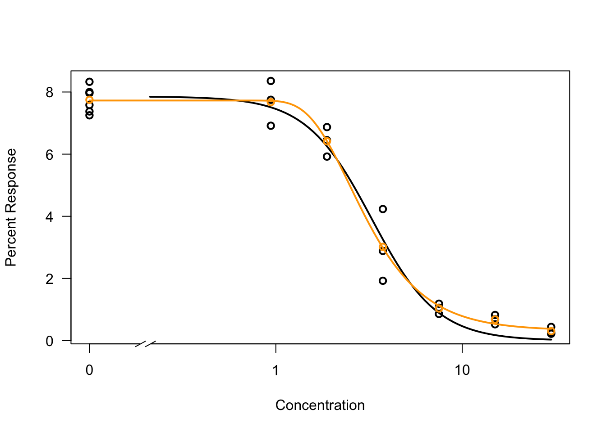

You can calculate the Akaike’s information criterion and the residual variance (smaller = better) with the `mselect()` function, to make an informed decision between different models:


```{.r .Rchunk}
mselect(model.LL3, fctList = list(W2.4()), linreg=TRUE) 
```

```{.Rout}
##          logLik        IC Lack of fit   Res var
## W2.4  -15.91352  41.82703   0.9450713 0.2646283
## LL.3  -18.60413  45.20827   0.3531679 0.3153724
## Cubic -25.53428  61.06856          NA 0.5899609
## Quad  -35.11558  78.23116          NA 1.2485122
## Lin   -50.47554 106.95109          NA 4.2863247
```


## scripts and Rmarkdown

First of all, download some data for the first lessons [here](data/alldatafirstlessons.zip). And some example Rmarkdown files [here](rmarkdown/markdownexamples.zip).

So far, we have run a lot of code in the console. Or perhaps you used a script to save some commands. Usually though, you will be working on a specific dataset, rather than playing around with course material. To save all the steps for a specific analysis, you can save your code in a script, or in a markdown file.

### scripts

Scripts have been introduced before. Quite simply, they are just all R code, but in a tekst file so you can save your code for later (and importantly: for reproducability).

All regular tekst in a .r script will be regarded as R code. Comments can be added by putting a hashtag in front of the tekst. Any plots will be displayed in the window at the lower right of the screen.


<div class="question">
##### Exercise 1 {-} 

If you haven't already, make a new script with the code for fitting dose response curves we used in the previous examples. Save you script on your computer.

</div>


<details><summary>Click for the answer</summary>

- click file --> new file --> R script (or click the empty paper with green + in the upper left corner)
- copy paste your code from the examples to your script.
- run the script (upper right corner, press Run) to check if it is still working.
- save the script to your computer.


```{.r .Rchunk}
library(drc)
library(tidyverse)

# fit a 4-parameter log-logistic model
model<- drm(formula = rootl~conc, # we are interested in rootlength as a function of (~) concentration
            data=ryegrass, # input
            fct=LL.4(names = c("Slope", "Lower Limit", "Upper Limit", "ED50")))
            #LL.4 means 4-parameter log-logistic

# give me the estimates
summary(model)

# plot the dose response curve
plot(model, type="all")

# calculate ED10, 20 and 50
ED(model, c(10,20,50), interval="delta")

# compare 2 different models
model.W24 <-  drm(rootl~conc, data=toxdata, fct=W2.4(names = c("Slope", "Lower Limit", "Upper Limit", "ED50"))) # W2.3: a weibull type 2 function with 4 parameters

model.LL3 <-  drm(rootl~conc, data=ryegrass, fct=LL.3(names = c("Slope", "Upper Limit", "ED50"))) # a Log logistic model with 3 parameters

# plot the comparison
plot(model.LL4, broken = TRUE, xlab="Concentration", ylab="Percent Response", type='all',lty=1, lwd=2)
plot(model.W24, add=TRUE,col="orange",lty=1, lwd=2)

# calculate IC
mselect(model.LL3, fctList = list(W2.4()), linreg=TRUE)
```

## Rmarkdown

If you want to present your findings you can either share your code and ask fellow researchers to reproduce your results or alternatively only show the output of your results. Both have their downsides, and Rmarkdown tries to comine the best of both methods. It is a reproducible manner of building documents (such as .pdf, .html and even .docx) which directly includes your code. So when you use code to generate a plot, it is included in the Rmarkdown-file you use to write the paper. It containis both code (method) and output. 

RMarkdown can be used in three ways:

- to communicate only the output and conclusions of your analysis to decision makers (and not the code behind the conclusions);
- to communicate the output and conclusions, as well as the code behind the conclusions to fellow scientists;
- as an environment in which to do data science, as a modern day lab notebook where you can capture not only what you did, but also what you were thinking.

Although here we focus on R code, RMarkdown documents can also integrate Python, Bash, SQL and other (programming) languages into one document showing both code and output. RMarkdown is also frequently used to produce (e-)books. And also, this reader.

Let's start with a simple RMarkdown document to examplify the concept of RMarkdown:

Download the course data for the first lessons by clicking here 

To open an existing RMarkdown file, perform the following steps:

(1) Click on *file > Open File*.

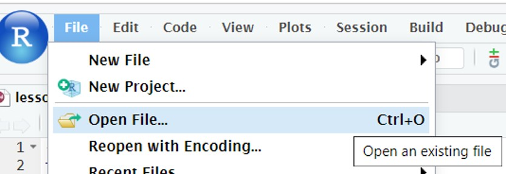

(2) Navigate to the folder you downloaded the course data to and select file **lesson1_example1.Rmd** (note: RMarkdown files have the extension .Rmd).

(3) Open RMarkdown file **lesson1_example1.Rmd**.

The contents of the file will be displayed in the upper left panel in RStudio and contains the following lines of code:

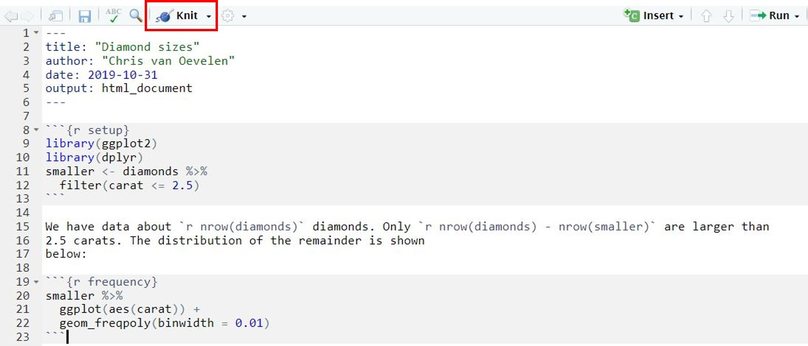

An R markdown file consist of different sections of code each marked with different characters: 

- The first **header** section starts and ends with ---
- Sections containing code (**chunks**) start and end with ```
- **Plain text** does not have marking characters
- Code within plain text starts and ends with `

To render an RMarkdown file (meaning to make an output file) simply click on the knit button located just above the RMarkdown file (see figure above). The output file will be shown in a separate RStudio panel. 

(4) Knit the RMarkdown file and take a close look at the output file.

The output document is saved in the same folder as the original RMarkdown file with the extension '.html'. This is the default output format but can be changed to, for example, a PDF or Word format.

IMPORTANT: by default the output file contains the code itself, messages and the output of the code. The default behavior of what to show in the output file can be changed and will be discussed later in this lesson. But first we will explain the lay-out of the RMarkdown file. 

## YAML header

The first section of the RMarkdown example is the YAML header. The YAML header provides general information of the output document:

- **title**: can be filled in when creating a new RMarkdown file.
- **author**: can be filled in when creating a new RMarkdown file.
- **date**: automatically set when creating a new RMarkdown file.
- **output**: by default RMarkdown creates an output file in HTML format. If you want another output format change output: to another file format such as PDF or Word (although you need additional packages).

If you want to make different RMarkdown output files from an existing RMarkdown, it is advisable to set the date in the YAML header as follows:


```{.r .Rchunk}
'`r Sys.Date()`'
```

This R function sets the current date. Note that the function is between a pair of single quotes and backticks (see also later in this lesson).

The YAML header provides many other options to control “whole document” settings. However, this is beyond the scope of this course.

###### Example


````{.Rout}
--- 
title: "Diamond sizes"
author: "Your Name"
date: 2019-10-31
output: html_document
--- 

```{r setup}
library(ggplot2)
library(dplyr)
smaller <- diamonds %>%
  filter(carat <= 2.5)
```

We have data about  ` r nrow( diamonds ) ` diamonds.  
Only ` r nrow( diamonds ) - nrow( smaller ) ` are larger than 2.5 carats. 
The distribution of the remainder is shown below:

```{r frequency}
smaller %>%
  ggplot(aes(carat)) +
  geom_freqpoly(binwidth = 0.01)
```
````

## Code chunks

The RMarkdown example above contains two chunks. A chunk is a section in the RMarkdown file containing the actual code. A chunk of code starts and ends with three backtick marks. To define the beginning of the code the three backtick marks are minimally followed with {r}. The r signals that the code is R. Remember that we can also use code of other languages such as bash or python. In that case the chunk header will be {bash} or {python}, respectively.

Within the {r} header, you can optionally provide a name of the header. In the example above, the first header is named "setup" and the second header is named "frequency". Naming chunks has the advantage that your RMarkdown becomes organized so that is will be easy to search for and navigate to a specific chunk. To search for a chunk, click on search button below the RMarkdown file (see figure below).

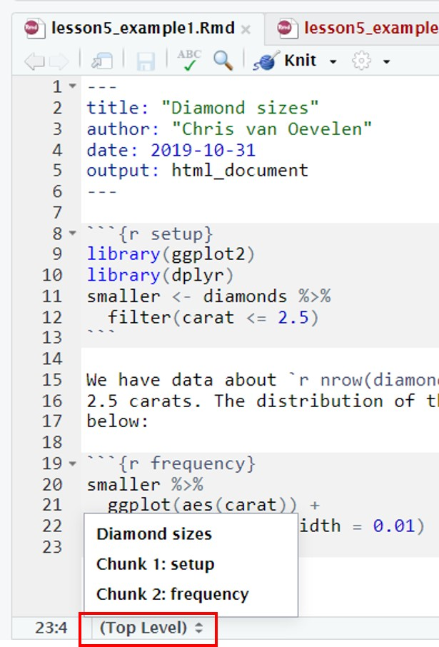

Another use of named chunks is to save figures. If a chunk creates a figure, the figure can also be saved separately. This option will be discussed in the next section.

## Output control

When rendering an RMarkdown file, by default the R code in a chunk is executed and the output file will contain the code, messages and output of the code. Most often this is not what you want. (NB: plain text is always printed.)

To control what will be shown in the output file we will use chunk options. If you want to apply a similar set of options for all "chunks", you can use knitr::opts$set as shown below. Put this chunk, named 'setup' at the beginning of your RMarkdown file. The chunck options defined here will be generally applied to the whole document:


````{.Rout}
```{r setup}
knitr::opts_chunk$set(option1 = 'hide',
option2 = FALSE,
option3 = FALSE
)
```
````


It is also possible to set options for a single chunk. Simply put the options in the header of the chunk you want to modify, as shown below. General chunk options as shown above will be overwritten by the single chunk options.


````{.Rout}
```{r setup, option1 = FALSE, option2 = FALSE} 
library(ggplot2)
library(dplyr)
smaller <- diamonds %>%
  filter(carat <= 2.5)
```                               
````

There are more than [60 options](https://yihui.org/knitr/options/) to add to a chunk header. Some of these options determine what happens with the chunk code:

- **eval** = FALSE: the code is not executed. The chunk code is shown in the output file. This is useful for displaying example code.
- **include** = FALSE: the code is executed, but the chunk code and all of its output (results, figures, messages and warnings) are not shown in the output file. This is useful for chunks performing data wrangling, for example data filtering or creating new variables, which are later used in graphs or summary tables.
- **echo** = FALSE: the code is executed, but the chunk code is not in the output file. All output of the chunk is shown in the output file. This is useful for showing the final results (graphs) of your data analysis and not how you achieved your results. Use this when writing reports aimed at people who do not want to see the underlying R code.

Note that the option "include = FALSE" [supresses](https://yihui.org/en/2017/11/knitr-include-false/) all output of a chunk. To specifically control what should not be be in the output file you can make use of the following options:

- **results** = "hide": the code is executed and the chunk code is shown in the output file. The results of R functions are not shown in the output file.
- **fig.show** = "hide": the code is executed and he chunk code is shown in the output file. Figures of R functions are not shown in the output file.
- **message** = FALSE: the code is executed and the chunk code is shown in the output file. R messages are not shown in the output file.
- **warning** = FALSE: the code is executed and the chunk code is shown in the output file. R warnings are not shown in the output file.

Table with different chunk output options. **yes** means present in the output file.

Option |	Run code |	Show code |	Output |	Plots |	Message |	Warning
:----|:-----|:---|:---|:---|:---|:---
eval = FALSE |	no |	**yes** |	no |	no |	no |	no
include = FALSE |	**yes** |	no |	no |	no 	| no |	no
echo = FALSE | 	**yes** |	no |	**yes** |	**yes** |	**yes** |	**yes**
results = "hide" |	**yes** |	**yes** |	no |	**yes** |	**yes** |	**yes**
fig.show = "hide" |	**yes** |	**yes** |	**yes** |	no |	**yes** |	**yes**
message = FALSE |	**yes** |	**yes** |	**yes** |	**yes** |	no 	| **yes**
warning = FALSE |	**yes** |	**yes** |	**yes** |	**yes** |	**yes** |	no

<div class="question">
##### Exercise 1 {-}

(a) Modify RMarkdown file **lesson1_example1.Rmd** to only show the figure in the output file.
(b) Modify RMarkdown file **lesson1_example1.Rmd** to only show the chunk code in the output file (not the output of the chunks).

Save the Rmd files as **lesson1_exercise_1a.Rmd** and **lesson1_exercise_1b.Rmd** respectively .
</div>

<details><summary>Click for the answer</summary>

(a)

```{.r .Rchunk}
{r setup, echo = FALSE, message = FALSE}
{r frequency, echo = FALSE}
```
(b)

```{.r .Rchunk}
{r setup, message = FALSE}
{r frequency, fig.show = "hide"}
```
</details>

-------------

There are also several options for dealing with figure output and layout:

- **fig.width** = n and **fig.height** = n (where n is a number representing inches): to change the width and height of the figures in your output file.
- **fig.cap** = "name of the caption": to add a caption to the figure plot (a caption is a numbered label, such as "Figure 1").
- **fig.path** = "figures/": to create separate files of figures created by a chunk. First create a figures folder in the rmarkdown directory. The file containing the figure will be stored in this folder with a similar name as the chunk name.

<div class="question">
##### Exercise 1 {-}

(a) Modify RMarkdown file lesson1_example1.Rmd to:

- Show only the figure in the output file.
- Modify the figure width to 6 and the height half of the width.
- The figure in the output file has an caption.

(b)

Modify RMarkdown file lesson1_example1.Rmd to:

- Show only the plain text.
- Save the figure in a separate file in a folder /figures.

Save the Rmd files as **lesson1_exercise_2a.Rmd** and **lesson1_exercise_2b.Rmd** respectively **
</div>

<details><summary>Click for the answer</summary>

(a)

```{.r .Rchunk}
{r setup, echo = FALSE, message = FALSE}
{r frequency, echo = FALSE, fig.height = 3, fig.width = 6, fig.cap = "Figure1: Distribution of carat values"}
```
(b)

```{.r .Rchunk}
{r setup, include=FALSE}
{r frequency, include=FALSE, fig.path ="figures/"}
```
</details>

------------

In the RMarkdown output file, data frames (tibbles) are printed in the same way as you would see them in the RStudio console. To change this behavior, you can use the knitr::kable() function as demonstrated in RMarkdown file **lesson1_tables.Rmd**.

Open and knit this RMarkdown file. Study the code and the RMarkdown output format.

There is an example in the .Rmd file on how to make APA format tables.

## Plain text formatting

An RMarkdown document contains a YAML header and chunks of code to be executed. In addition, plain text can be added to describe your analysis, results or whatever you think is useful to understand your RMarkdown document. Plain text will always be shown in the output file (unless you put it in a chunk as comments, starting with a # sign).

The output of plain text can easily be formatted by a set of simple formatting rules:

- to print plain text in italics surround the text with 1 underscore: \_text\_ will become _text_.
- to print plain text in bold surround the text with 2 underscores: \_\_text\_\_ will become __text__.
- to print superscript use \^2\^: 10\^2\^ will become 10^2^.
- to print subscript use \~2\~:  H\~2\~O will become H~2~O.

To print headers use the pound sign in front of the header text:

\# 1st Level Header
\#\# 2nd Level Header
\#\#\# 3rd Level Header

A quick reference guide can be found in RStudio: *Help > Markdown Quick Reference*. A complete reference guide can be found in RStudio: *Help > Cheatsheets > R markdown Reference Guide*.

Within plain text, R code can be executed. To incorporate R code within plain text, use r code surrounded by backticks `. The code will be evaluated and printed in the output document. Note that the original code will not be shown in the output document!

<div class="question">
##### Exercise 1 {-}

Modify RMarkdown document **lesson1_exercise_3.Rmd** to include:

- Plain text describing the source of the dataset. Write the package name in italics and the name of the dataset in bold.
- the sentence: "the infant mortality has dropped from ' [R code showing the max infant_mortality in 1960] ' in 1960 to ' [R code showing max infant_mortality in 2015] ' in 2015." NB: the parts between square brackets is R code you have to include; this R code will be evaluated within the plain text section after rendering the output file.

Save the RMarkdown file as **lesson1_exercise_4.Rmd**.
</div>

<details><summary>Click for the answer</summary>


````{.Rout}
---
title: "gapminder_table"
author: "Your name"
date: '`r Sys.Date()`'
output: html_document
---

```{r setup, include=FALSE}
library(tidyverse)
library(dslabs)
```

source of data: The __gapminder__ dataset from the _dslabs_ package.

The infant mortaliy has drop from 
`r year_1960 <- gapminder %>% filter (year == 1960); max (year_1960$infant_mortality, na.rm = TRUE)` 
in 1960 to 
`r year_2015 <-gapminder %>% filter (year == 2015); max (year_2015$infant_mortality, na.rm = TRUE)` 
in 2015.

```{r table, warning=FALSE, echo=FALSE}
knitr::kable(
  gapminder %>% select(country, year, infant_mortality) %>%
    group_by(year) %>%
    filter(infant_mortality == max(infant_mortality, na.rm = TRUE)),
  caption = 
    "Table1: countries with highest infant mortality rate from 1960-2016."
)
```
````

</details>

## Here package

To exemplify the idea of RMarkdown we have used a built-in dataset to show the different display options of code and output. However, most often you will refer to datasets or scripts in your RMarkdown file that are stored on a server or on your computer. This will cause a problem because RMarkdown and knit will not search for files in the project folder but instead in the folder were the RMarkdown file is stored. To solve this problem we will make use of the "here" package.

In the beginning of this course we have created an Rproject and before each session you should open the Rproject you are working on. Within the project folder (in this case **daur**) you organize your data files, scripts files, RMarkdown files and output files in different folders (see figure below). By using an Rproject you are guaranteed that when executing R code / scripts, all of your (data) files are read in properly. This is because by definition, within your Rproject environment, R will set the working directory to the project folder and start looking for folders and files relative from the Rproject folder (the folder that contains the .Rproj file, in this case the daur folder).


<div class="figure" style="text-align: center">
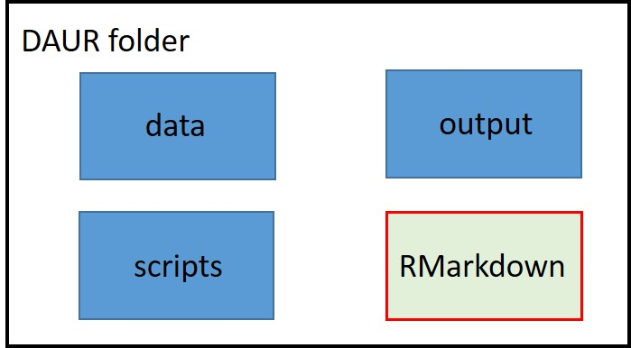
<p class="caption">(\#fig:unnamed-chunk-77)Data organisation on a server. Always create an Rproject to do data analysis.</p>
</div>

When using RMarkdown, the default behavior is to only look in the folder where the RMarkdown file is stored. This will cause errors when knitting an RMarkdown file because RMarkdown can not find the data files stored in the data folder outside the RMarkdown folder.

For example, you source (execute) a script from the **scripts** folder and this script imports a dataset present in the **data** folder. Because you work within your Rproject, R will start looking for folders and files relative to the project folder (in this case the daur folder). Contrary, if you are knitting an RMarkdown file and this RMarkdown imports a dataset present in the **data** folder, RMarkdown will only start looking in the RMarkdown folder and will never find the data folder. This will cause an error and the knitting of the RMarkdown document stops.

###### Example

Open via Rstudio the RMarkdown file **lesson1_here_example1.Rmd** . The file contains the following RMarkdown code:


````{.Rout}
```{r}
library(tidyverse)
object1 <- read_csv("data/lesson3/heights.csv")
head(object1)
```
````

Click on the knit button to render the output file. You will get the following error message:

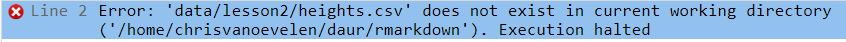

You notice that the current working directory is set to the **rmarkdown** folder. RMarkdown start looking for folder "heights.csv" in some "hard coded" folder (i.e. I typed out the whole (example) location) but can not find it. It throws an error and exits the knitting process.

To change the default behaviour of RMarkdown, we will use the **here** package. The **here** package recreates a file path to the Rproject folder. 

Install the package by typing `install.packages("here")` in the console.

###### Example

In Rstudio, open the RMarkdown file **lesson1_here_example2.Rmd**. The markdown file contains the following RMarkdown code:


````{.Rout}
``` {r}
library(tidyverse)
library(here) 
object2 <- read_csv(here("data/lesson3/heights.csv"))          
head(object2)
```
````

The output file will be displayed in a separate RStudio panel. In addition, an output file named **lesson1_here_example2.html** is created and saved in the **rmarkdown** folder.

<div class="question">
##### Exercise 1 {-}

Use dataset **c10_gene_expression.txt** from the course data. This file contains gene expression values after 0h, 3h, 12, 24h and 48h (hours) of induction of the c10 celline. After induction, the cell undergoes a massive change in gene expression.

Show the genes that become highest upregulated after 48 hours (48h) of induction compared to the start condition (= 0h). Only list genes which have a difference of 8 or more between 48h and 0h.

Write an RMarkdown document. The RMarkdown document should contain:

- YAML header.
- Plain text describing the source of the dataset.
- Chunks containing R code to create a table of the highest expressed genes after 48h.

The RMarkdown output file only contains the table. Save the RMarkdown file as **lesson1_exercise_5.Rmd**.
</div>

<details><summary>Click for the answer</summary>


````{.Rout}
---
title: "Lesson8_Exercise_5"
author: "Your Name"
date: ' `r Sys.Date() ` '
output: html_document
---

source of the dataset is __daur/data/lesson8/c10_gene_expression.txt__

``` {r setup, include=FALSE}
library(tidyverse)
library(here)
```

```{r import, include=FALSE}
# Read in the data
c10_gene_expression <- read_tsv(here("data/lesson8/c10_gene_expression.txt"))

# Create a column with the difference
c10_gene_expression_up8 <- 
  mutate(c10_gene_expression, up = `48h` - `0h`) %>% 
  filter(up >= 8)
```

```{r table_genes, echo=FALSE}
knitr::kable(
  c10_gene_expression_up8,
  caption = "Table1: Genes with highest induction of expression after 48 hours"
)
```
````

</details>

## Creating a new RMarkdown file

To create your own Rmarkdown documents in RStudio, perform the following steps:

1. click *File > New File > R Markdown*.

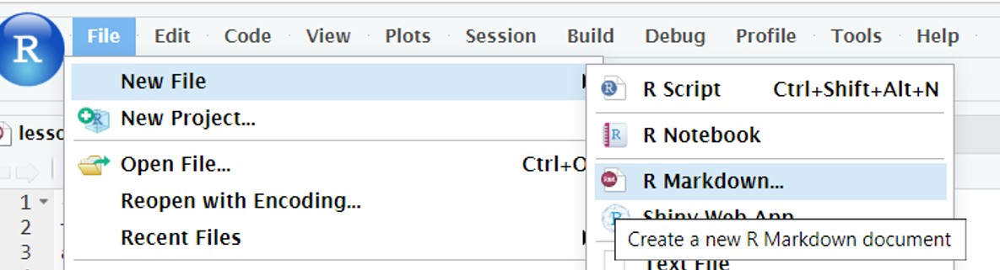

2. Fill out the Title and Author which will be displayed in the YAML header (this step is optional).

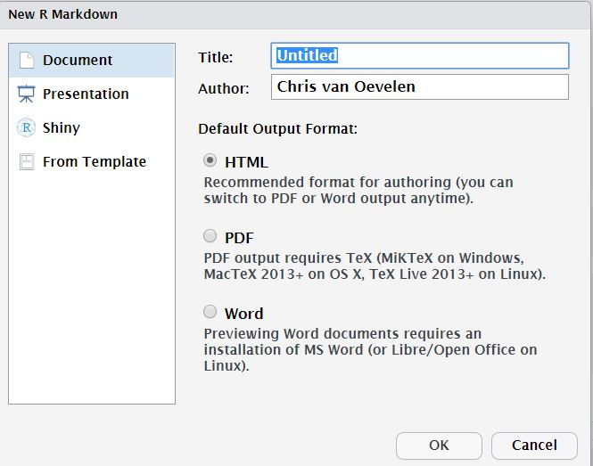

3. Click on OK. A default template will be opened in RStudio showing the YAML header and instruction on how to use RMarkdown:


4. Remove the instructions but leave the YAML header.
5. Start writing your RMarkdown document.
6. Save your document in a folder called rmarkdown in your project folder.
7. To render your RMarkdown document, click on the knit button.

<div class="question">
##### Exercise 1 {-}

Create a new RMarkdown document. In this document, create R chuncks to perform the following tasks:

- Read in the dataset **c10_gene_expression.txt** from the course data.
- Convert this dataset to a tidy dataset. Set the time variable as a factor and set the levels of this factor in a logical order.
- Create a scatter plot (ggplot) that shows the results for the genes "Slfn4" and "Cd14".

The RMarkdown output file contains the code to make the scatter plot and the plot itself. All other R code used for data transformation and wrangling is not shown in the output file. Save the RMarkdown file as **lesson1_exercise_genexp.Rmd**.
</div>

<details><summary>Click for the answer</summary>


````{.Rout}
---
title: "Lesson8_Exercise_6"
author: "Your Name"
date: ' `r Sys.Date() ` '
output: html_document
---

``` {r setup, include=FALSE}
library(tidyverse)
library(here)
```

```{r import, include=FALSE}
# Read in the data
c10_gene_expression <- read_tsv(here("data/lesson8/c10_gene_expression.txt"))

# Make data tidy
gene_expr_tidy <- c10_gene_expression %>% 
  gather(`0h`, `3h`, `12h`, `24h`, `48h`, key = time, value = expression) %>%
  mutate(time = as.factor(time))

# Reorder the levels of the time variable
levels(gene_expr_tidy$time) <- c("0h", "3h", "12h", "24h", "48h")
```

```{r figure_genes}
gene_expr_tidy %>% filter(gene == "Slfn4" | gene == "Cd14") %>%
  ggplot(aes(x = time, y = expression, colour = gene)) + 
  geom_point() 
```
````

</details>

<div class="dagopdracht">
Practice in the following week on building Rmarkdown reports with data chunks analysing a certain research question.

You can use the build-in datasets in R (type `data()` to see them)
</div>


