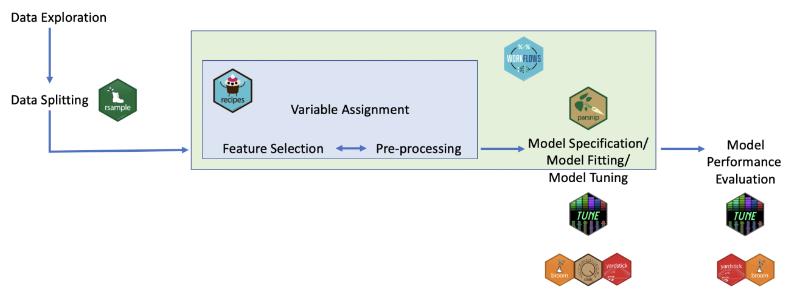
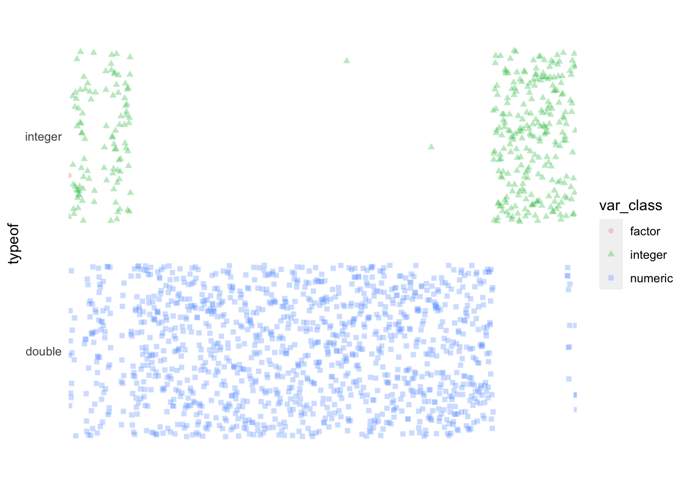
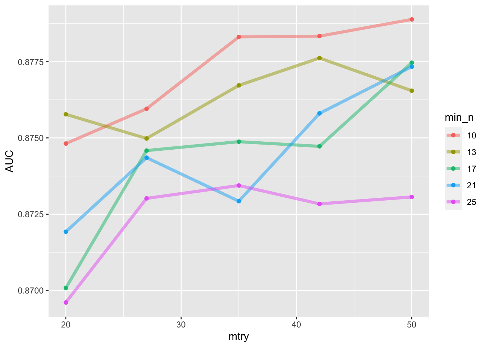
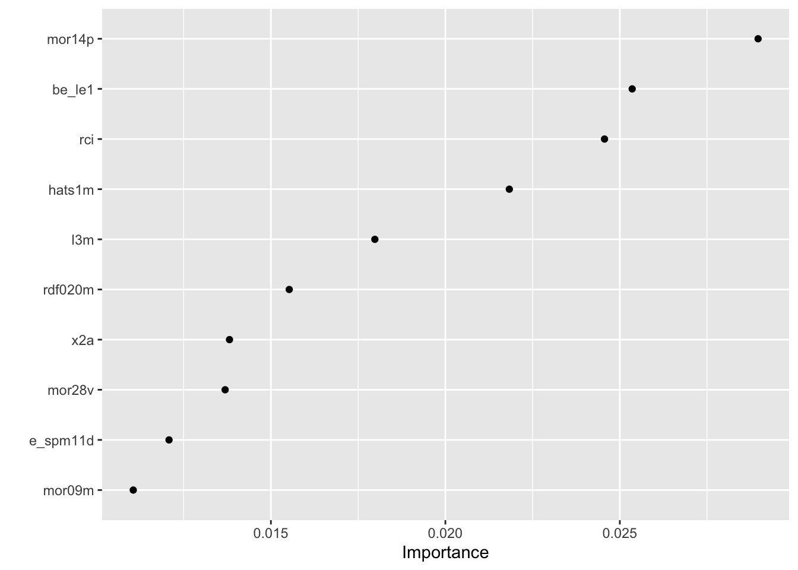
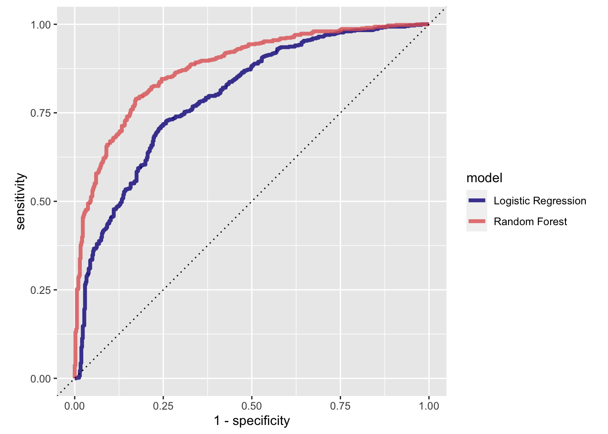
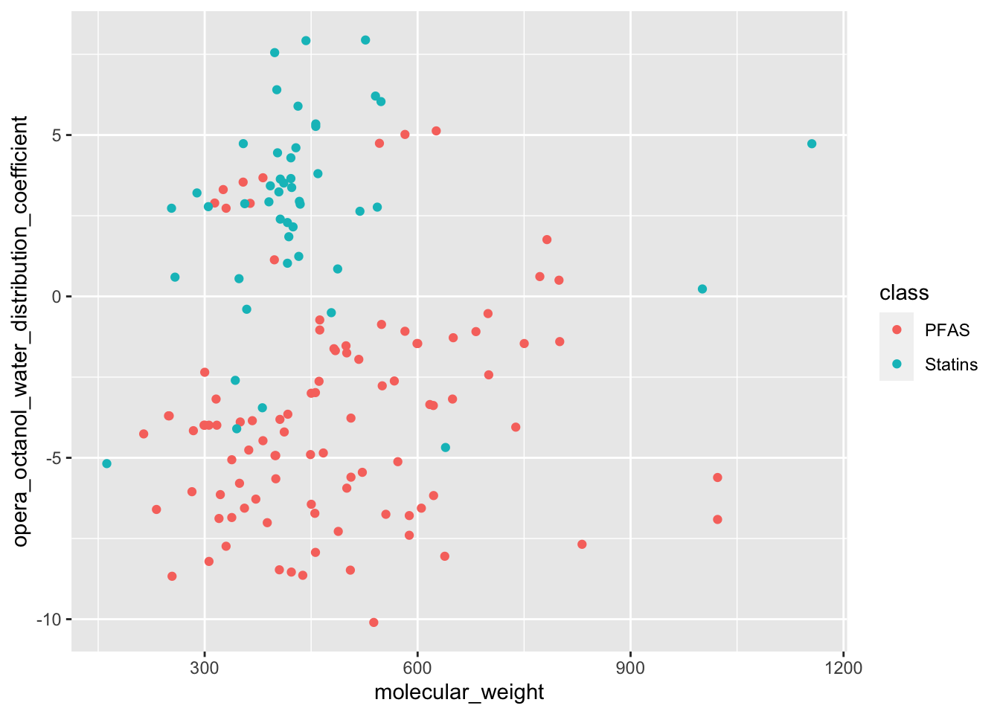
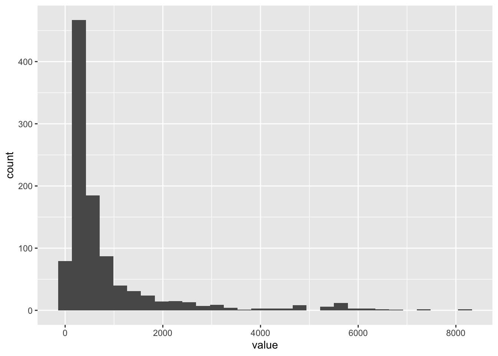

# Part 2 -- Machine Learning with R


## Learning objectives

After this activity:

 - You will be familiar with the core utilities and general workflow for developing a (machine learning) model using the `{idymodels}` framework in R 
 - You will be able to explore data suited for training a machine learning algorithm
 - Perform a number of unsupervised exploratory analysis (PCA, t-SNE, k-Means)
 - Build a predictive toxicity model, based on physioco-chemical attributes of chemicals 
 - Build a model to predict the partition coefficient (LogP), based on fingerprints

## Machine Learning
The term machine learning refers to a field of computational science and applications, where methods are used and developed that can 'learn' from data to solve specific tasks. In classicial machine learning these tasks are mostly related to classification. Machine Learning, of short ML, is considered a subfield of Artificial Intelligence and is considered as methods (or models / algorithms) that are trained on (sample) data to to make predictions or or decisions, without explicitly being programmed to do so. The following figure tries to convey the difference between classical problem solving using a rule based approach and modern ML.
For a gentle introduction see [this wiki page](https://en.wikipedia.org/wiki/Machine_learning)

## TAME
If after this workshop you would like to learn more about applying ML in Toxicology, the [The TAME Toolkit](https://github.com/UNCSRP/Data-Analysis-Training-Modules) for Introductory Data Science, Chemical-Biological Analyses, Predictive Modeling, and Database Mining for Environmental Health Research is a good place to start learning. Some of the examples in this lesson were taken from [chapter 2.2 of the TAME Bookdown project](https://uncsrp.github.io/Data-Analysis-Training-Modules/machine-learning-and-predictive-modeling.html#machine-learning-and-predictive-modeling)

[Reference:](https://doi.org/10.3389/ftox.2022.893924) Roell, K., Koval, L. E., Boyles, R., Patlewicz, G., Ring, C., Rider, C. V., Ward-Caviness, C., Reif, D. M., Jaspers, I., Fry, R. C., & Rager, J. E. (2022). Development of the InTelligence And Machine LEarning (TAME) Toolkit for Introductory Data Science, Chemical-Biological Analyses, Predictive Modeling, and Database Mining for Environmental Health Research. Frontiers in toxicology, 4, 893924. https://doi.org/10.3389/ftox.2022.893924

## Tidymodels
The Tidymodels framework is an extension of the `{tidyverse}` suite. It is especially focused towards providing a generalized way to define, run and optimize models in R. To get started we will walk you through a customized example, relevant for toxicological compound classification. To learn more see [Tidymodels documentation](https://www.tidymodels.org/start/. To learn even more about Tidymodels, there is also a very elaborate [bookdown project](https://www.tmwr.org)

## Packages
Here we load all the packages that we need for this demo.


```r
library(tidymodels)
```

```
## ── Attaching packages ────────────────────────────────────── tidymodels 1.1.0 ──
```

```
## ✔ broom        1.0.4     ✔ recipes      1.0.6
## ✔ dials        1.2.0     ✔ rsample      1.1.1
## ✔ dplyr        1.1.2     ✔ tibble       3.2.1
## ✔ ggplot2      3.4.2     ✔ tidyr        1.3.0
## ✔ infer        1.0.4     ✔ tune         1.1.1
## ✔ modeldata    1.1.0     ✔ workflows    1.1.3
## ✔ parsnip      1.1.0     ✔ workflowsets 1.0.1
## ✔ purrr        1.0.1     ✔ yardstick    1.2.0
```

```
## ── Conflicts ───────────────────────────────────────── tidymodels_conflicts() ──
## ✖ purrr::discard() masks scales::discard()
## ✖ dplyr::filter()  masks stats::filter()
## ✖ dplyr::lag()     masks stats::lag()
## ✖ recipes::step()  masks stats::step()
## • Use tidymodels_prefer() to resolve common conflicts.
```

```r
library(tidyverse)
```

```
## ── Attaching core tidyverse packages ──────────────────────── tidyverse 2.0.0 ──
## ✔ forcats   1.0.0          ✔ readr     2.1.4.9000
## ✔ lubridate 1.9.2          ✔ stringr   1.5.0.9000
```

```
## ── Conflicts ────────────────────────────────────────── tidyverse_conflicts() ──
## ✖ readr::col_factor() masks scales::col_factor()
## ✖ purrr::discard()    masks scales::discard()
## ✖ dplyr::filter()     masks stats::filter()
## ✖ stringr::fixed()    masks recipes::fixed()
## ✖ dplyr::lag()        masks stats::lag()
## ✖ readr::spec()       masks yardstick::spec()
## ℹ Use the conflicted package (<http://conflicted.r-lib.org/>) to force all conflicts to become errors
```

```r
library(broom.mixed)
library(dotwhisker)  
library(QSARdata)
library(bundle)
library(doMC)
```

```
## Loading required package: foreach
## 
## Attaching package: 'foreach'
## 
## The following objects are masked from 'package:purrr':
## 
##     accumulate, when
## 
## Loading required package: iterators
## Loading required package: parallel
```

```r
library(finetune)
library(tune)
```

## Datasets 
For this lesson we will use a number of different datasets. Because we need datasets that include somewhat larger volumes of data, we also download data on the fly.

Let's get the datasets in our R-session 

### Mutagen
A dataset from [Github](https://github.com/simonpcouch/mutagen).


```r
load(
 here::here(
   "data-raw",
   "mutagen_tbl.Rda"
 )
)
```

### A dataset on statins and PFAS from the EPA
This dataset was curated and provided in the TAME project mentioned above. It can be directly downloaded from Github.


```r
url <- "https://raw.githubusercontent.com/UNCSRP/Data-Analysis-Training-Modules/main/Chapter%202/2.2%20ML%20Predictive%20Modeling/Module2_2_Chemical_Lists_PFAS-Statins.csv"

data_tame <- read_csv(
    url, 
    locale = readr::locale(encoding ="UTF-8")
    )
```

```
## Rows: 144 Columns: 14
## ── Column specification ────────────────────────────────────────────────────────
## Delimiter: ","
## chr  (4): List, Substance Name, CASRN, DTXSID
## dbl (10): Molecular Weight, OPERA, Boiling Point, OPERA, Henry's Law Constan...
## 
## ℹ Use `spec()` to retrieve the full column specification for this data.
## ℹ Specify the column types or set `show_col_types = FALSE` to quiet this message.
```

### QSAR data
An example dataset that contains classical chemical fingerprints.
[From the UCL repository](https://archive.ics.uci.edu/ml/datasets/QSAR+oral+toxicity)

Metadata:
Attribute Information:

1024 binary molecular fingerprints and 1 experimental class:
1-1024) binary molecular fingerprint
1025) experimental class: positive (very toxic) and negative (not very toxic)

Data source:
[D. Ballabio, F. Grisoni, V. Consonni, R. Todeschini (2019), Integrated QSAR models to predict acute oral systemic toxicity, Molecular Informatics, 38, 180012; doi: 10.1002/minf.201800124](https://doi.org/10.1002/minf.201800124)

Files `ID.txt`,`class.csv` and `X.csv` in folder `./data-raw/` were obtained from the author of the paper above via personal communication. Original sources files (Matlab scripts and matrix files can be downloaded from the paper's DOI as supplemental data). They are included here for reproducibility reasons in `./data/lesson5/qsar/oral_toxicity_data.rar`

The code below downloads the data to a the `./data-raw` folder and unzips the file in a temporary folder. We read the file into R from that temp file.


```r
path <- here::here(
  "data-raw",
  "qsar_oral_toxicity.zip"
)

download.file(url = "https://archive.ics.uci.edu/ml/machine-learning-databases/00508/qsar_oral_toxicity.zip", destfile = path)

unzip(zipfile = path, exdir = here::here(
  "data-raw")
)
```

## Tidymodels overview

### Tidymodels core packages
[The core Tidymodels collection of packages consists of](https://www.tidymodels.org/packages/)

 - `{rsample}` - for splitting and resampling data
 - `{parsnip}` - provides an unified interface for different models
 - `{recipes}` - for pre-processing data
 - `{workflows}` - for putting the recipe and the model together
 - `{tune}` - for tuning the hyperparameters  
 - `{yardstick}` - for model evaluation and validation

The tidymodels packages allow you to specify, run, fine tune and evaluate models in a consistent way. They provide a workflow for defining and updating modelling approaches and take away the effort of accomodating syntactical differences between different model implementations, so that you can focus on the stuff that is really important. 

From my experience, the overall workflow is a little hard to get your head around initially, but putting in the effort to really understand it, pays off in the long run. Certainly, I am finding myself less busy with diving into the specific documentation of a model engine, but focussing more on the actual modelling part of the job!   

The steps we need to walk though are:

 1. Generate a training and a testing partition of the data. This can be done in several ways: Splitting into a single test and training set or genrating multiple so-called `folds`, that contain multiple (random) splits. It is crucial to understand the data before splitting. For example, you need to be able to provide answer to the question whrther the 'thing' you are trying to predict is present equally in the data, or that (e.g. in a binary classification, there are many more instances of one class, compared to the other) 
 1. Define a `{recipe}` for which variables and which dataset we would like to use for modelling. The recipe also holds so called `steps` that include any preprocessing we would need for the model we would like to fit. Different models have diffenrent requirements for preprocessing. See: for an overview [the Tidymodels Bookdown](https://www.tmwr.org/pre-proc-table.html)
 1. A model `specification`, that contains the details on which model to run and which values to set for the hyperparameters of a model. Hyperparameters can be viewed as the dials with which you tune the model. They regulate e.g. overfitting or number of interactions. Tuning a models is an important aspect of modelling and can be done in several ways. A very structured way to find the most optimal hyperparameters is `grid tuning`. The `{tune}` package is facilitating this in the tidymodels suite.   
 1. Definition of the model `metrics` that will help decide how well the fit of the model is for the data 
 1. A `workflow` where the recipe and the model specification come together. This is the 'wedding planner' of the tidymodels. It can be considered as the plan for the model (without actually running the model) 
 1. A model `fit`. This is the step where actually run out model, or models, and _fit_ the model to our data. From the fit we can extract the metrics, predictions, statistics and other valuable information that tells us how the model to the data.
 1. Model performance: Getting the model performance metrics such as `specificiy`, `selectivity` and overall performance as `accuracy`, can be obtained from the `fit` object. To evaluate the model, we need to expose the model to our test dataset, or datasets if we use folds.   
 1. When we use tuning, we rerun the steps of model training and evaluation multiple times to find the most optimal value for the hyperperameters. We then evaluate the best model and arrive at our final model.
 1. You can extend this workflow to running more then one model type. This is what we will do in this hands-on workshop.

Here is a visual that may help in understanding the role and nature of the steps, and the different tidymodels packages, in the modelling process.


```r
knitr::include_graphics(
  here::here(
    "images",
    "tidymodels-pkgs.png"
  )
)
```



## Getting started with `{tidymodels}`

If we put the complete `{tidymodels}` workflow together we can define all the models and run them on our `mutagen` data. Here we will focus on just one model to see all the step described above in sequence 
The complete code for running all the models shown in the plot above can be found in the mutagen repo: https://raw.githubusercontent.com/simonpcouch/mutagen/main/source/fit.R

See also: [`{tidymodels}` getting started documentation](https://www.tidymodels.org/start/) 

### Build our first model with Tidymodels
Let's train our first model, using tidymodels on the `mutagen_tbl` data. We will do some clean up of the ciolumn names first. As a convention, I like to put everything in lowercase. This saves brainpower by not having to ever worry about capitals. Same thing for `snake_case`. I like that best for readability and consistency. 

The code for modelling the `mutagen` data was adapted from https://github.com/simonpcouch/mutagen.

### Clean names mutagen data
the `clean_names()` from the `{janitor}` package is very handy.

```r
mutagen_tbl <- mutagen_tbl |> janitor::clean_names()
## add sample_id for later use (add_role() in recipe)
mutagen_tbl <- mutagen_tbl |>
  mutate(sample_id = 1:nrow(mutagen_tbl)) |>
  relocate(sample_id)
```

### Load processed modelling results
The `mutagen` data was already fitted with a number of models. The Github repo contains the fitting results, which we load here.


```r
load(
  here::here(
    "data",
    "mutagen",
    "data",
    "metrics_wf_set.Rda"))
load(here::here(
    "data",
    "mutagen",
    "data",
    "metrics_xgb.Rda"))
load(here::here(
    "data",
    "mutagen",
    "data",
    "xgb_final_fit.Rda"))
load(here::here(
    "data",
    "mutagen",
    "data",
    "final_fit.Rda"))
```

### Plotting the data
As a first step in modeling, it’s always a good idea to plot the data.
Here we plot two important determining attributes for chemicals: the `Molecular Weight` and the `Partition Coefficient`


```r
ggplot(mutagen_tbl) +
  aes(x = mw, y = mlogp, color = outcome) +
  geom_point(shape = 1, alpha = 0.7) +
  labs(x = "Mol. Weight", y = "Partition Coefficient") +
  theme_minimal() +
  scale_color_manual(values = c("#ba0600", "#71b075"))
```


You could repeat this visualization step with using different sets of variables. Then you will probably learn that no two variables can easily split the data into mutagens and non-mutagens. In order to build a predictive model that can predict the class of a compound (mutagen or non-mutagen), we need a more advanced method. Below we will build a logistic regression prediction model to illustrate all the steps in the tidymodels workflow. We choose logistic regression here as the model that does not have the lowest performance of all the models tested, and it is the more simpler model of the ones that have a good performance. Depending on the nature and intended use of the prediction model, it may not always be feasible to choose the most complex and lesser explainable model. The following section shows the performance results of six different models that were run on the `mutagen` data. 

### Evaluating multiple models
The previously run modelling results (model performance) experiments with the `mutagen` dataset can be visualized, using the dataframe containing the model metrics. Which model is best? Which is worst?


### Data types
When running models, it is very important to make sure that the datatype of the variables in the model are according what the model-algorithm _expects_. For example, many models require the outcome variable to be a factor, neural networks expect all the data to be tensors, and for logistic regression we need to convert categorical variables to dummy encoding. This makes it of importance to check the datatype and set or correct the datatype accordingly.

let's make a graph of the datatypes of all the variables in the `mutagen` data. We first get all the datatypes of the 1580 variables in the data, and store this in a dataframe. From this we create a graph.


```r
var_data_classes <- map_chr(
  .x = mutagen_tbl,
  .f = class
)

var_data_types <- map_df(
  .x = mutagen_tbl,
  .f = typeof
) |>
  pivot_longer(
    1:ncol(mutagen_tbl), 
    names_to = "var_name",
    values_to = "typeof") |>
  mutate(var_position = 1:ncol(mutagen_tbl),
         var_class = var_data_classes)

set.seed(123)
var_data_types |>
  ggplot(
    aes(x = reorder(as_factor(var_name), var_position),
        y = typeof)) +
      geom_point(
        aes(
          colour = var_class,
          shape = var_class), 
        position = "jitter", alpha = 0.3) +
  xlab(NULL) +
  theme(axis.text.x = element_blank(), axis.ticks = element_blank()) +
  scale_x_discrete(limits = unique(var_data_types$var_name))
```



This supports our assumption that all variables in the `mutagen` dataset are `numeric`: either `integer` or `double`. Because `factor` is a special integer with class `factor`, we see only 1 red dot. if you look carefully, you will see it to the far left of the plot. This is the only factor. Which variable do you think this is? We do not need to change the datatype of any of our variables for our first model (or any that will follow for that matter). **Usually, wild data like this is not so clean, so please always perform this check, before moving on.** 

### Subsetting the data for run-time
The mutagen data contains 1580 columns. This is a lot of features. Because the example here is for educational purposes, I decided to reduce the dataset to 100 randomly selected predictors. In real life, you would perform a more regorous and substantiated feature selection procedure. For example, you could use Ridge Regression or LASSO to select features. Or use a permutation approach in combination with a tree based algorithm. A good example on how to do this is described in [this blog by Julia Silge](https://juliasilge.com/blog/lasso-the-office/) or in [this video by Adrew Couch](https://youtu.be/1AKug0tgux8).


```r
set.seed(123)
# Assuming your data frame is named "df"

# Select the first 2 columns
selected_columns <- c(1, 2)
no_predictors <- 100

# Generate random indices for the remaining 99 columns
remaining_columns <- sample(2:ncol(mutagen_tbl), no_predictors)

# Combine the selected columns
selected_columns <- c(selected_columns, remaining_columns)

# Subset the data frame with the selected columns
mutagen_tbl_selected <- mutagen_tbl[, selected_columns]
```

### Tidymodels workflow illustration on the `mutagen` data
Let's put all the pieces of the complete tidymodels workflow together and run a logistic model on a single split (1-fold cross validation) of the `mutagen` data.

The code below was adapted from: https://github.com/simonpcouch/mutagen/blob/main/source/fit.R

To set the stage for modelling, which can be resource intensive, we create a cluster on the local cores of the computer. We leave one core available for the system.

```r
## multicore running
registerDoMC(cores = max(1, parallelly::availableCores() - 1))
```

### Split data
First step is to divide the data into a training and a test set. The `set.seed()` function can be used for reproducibility of the computations that are dependent on random numbers.


```r
set.seed(1)
mutagen_split <- initial_split(data = mutagen_tbl_selected)
mutagen_train <- training(mutagen_split)
mutagen_test <- testing(mutagen_split)
```

### Define model (specification)
With specific model functions (here: `logistic_reg()`), we choose the model type. A full list of tidymodels model implementation can be found [here]((https://www.tidymodels.org/find/parsnip/).


```r
spec_lr <-
logistic_reg() %>% 
  set_engine("glm") %>% 
  set_mode("classification")
```

### Define recipe 
The [`recipe()` function](https://recipes.tidymodels.org/reference/recipe.html) as we used it here has two arguments:

+ A **formula**. Any variable on the left-hand side of the tilde (`~`) is considered the model outcome (here, `outcome`). On the right-hand side of the tilde are the predictors. Variables may be listed by name, or you can use the dot (`.`) to indicate all other variables as predictors.

+ The **data**. A recipe is associated with the data set used to create the model. This will typically be the _training_ set, so `data = mutagen_train` here. 

A recipe contains the specification for which dataset we will use for modelling and all the preprocessing steps we need to perform, before the data is ready for modelling. When we look at [this table](https://www.tmwr.org/pre-proc-table.html), we can see that for 'logistic regression' (the first model we will try), a few pre-processing steps seem mandatory:

 1.dummy (`step_dummy()`) 	
 1.zv (`step_nzv()`) 	
 1. impute (`step_impute()`) 	
 1. decorrelate (`step_corr()`) 

Technically, we would need to do all the pre-processing of the data, before moving on. Here we can skip a few steps though: There are no categorical variables in the data, so we do not need to convert any to dummy variables. Secondly, there are no missing values in the data (did we check that? - How would you do a quick check, whether that is true?). 
Thirdly, removing zero variance (zv) variables is what we will do in our first recipe. Let's first see how that recipe works for this data and model. We can revisit or improve the recipe later and add a step, using the `add_step`. 

We can also add a role for a specific variable. For instance an id variable. Here we will create an additional column called `sample_id`, and assign it an `id` role. This step of adding roles to a recipe is optional; the purpose of using it here is that those two variables can be retained in the data but not included in the model. This can be convenient when, after the model is fit, we want to investigate some poorly predicted value. These ID columns will be available and can be used to try to understand what went wrong.

Let's put the recipe together. 


```r
recipe_lr <-
  recipe(outcome ~ ., mutagen_train) %>%
  add_role(sample_id, new_role = "id") |>
  step_zv(all_predictors()) |>
  step_corr(all_predictors())
```

### Model performance metrics 
Next, we need to specify what we would like to see for determining the performance of the model. Different modelling algorithms have different types of metrics. For more info see e.g [this blog](https://towardsdatascience.com/metrics-to-evaluate-your-machine-learning-algorithm-f10ba6e38234). Because we have a binary classification problem (mutagen vs. non-mutagen classification), we will chose the AUC - ROC evaluation metric here. The classification accuracy; indicating which proportion was classified correctly and which was not, can also be selected here.   


```r
mutagen_metrics <- metric_set(roc_auc, accuracy)
```

### Combine model specification and recipe a workflow 
We will want to use our recipe across several steps as we train and test our model. We will: 

1. **Process the recipe using the training set**: This involves any estimation or calculations based on the training set. For our recipe, the training set will be used to determine which predictors should be converted to dummy variables and which predictors will have zero-variance in the training set, and should be slated for removal. 
 
1. **Apply the recipe to the training set**: We create the final predictor set on the training set. 
 
1. **Apply the recipe to the test set**: We create the final predictor set on the test set. Nothing is recomputed and no information from the test set is used here; the dummy variable and zero-variance results from the training set are applied to the test set. 
 
To simplify this process, we can use a _model workflow_, which pairs a model and recipe together. This is a straightforward approach because different recipes are often needed for different models, so when a model and recipe are bundled, it becomes easier to train and test _workflows_. We'll use the [workflows package](https://workflows.tidymodels.org/) from tidymodels to bundle our parsnip model (`lr_mod`) with our recipe (`flights_rec`).

Now we are ready to setup our complete modelling workflow. This `workflow` contains the model `specification` and the `recipe`.


```r
wf_mutagen <-
  workflow(
    spec = spec_lr,
    recipe_lr
    )

wf_mutagen
```

```
## ══ Workflow ════════════════════════════════════════════════════════════════════
## Preprocessor: Recipe
## Model: logistic_reg()
## 
## ── Preprocessor ────────────────────────────────────────────────────────────────
## 2 Recipe Steps
## 
## • step_zv()
## • step_corr()
## 
## ── Model ───────────────────────────────────────────────────────────────────────
## Logistic Regression Model Specification (classification)
## 
## Computational engine: glm
```

### Fitting the logistic regression model
Now we use the workflow, we created to fit the model on our training data.
This steps takes a while. We use the training partition of the data, that we created previously.


```r
fit_lr <- wf_mutagen  %>% 
  fit(data = mutagen_train)
```

```
## Warning: glm.fit: fitted probabilities numerically 0 or 1 occurred
```

```r
fit_lr
```

```
## ══ Workflow [trained] ══════════════════════════════════════════════════════════
## Preprocessor: Recipe
## Model: logistic_reg()
## 
## ── Preprocessor ────────────────────────────────────────────────────────────────
## 2 Recipe Steps
## 
## • step_zv()
## • step_corr()
## 
## ── Model ───────────────────────────────────────────────────────────────────────
## 
## Call:  stats::glm(formula = ..y ~ ., family = stats::binomial, data = data)
## 
## Coefficients:
## (Intercept)    sample_id     e_eig14r        srw07       be_hp3       mor10v  
##   4.620e+00    4.080e-05    2.347e-01   -3.266e-03    7.359e-01   -1.334e-01  
##        n_ct          r5m          r2v          l3m         n_sh          rci  
##   2.847e-01    1.466e+00    1.718e+00    5.856e-01    1.803e-01    5.222e-01  
##      g_f_br       mor19p           de       mor25v       gats3v      n_ar_cn  
##   1.247e+00   -1.240e+00    3.444e+00    4.764e-01   -4.084e-01    3.911e-01  
##     rdf035p      n_h_don       mor04v         jgi6     e_eig02x      rdf055p  
##   3.138e-02   -1.165e-01   -5.016e-01    3.280e-01    2.843e-01   -2.259e-01  
##      hat_sm         ggi5       be_lm7       mor09m       mor09v          l1v  
##  -1.898e-02    6.057e-01   -6.161e-01    1.442e-01    2.012e-01   -5.686e-02  
##      mor27m       mor28v       mats4m       hats1m          x2a        r3p_2  
##  -7.579e-01   -2.367e+00    4.285e-01   -1.285e-01    2.394e+00   -2.212e+00  
##        vrz2        t_o_p      rdf130p       t_p_br        ats5e        c_036  
##  -5.631e+00    1.652e-02    7.063e-02   -2.685e-01   -3.040e-01   -6.362e-01  
##       n_r07       jhet_z       mats3v        r8u_2       hats2u      rdf155m  
##   8.411e-01   -2.347e-01    5.684e-02   -1.038e+01   -6.782e-01   -1.692e-02  
##     rdf020m     e_spm11d          g1e       hats5v      rdf045m          r3u  
##  -2.628e-01    9.261e-02    3.135e-02   -3.748e+00    3.951e-02    4.140e-01  
##        n_br       be_le1            w      rdf060m     e_eig08r       n_r_cp  
##   1.244e+00   -2.234e+00    3.587e-06    8.505e-03   -8.979e-02    1.622e-01  
##      r_te_2           dm       mor32m       mor14p       mor23e  n_pyrazines  
##   1.111e+00   -1.356e+00   -1.255e+00    2.054e+00   -1.365e-01   -3.661e-01  
##         r8p        qz_zm       d_dr03          h6u       hats4v          e1s  
##   1.369e+00    7.284e-04   -3.855e-02    4.782e-01    7.051e-01   -9.214e-01  
##      be_hm5       mor22p           ke          g2p           am       hats4e  
##   2.964e-02   -3.404e-01   -4.962e-01    6.331e-01   -2.683e-03   -5.515e-01  
## 
## Degrees of Freedom: 3250 Total (i.e. Null);  3173 Residual
## Null Deviance:	    4471 
## Residual Deviance: 3308 	AIC: 3464
```

```r
rf_training_pred <- 
  predict(fit_lr, mutagen_train) %>% 
  bind_cols(predict(fit_lr, mutagen_train, type = "prob")) %>% 
  # Add the true outcome data back in
  bind_cols(mutagen_train %>% 
              select(outcome))

rf_training_pred %>%                # training set predictions
  accuracy(truth = outcome, .pred_class) -> acc_train
acc_train
```

```
## # A tibble: 1 × 3
##   .metric  .estimator .estimate
##   <chr>    <chr>          <dbl>
## 1 accuracy binary         0.747
```

The accuracy of the model on the training data is 0.7471547 which is above 0.5 (mere chance). This basically means that the model was able to learn predictive patterns from the training data. To see if the model is able to _generalise_ what it learned when exposed to new data, we evaluate the model on our hold-out (or so-called `test` data). We created a test dataset when splitting the data at the start of the modelling.

### Evaluating the model on the test data
The resulting accuracy is less then the accuracy on the training data, but not too bad for a first go and a relatively simple classification model. 


```r
lr_testing_pred <- 
  predict(fit_lr, mutagen_test) %>% 
  bind_cols(predict(fit_lr, mutagen_test, type = "prob")) %>% 
  bind_cols(mutagen_test %>% select(outcome))

lr_testing_pred %>%                   # test set predictions
  accuracy(outcome, .pred_class)
```

```
## # A tibble: 1 × 3
##   .metric  .estimator .estimate
##   <chr>    <chr>          <dbl>
## 1 accuracy binary         0.719
```

```r
## Let's plot the AUC-ROC 
lr_testing_pred %>% 
  roc_curve(truth = outcome, .pred_mutagen) %>% 
  mutate(model = "Logistic Regression") |>
  autoplot()
```


Next, we will explore our improvement options: using a different model type, hyperparameter tuning and multiple fold cross-validation, to see if we can crank up the model performance.

## Running a different model type, Random Forest
We will try a Random Forest model (RF), that is able to construct a model from a selection of so-called `predictors` or `parameters`. While building the new RF model, we will also demo how to tune the hyperparameters for such a model, using a grid-search. The code used in the following fragment was adapted from [this blog by Julia Silge, who works for Posit](https://juliasilge.com/blog/sf-trees-random-tuning/)

### Finding the best Random Forest model with hyperparameter tuning
First we define a new model specification. You can find all the models available [here](https://www.tidymodels.org/find/parsnip/). Let define a new models specification that will define what model and model-engine to use and which hyperparameters we will be `tuning`. The "ranger" engine takes three hyperparameters that we need to set before running the model. We set the `trees` parameter to a fixed value and we will set the `mtry` and `min_n` to value `tune()`, which means that we will be optimizing the performance of the model by tuning these two hyperparameters. We could have chosen to also tune the `trees` parameter. It would just mean replacing the value `100` for `tune()` and including values for this parameter in the tuning grid. It would also mean a significant increase of computation time. For now, we leave it up to you to experiment with this.   


```r
rf_tune_spec <- rand_forest(
  mtry = tune(),
  trees = 100,
  min_n = tune()) %>%
  set_mode("classification") %>%
  set_engine("ranger")
```

### A new recipe for RF modelling
When looking at the table for preprocessing steps for Random Forest, we see that the only step recommended is imputation. Here we have a dataset that does not include missing values, so we can skip that step. See [this blog](https://juliasilge.com/blog/captive-africans-voyages/) for more info on imputation with tidymodels. Let's start with the most simple recipe we can make: just the data, the specification of the outcome variable and all other columns in the dataset as predictors.


```r
rf_rec <- recipe(outcome ~ ., data = mutagen_train) 
```

### Defining a new modelling workflow

```r
rf_tune_wf <- workflow() %>%
  add_recipe(rf_rec) %>%
  add_model(rf_tune_spec)

rf_tune_wf
```

```
## ══ Workflow ════════════════════════════════════════════════════════════════════
## Preprocessor: Recipe
## Model: rand_forest()
## 
## ── Preprocessor ────────────────────────────────────────────────────────────────
## 0 Recipe Steps
## 
## ── Model ───────────────────────────────────────────────────────────────────────
## Random Forest Model Specification (classification)
## 
## Main Arguments:
##   mtry = tune()
##   trees = 100
##   min_n = tune()
## 
## Computational engine: ranger
```

### Defining a grid for `grid search` hyperparameter tuning.
In order to define a number of possible values for the hyperparameters that we will tune, we will define a grid. Because we are tuning two hyperparameters here, we will define a grid that holds varying values for combinations of both parameters, to find the best combination. We will train the models, based on a number of cross-validation resamples. This means that we create different sets of training and test data. Default, the function `vfold_cv()` will create 10 so-called folds, containing roughly the same amount of training and validation samples from the data. Each fold is different, because the samples for the training and validation set are randomly sampled from the input data. 


```r
set.seed(234)
mutagen_folds <- vfold_cv(mutagen_train)
mutagen_folds
```

```
## #  10-fold cross-validation 
## # A tibble: 10 × 2
##    splits             id    
##    <list>             <chr> 
##  1 <split [2925/326]> Fold01
##  2 <split [2926/325]> Fold02
##  3 <split [2926/325]> Fold03
##  4 <split [2926/325]> Fold04
##  5 <split [2926/325]> Fold05
##  6 <split [2926/325]> Fold06
##  7 <split [2926/325]> Fold07
##  8 <split [2926/325]> Fold08
##  9 <split [2926/325]> Fold09
## 10 <split [2926/325]> Fold10
```

### Running the initial tuning 
Initially we will use a grid tuning where we are just setting the dimensions of the grid (`grid = 20`). The `workflow` and cross validation `folds` are the input for this grid tuning. This step takes a bit longer.


```r
registerDoMC(cores = max(1, parallelly::availableCores() - 1))  

 tictoc::tic()
  set.seed(345)
  tune_res <- tune_grid(
  rf_tune_wf,
  resamples = mutagen_folds,
  grid = 4
  )
```

```
## i Creating pre-processing data to finalize unknown parameter: mtry
```

```r
  tictoc::toc(log = TRUE)
```

```
## 16.359 sec elapsed
```

```r
tune_res
```

```
## # Tuning results
## # 10-fold cross-validation 
## # A tibble: 10 × 4
##    splits             id     .metrics         .notes          
##    <list>             <chr>  <list>           <list>          
##  1 <split [2925/326]> Fold01 <tibble [8 × 6]> <tibble [0 × 3]>
##  2 <split [2926/325]> Fold02 <tibble [8 × 6]> <tibble [0 × 3]>
##  3 <split [2926/325]> Fold03 <tibble [8 × 6]> <tibble [0 × 3]>
##  4 <split [2926/325]> Fold04 <tibble [8 × 6]> <tibble [0 × 3]>
##  5 <split [2926/325]> Fold05 <tibble [8 × 6]> <tibble [0 × 3]>
##  6 <split [2926/325]> Fold06 <tibble [8 × 6]> <tibble [0 × 3]>
##  7 <split [2926/325]> Fold07 <tibble [8 × 6]> <tibble [0 × 3]>
##  8 <split [2926/325]> Fold08 <tibble [8 × 6]> <tibble [0 × 3]>
##  9 <split [2926/325]> Fold09 <tibble [8 × 6]> <tibble [0 × 3]>
## 10 <split [2926/325]> Fold10 <tibble [8 × 6]> <tibble [0 × 3]>
```

```r
## get timings
tictoc::tic.log(format = TRUE)
```

```
## [[1]]
## [1] "16.359 sec elapsed"
```

### Visualize tuning
We chose a small grid of only 4 points for each tuning parameter and a low number of trees to keep the run time down. Note that if you increase these numbers, run time will become slower up to the point that you either need to wait for several hours or run things on a larger machine. If you would like to time runtime, you could use [the `{tictoc}` package](https://www.jumpingrivers.com/blog/timing-in-r/). The output can be retrieved by printing `toc.log(format = TRUE)` to the console to get the elapsed time, since tic(). 


```r
tune_res %>%
  collect_metrics() %>%
  filter(.metric == "roc_auc") %>%
  select(mean, min_n, mtry) %>%
  pivot_longer(min_n:mtry,
    values_to = "value",
    names_to = "parameter"
  ) %>%
  ggplot(aes(value, mean, color = parameter)) +
  geom_point(show.legend = FALSE) +
  facet_wrap(~parameter, scales = "free_x") +
  labs(x = NULL, y = "AUC")
```


### Using a more fine grained grid
Based on initial (rough) tuning we can define a more fine-grained grid

```r
rf_grid <- grid_regular(
  mtry(range = c(20, 50)),
  min_n(range = c(10, 25)),
  levels = 5
)

rf_grid
```

```
## # A tibble: 25 × 2
##     mtry min_n
##    <int> <int>
##  1    20    10
##  2    27    10
##  3    35    10
##  4    42    10
##  5    50    10
##  6    20    13
##  7    27    13
##  8    35    13
##  9    42    13
## 10    50    13
## # ℹ 15 more rows
```

### Running another tuning
This step takes a longer time. I ran this on a 30 core machine with >400 Gb RAM, which took about 8 hours to complete. In stead of running we load the resulting R-object from disk. I commented the code out, so that it cannot be run accidentally.

```r
 registerDoMC(cores = max(1, parallelly::availableCores() - 1))  
 tictoc::tic()
 set.seed(456)
 regular_res <- tune_grid(
   rf_tune_wf,
   resamples = mutagen_folds,
   grid = rf_grid
 )
 tictoc::toc()
```

```
## 76.531 sec elapsed
```

```r
 regular_res
```

```
## # Tuning results
## # 10-fold cross-validation 
## # A tibble: 10 × 4
##    splits             id     .metrics          .notes          
##    <list>             <chr>  <list>            <list>          
##  1 <split [2925/326]> Fold01 <tibble [50 × 6]> <tibble [0 × 3]>
##  2 <split [2926/325]> Fold02 <tibble [50 × 6]> <tibble [0 × 3]>
##  3 <split [2926/325]> Fold03 <tibble [50 × 6]> <tibble [0 × 3]>
##  4 <split [2926/325]> Fold04 <tibble [50 × 6]> <tibble [0 × 3]>
##  5 <split [2926/325]> Fold05 <tibble [50 × 6]> <tibble [0 × 3]>
##  6 <split [2926/325]> Fold06 <tibble [50 × 6]> <tibble [0 × 3]>
##  7 <split [2926/325]> Fold07 <tibble [50 × 6]> <tibble [0 × 3]>
##  8 <split [2926/325]> Fold08 <tibble [50 × 6]> <tibble [0 × 3]>
##  9 <split [2926/325]> Fold09 <tibble [50 × 6]> <tibble [0 × 3]>
## 10 <split [2926/325]> Fold10 <tibble [50 × 6]> <tibble [0 × 3]>
```

```r
 ## get timings
 tictoc::tic.log(format = TRUE)
```

```
## [[1]]
## [1] "16.359 sec elapsed"
```

```r
 write_rds(regular_res, here::here("data", "regular_res.rds"))
```


```r
## read regular_res from disk
regular_res <- readr::read_rds(
  here::here(
    "data",
    "regular_res.rds"
  )
)

regular_res
```

```
## # Tuning results
## # 10-fold cross-validation 
## # A tibble: 10 × 4
##    splits             id     .metrics          .notes          
##    <list>             <chr>  <list>            <list>          
##  1 <split [2925/326]> Fold01 <tibble [50 × 6]> <tibble [0 × 3]>
##  2 <split [2926/325]> Fold02 <tibble [50 × 6]> <tibble [0 × 3]>
##  3 <split [2926/325]> Fold03 <tibble [50 × 6]> <tibble [0 × 3]>
##  4 <split [2926/325]> Fold04 <tibble [50 × 6]> <tibble [0 × 3]>
##  5 <split [2926/325]> Fold05 <tibble [50 × 6]> <tibble [0 × 3]>
##  6 <split [2926/325]> Fold06 <tibble [50 × 6]> <tibble [0 × 3]>
##  7 <split [2926/325]> Fold07 <tibble [50 × 6]> <tibble [0 × 3]>
##  8 <split [2926/325]> Fold08 <tibble [50 × 6]> <tibble [0 × 3]>
##  9 <split [2926/325]> Fold09 <tibble [50 × 6]> <tibble [0 × 3]>
## 10 <split [2926/325]> Fold10 <tibble [50 × 6]> <tibble [0 × 3]>
```

### View results for fine-grained tuning 

```r
regular_res %>%
  collect_metrics() %>%
  filter(.metric == "roc_auc") %>%
  mutate(min_n = factor(min_n)) %>%
  ggplot(aes(mtry, mean, color = min_n)) +
  geom_line(alpha = 0.5, linewidth = 1.5) +
  geom_point() +
  labs(y = "AUC")
```



### Fit final model with optimized hyperparameters
We could rerun all step above, to also optimize the number of `trees` hyperperparamter.


```r
best_auc <- select_best(regular_res, "roc_auc")

final_rf <- finalize_model(
  rf_tune_spec,
  best_auc
)

final_rf
```

```
## Random Forest Model Specification (classification)
## 
## Main Arguments:
##   mtry = 50
##   trees = 100
##   min_n = 10
## 
## Computational engine: ranger
```

### Explore final model
Because of the many features, we can look at their importance using the `{vip}` package.

```r
library(vip)
```

```
## 
## Attaching package: 'vip'
```

```
## The following object is masked from 'package:utils':
## 
##     vi
```

```r
rf_mutagen_prep <- prep(rf_rec)
mutagen_juiced <- juice(rf_mutagen_prep)

registerDoMC(cores = max(1, parallelly::availableCores() - 1))  

tictoc::tic()
final_rf %>%
  set_engine("ranger", importance = "permutation") %>%
  fit(outcome ~ .,
    data = mutagen_juiced) -> rf_mutagen_final_fit
tictoc::toc(log = TRUE)
```

```
## 2.537 sec elapsed
```

```r
## write to disk
write_rds(
  rf_mutagen_final_fit,
  here::here(
    "data",
    "rf_mutagen_final_fit.rds"
  )
)

## read from disk
rf_mutagen_final_fit <- read_rds(
  here::here(
      "data",
      "rf_mutagen_final_fit.rds")
  )

rf_mutagen_final_fit %>%
  vip(geom = "point")
```



## Final fit

```r
rf_final_wf <- workflow() %>%
  add_recipe(rf_rec) %>%
  add_model(final_rf)

 rf_final_res <- rf_final_wf %>%
  last_fit(mutagen_split)

 rf_final_res %>%
  collect_metrics()
```

```
## # A tibble: 2 × 4
##   .metric  .estimator .estimate .config             
##   <chr>    <chr>          <dbl> <chr>               
## 1 accuracy binary         0.803 Preprocessor1_Model1
## 2 roc_auc  binary         0.878 Preprocessor1_Model1
```

### Compare AUC-ROC curves 
To compare performance of the logistic regression and the Random Forest model, we plot both ROC curves in the same graph. When we compare the ROC curve for the logistic regression model (`blue`) with the curve for the Random Forest model (`Red`), we see that indeed the overall performance of the Random Forest model is better.


```r
rf_auc <- 
  rf_final_res %>% 
  collect_predictions() %>% 
  roc_curve(outcome, .pred_mutagen) %>% 
  mutate(model = "Random Forest")

lr_auc <- lr_testing_pred %>% 
  roc_curve(truth = outcome, .pred_mutagen) %>% 
  mutate(model = "Logistic Regression")


## compare logistic regression and RF
bind_rows(rf_auc, lr_auc) %>% 
  ggplot(aes(x = 1 - specificity, y = sensitivity, col = model)) + 
  geom_path(lwd = 1.5, alpha = 0.8) +
  geom_abline(lty = 3) + 
  coord_equal() + 
  scale_color_viridis_d(option = "plasma", end = .6)
```



### Confusion matrix
As a final check for performance, you can take a look a the so-called `confusion matrix`. This matrix show the raw frequencies for the true classifications, versus the estimated (predicted) classes. You can see that the model is able to make accurate predictions, but makes mistakes, especially when predicting non-mutagens, where the actual class is mutagen. This is called a `false negative`. The model also missclassifies a number of mutagens, where the actual class is non-mutagen. This is called a `false postive`. 

Sensitivity and Specificity and overall Accuracy, can be directly derived from the confusion matrix as:

$Sensitivity=[a/(a+c)]×100$

$Specificity=[d/(b+d)]×100$

$Accuracy=[(a+d)/(a+d+b+c)]$

where a, b, c and d are explained in the image below:

```r
knitr::include_graphics(
  here::here(
    "images",
    "conf_mat_spec_sele.png"
  )
)
```


To get the confusion matrix from our final Random Forest fit

```r
 rf_final_res %>% 
  collect_predictions() -> predictions_tbl

conf_mat(predictions_tbl, truth = outcome, estimate = .pred_class)
```

```
##             Truth
## Prediction   mutagen nonmutagen
##   mutagen        510        121
##   nonmutagen      93        360
```

### Conclusion
The final model is not too bad, and better then logistic regression. We could rerun all the steps above for different modelling algorithms. Also, remember that for this educational exercise we kept only 100 arbitrary (randomly selected) columns in the data. One could imagine rerunning the model training with all the features. This could well result in better model performance. 


<div class="question">
##### Exercise; Getting started with the TAME dataset 2 {-}

The TAME learning module contains an example dataset from the EPA containing molecular descriptors of PFAS and statins. The data was already downloaded above and should be visible in your Global env. as `data_tame`. If not, look up the code chunk above an rerun it.

In this exercise, we are going to build a predictive model to try and answer the following question:

"Can we differentiate between the `PFAS` and `statin` chemical classes, when considering just the raw physicochemical property variables.

The assignment is to build a predictive model, using the Tidymodel framework that was demonstrated in the previous section. In order to achieve this you need at least to consider the following steps

 1. Inpect the data, using the tools/functions you learned during the previous section of this lesson and the course
 1. Check the datatypes of the variables
 1. Create some exploratory graphs
 1. Identify the type of modelling approach (engine?) you would like to use
 1. Identify the roles for each variable in the dataset
 1. Are there any variables that need to be '`feature engineered`'?
 1. Build a `tame_mod` R object that contains the model definition (formula) 
 1. Split the data in to a `data_tame_train` and a `data_tame_test` fold
 1. Define a recipe (`tame_rec`) that includes all the steps you would like to perform as pre-processing. Think about the 'zero-variance' variables here
 1. Build a workflow that combines the model (`tame_mod`) and recipe (`tame_rec`)
 1. Fit the model using the workflow and the training data
 1. Check the model performance using the fitted model and the test data
 1. Visualize model performance.

**TIPS**
 
 1. Think about what type of classification problem we are dealing with here: regression, logistic regression, binary classification, is the outcome numeric or a factor?
 1. Check if there are any missing values, as part of your exploratory analysis
 1. Also check the distributions of the variables, do we perhaps need to scale and/or center the variables, before fitting the model? If so why, or if not - why not?
 1. Remember `janitor::clean_names()` to tidy the variable names, this makes the variables complient to R convention
 1. Maybe rename the `List` variable to something more meaningful?

</div>

<details><summary>Click for the answer</summary>

Exercise Answer:


```r
## Inspect the data
dim(data_tame)
```

```
## [1] 144  14
```

```r
data_tame[1:4,1:5]
```

```
## # A tibble: 4 × 5
##   List  `Substance Name`                         CASRN DTXSID `Molecular Weight`
##   <chr> <chr>                                    <chr> <chr>               <dbl>
## 1 PFAS  Perfluoro-2-(trifluoromethyl)propanesul… 9376… DTXSI…               300.
## 2 PFAS  Potassium perfluoroheptanesulfonate      6027… DTXSI…               488.
## 3 PFAS  Bis(2-hydroxyethyl)ammonium perfluorohe… 7022… DTXSI…               555.
## 4 PFAS  Potassium perfluoro-p-ethylcyclohexanes… 335-… DTXSI…               500.
```

```r
# or
data_tame
```

```
## # A tibble: 144 × 14
##    List  `Substance Name` CASRN DTXSID `Molecular Weight` `OPERA, Boiling Point`
##    <chr> <chr>            <chr> <chr>               <dbl>                  <dbl>
##  1 PFAS  Perfluoro-2-(tr… 9376… DTXSI…               300.                   213.
##  2 PFAS  Potassium perfl… 6027… DTXSI…               488.                   223.
##  3 PFAS  Bis(2-hydroxyet… 7022… DTXSI…               555.                   223.
##  4 PFAS  Potassium perfl… 335-… DTXSI…               500.                   221.
##  5 PFAS  1,1,2,2,3,3,4,4… 647-… DTXSI…               484.                   207.
##  6 PFAS  Perfluorononane… 6825… DTXSI…               550.                   224.
##  7 PFAS  Ammonium perflu… 6825… DTXSI…               367.                   225.
##  8 PFAS  Ammonium perflu… 6825… DTXSI…               467.                   223.
##  9 PFAS  Sodium nonafluo… 6045… DTXSI…               322.                   211.
## 10 PFAS  2H-Perfluoropro… 357-… DTXSI…               232.                   202.
## # ℹ 134 more rows
## # ℹ 8 more variables: `OPERA, Henry's Law Constant` <dbl>,
## #   `OPERA, Melting Point` <dbl>,
## #   `OPERA, Negative Log of Acid Dissociation Constant` <dbl>,
## #   `OPERA, Octanol-Air Partition Coefficient` <dbl>,
## #   `OPERA, Octanol-Water Distribution Coefficient` <dbl>,
## #   `OPERA, Octanol-Water Partition Coefficient` <dbl>, …
```

```r
unique(data_tame$List)
```

```
## [1] "PFAS"    "Statins"
```

```r
colnames(data_tame)
```

```
##  [1] "List"                                             
##  [2] "Substance Name"                                   
##  [3] "CASRN"                                            
##  [4] "DTXSID"                                           
##  [5] "Molecular Weight"                                 
##  [6] "OPERA, Boiling Point"                             
##  [7] "OPERA, Henry's Law Constant"                      
##  [8] "OPERA, Melting Point"                             
##  [9] "OPERA, Negative Log of Acid Dissociation Constant"
## [10] "OPERA, Octanol-Air Partition Coefficient"         
## [11] "OPERA, Octanol-Water Distribution Coefficient"    
## [12] "OPERA, Octanol-Water Partition Coefficient"       
## [13] "OPERA, Vapor Pressure"                            
## [14] "OPERA, Water Solubility"
```


```r
## exploratory graphs
data_tame_tidy <- data_tame |>
  rename(class = List) |>
  mutate(class = as_factor(class)) |>
  janitor::clean_names()
names(data_tame_tidy)
```

```
##  [1] "class"                                           
##  [2] "substance_name"                                  
##  [3] "casrn"                                           
##  [4] "dtxsid"                                          
##  [5] "molecular_weight"                                
##  [6] "opera_boiling_point"                             
##  [7] "opera_henrys_law_constant"                       
##  [8] "opera_melting_point"                             
##  [9] "opera_negative_log_of_acid_dissociation_constant"
## [10] "opera_octanol_air_partition_coefficient"         
## [11] "opera_octanol_water_distribution_coefficient"    
## [12] "opera_octanol_water_partition_coefficient"       
## [13] "opera_vapor_pressure"                            
## [14] "opera_water_solubility"
```

```r
data_tame_tidy |>
  ggplot(aes(x = molecular_weight, y = opera_octanol_water_distribution_coefficient)) +
  geom_point(aes(colour = class))
```



```r
## let's do another
data_tame_tidy |>
  ggplot(aes(x = opera_water_solubility , y = opera_negative_log_of_acid_dissociation_constant)) +
  geom_point(aes(colour = class))
```


```r
## What can you conclude from these two example graphs?

## missing values
sum(is.na(data_tame_tidy))
```

```
## [1] 47
```

```r
library(naniar)
vis_miss(data_tame_tidy)
```


```r
## missingnes seems to be in the dtxsid colum
## check
sum(is.na(data_tame_tidy$dtxsid))
```

```
## [1] 47
```

```r
# > 47, so not a problem, this variable is an ID, not a predictor. For random forest, we cannot have missing values in predictor variables
```


```r
## define the engine and model type
## this problem seems fit for a regression tree approach, e.g. random forest. See: https://parsnip.tidymodels.org/reference/rand_forest.html

tame_mod <- rand_forest() |>
  set_engine("ranger") |>
  set_mode("classification")# default engine

tame_mod
```

```
## Random Forest Model Specification (classification)
## 
## Computational engine: ranger
```


```r
## data split
data_tame_split <- initial_split(data_tame_tidy, prop = 3/4)

# Create data frames for the two sets:
data_tame_train <- training(data_tame_split)
data_tame_test  <- testing(data_tame_split)
```


```r
names(data_tame_tidy)
```

```
##  [1] "class"                                           
##  [2] "substance_name"                                  
##  [3] "casrn"                                           
##  [4] "dtxsid"                                          
##  [5] "molecular_weight"                                
##  [6] "opera_boiling_point"                             
##  [7] "opera_henrys_law_constant"                       
##  [8] "opera_melting_point"                             
##  [9] "opera_negative_log_of_acid_dissociation_constant"
## [10] "opera_octanol_air_partition_coefficient"         
## [11] "opera_octanol_water_distribution_coefficient"    
## [12] "opera_octanol_water_partition_coefficient"       
## [13] "opera_vapor_pressure"                            
## [14] "opera_water_solubility"
```

```r
## define the recipe
tame_rec <- recipe(class ~ ., data = data_tame_train) |> 
  update_role(substance_name, casrn, dtxsid, new_role = "ID") %>% 
  step_normalize(all_numeric_predictors()) |>
  step_center(all_numeric_predictors()) |>
  step_zv(all_predictors())

## let's look at the distribution of values accross the predictors
map_lgl(
  data_tame_tidy,
  is.numeric
) -> ind

map_df(
  data_tame_tidy[,ind],
  min
) -> mins

mins$type = "min"

map_df(
  data_tame_tidy[,ind],
  max
) -> maxes

maxes$type = "max"

bind_rows(mins, maxes) |>
  pivot_longer(1:10, names_to = "vars", values_to = "values") |>
  ggplot(aes(
    x = reorder(as_factor(vars), values), 
    y = values)) +
  geom_point(aes(colour = type), position = "jitter") +
  toolboxr::rotate_axis_labels("x", 90)
```


```r
## now we do the same for the normalized and centered data, we will use the function `preProcess()` from the {caret} package, which was developed by Max Kuhn (co/lead-developer for {tidymodels})
library(caret)
```

```
## Loading required package: lattice
```

```
## 
## Attaching package: 'caret'
```

```
## The following objects are masked from 'package:yardstick':
## 
##     precision, recall, sensitivity, specificity
```

```
## The following object is masked from 'package:purrr':
## 
##     lift
```

```r
preProcValues <- preProcess(data_tame, method = c("center", "scale"))

data_tame_transformed <- predict(preProcValues, data_tame)
data_tame_transformed
```

```
## # A tibble: 144 × 14
##    List  `Substance Name` CASRN DTXSID `Molecular Weight` `OPERA, Boiling Point`
##    <chr> <chr>            <chr> <chr>               <dbl>                  <dbl>
##  1 PFAS  Perfluoro-2-(tr… 9376… DTXSI…            -1.03                   -0.626
##  2 PFAS  Potassium perfl… 6027… DTXSI…             0.118                  -0.515
##  3 PFAS  Bis(2-hydroxyet… 7022… DTXSI…             0.526                  -0.515
##  4 PFAS  Potassium perfl… 335-… DTXSI…             0.191                  -0.543
##  5 PFAS  1,1,2,2,3,3,4,4… 647-… DTXSI…             0.0931                 -0.694
##  6 PFAS  Perfluorononane… 6825… DTXSI…             0.495                  -0.504
##  7 PFAS  Ammonium perflu… 6825… DTXSI…            -0.619                  -0.494
##  8 PFAS  Ammonium perflu… 6825… DTXSI…            -0.0103                 -0.515
##  9 PFAS  Sodium nonafluo… 6045… DTXSI…            -0.893                  -0.650
## 10 PFAS  2H-Perfluoropro… 357-… DTXSI…            -1.44                   -0.752
## # ℹ 134 more rows
## # ℹ 8 more variables: `OPERA, Henry's Law Constant` <dbl>,
## #   `OPERA, Melting Point` <dbl>,
## #   `OPERA, Negative Log of Acid Dissociation Constant` <dbl>,
## #   `OPERA, Octanol-Air Partition Coefficient` <dbl>,
## #   `OPERA, Octanol-Water Distribution Coefficient` <dbl>,
## #   `OPERA, Octanol-Water Partition Coefficient` <dbl>, …
```

```r
## let's put the code above in a function that we can recycle for later use
plot_min_max <- function(df, ...) { ## ... ellipsis, additional arguments to pivot_longer(), column index or tidy-eval column names (unquoted)
  map_lgl(df,
          is.numeric) -> ind
  
  map_df(df[, ind],
         min) -> mins
  
  mins$type = "min"
  
  map_df(df[, ind],
         max) -> maxes
  
  maxes$type = "max"
  
  title <- deparse(substitute(df)) 
  
  bind_rows(mins, maxes) |>
    pivot_longer(..., names_to = "vars", values_to = "values") |>
    ggplot(aes(x = reorder(as_factor(vars), values),
               y = values)) +
    geom_point(aes(colour = type), position = "jitter") +
    ggtitle(title) +
    toolboxr::rotate_axis_labels("x", 90) -> p
  return(p)
}

plot_min_max(df = data_tame_transformed, 1:10) -> tame_plot_transformed 
plot_min_max(df = data_tame, 1:10) -> tame_plot

cowplot::plot_grid(
  tame_plot,
  tame_plot_transformed
)
```


```r
## In terms of feature engineering, there seems to be no need to do this upfront. We could get the SMILES for each compound from a database, and calculate fingerprints. In a later part of this lesson we will revisit this option.
```


```r
tame_workflow <- workflow() |>
  add_model(tame_mod) |>
  add_recipe(tame_rec)
```


```r
## fitting the model
tame_fit <- tame_workflow |>
  fit(data = data_tame_train)

predict(tame_fit, data_tame_test)
```

```
## # A tibble: 36 × 1
##    .pred_class
##    <fct>      
##  1 PFAS       
##  2 PFAS       
##  3 PFAS       
##  4 PFAS       
##  5 PFAS       
##  6 PFAS       
##  7 PFAS       
##  8 PFAS       
##  9 PFAS       
## 10 PFAS       
## # ℹ 26 more rows
```

```r
predict(tame_fit, data_tame_test, type = "prob")
```

```
## # A tibble: 36 × 2
##    .pred_PFAS .pred_Statins
##         <dbl>         <dbl>
##  1      0.998       0.002  
##  2      1           0      
##  3      0.981       0.0187 
##  4      0.997       0.00326
##  5      0.994       0.00630
##  6      1           0      
##  7      0.997       0.0026 
##  8      1           0      
##  9      0.996       0.00411
## 10      0.998       0.0024 
## # ℹ 26 more rows
```

```r
## augment
tame_aug <- 
  augment(tame_fit, data_tame_test, .pred_PFAS, .pred_Statins)

## The data look like: 
tame_aug %>%
  select(class, .pred_class, .pred_PFAS, .pred_Statins)
```

```
## # A tibble: 36 × 4
##    class .pred_class .pred_PFAS .pred_Statins
##    <fct> <fct>            <dbl>         <dbl>
##  1 PFAS  PFAS             0.998       0.002  
##  2 PFAS  PFAS             1           0      
##  3 PFAS  PFAS             0.981       0.0187 
##  4 PFAS  PFAS             0.997       0.00326
##  5 PFAS  PFAS             0.994       0.00630
##  6 PFAS  PFAS             1           0      
##  7 PFAS  PFAS             0.997       0.0026 
##  8 PFAS  PFAS             1           0      
##  9 PFAS  PFAS             0.996       0.00411
## 10 PFAS  PFAS             0.998       0.0024 
## # ℹ 26 more rows
```

```r
## Confusion table
 tame_aug %>%
  conf_mat(truth = class, estimate = .pred_class)
```

```
##           Truth
## Prediction PFAS Statins
##    PFAS      25       0
##    Statins    0      11
```

```r
## Accuracy
 # Model preformace metrics
class_metrics <- metric_set(accuracy)

## Get preformance metrics
tame_aug %>%
 class_metrics(truth = class, estimate = .pred_class)
```

```
## # A tibble: 1 × 3
##   .metric  .estimator .estimate
##   <chr>    <chr>          <dbl>
## 1 accuracy binary             1
```

</details>

## Feature importance
When we use a tree based approach we can also get an idea on which features are most important in the determining the class to which an observation belongs. We will need a different model "deand engine "rpart" to get to the feature importance and the derived decision tree. 


```r
tame_importance_mod <- decision_tree() |>
  set_engine("rpart") |>
  set_mode("classification")# default engine

tame_rpart_wf <- tame_workflow |>
  update_model(tame_importance_mod)

## new fit using the updated workflow
tame_importance_fit <- tame_rpart_wf |>
  fit(data = data_tame_train)

## decision tree
library(rpart.plot)
```

```
## Loading required package: rpart
```

```
## 
## Attaching package: 'rpart'
```

```
## The following object is masked from 'package:dials':
## 
##     prune
```

```r
tame_importance_fit %>%
  extract_fit_engine() %>%
  rpart.plot(roundint = FALSE)
```


## Case study; QSAR data
To look at a more realistic case example, that is not so clear cut as the previous (educational) exercise. Let's look at a dataset containing data suitable for Quantitative Structure Activity Relationships (QSAR).
We downloaded the data in a code chunk above as "qsar_oral_toxicity.csv". The data should be available in a temporary directory on your machine. To see the contents of this directory type

```r
list.files(here::here("data"), full.names = TRUE, pattern = ".csv")
```

```
## character(0)
```

<div class="question">
##### Exercise 2 {-}
 
 1. Inspect the file `qsar_oral_toxicity.csv`, using the `head` command in the terminal, or on Windows: open the file with Notepad. Are there headers in this file? 
 2. Read the file into R, using the `read_csv()` funtion
 2. Rename the columns with a string from "f1" to "f1025"
 3. Reorder the classification column ("f1025") to be the first column, and rename this column to `class`
 4. Look at the dataset
 5. Tally the classification column, how many observations of each class do we have? Does this correspond with the meta data on UCL? Do you see a potential problem?
 6. Isolate the classification column in a new R object
 7. Remove the row with classifications ("f1025") from the data and store the resulting new dataframe as a matrix, using the `as.matrix()` function.
</div>

<details><summary>Click for the answer</summary>
Reading the data into R. This file has no headers. The last column in the data contains the labels. We will move that column to the first position.

```r
data_qsar <- read_csv2(
  here::here(
    "data-raw",
    "qsar_oral_toxicity.csv"),
  col_names = FALSE) |>
  relocate()
```

```
## ℹ Using "','" as decimal and "'.'" as grouping mark. Use `read_delim()` for more control.
```

```
## Rows: 8992 Columns: 1025
## ── Column specification ────────────────────────────────────────────────────────
## Delimiter: ";"
## chr    (1): X1025
## dbl (1024): X1, X2, X3, X4, X5, X6, X7, X8, X9, X10, X11, X12, X13, X14, X15...
## 
## ℹ Use `spec()` to retrieve the full column specification for this data.
## ℹ Specify the column types or set `show_col_types = FALSE` to quiet this message.
```


```r
# answer
names_new <- paste0("f", 1:1025)
names(data_qsar) <- names_new
data_qsar <- data_qsar |>
  dplyr::relocate(f1025, .before = f1) |>
  rename(class = f1025)

data_qsar |> 
  group_by(class) |>
  tally()
```

```
## # A tibble: 2 × 2
##   class        n
##   <chr>    <int>
## 1 negative  8251
## 2 positive   741
```

```r
classes <- data_qsar$class

#data_qsar_all_numm <- data_qsar |>
#  select(-class)

## look at the data
data_qsar
```

```
## # A tibble: 8,992 × 1,025
##    class    f1    f2    f3    f4    f5    f6    f7    f8    f9   f10   f11   f12
##    <chr> <dbl> <dbl> <dbl> <dbl> <dbl> <dbl> <dbl> <dbl> <dbl> <dbl> <dbl> <dbl>
##  1 nega…     0     0     0     0     0     0     0     0     0     0     1     0
##  2 nega…     0     0     1     0     0     0     0     0     0     0     1     0
##  3 nega…     0     0     0     0     0     0     0     0     0     0     1     0
##  4 nega…     0     0     0     0     0     0     0     1     0     0     1     0
##  5 nega…     0     0     0     0     0     0     0     0     0     0     0     0
##  6 nega…     1     0     0     0     0     0     1     0     0     0     0     0
##  7 nega…     0     0     0     0     0     0     0     0     0     0     1     0
##  8 posi…     0     0     1     0     0     0     0     0     0     0     0     0
##  9 nega…     0     0     0     0     0     0     0     0     0     0     0     0
## 10 nega…     0     0     0     0     0     0     0     0     0     0     0     0
## # ℹ 8,982 more rows
## # ℹ 1,012 more variables: f13 <dbl>, f14 <dbl>, f15 <dbl>, f16 <dbl>,
## #   f17 <dbl>, f18 <dbl>, f19 <dbl>, f20 <dbl>, f21 <dbl>, f22 <dbl>,
## #   f23 <dbl>, f24 <dbl>, f25 <dbl>, f26 <dbl>, f27 <dbl>, f28 <dbl>,
## #   f29 <dbl>, f30 <dbl>, f31 <dbl>, f32 <dbl>, f33 <dbl>, f34 <dbl>,
## #   f35 <dbl>, f36 <dbl>, f37 <dbl>, f38 <dbl>, f39 <dbl>, f40 <dbl>,
## #   f41 <dbl>, f42 <dbl>, f43 <dbl>, f44 <dbl>, f45 <dbl>, f46 <dbl>, …
```
</details> 
 
<div class="question">
##### Exercise Exploratory Data Analysis 2 {-} 

 * Use visualizations and transformations to explore your data in a systematic way
 * A task that statisticians call exploratory data analysis, or EDA for short. 
 
## EDA is an iterative cycle; you:

 1) Generate questions about your data.
 2) Search for answers by visualising, transforming, and modelling your data.
 3) Use what you learn to refine your questions and/or generate new questions.

__You do not need to know statistics for EDA, but it helps if you do!__

## EDA is not a formal process with a strict set of rules

 * EDA is a state of mind. 
 * Should feel free to investigate every idea that occurs to you. 
 * Some of these ideas will pan out, and some will be dead ends. 
 * As your exploration continues, you will zoom in on a few particularly productive areas that you'll eventually write up and communicate to others.

## EDA Steps

To do data analysis, you'll need to deploy all the tools of EDA: visualisation, transformation, and modelling.

When perfoming EDA consider

 1. What question(s) are you trying to solve (or prove wrong)?
 1. Which information do you need and can you come up with a plan to answer the question(s)
 1. What kind of data do you have and how do you treat different types?
 1. What’s missing from the data and how do you deal with it?
 1. Where are the outliers and why should you care about them?
 1. How can you add, change or remove features to get more out of your data?
 1. Do you need additional data from other sources to relate to the dataset under scrutany?
 1. Are underlying statitical assumptions met / how is data distribution looking?
 1. What (exploratory) models apply or fit well to the data?
 1. What is the undelying (experimental) design?
 1. Is there multi-colinearity?
 
## Definitions

 * A __variable__ is a quantity, quality, or property that you can measure. 
 * A __value__ is the state of a variable when you measure it. The value of a variable may change from measurement to measurement.
 * An __observation__ is a set of measurements made under similar conditions. An observation will contain several values, each associated with a different variable. I'll sometimes refer to an observation as a data point.
 * Tables: __Tabular data__ is a set of values, each associated with a variable and an observation. 
 * Tabular data is _tidy_ if each value is placed in its own "cell", each variable in its own column, and each observation in its own row. 
 * In real-life, most data isn't tidy, as we've seen in __tidy data__.

## Variation

**Variation** is the tendency of the values of a variable to change from measurement to measurement. 

 * Categorical variables can also vary if you measure across different subjects (e.g. the eye colors of different people), or different times (e.g. the energy levels of an electron at different moments). 
 
 * Every variable has its own pattern of variation, which can reveal interesting information. The best way to understand that pattern is to visualise the distribution of the variable's values.

### Categorical variables

 * A variable is **categorical** if it can only take one of a small set of values.   
 * In R, categorical variables are usually saved as factors or character vectors. 
 * To examine the distribution of a categorical variable, use a bar chart:

## Missing values
In a dataset such as this, I do not expect to encouter any missing values. The fingerprints are calculated from molecules, so it would not make sense to have missing values somewhere. But just to be sure, we can get the sum of missing values like this:

```r
sum(is.na(data_qsar))
```

```
## [1] 0
```
One less thing to worry about.

## Distributions
Here we have a distribution of either value `0` or `1` in the data. Let's check if on average the amount of `1`s is the same for positive and negative compounds. We will convert the dataframe to a long format to do more easy calculations and plotting with `{ggplot2}`

Calculate first how many times a certain feature is present in the data.

<details><summary>Click for the answer</summary>

```r
data_qsar_mtx <- data_qsar |>
  select(-class) |>
  as.matrix()

features <- colSums(data_qsar_mtx) |> 
  enframe()

features |>
  ggplot(aes(x = value)) +
  geom_histogram()
```

```
## `stat_bin()` using `bins = 30`. Pick better value with `binwidth`.
```



So there are many featurs that are represented in the data at low frequencies and very few features that are respresented in the data very often.

</details>

How do these distributions look if we split for negative and positive compounds
<details><summary>Click for the answer</summary>

```r
features_negative <- data_qsar |>
  dplyr::filter(class == "negative") |>
  select(-class) |>
  as.matrix() |>
  colSums() |>
  enframe() |>
  mutate(distro = "negative")

features_positive <- data_qsar |>
  dplyr::filter(class == "positive") |>
  select(-class) |>
  as.matrix() |>
  colSums() |>
  enframe() |>
  mutate(distro = "positive")

features_neg_pos <- dplyr::bind_rows(
  features_negative,
  features_positive
)

features_neg_pos |>
  ggplot(aes(x = value)) +
  geom_freqpoly(aes(colour = distro), alpha = 0.8)
```

```
## `stat_bin()` using `bins = 30`. Pick better value with `binwidth`.
```


</details>

</div>

<div class="question">
##### Exercise 2 {-}
Are there differences in total amount of features between positive and negative compounds?

Be aware, that we have more negtives then positives in our data. Can you think of a way to normalize for this?

**TIPS**

 - Create a frequency distribution of all features and group by compound class (negatives/positives)
 - Remember that `{ggplot2}` works best with long dataframe format
 - The `{ggplot2}` geom for frequency distribution is `geom_freqpoly()` 

</div>

<details><summary>Click for the answer</summary>

```r
data_qsar |>
  group_by(class) |>
  tally() -> tally_compounds

features_row_neg <- data_qsar |>
  dplyr::filter(class == "negative") |>
  select(-class) |>
  as.matrix() |>
  rowSums() |>
  enframe() |>
  mutate(distro = "negative")

features_row_pos <- data_qsar |>
  dplyr::filter(class == "positive") |>
  select(-class) |>
  as.matrix() |>
  rowSums() |>
  enframe() |>
  mutate(distro = "positive")

features_row_neg_pos <- dplyr::bind_rows(
  features_row_neg,
  features_row_pos
)

features_row_neg_pos |>
  ggplot(aes(x = value)) +
  geom_freqpoly(aes(colour = distro), alpha = 0.8)
```

```
## `stat_bin()` using `bins = 30`. Pick better value with `binwidth`.
```


```r
features_row_neg_pos |>
  group_by(distro) |>
  summarise(mean_feat = mean(value))
```

```
## # A tibble: 2 × 2
##   distro   mean_feat
##   <chr>        <dbl>
## 1 negative      95.6
## 2 positive      91.4
```

On average, there is not much difference in number of features per compound, if we compare negatives and positives 

</details>

## Sparsity
As we saw upon first inspection of the data, the fingerprints contain only 2 values: a `1` and a `0`. One of the disadvantages of describing molecules on the basis of fingerprints is that the resulting matrix is _sparse_. This means that there is a relatively low amount of information content (many zeros and a few ones) in the data. Let's calculate how sparse the matrix is. We will write a function that we can recycle.


```r
df = data_qsar
only_numeric <- select_if(df, is.numeric)
number_numeric_cells <- (nrow(df) * ncol(df))
number_zeros <- sum(df == 0) 
number_ones <- sum(df == 1)
sparsity = (number_ones / number_zeros)*100

## Let's put this together in a function, we write a test to check for input

get_sparsity_perc <- function(df){
  
  only_numeric <- select_if(df, is.numeric)
  only_numeric_mtx <- only_numeric |> as.matrix()
  
  ## check if values of matrix are either 0 or 1
  ## %in% is functional for `match`
  if(
      only_numeric_mtx %in% c(0,1) |> 
      all() == FALSE){
    stop("Please check if input values are either ones               and/or zeros")
   }
      
  number_numeric_cells <- (nrow(df) * ncol(df))
  number_zeros <- sum(df == 0) 
  number_ones <- sum(df == 1)
  sparsity = (number_ones / number_zeros)*100
  return(sparsity)

}
  
## test function
get_sparsity_perc(df = data_qsar)

## check our test
data_qsar_with_mutation <- data_qsar
data_qsar_with_mutation[333,445] <- 9.887
get_sparsity_perc(data_qsar_with_mutation)

## getting unique values
select_if(data_qsar, is.numeric) |>
map(unique) |>
  unique() |> 
  flatten() |> 
  unique()

select_if(data_qsar_with_mutation, is.numeric) |>
map(unique) |>  unique() |> 
  flatten() |> 
  unique()
```

### Heatmap
Let's look at the fingerprints and see how they differ between negatives and positives. Maybe we can learn something there. Because we have many features and observations, we will take a random sample, to reduce computation time.

```r
set.seed(123)
data_qsar_sample <- data_qsar |>
  mutate(row_id = 1:nrow(data_qsar)) |>
  sample_frac(0.005)

data_qsar_mtx_sample <- data_qsar_sample |>
  select(-class) |>
  as.matrix() 

colnames(data_qsar_mtx_sample) <- paste0(
  "c", 
  1:ncol(data_qsar_mtx_sample)
  )


data_qsar_sample |> 
  pivot_longer(cols = f1:f1024, values_to = "score", names_to = "feature") |>
  ggplot(aes(
    x = reorder(as_factor(feature), score), 
    y = as_factor(score))) +
  geom_tile(aes(fill = as_factor(score))) + facet_wrap(class~row_id) +
  xlab(NULL) +
  ylab(NULL) +
  theme(axis.title.x=element_blank(),
        axis.text.x=element_blank(),
        axis.ticks.x=element_blank(),
        strip.text.x = element_text(size = 4))
  
## to save the graph in a readible size and format
# ggsave("test.png", height = 20, width = 20, units = "cm", dpi = 300)
## or if you want to have a vectorgraph
# ggsave("test.png", height = 20, width = 20, units = "cm", dpi = 300)
```

## Unsupervised machine learning
Before we plan to do any kind of classification task on our data, it is good to consider doing an exploratory data analysis to learn more about our data.
Here we use a principal component analysis and a k-means clustering to learn some patterns.

## Principal Component Analysis
For code see: https://cmdlinetips.com/2020/06/pca-with-tidymodels-in-r/

```r
library(tidymodels)
library(tidyverse)
#library(gapminder)
theme_set(theme_bw(16))
```


```r
pca_recipe <- recipe(~., data = data_qsar)
pca_trans <- pca_recipe %>%
  # center the data
  step_center(all_numeric()) %>%
  # center the data
  step_scale(all_numeric()) %>%
  # pca on all numeric variables
  step_pca(all_numeric())

pca_estimates <- prep(pca_trans) ## this step takes a bit longer to calculate
pca_estimates$var_info
sdev <- pca_estimates$steps[[3]]$res$sdev
percent_variation <- sdev^2 / sum(sdev^2)

var_df <- data.frame(PC=paste0("PC",1:length(sdev)),
                     var_explained=percent_variation,
                     stringsAsFactors = FALSE)

var_df %>%
  mutate(PC = fct_inorder(PC)) %>%
  ggplot(aes(x=PC,y=var_explained))+geom_col()

juice(pca_estimates) 
juice(pca_estimates) %>%
  ggplot(aes(PC1, PC2)) +
  geom_point(aes(color = class), alpha = 0.3, size = 2)+
  labs(title="PCA from tidymodels")
```

## t-SNE
T-SNE or [t-distributed stochastic neighbor embedding](https://en.wikipedia.org/wiki/T-distributed_stochastic_neighbor_embedding) is way to visualize high dimensional data. It is especially used in many of the omics areas. For illustrative puposes, we here show how to run such a model on our QSAR data.


```r
#install.packages("embed")
library(embed)
pca_recipe <- recipe(~., data = data_qsar)
pca_trans <- pca_recipe %>%
  # center the data
  step_center(all_numeric()) %>%
  # center the data
  step_scale(all_numeric()) %>%
  # pca on all numeric variables
  step_umap(all_numeric())

pca_estimates <- prep(pca_trans) ## this step takes a bit longer to calculate
pca_estimates$var_info
```

```
## # A tibble: 1,025 × 4
##    variable type      role      source  
##    <chr>    <list>    <chr>     <chr>   
##  1 class    <chr [3]> predictor original
##  2 f1       <chr [2]> predictor original
##  3 f2       <chr [2]> predictor original
##  4 f3       <chr [2]> predictor original
##  5 f4       <chr [2]> predictor original
##  6 f5       <chr [2]> predictor original
##  7 f6       <chr [2]> predictor original
##  8 f7       <chr [2]> predictor original
##  9 f8       <chr [2]> predictor original
## 10 f9       <chr [2]> predictor original
## # ℹ 1,015 more rows
```

```r
juice(pca_estimates) 
```

```
## # A tibble: 8,992 × 3
##    class     UMAP1 UMAP2
##    <fct>     <dbl> <dbl>
##  1 negative -0.848 -3.64
##  2 negative -0.806 -3.49
##  3 negative -0.851 -3.49
##  4 negative -0.901 -3.37
##  5 negative  1.05  -2.19
##  6 negative -0.633 -3.04
##  7 negative  1.21  -3.84
##  8 positive -3.90   4.54
##  9 negative -3.77   4.46
## 10 negative -2.93   6.20
## # ℹ 8,982 more rows
```

```r
juice(pca_estimates) %>%
  ggplot(aes(UMAP1, UMAP2)) +
  geom_point(aes(color = class), alpha = 0.3, size = 2)+
  labs(title="UMAP (t-SNE) from tidymodels")
```


## K-means clustering 
To show you that we do not need to stick to the Tidymodels framework (but I would recommend it), here we use a dedicated workflow for K-means clustering. An equivalent Tidymodels approach can be found [here](https://www.tidymodels.org/learn/statistics/k-means/)

https://uc-r.github.io/kmeans_clustering

```r
library(tidyverse)  # data manipulation
library(cluster)    # clustering algorithms
library(factoextra)

set.seed(123)
data_qsar_k <- data_qsar |>
  sample_frac(0.1) |>
  as.data.frame()

row_names <- paste(c(1:nrow(data_qsar_k)), data_qsar_k$class, sep = "_")

rownames(data_qsar_k) <- row_names

data_qsar_k <- data_qsar_k |>
  select(-class)

df <- scale(data_qsar_k) 
df
distance <- get_dist(df)

sum(is.na(df))
sum(is.na(data_qsar_sample))

## takes a long time to compute
fviz_dist(
  distance, 
  gradient = list(
    low = "#00AFBB", 
    mid = "white", 
    high = "#FC4E07"
    )
  )

k2 <- kmeans(df, centers = 2)
fviz_cluster(k2, data = df)


## Multiple clusters
k3 <- kmeans(df, centers = 3, nstart = 25)
k4 <- kmeans(df, centers = 4, nstart = 25)
k5 <- kmeans(df, centers = 5, nstart = 25)

p1 <- fviz_cluster(k2, geom = "point", data = df) + ggtitle("k = 2")
p2 <- fviz_cluster(k3, geom = "point",  data = df) + ggtitle("k = 3")
p3 <- fviz_cluster(k4, geom = "point",  data = df) + ggtitle("k = 4")
p4 <- fviz_cluster(k5, geom = "point",  data = df) + ggtitle("k = 5")

library(gridExtra)
grid.arrange(p1, p2, p3, p4, nrow = 2)

set.seed(123)
fviz_nbclust(df, kmeans, method = "wss")
fviz_nbclust(df, kmeans, method = "silhouette")
set.seed(123)
```

<div class="question">
##### Exercise Building an XGBoost model on the QSAR data 2 {-}

A much used machine learning algorithm is a regression tree as we saw before. A variant that is often used to boost accuracy is the [XGBoost model](https://parsnip.tidymodels.org/reference/details_boost_tree_xgboost.html). In this Exercise we invite you to build such a model and run some predictions and diagnostics on your model. You can follow the steps from the previous demo, where we used the TAME `PFAS/Statins` dataset to build a Random Forest model.

These are the steps you need to take

 1. Build the appropriate model - [XGBoost](https://parsnip.tidymodels.org/reference/details_boost_tree_xgboost.html)
 2. Choose the right mode and engine
 3. Build a suitable recipe
 4. Generate a random split of the data for a train and a test portion - maybe think about stratification here
 5. Build a workflow, including the model and the recipe
 6. Fit our model on the training data
 7. Test our model on the test dataset
 8. Evaluate the model by assessing some performance metrics (accuracy, confusion table)

</div>

<details><summary>Click for the answer</summary>
Beause we have class imbalance (more negatives then positives) we use a stratification approach

```r
## prepare data splits
set.seed(123)
qsar_split <- initial_split(data = data_qsar, 
                             prop = 0.80, 
                            strata = class)
qsar_train <- training(qsar_split)
qsar_test <- testing(qsar_split)
```

Let's look at the tally
https://r4ds.github.io/bookclub-tmwr/class-imbalance.html

```r
qsar_test |>
  group_by(class) |>
  tally()
```

```
## # A tibble: 2 × 2
##   class        n
##   <chr>    <int>
## 1 negative  1665
## 2 positive   134
```

```r
qsar_train |>
  group_by(class) |>
  tally()
```

```
## # A tibble: 2 × 2
##   class        n
##   <chr>    <int>
## 1 negative  6586
## 2 positive   607
```

## XGBoost

See: https://parsnip.tidymodels.org/reference/details_boost_tree_xgboost.html

```r
## prepare model recipe
xgb_mod <- boost_tree(mtry = 50, trees = 500) %>% 
  set_engine("xgboost") %>%
  set_mode("classification")

xgb_rec <- recipe(class ~ ., data = qsar_train) |>
  step_center(all_numeric_predictors()) |>
  step_scale(all_numeric_predictors()) |> 
  step_zv(all_predictors())

xgb_wf <- workflow() %>% 
  add_model(xgb_mod) %>% 
  add_recipe(xgb_rec)

#prep <- prep(rf_rec)
#juiced <- juice(prep)

data_qsar <- data_qsar |>
  mutate(class = as_factor(class))

qsar_test <- qsar_test |>
  mutate(class = as_factor(class))

qsar_train <- qsar_train |>
  mutate(class = as_factor(class))

set.seed(1)

## fit model
xgb_fit <- xgb_wf %>% 
  fit(data = qsar_train)

## see model metrics

xgb_fit %>% extract_fit_parsnip()
```

```
## parsnip model object
## 
## ##### xgb.Booster
## raw: 863.8 Kb 
## call:
##   xgboost::xgb.train(params = list(eta = 0.3, max_depth = 6, gamma = 0, 
##     colsample_bytree = 1, colsample_bynode = 0.048828125, min_child_weight = 1, 
##     subsample = 1), data = x$data, nrounds = 500, watchlist = x$watchlist, 
##     verbose = 0, nthread = 1, objective = "binary:logistic")
## params (as set within xgb.train):
##   eta = "0.3", max_depth = "6", gamma = "0", colsample_bytree = "1", colsample_bynode = "0.048828125", min_child_weight = "1", subsample = "1", nthread = "1", objective = "binary:logistic", validate_parameters = "TRUE"
## xgb.attributes:
##   niter
## callbacks:
##   cb.evaluation.log()
## # of features: 1024 
## niter: 500
## nfeatures : 1024 
## evaluation_log:
##     iter training_logloss
##        1       0.50282655
##        2       0.39467603
## ---                      
##      499       0.02022062
##      500       0.02018738
```

```r
predict(xgb_fit, qsar_test)
```

```
## # A tibble: 1,799 × 1
##    .pred_class
##    <fct>      
##  1 negative   
##  2 negative   
##  3 negative   
##  4 negative   
##  5 negative   
##  6 positive   
##  7 negative   
##  8 negative   
##  9 negative   
## 10 negative   
## # ℹ 1,789 more rows
```

```r
## Model eval
xgb_fit %>% 
  predict( new_data = qsar_test) %>% 
  bind_cols(qsar_test["class"]) %>% 
  accuracy(truth= class, .pred_class) 
```

```
## # A tibble: 1 × 3
##   .metric  .estimator .estimate
##   <chr>    <chr>          <dbl>
## 1 accuracy binary         0.957
```

```r
## confusion matrix
caret::confusionMatrix(
  as.factor(qsar_test$class), 
  predict(xgb_fit, new_data = qsar_test)$.pred_class)
```

```
## Confusion Matrix and Statistics
## 
##           Reference
## Prediction negative positive
##   negative     1646       19
##   positive       59       75
##                                           
##                Accuracy : 0.9566          
##                  95% CI : (0.9462, 0.9656)
##     No Information Rate : 0.9477          
##     P-Value [Acc > NIR] : 0.04729         
##                                           
##                   Kappa : 0.6355          
##                                           
##  Mcnemar's Test P-Value : 1.006e-05       
##                                           
##             Sensitivity : 0.9654          
##             Specificity : 0.7979          
##          Pos Pred Value : 0.9886          
##          Neg Pred Value : 0.5597          
##              Prevalence : 0.9477          
##          Detection Rate : 0.9150          
##    Detection Prevalence : 0.9255          
##       Balanced Accuracy : 0.8816          
##                                           
##        'Positive' Class : negative        
## 
```

```r
bind_cols(
    predict(xgb_fit, qsar_test),
    predict(xgb_fit, qsar_test, type = "prob"),
    qsar_test[,1]
  ) -> predictions
predictions
```

```
## # A tibble: 1,799 × 4
##    .pred_class .pred_negative .pred_positive class   
##    <fct>                <dbl>          <dbl> <fct>   
##  1 negative             0.999      0.00131   negative
##  2 negative             1.00       0.000378  negative
##  3 negative             0.976      0.0241    negative
##  4 negative             0.983      0.0173    negative
##  5 negative             0.999      0.000697  negative
##  6 positive             0.489      0.511     positive
##  7 negative             0.999      0.00142   negative
##  8 negative             0.622      0.378     negative
##  9 negative             0.937      0.0634    negative
## 10 negative             1.00       0.0000561 negative
## # ℹ 1,789 more rows
```
 
</details> 
 
## Tuning our model
Above we arbitrarily chose trees = 200 and mtry = 50. These arguments is called hyperparameters. We can more structurally tune our model when we do a grid search for the optimal hyperparameters that yield the best accuracy of our model.


```r
library(tidymodels)  # for the tune package, along with the rest of tidymodels

# Helper packages
library(rpart.plot)  # for visualizing a decision tree
library(vip)         # for variable importance plots
```
</details>

## Model tuning
Model tuning, means that we will try to find the optimal value for the so-called hyperparameters of the model. These parameters are the paramters that define some setting of the model. For the Random Forest model we saw earlier, we chose an arbitrary value for instance for the `mtry` and `trees` hyperparameters. During the model tuning process, we run muliple models with varying values for the hyperparameters. Each time we evaluate the model to check the performance. The result from this tuning will hopefully yield the best setting for our hyperparameters. Finally, we can run the model one last time with these optimized setting to get the maximum performance. Because model tuning is expensive in terms of computing power, I have run the computation on a Virtual Machine in the Cloud. A machine with 30 cores and 472 Gb RAM memory. A big computer, much bigger than your laptop. The results of these expensive calculations were saved to disk. They can be found online [here](**ADD LINK**).
To tune the hyperparameters of our XGBoost model we can update (create a new) model using a grid search. This is structural way of defining different values for our hyperparameters. We stick to the [Tidymodels tuning workflow here](https://www.tidymodels.org/start/tuning/).

In stead of defining a value for the hyperparameters, we use the `tune()` function to act as a placeholder for the actual values from the tune grid:

```r
xgb_mod_tune <- boost_tree(
  mtry = tune(), 
  trees = tune(),
  tree_depth = tune()) %>% 
  set_engine("xgboost") %>%
  set_mode("classification")
```

In order to get a structured collection of possible combinations of our hyperperparameters, we can use the `grid_regular()` function. 

```r
tree_grid <- grid_regular(
  trees(),
  tree_depth(),
  finalize(mtry(), select(data_qsar , -class)),
  levels = 3)
tree_grid
```

```
## # A tibble: 27 × 3
##    trees tree_depth  mtry
##    <int>      <int> <int>
##  1     1          1     1
##  2  1000          1     1
##  3  2000          1     1
##  4     1          8     1
##  5  1000          8     1
##  6  2000          8     1
##  7     1         15     1
##  8  1000         15     1
##  9  2000         15     1
## 10     1          1   512
## # ℹ 17 more rows
```

Armed with this grid we need to create multiple folds of our data to run the models.

```r
set.seed(234)
cell_folds <- vfold_cv(qsar_train, v = 3)
```

We tune our parameters according the grid, over the data-folds we created. This step takes a long time to compute. I ran this on 30 core VM, with 472 Gb RAM. A very large machine, in comparison to a standards laptop, almost 4x more compute power. On that machine it took about 2 hours for the code below to finish. That is why I stored the results on disk, so that you do not need to run this. For safety reasons, I out-commented the code, so that you do not accidentally run it. 

```r
# set.seed(345)

# tree_grid <- grid_regular(
#   trees(),
#   tree_depth(),
#   finalize(mtry(), select(data_qsar , -class)),
#   levels = 3)
 
 
# set.seed(234)
# cell_folds <- vfold_cv(qsar_train, v = 3)
 

# xgb_wf_tune <- workflow() %>%
#  add_model(xgb_mod_tune) %>%
#  add_formula(class ~ .)

# xgb_res <- 
#  xgb_wf_tune %>% 
#  tune_grid(
#    resamples = cell_folds,
#    grid = tree_grid, control = control_grid(verbose = TRUE))
    

#xgb_res
#write_rds(xgb_res, here::here(base_folder, "data", "xgb_res.rds"))
```

## Read results from disk

```r
xgb_res <- readr::read_rds(here::here(base_folder, "data", "xgb_res.rds"))
xgb_res

hyper_p <- xgb_res |>
  collect_metrics()

xgb_res %>%
  collect_metrics() %>%
  mutate(tree_depth = factor(tree_depth)) %>%
  ggplot(aes(trees, mean, color = tree_depth)) +
#  geom_line(size = 1.5, alpha = 0.6) +
  geom_point(size = 2) +
  facet_wrap(~ .metric, scales = "free", nrow = 2) +
  scale_x_log10(labels = scales::label_number()) +
  scale_color_viridis_d(option = "plasma", begin = .9, end = 0) +
  facet_wrap(~mtry)

xgb_res %>%
  show_best("accuracy")

best_boost <- xgb_res %>%
  select_best("accuracy")

final_wf <- 
  xgb_wf %>% 
  finalize_workflow(best_boost)
final_wf

final_fit <- 
  final_wf %>%
  last_fit(qsar_split) 

final_fit$.metrics
final_fit$.predictions

final_fit$.predictions[[1]] %>% 
  accuracy(truth= as.factor(class), .pred_class) 

caret::confusionMatrix(
  final_fit$.predictions[[1]]$.pred_class, final_fit$.predictions[[1]]$class )
```

## Bigger grid
https://cran.r-project.org/web/packages/doFuture/vignettes/doFuture.html

```r
# # ## we can optimize the big grid tuning using a different engine
#  xgb_l_tune <- boost_tree(
#    trees = tune(),
#    mtry = tune(),
#    tree_depth = tune()) %>% 
#    set_engine("xgboost") |>
#    set_mode("classification")
# # 
# # tree_grid <- grid_regular(
# #   trees(),
# #   tree_depth(),
# #   finalize(mtry(), select(data_qsar , -class)),
# #   levels = 10)
# # 
# # 
# # set.seed(234)
# # cell_folds <- vfold_cv(qsar_train, v = 10)
# # 
# 
# # 
# # set.seed(345)
# 
# ## read results from disk
# xgb_l_res <- readr::read_rds("xgb_l_res.rds")
# 
#  xgb_wf_l_tune <- workflow() %>%
#    add_model(xgb_l_tune) %>%
#    add_formula(class ~ .)
# 
# #xgb_l_res <- 
# #  xgb_wf_l_tune %>% 
# #  tune_grid(
# #    resamples = cell_folds,
# #    grid = tree_grid, control = control_grid(verbose = TRUE))
#     
# #xgb_l_res
# #readr::write_rds(xgb_l_res, "xgb_l_res.rds")
# 
# hyper_p <- xgb_l_res |>
#   collect_metrics()
# 
# xgb_l_res %>%
#   collect_metrics() %>%
#   mutate(tree_depth = factor(tree_depth)) %>%
#   ggplot(aes(trees, mean, color = tree_depth)) +
# #  geom_line(size = 1.5, alpha = 0.6) +
#   geom_point(size = 2) +
#   facet_wrap(~ .metric, scales = "free", nrow = 2) +
#   scale_x_log10(labels = scales::label_number()) +
#   scale_color_viridis_d(option = "plasma", begin = .9, end = 0) +
#   facet_wrap(~mtry)
# 
# xgb_l_res %>%
#   show_best("accuracy")
# 
# best_boost <- xgb_l_res %>%
#   select_best("accuracy")
# 
# final_wf <- 
#   xgb_wf %>% 
#   finalize_workflow(best_boost)
# final_wf
# 
# final_fit <- 
#   final_wf %>%
#   last_fit(qsar_split) 
# 
# final_fit$.metrics
# 
# xgb_fit %>% extract_fit_parsnip()
# #predict(final_fit, qsar_test)
# 
# final_fit$.predictions
# 
# final_fit$.predictions[[1]] %>% 
#   accuracy(truth= as.factor(class), .pred_class) 
# 
# caret::confusionMatrix(
#   final_fit$.predictions[[1]]$.pred_class, final_fit$.predictions[[1]]$class )
```
