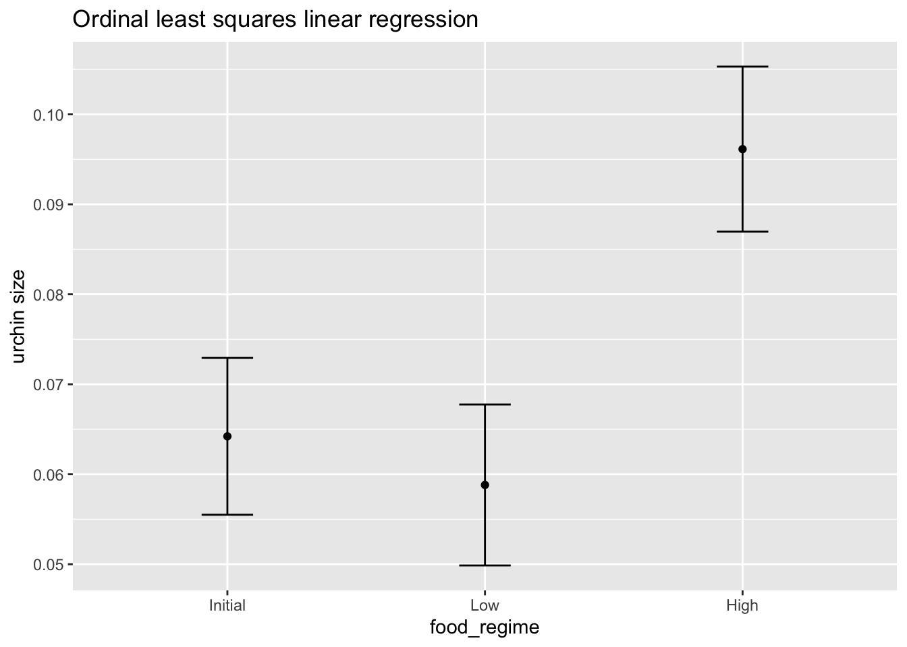
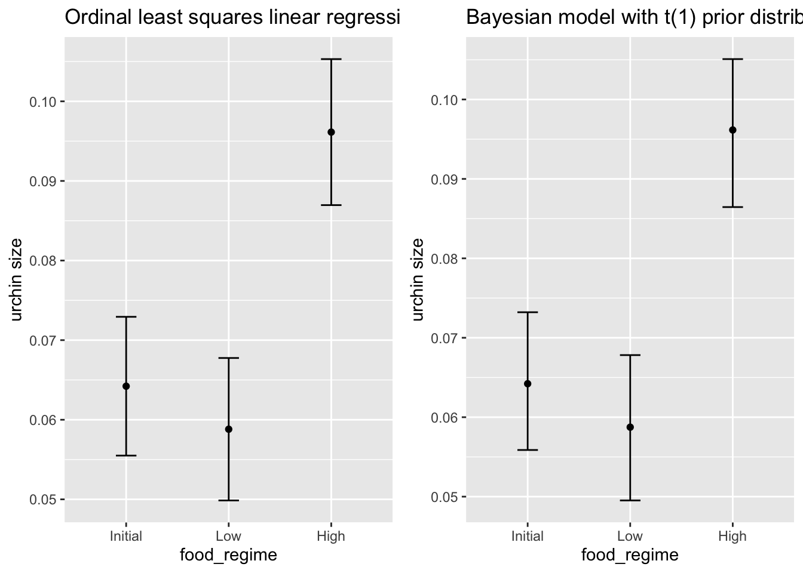
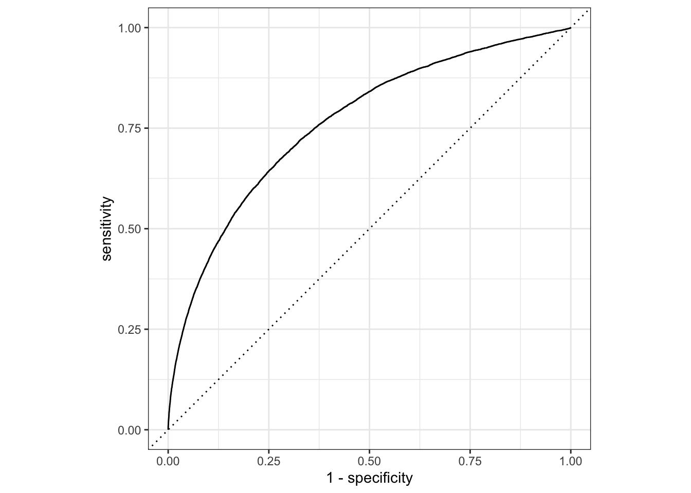
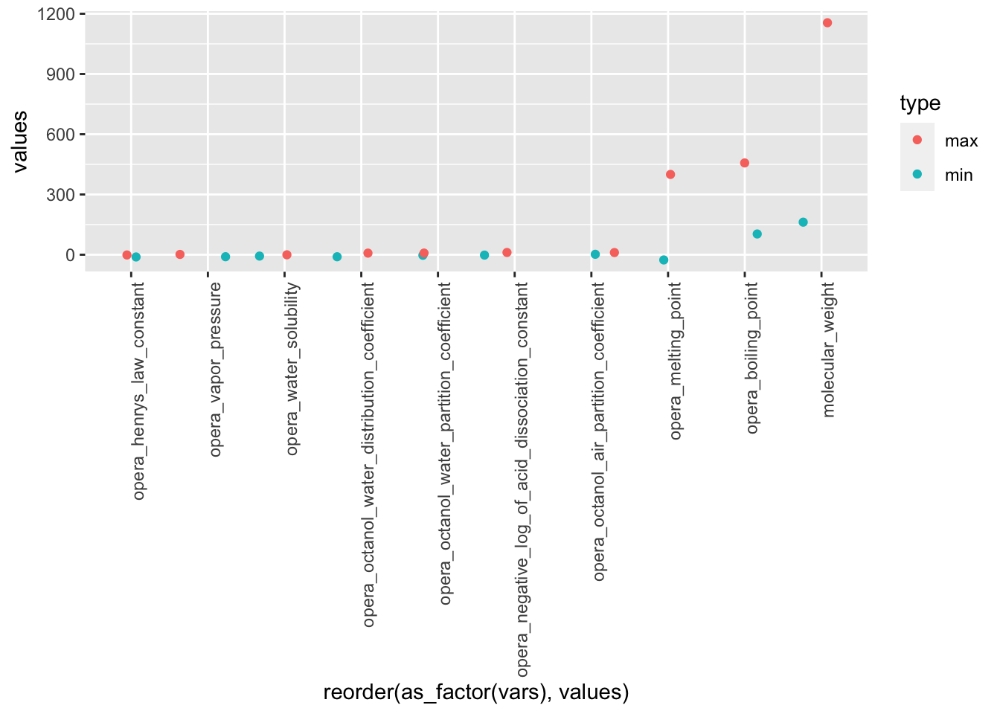
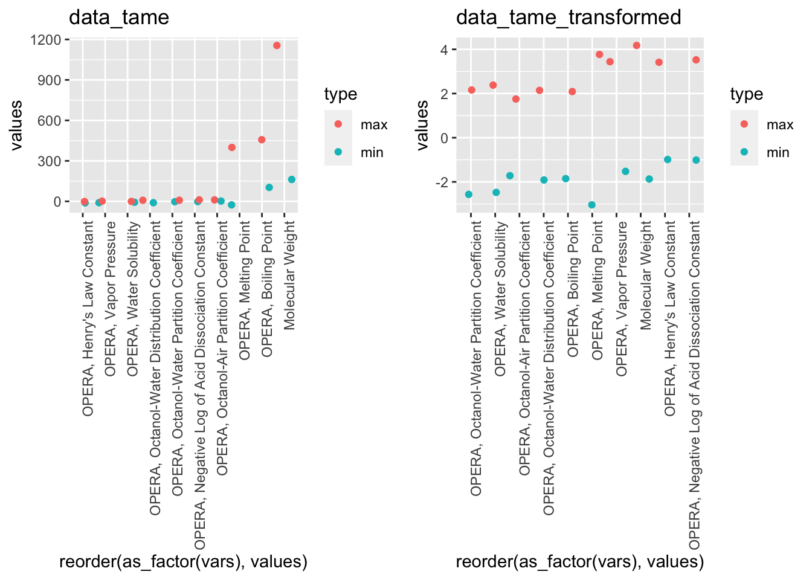
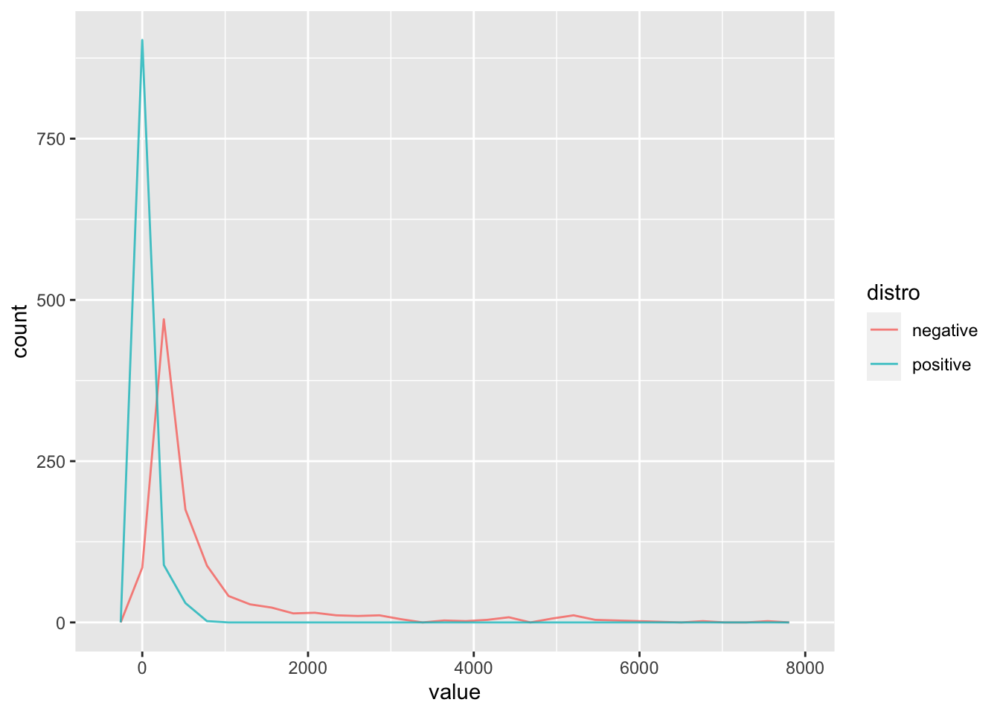
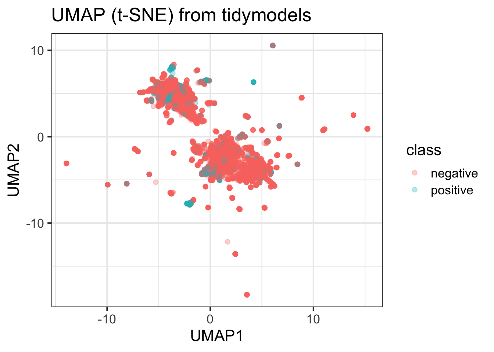

# Part 2 -- Machine Learning with R


## Learning objectives

After this lesson:

- You will be able to explore data suited for training a machine learning algorithm
- Perform a number of unsupervised exploratory analysis (PCA, t-SNE, k-Means)
- Build a predictive toxicity model, based on chemical fingerprints
- Build a model to predict the partition coefficient (LogP), based on fingerprints
- Enrich your data using an external data source (Tox21 dataset)
- (Perform a biological read across, based on compound similarity)

## Machine Learning
The term machine learning refers to a field of computational science and applications, where methods are used and developed that can 'learn' from data to solve specific tasks. In classicial machine learning these tasks are mostly related to classification. Machine Learning, of short ML, is considered a subfield of Artificial Intelligence and is considered as methods (or models / algorithms) that are trained on (sample) data to to make predictions or or decisions, without explicitly being programmed to do so. The following figure tries to convey the difference between classical problem solving using a rule based approach and modern ML.
For a gently introduction see [this wiki page](https://en.wikipedia.org/wiki/Machine_learning)

## Learning more; TAME
If after this course you would like to learn more about applying ML in Toxicology, the [The TAME Toolkit](https://github.com/UNCSRP/Data-Analysis-Training-Modules) for Introductory Data Science, Chemical-Biological Analyses, Predictive Modeling, and Database Mining for Environmental Health Research is a good place to start learning. Some of the examples in this lesson were taken from [chapter 2.2 of the TAME Bookdown project](https://uncsrp.github.io/Data-Analysis-Training-Modules/machine-learning-and-predictive-modeling.html#machine-learning-and-predictive-modeling)

[Reference:](https://doi.org/10.3389/ftox.2022.893924) Roell, K., Koval, L. E., Boyles, R., Patlewicz, G., Ring, C., Rider, C. V., Ward-Caviness, C., Reif, D. M., Jaspers, I., Fry, R. C., & Rager, J. E. (2022). Development of the InTelligence And Machine LEarning (TAME) Toolkit for Introductory Data Science, Chemical-Biological Analyses, Predictive Modeling, and Database Mining for Environmental Health Research. Frontiers in toxicology, 4, 893924. https://doi.org/10.3389/ftox.2022.893924

## Tidymodels
The Tidymodels framework is an extension of the `{tidyverse}` suite. It is especially focused towards providing a generalized way to define, run and optimize models in R. To get started we will walk you though the 'getting started' part of the [Tidymodels documentation](https://www.tidymodels.org/start/)

To learn more on Tidymodels, there is a very elaborate [bookdown project](https://www.tmwr.org)

## Packages

```r
library(tidymodels)
```

```
## ── Attaching packages ────────────────────────────────────── tidymodels 1.0.0 ──
```

```
## ✔ broom        1.0.4          ✔ recipes      1.0.6     
## ✔ dials        1.1.0          ✔ rsample      1.1.1     
## ✔ dplyr        1.1.1.9000     ✔ tibble       3.2.1     
## ✔ ggplot2      3.4.1          ✔ tidyr        1.3.0     
## ✔ infer        1.0.4          ✔ tune         1.0.1     
## ✔ modeldata    1.1.0          ✔ workflows    1.1.3     
## ✔ parsnip      1.0.4          ✔ workflowsets 1.0.0     
## ✔ purrr        1.0.1          ✔ yardstick    1.1.0
```

```
## ── Conflicts ───────────────────────────────────────── tidymodels_conflicts() ──
## ✖ purrr::discard() masks scales::discard()
## ✖ dplyr::filter()  masks stats::filter()
## ✖ dplyr::lag()     masks stats::lag()
## ✖ recipes::step()  masks stats::step()
## • Dig deeper into tidy modeling with R at https://www.tmwr.org
```

```r
library(tidyverse)
```

```
## ── Attaching core tidyverse packages ──────────────────────── tidyverse 2.0.0 ──
## ✔ forcats   1.0.0          ✔ readr     2.1.4.9000
## ✔ lubridate 1.9.2          ✔ stringr   1.5.0.9000
```

```
## ── Conflicts ────────────────────────────────────────── tidyverse_conflicts() ──
## ✖ readr::col_factor() masks scales::col_factor()
## ✖ purrr::discard()    masks scales::discard()
## ✖ dplyr::filter()     masks stats::filter()
## ✖ stringr::fixed()    masks recipes::fixed()
## ✖ dplyr::lag()        masks stats::lag()
## ✖ readr::spec()       masks yardstick::spec()
## ℹ Use the conflicted package (<http://conflicted.r-lib.org/>) to force all conflicts to become errors
```

```r
library(broom.mixed) # for converting bayesian models to tidy tibbles
library(dotwhisker)  #
```

## Data 
For this lesson we will use a number of different datasets. Because we need datasets that include somewhat larger volumes of data, we also download data on the fly.

Let's get the datasets 

### Sea Urchins
A dataset build into the `{tidymodels}` documentation for illustrative purposes. See [original resource:](https://www.tidymodels.org/start/models/)

```r
urchins <-
  # Data were assembled for a tutorial 
  # at https://www.flutterbys.com.au/stats/tut/tut7.5a.html
  read_csv("https://tidymodels.org/start/models/urchins.csv") %>% 
  # Change the names to be a little more verbose
  setNames(c("food_regime", "initial_volume", "width")) %>% 
  # Factors are very helpful for modeling, so we convert one column
  mutate(food_regime = factor(food_regime, levels = c("Initial", "Low", "High")))
```

```
## Rows: 72 Columns: 3
## ── Column specification ────────────────────────────────────────────────────────
## Delimiter: ","
## chr (1): TREAT
## dbl (2): IV, SUTW
## 
## ℹ Use `spec()` to retrieve the full column specification for this data.
## ℹ Specify the column types or set `show_col_types = FALSE` to quiet this message.
```

```r
#> Rows: 72 Columns: 3
#> ── Column specification ──────────────────────────────────────────────
#> Delimiter: ","
#> chr (1): TREAT
#> dbl (2): IV, SUTW
#> 
#> ℹ Use `spec()` to retrieve the full column specification for this data.
#> ℹ Specify the column types or set `show_col_types = FALSE` to quiet this message.
```

### Chemical_Lists_PFAS-Statins from the EPA
This datset was curated and povided in the TAME project mentioned above
It can be directly downloaded from Github

```r
url <- "https://raw.githubusercontent.com/UNCSRP/Data-Analysis-Training-Modules/main/Chapter%202/2.2%20ML%20Predictive%20Modeling/Module2_2_Chemical_Lists_PFAS-Statins.csv"

data_tame <- read_csv(
    url, 
    locale = readr::locale(encoding ="UTF-8")
    )
```

```
## Rows: 144 Columns: 14
## ── Column specification ────────────────────────────────────────────────────────
## Delimiter: ","
## chr  (4): List, Substance Name, CASRN, DTXSID
## dbl (10): Molecular Weight, OPERA, Boiling Point, OPERA, Henry's Law Constan...
## 
## ℹ Use `spec()` to retrieve the full column specification for this data.
## ℹ Specify the column types or set `show_col_types = FALSE` to quiet this message.
```

### Tox21 end Chembl, using the [biobricks.ai bricks](https://biobricks.ai/) 
Biobricks.ai is developed by researcher Dr. Tom Luechtefeld as a 'data-as-dependency' approach. By integrating large public databases into so-called bricks, the database data can be accessed through a standardized api and downloaded to a local machine or Virtual Machine. The bricks are version controlled, so this enables a reproducible workflow.
We will not use this data in this lesson, but it will get you started in finding and downloading data for your own modelling purposes. To get started on Biobricks, the code below will get you the 'tox21' brick.


```r
biobricks::local_bblib()
initialize()
brick_install("tox21")
brick_pull("tox21") # OR build it with brick_repro("HGNC")
tbls <- brick_load_arrow("tox21")
names(tbls) # "hgnc_complete_set.parquet"

## look at one table

tox21_tbls  <- purrr::imap_dfr(tbls,~ tibble(tbl=.y,rows=nrow(.x))) |> arrange(desc(rows))
tox21_names <- purrr::imap_dfr(tbls,~ tibble(tbl=.y,name=names(.x)))

ids <- tox21_names |> filter(grepl("ID$",name))
ids <- ids |> split(ids$name) |> discard(~nrow(.)<2) 
names(ids)
tox21_names 

## look at one table
x <- tbls$`tox21-ache-p3.aggregrated.parquet` |> dplyr::collect()
x

data_all <- 
  map(
    .x = tbls,
    .f = dplyr::collect
  )
```


## QSAR data

An example dataset that contains classical chemical fingerprints.
[From the UCL repository](https://archive.ics.uci.edu/ml/datasets/QSAR+oral+toxicity)

Metadata:
Attribute Information:

1024 binary molecular fingerprints and 1 experimental class:
1-1024) binary molecular fingerprint
1025) experimental class: positive (very toxic) and negative (not very toxic)

Relevant Papers:

[D. Ballabio, F. Grisoni, V. Consonni, R. Todeschini (2019), Integrated QSAR models to predict acute oral systemic toxicity, Molecular Informatics, 38, 180012; doi: 10.1002/minf.201800124](https://doi.org/10.1002/minf.201800124)

Files `ID.txt`,`class.csv` and `X.csv` in folder `./data/lesson5/qsar` were obtained from the author of the paper above via personal communication. Orinal sources files (Matlab scripts and matrix files can be downloaded from the paper's DOI as supplemental data). They are included here for reproducibility reasons in `./data/lesson5/qsar/oral_toxicity_data.rar`

The code below downloads the data to a the `./data` folder and unzips the file in a temporary folder. We read the file into R from that temp file.

```r
path <- here::here(
  base_folder,
  "data",
  "qsar_oral_toxicity.zip"
)

download.file(url = "https://archive.ics.uci.edu/ml/machine-learning-databases/00508/qsar_oral_toxicity.zip", destfile = path)

unzip(zipfile = path, exdir = here::here(
  base_folder, "data")
)
```

## Getting started with `{tidymodels}`
The fragment below was reproduced from [the `tidymodels` documentation](https://www.tidymodels.org/start/models/)

### Build our first model with Tidymodels


```r
urchins
```

```
## # A tibble: 72 × 3
##    food_regime initial_volume width
##    <fct>                <dbl> <dbl>
##  1 Initial                3.5 0.01 
##  2 Initial                5   0.02 
##  3 Initial                8   0.061
##  4 Initial               10   0.051
##  5 Initial               13   0.041
##  6 Initial               13   0.061
##  7 Initial               15   0.041
##  8 Initial               15   0.071
##  9 Initial               16   0.092
## 10 Initial               17   0.051
## # ℹ 62 more rows
```

Plotting the data
As a first step in modeling, it’s always a good idea to plot the data:


```r
ggplot(urchins,
       aes(x = initial_volume, 
           y = width, 
           group = food_regime, 
           col = food_regime)) + 
  geom_point() + 
  geom_smooth(method = lm, se = FALSE) +
  scale_color_viridis_d(option = "plasma", end = .7)
```

```
## `geom_smooth()` using formula = 'y ~ x'
```


```r
#> `geom_smooth()` using formula 'y ~ x'
```

A standard two-way analysis of variance (ANOVA) model makes sense for this dataset because we have both a continuous predictor and a categorical predictor. Since the slopes appear to be different for at least two of the feeding regimes, let’s build a model that allows for two-way interactions. Specifying an R formula with our variables in this way:

$width \sim initial\_volume * food\_regime$, where the $\sim$ means 'is dependent on'.

The `{parsnip}` package allows to specify models like this in consistent way. Here we will use the `lin_reg()` engine of `{parnsip}` to define the model engine, the type of regression and the model definition as showed in the formula above.

If we put this together we can define the linear regression model (using the 'ordinal least squares' engine) as:


```r
linear_reg() |>
  set_engine("lm")
```

```
## Linear Regression Model Specification (regression)
## 
## Computational engine: lm
```

```r
## because "lm" is the default engine this is the same as
linear_reg()
```

```
## Linear Regression Model Specification (regression)
## 
## Computational engine: lm
```

We can choose a different computational 'engine' as

```r
linear_reg() |>
  set_engine("keras")
```

```
## Linear Regression Model Specification (regression)
## 
## Computational engine: keras
```

The [documentation page](https://parsnip.tidymodels.org/reference/linear_reg.html) for `linear_reg()` lists all the possible engines. We’ll save our model object using the default engine as lm_mod.

```r
lm_mod <- linear_reg()
```

From here, the model can be estimated or trained using the fit() function:

```r
lm_fit <- 
  lm_mod %>% 
  fit(width ~ initial_volume * food_regime, data = urchins)
lm_fit
```

```
## parsnip model object
## 
## 
## Call:
## stats::lm(formula = width ~ initial_volume * food_regime, data = data)
## 
## Coefficients:
##                    (Intercept)                  initial_volume  
##                      0.0331216                       0.0015546  
##                 food_regimeLow                 food_regimeHigh  
##                      0.0197824                       0.0214111  
##  initial_volume:food_regimeLow  initial_volume:food_regimeHigh  
##                     -0.0012594                       0.0005254
```

We can get the model summary using the `summary()` function, but a more tidy output will be achieved if we use the `tidy()` function.

```r
tidy(lm_fit)
```

```
## # A tibble: 6 × 5
##   term                            estimate std.error statistic  p.value
##   <chr>                              <dbl>     <dbl>     <dbl>    <dbl>
## 1 (Intercept)                     0.0331    0.00962      3.44  0.00100 
## 2 initial_volume                  0.00155   0.000398     3.91  0.000222
## 3 food_regimeLow                  0.0198    0.0130       1.52  0.133   
## 4 food_regimeHigh                 0.0214    0.0145       1.47  0.145   
## 5 initial_volume:food_regimeLow  -0.00126   0.000510    -2.47  0.0162  
## 6 initial_volume:food_regimeHigh  0.000525  0.000702     0.748 0.457
```

If you like to see a visual representation of the model results, which can be handy to e.g. compare models.

```r
tidy(lm_fit) %>% 
  dwplot(dot_args = list(size = 2, color = "black"),
         whisker_args = list(color = "black"),
         vline = geom_vline(xintercept = 0, colour = "grey50", linetype = 2))
```


This fitted object lm_fit has the lm model output built-in, which you can access with lm_fit$fit, but there are some benefits to using the fitted parsnip model object when it comes to predicting.

Suppose that, for a publication, it would be particularly interesting to make a plot of the mean body size for urchins that started the experiment with an initial volume of 20ml. To create such a graph, we start with some new example data that we will make predictions for, to show in our graph:


```r
new_points <- expand.grid(initial_volume = 20, 
                          food_regime = c("Initial", "Low", "High"))
new_points
```

```
##   initial_volume food_regime
## 1             20     Initial
## 2             20         Low
## 3             20        High
```

To get our predicted results, we can use the predict() function to find the mean values at 20ml.

It is also important to communicate the variability, so we also need to find the predicted confidence intervals. If we had used `lm()` to fit the model directly, a few minutes of reading the documentation page for `predict.lm()` would explain how to do this. However, if we decide to use a different model to estimate urchin size, it is likely that a completely different syntax would be required.

This is the strength of `{tidymodels}`. It provides a single interface and modelling syntax, to build many different types of models. With `{tidymodels}`, the types of predicted values are standardized so that we can use the same syntax to get these values.

First, let’s generate the mean body width values:

```r
mean_pred <- predict(lm_fit, new_data = new_points)
mean_pred
```

```
## # A tibble: 3 × 1
##    .pred
##    <dbl>
## 1 0.0642
## 2 0.0588
## 3 0.0961
```

When making predictions, the tidymodels convention is to always produce a tibble of results with standardized column names. This makes it easy to combine the original data and the predictions in a usable format:


```r
conf_int_pred <- predict(lm_fit, 
                         new_data = new_points, 
                         type = "conf_int")
conf_int_pred
```

```
## # A tibble: 3 × 2
##   .pred_lower .pred_upper
##         <dbl>       <dbl>
## 1      0.0555      0.0729
## 2      0.0499      0.0678
## 3      0.0870      0.105
```

```r
# Now combine: 
plot_data <- 
  new_points %>% 
  bind_cols(mean_pred) %>% 
  bind_cols(conf_int_pred)

# and plot:
ggplot(plot_data, aes(x = food_regime)) + 
  geom_point(aes(y = .pred)) + 
  geom_errorbar(aes(ymin = .pred_lower, 
                    ymax = .pred_upper),
                width = .2) + 
  labs(y = "urchin size") +
  ggtitle("Ordinal least squares linear regression") -> p_lm


p_lm
```



Of course, we will demo how we can choose a different modelling engine. As said, we do not need to change the syntax, when we use `{tidymodels}`.

The [documentation](https://github.com/stan-dev/rstanarm) on the `{rstanarm}` package shows us that the `stan_glm()` function can be used to estimate this model, and that the function arguments that need to be specified are called prior and prior_intercept. If we were to use `stan_glm()`, we would need to change our syntax to model the `urchin` data with this `{rstanarm}` engine. It turns out that `linear_reg()` has a stan engine. Since these prior distribution arguments are specific to the Stan software, they are passed as arguments to parsnip::set_engine(). If we want to use this engine, we need to install the `{rstanarm}` package, in order for tidymodels to be able to use the engine under the hood 


```r
# install.packages("rstanarm")
library(rstanarm)
```

```
## Loading required package: Rcpp
```

```
## 
## Attaching package: 'Rcpp'
```

```
## The following object is masked from 'package:rsample':
## 
##     populate
```

```
## This is rstanarm version 2.21.4
```

```
## - See https://mc-stan.org/rstanarm/articles/priors for changes to default priors!
```

```
## - Default priors may change, so it's safest to specify priors, even if equivalent to the defaults.
```

```
## - For execution on a local, multicore CPU with excess RAM we recommend calling
```

```
##   options(mc.cores = parallel::detectCores())
```

After that, the same exact fit() call is used:


```r
# set the prior distribution
prior_dist <- rstanarm::student_t(df = 1)
```

Now we can fir our model, using a Bayesian modelling engine.

```r
set.seed(123)

# make the parsnip model
bayes_mod <-   
  linear_reg() %>% 
  set_engine("stan", 
             prior_intercept = prior_dist, 
             prior = prior_dist) 

# train the model
bayes_fit <- 
  bayes_mod %>% 
  fit(width ~ initial_volume * food_regime, data = urchins)

print(bayes_fit, digits = 5)
```

```
## parsnip model object
## 
## stan_glm
##  family:       gaussian [identity]
##  formula:      width ~ initial_volume * food_regime
##  observations: 72
##  predictors:   6
## ------
##                                Median   MAD_SD  
## (Intercept)                     0.03336  0.01003
## initial_volume                  0.00156  0.00040
## food_regimeLow                  0.01963  0.01308
## food_regimeHigh                 0.02120  0.01421
## initial_volume:food_regimeLow  -0.00126  0.00051
## initial_volume:food_regimeHigh  0.00054  0.00070
## 
## Auxiliary parameter(s):
##       Median  MAD_SD 
## sigma 0.02129 0.00188
## 
## ------
## * For help interpreting the printed output see ?print.stanreg
## * For info on the priors used see ?prior_summary.stanreg
```

This kind of Bayesian analysis (like many models) involves randomly generated numbers in its fitting procedure. We can use set.seed() to ensure that the same (pseudo-)random numbers are generated each time we run this code. The number 123 isn’t special or related to our data; it is just a “seed” used to choose random numbers.

To update the parameter table, the tidy() method is once again used:

```r
tidy(bayes_fit, conf.int = TRUE)
```

```
## # A tibble: 6 × 5
##   term                            estimate std.error  conf.low conf.high
##   <chr>                              <dbl>     <dbl>     <dbl>     <dbl>
## 1 (Intercept)                     0.0334    0.0100    0.0179    0.0493  
## 2 initial_volume                  0.00156   0.000404  0.000876  0.00219 
## 3 food_regimeLow                  0.0196    0.0131   -0.00271   0.0414  
## 4 food_regimeHigh                 0.0212    0.0142   -0.00289   0.0455  
## 5 initial_volume:food_regimeLow  -0.00126   0.000515 -0.00213  -0.000364
## 6 initial_volume:food_regimeHigh  0.000541  0.000696 -0.000669  0.00174
```

A goal of the tidymodels packages is that the interfaces to common tasks are standardized (as seen in the tidy() results above). The same is true for getting predictions; we can use the same code even though the underlying packages use very different syntax:


```r
bayes_plot_data <- 
  new_points %>% 
  bind_cols(predict(bayes_fit, new_data = new_points)) %>% 
  bind_cols(predict(bayes_fit, new_data = new_points, type = "conf_int"))

ggplot(bayes_plot_data, aes(x = food_regime)) + 
  geom_point(aes(y = .pred)) + 
  geom_errorbar(aes(ymin = .pred_lower, ymax = .pred_upper), width = .2) + 
  labs(y = "urchin size") + 
  ggtitle("Bayesian model with t(1) prior distribution") -> p_bayes


cowplot::plot_grid(p_lm, p_bayes)
```



The parsnip package can work with many model types, engines, and arguments. Check out tidymodels.org/find/parsnip to see what is available.


### Preprocssing the data for modelling using `{recipes}`

Recipes are built as a series of preprocessing steps, such as:

 - converting qualitative predictors to indicator variables (also known as dummy variables)
 - transforming data to be on a different scale (e.g., taking the logarithm of a variable)
 - transforming whole groups of predictors together
 - extracting key features from raw variables (e.g., getting the day of the week out of a date variable)


```r
library(tidymodels) ## for the recipes package, along with the rest of tidymodels

## Helper packages
#install.packages(c("nycflights13", "skimr"))
library(nycflights13)    ## for flight data
library(skimr)      ## for variable summaries
library(tidyverse)
```

Let’s use the nycflights13 data to predict whether a plane arrives more than 30 minutes late. This data set contains information on 325,819 flights departing near New York City in 2013. Let’s start by loading the data and making a few changes to the variables:


```r
set.seed(123)

flight_data <- 
  flights |>
  mutate(
    # Convert the arrival delay to a factor
    arr_delay = ifelse(arr_delay >= 30, "late", "on_time"),
    arr_delay = factor(arr_delay),
    # We will use the date (not date-time) in the recipe below
    date = lubridate::as_date(time_hour)
  ) |>
  # Include the weather data
  inner_join(weather, by = c("origin", "time_hour")) |>
  # Only retain the specific columns we will use
  select(dep_time, flight, origin, dest, air_time, distance, 
         carrier, date, arr_delay, time_hour) %>% 
  # Exclude missing data
  na.omit() |>
  # For creating models, it is better to have qualitative columns
  # encoded as factors (instead of character strings)
  mutate_if(is.character, as.factor) |> ## it is custom to move the 'class' column to the first position, as the dependent variable
  relocate(arr_delay, 1)
```

We can see that about 16% of the flights in this data set arrived more than 30 minutes late.


```r
flight_data |> 
  group_by(arr_delay) |>
  tally() -> counts

counts$n[1]/sum(counts$n) *100
```

```
## [1] 16.12552
```
  
Before we start building up our recipe, let’s take a quick look at a few specific variables that will be important for both preprocessing and modeling.

First, notice that the variable we created called arr_delay is a factor variable; it is important that our outcome variable for training a logistic regression model is a factor.

```r
glimpse(flight_data)
```

```
## Rows: 325,819
## Columns: 10
## $ arr_delay <fct> on_time, on_time, late, on_time, on_time, on_time, on_time, …
## $ dep_time  <int> 517, 533, 542, 544, 554, 554, 555, 557, 557, 558, 558, 558, …
## $ flight    <int> 1545, 1714, 1141, 725, 461, 1696, 507, 5708, 79, 301, 49, 71…
## $ origin    <fct> EWR, LGA, JFK, JFK, LGA, EWR, EWR, LGA, JFK, LGA, JFK, JFK, …
## $ dest      <fct> IAH, IAH, MIA, BQN, ATL, ORD, FLL, IAD, MCO, ORD, PBI, TPA, …
## $ air_time  <dbl> 227, 227, 160, 183, 116, 150, 158, 53, 140, 138, 149, 158, 3…
## $ distance  <dbl> 1400, 1416, 1089, 1576, 762, 719, 1065, 229, 944, 733, 1028,…
## $ carrier   <fct> UA, UA, AA, B6, DL, UA, B6, EV, B6, AA, B6, B6, UA, UA, AA, …
## $ date      <date> 2013-01-01, 2013-01-01, 2013-01-01, 2013-01-01, 2013-01-01,…
## $ time_hour <dttm> 2013-01-01 05:00:00, 2013-01-01 05:00:00, 2013-01-01 05:00:…
```

If we want to explore the data further, we can use the `skim()` function

```r
flight_data %>% 
  skimr::skim(dest, carrier) |> DT::datatable()
```

```{=html}
<div class="datatables html-widget html-fill-item-overflow-hidden html-fill-item" id="htmlwidget-9eceb20dc2a931752ae4" style="width:100%;height:auto;"></div>
<script type="application/json" data-for="htmlwidget-9eceb20dc2a931752ae4">{"x":{"filter":"none","vertical":false,"data":[["1","2"],["factor","factor"],["dest","carrier"],[0,0],[1,1],[false,false],[104,16],["ATL: 16771, ORD: 16507, LAX: 15942, BOS: 14948","UA: 57489, B6: 53715, EV: 50868, DL: 47465"]],"container":"<table class=\"display\">\n  <thead>\n    <tr>\n      <th> <\/th>\n      <th>skim_type<\/th>\n      <th>skim_variable<\/th>\n      <th>n_missing<\/th>\n      <th>complete_rate<\/th>\n      <th>factor.ordered<\/th>\n      <th>factor.n_unique<\/th>\n      <th>factor.top_counts<\/th>\n    <\/tr>\n  <\/thead>\n<\/table>","options":{"columnDefs":[{"className":"dt-right","targets":[3,4,6]},{"orderable":false,"targets":0}],"order":[],"autoWidth":false,"orderClasses":false},"selection":{"mode":"multiple","selected":null,"target":"row","selectable":null}},"evals":[],"jsHooks":[]}</script>
```
These two variables are what we call zero variance variables. They contain information on the rows in the form of ids for the destionation and the carrier. We can use these types of variables to identify problems later.

To get started, let’s split this single dataset into two: a training set and a testing set. We’ll keep most of the rows in the original dataset (subset chosen randomly) in the training set. The training data will be used to fit the model, and the testing set will be used to measure model performance.

To do this, we can use the `{rsample}` package to create an object that contains the information on how to split the data, and then two more `{rsample}` functions to create data frames for the training and testing sets:

```r
library(tidymodels)
# Fix the random numbers by setting the seed 
# This enables the analysis to be reproducible when random numbers are used 
set.seed(222)
# Put 3/4 of the data into the training set 
data_split <- initial_split(flight_data, prop = 3/4)

# Create data frames for the two sets:
train_data <- training(data_split)
test_data  <- testing(data_split)
```

## Create recipe and roles {#recipe}

To get started, let's create a recipe for a simple logistic regression model. Before training the model, we can use a recipe to create a few new predictors and conduct some preprocessing required by the model. 

Let's initiate a new recipe: 


```r
flights_rec <- 
  recipe(arr_delay ~ ., data = train_data) 
```

The [`recipe()` function](https://recipes.tidymodels.org/reference/recipe.html) as we used it here has two arguments:

+ A **formula**. Any variable on the left-hand side of the tilde (`~`) is considered the model outcome (here, `arr_delay`). On the right-hand side of the tilde are the predictors. Variables may be listed by name, or you can use the dot (`.`) to indicate all other variables as predictors.

+ The **data**. A recipe is associated with the data set used to create the model. This will typically be the _training_ set, so `data = train_data` here. 

Now we can add [roles](https://recipes.tidymodels.org/reference/roles.html) to this recipe. We can use the [`update_role()` function](https://recipes.tidymodels.org/reference/roles.html) to let recipes know that `flight` and `time_hour` are variables with a custom role that we called `"ID"` (a role can have any character value). Whereas our formula included all variables in the training set other than `arr_delay` as predictors, this tells the recipe to keep these two variables but not use them as either outcomes or predictors.
This is particularly useful in a reproducible workflow, because we do not need to mutate the data itself to select the predictors. Furthermore, there is no need to copy the dataset as another variable in our R environment.


```r
flights_rec <- 
  recipe(arr_delay ~ ., data = train_data) %>% 
  update_role(flight, time_hour, new_role = "ID") 
```

This step of adding roles to a recipe is optional; the purpose of using it here is that those two variables can be retained in the data but not included in the model. This can be convenient when, after the model is fit, we want to investigate some poorly predicted value. These ID columns will be available and can be used to try to understand what went wrong.

To get the current set of variables and roles, use the `summary()` function: 


```r
summary(flights_rec)
```

```
## # A tibble: 10 × 4
##    variable  type      role      source  
##    <chr>     <list>    <chr>     <chr>   
##  1 dep_time  <chr [2]> predictor original
##  2 flight    <chr [2]> ID        original
##  3 origin    <chr [3]> predictor original
##  4 dest      <chr [3]> predictor original
##  5 air_time  <chr [2]> predictor original
##  6 distance  <chr [2]> predictor original
##  7 carrier   <chr [3]> predictor original
##  8 date      <chr [1]> predictor original
##  9 time_hour <chr [1]> ID        original
## 10 arr_delay <chr [3]> outcome   original
```

## Create features {#features}

Now we can start adding steps onto our recipe using the pipe operator. Perhaps it is reasonable for the date of the flight to have an effect on the likelihood of a late arrival. How should the date be encoded into the model? The `date` column has an R `date` object so including that column "as is" will mean that the model will convert it to a numeric format equal to the number of days after a reference date: 

```r
flight_data %>% 
  distinct(date) %>% 
  mutate(numeric_date = as.numeric(date)) 
```

```
## # A tibble: 364 × 2
##   date       numeric_date
##   <date>            <dbl>
## 1 2013-01-01        15706
## 2 2013-01-02        15707
## 3 2013-01-03        15708
## 4 2013-01-04        15709
## 5 2013-01-05        15710
## # ℹ 359 more rows
```

It's possible that the numeric date variable is a good option for modeling; perhaps the model would benefit from a linear trend between the log-odds of a late arrival and the numeric date variable. However, it might be better to add model terms _derived_ from the date that have a better potential to be important to the model. For example, we could derive the following meaningful features from the single `date` variable: 

* the day of the week,
* the month, and
* whether or not the date corresponds to a holiday. 
 
Let's do all three of these by adding steps to our recipe:

```r
flights_rec <- 
  recipe(arr_delay ~ ., data = train_data) %>% 
  update_role(flight, time_hour, new_role = "ID") %>% 
  step_date(date, features = c("dow", "month")) %>%               
  step_holiday(date, 
               holidays = timeDate::listHolidays("US"), 
               keep_original_cols = FALSE)
```

What do each of these steps do?

* With [`step_date()`](https://recipes.tidymodels.org/reference/step_date.html), we created two new factor columns with the appropriate day of the week and the month. 

* With [`step_holiday()`](https://recipes.tidymodels.org/reference/step_holiday.html), we created a binary variable indicating whether the current date is a holiday or not. The argument value of `timeDate::listHolidays("US")` uses the [timeDate package](https://cran.r-project.org/web/packages/timeDate/index.html) to list the 18 standard US holidays.

* With `keep_original_cols = FALSE`, we remove the original `date` variable since we no longer want it in the model. Many recipe steps that create new variables have this argument.

Next, we'll turn our attention to the variable types of our predictors. Because we plan to train a logistic regression model, we know that predictors will ultimately need to be numeric, as opposed to nominal data like strings and factor variables. In other words, there may be a difference in how we store our data (in factors inside a data frame), and how the underlying equations require them (a purely numeric matrix).

For factors like `dest` and `origin`, [standard practice](https://bookdown.org/max/FES/creating-dummy-variables-for-unordered-categories.html) is to convert them into _dummy_ or _indicator_ variables to make them numeric. These are binary values for each level of the factor. For example, our `origin` variable has values of `"EWR"`, `"JFK"`, and `"LGA"`. The standard dummy variable encoding, shown below, will create _two_ numeric columns of the data that are 1 when the originating airport is `"JFK"` or `"LGA"` and zero otherwise, respectively. 


```
## 
## Attaching package: 'kableExtra'
```

```
## The following object is masked from 'package:dplyr':
## 
##     group_rows
```

<table class="table" style="width: auto !important; margin-left: auto; margin-right: auto;">
 <thead>
  <tr>
   <th style="text-align:left;"> origin </th>
   <th style="text-align:right;"> origin_JFK </th>
   <th style="text-align:right;"> origin_LGA </th>
  </tr>
 </thead>
<tbody>
  <tr>
   <td style="text-align:left;"> JFK </td>
   <td style="text-align:right;"> 1 </td>
   <td style="text-align:right;"> 0 </td>
  </tr>
  <tr>
   <td style="text-align:left;"> EWR </td>
   <td style="text-align:right;"> 0 </td>
   <td style="text-align:right;"> 0 </td>
  </tr>
  <tr>
   <td style="text-align:left;"> LGA </td>
   <td style="text-align:right;"> 0 </td>
   <td style="text-align:right;"> 1 </td>
  </tr>
</tbody>
</table>

But, unlike the standard model formula methods in R, a recipe **does not** automatically create these dummy variables for you; you'll need to tell your recipe to add this step. This is for two reasons. First, many models do not require [numeric predictors](https://bookdown.org/max/FES/categorical-trees.html), so dummy variables may not always be preferred. Second, recipes can also be used for purposes outside of modeling, where non-dummy versions of the variables may work better. For example, you may want to make a table or a plot with a variable as a single factor. For those reasons, you need to explicitly tell recipes to create dummy variables using `step_dummy()`.

Apply the example above to the whole dataset:

```r
flights_rec <- 
  recipe(arr_delay ~ ., data = train_data) %>% 
  update_role(flight, time_hour, new_role = "ID") %>% 
  step_date(date, features = c("dow", "month")) %>%               
  step_holiday(date, 
               holidays = timeDate::listHolidays("US"), 
               keep_original_cols = FALSE) %>% 
  step_dummy(all_nominal_predictors())
```

Here, we did something different than before: instead of applying a step to an individual variable, we used [selectors](https://recipes.tidymodels.org/reference/selections.html) to apply this recipe step to several variables at once, `all_nominal_predictors()`. The [selector functions](https://recipes.tidymodels.org/reference/selections.html) can be combined to select intersections of variables.

At this stage in the recipe, this step selects the `origin`, `dest`, and `carrier` variables. It also includes two new variables, `date_dow` and `date_month`, that were created by the earlier `step_date()`. 

More generally, the recipe selectors mean that you don't always have to apply steps to individual variables one at a time. Since a recipe knows the _variable type_ and _role_ of each column, they can also be selected (or dropped) using this information. 

We need one final step to add to our recipe. Since `carrier` and `dest` have some infrequently occurring factor values, it is possible that dummy variables might be created for values that don't exist in the training set. For example, there is one destination that is only in the test set: 


```r
test_data %>% 
  distinct(dest) %>% 
  anti_join(train_data)
```

```
## Joining with `by = join_by(dest)`
```

```
## # A tibble: 1 × 1
##   dest 
##   <fct>
## 1 LEX
```

When the recipe is applied to the training set, a column is made for LEX because the factor levels come from `flight_data` (not the training set), but this column will contain all zeros. This is a "zero-variance predictor" that has no information within the column. While some R functions will not produce an error for such predictors, it usually causes warnings and other issues. `step_zv()` will remove columns from the data when the training set data have a single value, so it is added to the recipe *after* `step_dummy()`: 


```r
flights_rec <- 
  recipe(arr_delay ~ ., data = train_data) %>% 
  update_role(flight, time_hour, new_role = "ID") %>% 
  step_date(date, features = c("dow", "month")) %>%               
  step_holiday(date, 
               holidays = timeDate::listHolidays("US"), 
               keep_original_cols = FALSE) %>% 
  step_dummy(all_nominal_predictors()) %>% 
  step_zv(all_predictors())
```

Now we've created a _specification_ of what should be done with the data. How do we use the recipe we made? 

## Fit a model with a recipe {#fit-workflow}

Let's use logistic regression to model the flight data. As we saw in [*Build a Model*](/start/models/), we start by [building a model specification](/start/models/#build-model) using the parsnip package: 


```r
lr_mod <- 
  logistic_reg() %>% 
  set_engine("glm")
```


We will want to use our recipe across several steps as we train and test our model. We will: 

1. **Process the recipe using the training set**: This involves any estimation or calculations based on the training set. For our recipe, the training set will be used to determine which predictors should be converted to dummy variables and which predictors will have zero-variance in the training set, and should be slated for removal. 
 
1. **Apply the recipe to the training set**: We create the final predictor set on the training set. 
 
1. **Apply the recipe to the test set**: We create the final predictor set on the test set. Nothing is recomputed and no information from the test set is used here; the dummy variable and zero-variance results from the training set are applied to the test set. 
 
To simplify this process, we can use a _model workflow_, which pairs a model and recipe together. This is a straightforward approach because different recipes are often needed for different models, so when a model and recipe are bundled, it becomes easier to train and test _workflows_. We'll use the [workflows package](https://workflows.tidymodels.org/) from tidymodels to bundle our parsnip model (`lr_mod`) with our recipe (`flights_rec`).


```r
flights_wflow <- 
  workflow() %>% 
  add_model(lr_mod) %>% 
  add_recipe(flights_rec)

flights_wflow
```

```
## ══ Workflow ════════════════════════════════════════════════════════════════════
## Preprocessor: Recipe
## Model: logistic_reg()
## 
## ── Preprocessor ────────────────────────────────────────────────────────────────
## 4 Recipe Steps
## 
## • step_date()
## • step_holiday()
## • step_dummy()
## • step_zv()
## 
## ── Model ───────────────────────────────────────────────────────────────────────
## Logistic Regression Model Specification (classification)
## 
## Computational engine: glm
```

Now, there is a single function that can be used to prepare the recipe and train the model from the resulting predictors: `fit()`


```r
## this step is the actual fitting and can take a 
flights_fit <- 
  flights_wflow %>% 
  fit(data = train_data)
```
 
This object has the finalized recipe and fitted model objects inside. You may want to extract the model or recipe objects from the workflow. To do this, you can use the helper functions `extract_fit_parsnip()` and `extract_recipe()`. For example, here we pull the fitted model object then use the `broom::tidy()` function to get a tidy tibble of model coefficients: 


```r
flights_fit %>% 
  extract_fit_parsnip() %>% 
  tidy()
```

```
## # A tibble: 158 × 5
##   term                estimate std.error statistic  p.value
##   <chr>                  <dbl>     <dbl>     <dbl>    <dbl>
## 1 (Intercept)          7.26    2.73           2.66 7.75e- 3
## 2 dep_time            -0.00166 0.0000141   -118.   0       
## 3 air_time            -0.0440  0.000563     -78.2  0       
## 4 distance             0.00508 0.00150        3.38 7.13e- 4
## 5 date_USChristmasDay  1.35    0.178          7.59 3.32e-14
## # ℹ 153 more rows
```

## Use a trained workflow to predict {#predict-workflow}

Our goal was to predict whether a plane arrives more than 30 minutes late. We have just:

 1. Built the model (`lr_mod`),
 1. Created a preprocessing recipe (`flights_rec`),
 1. Bundled the model and recipe (`flights_wflow`), and 
 1. Trained our workflow using a single call to `fit()`. 

The next step is to use the trained workflow (`flights_fit`) to predict with the unseen test data, which we will do with a single call to `predict()`. The `predict()` method applies the recipe to the new data, then passes them to the fitted model. 


```r
predict(flights_fit, test_data)
```

```
## # A tibble: 81,455 × 1
##   .pred_class
##   <fct>      
## 1 on_time    
## 2 on_time    
## 3 on_time    
## 4 on_time    
## 5 on_time    
## # ℹ 81,450 more rows
```

Because our outcome variable here is a factor, the output from `predict()` returns the predicted class: `late` versus `on_time`. But, let's say we want the predicted class probabilities for each flight instead. To return those, we can specify `type = "prob"` when we use `predict()` or use `augment()` with the model plus test data to save them together:


```r
flights_aug <- 
  augment(flights_fit, test_data)

# The data look like: 
flights_aug %>%
  select(arr_delay, time_hour, flight, .pred_class, .pred_on_time)
```

```
## # A tibble: 81,455 × 5
##   arr_delay time_hour           flight .pred_class .pred_on_time
##   <fct>     <dttm>               <int> <fct>               <dbl>
## 1 on_time   2013-01-01 05:00:00   1545 on_time             0.945
## 2 on_time   2013-01-01 05:00:00   1714 on_time             0.949
## 3 on_time   2013-01-01 06:00:00    507 on_time             0.964
## 4 on_time   2013-01-01 06:00:00   5708 on_time             0.961
## 5 on_time   2013-01-01 06:00:00     71 on_time             0.962
## # ℹ 81,450 more rows
```

Now that we have a tibble with our predicted class probabilities, how will we evaluate the performance of our workflow? We can see from these first few rows that our model predicted these 5 on time flights correctly because the values of `.pred_on_time` are *p* > .50. But we also know that we have 81,455 rows total to predict. We would like to calculate a metric that tells how well our model predicted late arrivals, compared to the true status of our outcome variable, `arr_delay`.

Let's use the area under the [ROC curve](https://bookdown.org/max/FES/measuring-performance.html#class-metrics) as our metric, computed using `roc_curve()` and `roc_auc()` from the [yardstick package](https://yardstick.tidymodels.org/). 

To generate a ROC curve, we need the predicted class probabilities for `late` and `on_time`, which we just calculated in the code chunk above. We can create the ROC curve with these values, using `roc_curve()` and then piping to the `autoplot()` method: 


```r
flights_aug %>% 
  roc_curve(truth = arr_delay, .pred_late) %>% 
  autoplot()
```

```
## Warning: Returning more (or less) than 1 row per `summarise()` group was deprecated in
## dplyr 1.1.0.
## ℹ Please use `reframe()` instead.
## ℹ When switching from `summarise()` to `reframe()`, remember that `reframe()`
##   always returns an ungrouped data frame and adjust accordingly.
## ℹ The deprecated feature was likely used in the yardstick package.
##   Please report the issue at <https://github.com/tidymodels/yardstick/issues>.
## This warning is displayed once every 8 hours.
## Call `lifecycle::last_lifecycle_warnings()` to see where this warning was
## generated.
```



Similarly, `roc_auc()` estimates the area under the curve: 


```r
flights_aug %>% 
  roc_auc(truth = arr_delay, .pred_late)
```

```
## # A tibble: 1 × 3
##   .metric .estimator .estimate
##   <chr>   <chr>          <dbl>
## 1 roc_auc binary         0.764
```

Not too bad! We leave it to the reader to test out this workflow [*without*](https://workflows.tidymodels.org/reference/add_formula.html) this recipe. You can use `workflows::add_formula(arr_delay ~ .)` instead of `add_recipe()` (remember to remove the identification variables first!), and see whether our recipe improved our model's ability to predict late arrivals.


<div class="question">
##### Exercise; Getting started with the TAME dataset 2 {-}

The TAME learning module contains an example dataset from the EPA containing molecular descriptors of pfas and statins. The data was already downloaded above and should be visible in your Global env. as `data_tame`. If not, look up the code chunk above an rerun it.

In this exercise, we are going to build a predictive model to try and answer the following question:

"Can we differentiate between the `PFAS` and `statin` chemical classes, when considering just the raw physicochemical property variables.

The assignment is to build a predictive model, using the Tidymodel framework that was demonstrated in the previous section. In order to achieve this you need at least to consider the following steps

 1. Inpect the data, using the tools/functions you learned during the previous section of this lesson and the course (e.g. `head()`, `skim::skimr()`, `colnames()`, etc.)
 1. Check the datatypes of the variables
 1. Create some exploratory graphs
 1. Identify the type of modelling approach (engine?) you would like to use
 1. Identify the roles for each variable in the dataset
 1. Are there any variables that need to be '`feature engineered`'?
 1. Build a `tame_mod` R object that contains the model definition (formula) 
 1. Split the data in to a `data_tame_train` and a `data_tame_test` fold
 1. Define a recipe (`tame_rec`) that includes all the steps you would like to perform as pre-processing. Think about the 'zero-variance' variables here
 1. Build a workflow that combines the model (`tame_mod`) and recipe (`tame_rec`)
 1. Fit the model using the workflow and the training data
 1. Check the model performance using the fitted model and the test data

**TIPS**
 
 1. Think about what type of classification problem we are dealing with here: regression, logistic regression, binary classification, is the outcome numeric or a factor?
 1. Check if there are any missing values, as part of your exploratory analysis
 1. Also check the distributions of the variables, do we perhaps need to scale and/or center the variables, before fitting the model? If so why, or if not - why not?
 1. Remember `janitor::clean_names()` to tidy the variable names, this makes the variables complient to R convention
 1. Maybe rename the `List` variable to something more meaningful?

</div>

<details><summary>Click for the answer</summary>

Exercise Answer:


```r
## Inspect the data
dim(data_tame)
```

```
## [1] 144  14
```

```r
data_tame[1:4,1:5]
```

```
## # A tibble: 4 × 5
##   List  `Substance Name`                         CASRN DTXSID `Molecular Weight`
##   <chr> <chr>                                    <chr> <chr>               <dbl>
## 1 PFAS  Perfluoro-2-(trifluoromethyl)propanesul… 9376… DTXSI…               300.
## 2 PFAS  Potassium perfluoroheptanesulfonate      6027… DTXSI…               488.
## 3 PFAS  Bis(2-hydroxyethyl)ammonium perfluorohe… 7022… DTXSI…               555.
## 4 PFAS  Potassium perfluoro-p-ethylcyclohexanes… 335-… DTXSI…               500.
```

```r
# or
data_tame
```

```
## # A tibble: 144 × 14
##    List  `Substance Name` CASRN DTXSID `Molecular Weight` `OPERA, Boiling Point`
##    <chr> <chr>            <chr> <chr>               <dbl>                  <dbl>
##  1 PFAS  Perfluoro-2-(tr… 9376… DTXSI…               300.                   213.
##  2 PFAS  Potassium perfl… 6027… DTXSI…               488.                   223.
##  3 PFAS  Bis(2-hydroxyet… 7022… DTXSI…               555.                   223.
##  4 PFAS  Potassium perfl… 335-… DTXSI…               500.                   221.
##  5 PFAS  1,1,2,2,3,3,4,4… 647-… DTXSI…               484.                   207.
##  6 PFAS  Perfluorononane… 6825… DTXSI…               550.                   224.
##  7 PFAS  Ammonium perflu… 6825… DTXSI…               367.                   225.
##  8 PFAS  Ammonium perflu… 6825… DTXSI…               467.                   223.
##  9 PFAS  Sodium nonafluo… 6045… DTXSI…               322.                   211.
## 10 PFAS  2H-Perfluoropro… 357-… DTXSI…               232.                   202.
## # ℹ 134 more rows
## # ℹ 8 more variables: `OPERA, Henry's Law Constant` <dbl>,
## #   `OPERA, Melting Point` <dbl>,
## #   `OPERA, Negative Log of Acid Dissociation Constant` <dbl>,
## #   `OPERA, Octanol-Air Partition Coefficient` <dbl>,
## #   `OPERA, Octanol-Water Distribution Coefficient` <dbl>,
## #   `OPERA, Octanol-Water Partition Coefficient` <dbl>, …
```

```r
unique(data_tame$List)
```

```
## [1] "PFAS"    "Statins"
```

```r
colnames(data_tame)
```

```
##  [1] "List"                                             
##  [2] "Substance Name"                                   
##  [3] "CASRN"                                            
##  [4] "DTXSID"                                           
##  [5] "Molecular Weight"                                 
##  [6] "OPERA, Boiling Point"                             
##  [7] "OPERA, Henry's Law Constant"                      
##  [8] "OPERA, Melting Point"                             
##  [9] "OPERA, Negative Log of Acid Dissociation Constant"
## [10] "OPERA, Octanol-Air Partition Coefficient"         
## [11] "OPERA, Octanol-Water Distribution Coefficient"    
## [12] "OPERA, Octanol-Water Partition Coefficient"       
## [13] "OPERA, Vapor Pressure"                            
## [14] "OPERA, Water Solubility"
```


```r
## exploratory graphs
data_tame_tidy <- data_tame |>
  rename(class = List) |>
  mutate(class = as_factor(class)) |>
  janitor::clean_names()
names(data_tame_tidy)
```

```
##  [1] "class"                                           
##  [2] "substance_name"                                  
##  [3] "casrn"                                           
##  [4] "dtxsid"                                          
##  [5] "molecular_weight"                                
##  [6] "opera_boiling_point"                             
##  [7] "opera_henrys_law_constant"                       
##  [8] "opera_melting_point"                             
##  [9] "opera_negative_log_of_acid_dissociation_constant"
## [10] "opera_octanol_air_partition_coefficient"         
## [11] "opera_octanol_water_distribution_coefficient"    
## [12] "opera_octanol_water_partition_coefficient"       
## [13] "opera_vapor_pressure"                            
## [14] "opera_water_solubility"
```

```r
data_tame_tidy |>
  ggplot(aes(x = molecular_weight, y = opera_octanol_water_distribution_coefficient)) +
  geom_point(aes(colour = class))
```


```r
## let's do another
data_tame_tidy |>
  ggplot(aes(x = opera_water_solubility , y = opera_negative_log_of_acid_dissociation_constant)) +
  geom_point(aes(colour = class))
```


```r
## What can you conclude from these two example graphs?

## missing values
sum(is.na(data_tame_tidy))
```

```
## [1] 47
```

```r
library(naniar)
```

```
## 
## Attaching package: 'naniar'
```

```
## The following object is masked from 'package:skimr':
## 
##     n_complete
```

```r
vis_miss(data_tame_tidy)
```


```r
## missingnes seems to be in the dtxsid colum
## check
sum(is.na(data_tame_tidy$dtxsid))
```

```
## [1] 47
```

```r
# > 47, so not a problem, this variable is an ID, not a predictor. For random forest, we cannot have missing values in predictor variables
```


```r
## define the engine and model type
## this problem seems fit for a regression tree approach, e.g. random forest. See: https://parsnip.tidymodels.org/reference/rand_forest.html

tame_mod <- rand_forest() |>
  set_engine("ranger") |>
  set_mode("classification")# default engine

tame_mod
```

```
## Random Forest Model Specification (classification)
## 
## Computational engine: ranger
```


```r
## data split
data_tame_split <- initial_split(data_tame_tidy, prop = 3/4)

# Create data frames for the two sets:
data_tame_train <- training(data_tame_split)
data_tame_test  <- testing(data_tame_split)
```


```r
names(data_tame_tidy)
```

```
##  [1] "class"                                           
##  [2] "substance_name"                                  
##  [3] "casrn"                                           
##  [4] "dtxsid"                                          
##  [5] "molecular_weight"                                
##  [6] "opera_boiling_point"                             
##  [7] "opera_henrys_law_constant"                       
##  [8] "opera_melting_point"                             
##  [9] "opera_negative_log_of_acid_dissociation_constant"
## [10] "opera_octanol_air_partition_coefficient"         
## [11] "opera_octanol_water_distribution_coefficient"    
## [12] "opera_octanol_water_partition_coefficient"       
## [13] "opera_vapor_pressure"                            
## [14] "opera_water_solubility"
```

```r
## define the recipe
tame_rec <- recipe(class ~ ., data = data_tame_train) |> 
  update_role(substance_name, casrn, dtxsid, new_role = "ID") %>% 
  step_normalize(all_numeric_predictors()) |>
  step_center(all_numeric_predictors()) |>
  step_zv(all_predictors())

## let's look at the distribution of values accross the predictors
map_lgl(
  data_tame_tidy,
  is.numeric
) -> ind

map_df(
  data_tame_tidy[,ind],
  min
) -> mins

mins$type = "min"

map_df(
  data_tame_tidy[,ind],
  max
) -> maxes

maxes$type = "max"

bind_rows(mins, maxes) |>
  pivot_longer(1:10, names_to = "vars", values_to = "values") |>
  ggplot(aes(
    x = reorder(as_factor(vars), values), 
    y = values)) +
  geom_point(aes(colour = type), position = "jitter") +
  toolboxr::rotate_axis_labels("x", 90)
```



```r
## now we do the same for the normalized and centered data, we will use the function `preProcess()` from the {caret} package, which was developed by Max Kuhn (co/lead-developer for {tidymodels})
library(caret)
```

```
## Loading required package: lattice
```

```
## 
## Attaching package: 'caret'
```

```
## The following objects are masked from 'package:rstanarm':
## 
##     compare_models, R2
```

```
## The following objects are masked from 'package:yardstick':
## 
##     precision, recall, sensitivity, specificity
```

```
## The following object is masked from 'package:purrr':
## 
##     lift
```

```r
preProcValues <- preProcess(data_tame, method = c("center", "scale"))

data_tame_transformed <- predict(preProcValues, data_tame)
data_tame_transformed
```

```
## # A tibble: 144 × 14
##    List  `Substance Name` CASRN DTXSID `Molecular Weight` `OPERA, Boiling Point`
##    <chr> <chr>            <chr> <chr>               <dbl>                  <dbl>
##  1 PFAS  Perfluoro-2-(tr… 9376… DTXSI…            -1.03                   -0.626
##  2 PFAS  Potassium perfl… 6027… DTXSI…             0.118                  -0.515
##  3 PFAS  Bis(2-hydroxyet… 7022… DTXSI…             0.526                  -0.515
##  4 PFAS  Potassium perfl… 335-… DTXSI…             0.191                  -0.543
##  5 PFAS  1,1,2,2,3,3,4,4… 647-… DTXSI…             0.0931                 -0.694
##  6 PFAS  Perfluorononane… 6825… DTXSI…             0.495                  -0.504
##  7 PFAS  Ammonium perflu… 6825… DTXSI…            -0.619                  -0.494
##  8 PFAS  Ammonium perflu… 6825… DTXSI…            -0.0103                 -0.515
##  9 PFAS  Sodium nonafluo… 6045… DTXSI…            -0.893                  -0.650
## 10 PFAS  2H-Perfluoropro… 357-… DTXSI…            -1.44                   -0.752
## # ℹ 134 more rows
## # ℹ 8 more variables: `OPERA, Henry's Law Constant` <dbl>,
## #   `OPERA, Melting Point` <dbl>,
## #   `OPERA, Negative Log of Acid Dissociation Constant` <dbl>,
## #   `OPERA, Octanol-Air Partition Coefficient` <dbl>,
## #   `OPERA, Octanol-Water Distribution Coefficient` <dbl>,
## #   `OPERA, Octanol-Water Partition Coefficient` <dbl>, …
```

```r
## let's put the code above in a function that we can recycle for later use
plot_min_max <- function(df, ...) { ## ... ellipsis, additional arguments to pivot_longer(), column index or tidy-eval column names (unquoted)
  map_lgl(df,
          is.numeric) -> ind
  
  map_df(df[, ind],
         min) -> mins
  
  mins$type = "min"
  
  map_df(df[, ind],
         max) -> maxes
  
  maxes$type = "max"
  
  title <- deparse(substitute(df)) 
  
  bind_rows(mins, maxes) |>
    pivot_longer(..., names_to = "vars", values_to = "values") |>
    ggplot(aes(x = reorder(as_factor(vars), values),
               y = values)) +
    geom_point(aes(colour = type), position = "jitter") +
    ggtitle(title) +
    toolboxr::rotate_axis_labels("x", 90) -> p
  return(p)
}

plot_min_max(df = data_tame_transformed, 1:10) -> tame_plot_transformed 
plot_min_max(df = data_tame, 1:10) -> tame_plot

cowplot::plot_grid(
  tame_plot,
  tame_plot_transformed
)
```




```r
## In terms of feature engineering, there seems to be no need to do this upfront. We could get the SMILES for each compound from a database, and calculate fingerprints. In a later part of this lesson we will revisit this option.
```


```r
tame_workflow <- workflow() |>
  add_model(tame_mod) |>
  add_recipe(tame_rec)
```


```r
## fitting the model
tame_fit <- tame_workflow |>
  fit(data = data_tame_train)

predict(tame_fit, data_tame_test)
```

```
## # A tibble: 36 × 1
##    .pred_class
##    <fct>      
##  1 PFAS       
##  2 PFAS       
##  3 PFAS       
##  4 PFAS       
##  5 PFAS       
##  6 PFAS       
##  7 PFAS       
##  8 PFAS       
##  9 PFAS       
## 10 PFAS       
## # ℹ 26 more rows
```

```r
predict(tame_fit, data_tame_test, type = "prob")
```

```
## # A tibble: 36 × 2
##    .pred_PFAS .pred_Statins
##         <dbl>         <dbl>
##  1      1          0       
##  2      1          0       
##  3      0.999      0.001   
##  4      0.994      0.00608 
##  5      1          0       
##  6      0.999      0.001   
##  7      1          0       
##  8      0.999      0.000857
##  9      1          0       
## 10      1          0       
## # ℹ 26 more rows
```

```r
## augment
tame_aug <- 
  augment(tame_fit, data_tame_test, .pred_PFAS, .pred_Statins)

## The data look like: 
tame_aug %>%
  select(class, .pred_class, .pred_PFAS, .pred_Statins)
```

```
## # A tibble: 36 × 4
##    class .pred_class .pred_PFAS .pred_Statins
##    <fct> <fct>            <dbl>         <dbl>
##  1 PFAS  PFAS             1          0       
##  2 PFAS  PFAS             1          0       
##  3 PFAS  PFAS             0.999      0.001   
##  4 PFAS  PFAS             0.994      0.00608 
##  5 PFAS  PFAS             1          0       
##  6 PFAS  PFAS             0.999      0.001   
##  7 PFAS  PFAS             1          0       
##  8 PFAS  PFAS             0.999      0.000857
##  9 PFAS  PFAS             1          0       
## 10 PFAS  PFAS             1          0       
## # ℹ 26 more rows
```

```r
## Confusion table
 tame_aug %>%
  conf_mat(truth = class, estimate = .pred_class)
```

```
##           Truth
## Prediction PFAS Statins
##    PFAS      21       1
##    Statins    0      14
```

```r
## Accuracy
 # Model preformace metrics
class_metrics <- metric_set(accuracy)

## Get preformance metrics
tame_aug %>%
 class_metrics(truth = class, estimate = .pred_class)
```

```
## # A tibble: 1 × 3
##   .metric  .estimator .estimate
##   <chr>    <chr>          <dbl>
## 1 accuracy binary         0.972
```

</details>

## Feature importance
When we use a tree based approach we can also get an idea on which features are most important in the determining the class to which an observation belongs. We will need a different model "deand engine "rpart" to get to the feature importance and the derived decision tree. 


```r
tame_importance_mod <- decision_tree() |>
  set_engine("rpart") |>
  set_mode("classification")# default engine

tame_rpart_wf <- tame_workflow |>
  update_model(tame_importance_mod)

## new fit using the updated workflow
tame_importance_fit <- tame_rpart_wf |>
  fit(data = data_tame_train)

## decision tree
library(rpart.plot)
```

```
## Loading required package: rpart
```

```
## 
## Attaching package: 'rpart'
```

```
## The following object is masked from 'package:dials':
## 
##     prune
```

```r
tame_importance_fit %>%
  extract_fit_engine() %>%
  rpart.plot(roundint = FALSE)
```


## Case study; QSAR data
To look at a more realistic case example, that is not so clear cut as the previous (educational) exercise. Let's look at a dataset containing data suitable for Quantitative Structure Activity Relationships (QSAR).
We downloaded the data in a code chunk above as "qsar_oral_toxicity.csv". The data should be available in a temporary directory on your machine. To see the contents of this directory type

```r
list.files(here::here(base_folder, "data"), full.names = TRUE, pattern = ".csv")
```

```
## [1] "/Users/marcteunis/Documents/workspaces/course-materials/track-a/machine-learning-with-r/data/qsar_oral_toxicity.csv"
```

<div class="question">
##### Exercise 2 {-}
 
 1. Inspect the file `qsar_oral_toxicity.csv`, using the `head` command in the terminal, or on Windows: open the file with Notepad. Are there headers in this file? 
 2. Read the file into R, using the `read_csv()` funtion
 2. Rename the columns with a string from "f1" to "f1025"
 3. Reorder the classification column ("f1025") to be the first column, and rename this column to `class`
 4. Look at the dataset
 5. Tally the classification column, how many observations of each class do we have? Does this correspond with the meta data on UCL? Do you see a potential problem?
 6. Isolate the classification column in a new R object
 7. Remove the row with classifications ("f1025") from the data and store the resulting new dataframe as a matrix, using the `as.matrix()` function.
</div>

<details><summary>Click for the answer</summary>
Reading the data into R. This file has no headers. The last column in the data contains the labels.

```r
data_qsar <- read_csv2(
  here::here(
    base_folder, 
    "data",
    "qsar_oral_toxicity.csv"),
  col_names = FALSE)
```

```
## ℹ Using "','" as decimal and "'.'" as grouping mark. Use `read_delim()` for more control.
```

```
## Rows: 8992 Columns: 1025
## ── Column specification ────────────────────────────────────────────────────────
## Delimiter: ";"
## chr    (1): X1025
## dbl (1024): X1, X2, X3, X4, X5, X6, X7, X8, X9, X10, X11, X12, X13, X14, X15...
## 
## ℹ Use `spec()` to retrieve the full column specification for this data.
## ℹ Specify the column types or set `show_col_types = FALSE` to quiet this message.
```

```r
# answer
names_new <- paste0("f", 1:1025)
names(data_qsar) <- names_new
data_qsar <- data_qsar |>
  dplyr::relocate(f1025, .before = f1) |>
  rename(class = f1025)

data_qsar |> 
  group_by(class) |>
  tally()
```

```
## # A tibble: 2 × 2
##   class        n
##   <chr>    <int>
## 1 negative  8251
## 2 positive   741
```

```r
classes <- data_qsar$class

#data_qsar_all_numm <- data_qsar |>
#  select(-class)

## look at the data
data_qsar
```

```
## # A tibble: 8,992 × 1,025
##    class    f1    f2    f3    f4    f5    f6    f7    f8    f9   f10   f11   f12
##    <chr> <dbl> <dbl> <dbl> <dbl> <dbl> <dbl> <dbl> <dbl> <dbl> <dbl> <dbl> <dbl>
##  1 nega…     0     0     0     0     0     0     0     0     0     0     1     0
##  2 nega…     0     0     1     0     0     0     0     0     0     0     1     0
##  3 nega…     0     0     0     0     0     0     0     0     0     0     1     0
##  4 nega…     0     0     0     0     0     0     0     1     0     0     1     0
##  5 nega…     0     0     0     0     0     0     0     0     0     0     0     0
##  6 nega…     1     0     0     0     0     0     1     0     0     0     0     0
##  7 nega…     0     0     0     0     0     0     0     0     0     0     1     0
##  8 posi…     0     0     1     0     0     0     0     0     0     0     0     0
##  9 nega…     0     0     0     0     0     0     0     0     0     0     0     0
## 10 nega…     0     0     0     0     0     0     0     0     0     0     0     0
## # ℹ 8,982 more rows
## # ℹ 1,012 more variables: f13 <dbl>, f14 <dbl>, f15 <dbl>, f16 <dbl>,
## #   f17 <dbl>, f18 <dbl>, f19 <dbl>, f20 <dbl>, f21 <dbl>, f22 <dbl>,
## #   f23 <dbl>, f24 <dbl>, f25 <dbl>, f26 <dbl>, f27 <dbl>, f28 <dbl>,
## #   f29 <dbl>, f30 <dbl>, f31 <dbl>, f32 <dbl>, f33 <dbl>, f34 <dbl>,
## #   f35 <dbl>, f36 <dbl>, f37 <dbl>, f38 <dbl>, f39 <dbl>, f40 <dbl>,
## #   f41 <dbl>, f42 <dbl>, f43 <dbl>, f44 <dbl>, f45 <dbl>, f46 <dbl>, …
```
</details> 
 
<div class="question">
##### Exercise Exploratory Data Analysis 2 {-} 

 * Use visualizations and transformations to explore your data in a systematic way
 * A task that statisticians call exploratory data analysis, or EDA for short. 
 
## EDA is an iterative cycle; you:

 1) Generate questions about your data.
 2) Search for answers by visualising, transforming, and modelling your data.
 3) Use what you learn to refine your questions and/or generate new questions.

__You do not need to know statistics for EDA, but it helps if you do!__

## EDA is not a formal process with a strict set of rules

 * EDA is a state of mind. 
 * Should feel free to investigate every idea that occurs to you. 
 * Some of these ideas will pan out, and some will be dead ends. 
 * As your exploration continues, you will zoom in on a few particularly productive areas that you'll eventually write up and communicate to others.

## EDA Steps

To do data analysis, you'll need to deploy all the tools of EDA: visualisation, transformation, and modelling.

When perfoming EDA consider

 1. What question(s) are you trying to solve (or prove wrong)?
 1. Which information do you need and can you come up with a plan to answer the question(s)
 1. What kind of data do you have and how do you treat different types?
 1. What’s missing from the data and how do you deal with it?
 1. Where are the outliers and why should you care about them?
 1. How can you add, change or remove features to get more out of your data?
 1. Do you need additional data from other sources to relate to the dataset under scrutany?
 1. Are underlying statitical assumptions met / how is data distribution looking?
 1. What (exploratory) models apply or fit well to the data?
 1. What is the undelying (experimental) design?
 1. Is there multi-colinearity?
 
## Definitions

 * A __variable__ is a quantity, quality, or property that you can measure. 
 * A __value__ is the state of a variable when you measure it. The value of a variable may change from measurement to measurement.
 * An __observation__ is a set of measurements made under similar conditions. An observation will contain several values, each associated with a different variable. I'll sometimes refer to an observation as a data point.
 * Tables: __Tabular data__ is a set of values, each associated with a variable and an observation. 
 * Tabular data is _tidy_ if each value is placed in its own "cell", each variable in its own column, and each observation in its own row. 
 * In real-life, most data isn't tidy, as we've seen in __tidy data__.

## Variation

**Variation** is the tendency of the values of a variable to change from measurement to measurement. 

 * Categorical variables can also vary if you measure across different subjects (e.g. the eye colors of different people), or different times (e.g. the energy levels of an electron at different moments). 
 
 * Every variable has its own pattern of variation, which can reveal interesting information. The best way to understand that pattern is to visualise the distribution of the variable's values.

### Categorical variables

 * A variable is **categorical** if it can only take one of a small set of values.   
 * In R, categorical variables are usually saved as factors or character vectors. 
 * To examine the distribution of a categorical variable, use a bar chart:

## Missing values
In a dataset such as this, I do not expect to encouter any missing values. The fingerprints are calculated from molecules, so it would not make sense to have missing values somewhere. But just to be sure, we can get the sum of missing values like this:

```r
sum(is.na(data_qsar))
```

```
## [1] 0
```
One less thing to worry about.

## Distributions
Here we have a distribution of either value `0` or `1` in the data. Let's check if on average the amount of `1`s is the same for positive and negative compounds. We will convert the dataframe to a long format to do more easy calculations and plotting with `{ggplot2}`

Calculate first how many times a certain feature is present in the data.

<details><summary>Click for the answer</summary>

```r
data_qsar_mtx <- data_qsar |>
  select(-class) |>
  as.matrix()

features <- colSums(data_qsar_mtx) |> 
  enframe()

features |>
  ggplot(aes(x = value)) +
  geom_histogram()
```

```
## `stat_bin()` using `bins = 30`. Pick better value with `binwidth`.
```


So there are many featurs that are represented in the data at low frequencies and very few features that are respresented in the data very often.

</details>

How do these distributions look if we split for negative and positive compounds
<details><summary>Click for the answer</summary>

```r
features_negative <- data_qsar |>
  dplyr::filter(class == "negative") |>
  select(-class) |>
  as.matrix() |>
  colSums() |>
  enframe() |>
  mutate(distro = "negative")

features_positive <- data_qsar |>
  dplyr::filter(class == "positive") |>
  select(-class) |>
  as.matrix() |>
  colSums() |>
  enframe() |>
  mutate(distro = "positive")

features_neg_pos <- dplyr::bind_rows(
  features_negative,
  features_positive
)

features_neg_pos |>
  ggplot(aes(x = value)) +
  geom_freqpoly(aes(colour = distro), alpha = 0.8)
```

```
## `stat_bin()` using `bins = 30`. Pick better value with `binwidth`.
```


</details>

</div>

<div class="question">
##### Exercise 2 {-}
Are there differences in total amount of features between positive and negative compounds?

Be aware, that we have more negtives then positives in our data. Can you think of a way to normalize for this?

**TIPS**

 - Create a frequency distribution of all features and group by compound class (negatives/positives)
 - Remember that `{ggplot2}` works best with long dataframe format
 - The `{ggplot2}` geom for frequency distribution is `geom_freqpoly()` 

</div>

<details><summary>Click for the answer</summary>

```r
data_qsar |>
  group_by(class) |>
  tally() -> tally_compounds

features_row_neg <- data_qsar |>
  dplyr::filter(class == "negative") |>
  select(-class) |>
  as.matrix() |>
  rowSums() |>
  enframe() |>
  mutate(distro = "negative")

features_row_pos <- data_qsar |>
  dplyr::filter(class == "positive") |>
  select(-class) |>
  as.matrix() |>
  rowSums() |>
  enframe() |>
  mutate(distro = "positive")

features_row_neg_pos <- dplyr::bind_rows(
  features_row_neg,
  features_row_pos
)

features_row_neg_pos |>
  ggplot(aes(x = value)) +
  geom_freqpoly(aes(colour = distro), alpha = 0.8)
```

```
## `stat_bin()` using `bins = 30`. Pick better value with `binwidth`.
```


```r
features_row_neg_pos |>
  group_by(distro) |>
  summarise(mean_feat = mean(value))
```

```
## # A tibble: 2 × 2
##   distro   mean_feat
##   <chr>        <dbl>
## 1 negative      95.6
## 2 positive      91.4
```

On average, there is not much difference in number of features per compound, if we compare negatives and positives 

</details>

## Sparsity
As we saw upon first inspection of the data, the fingerprints contain only 2 values: a `1` and a `0`. One of the disadvantages of describing molecules on the basis of fingerprints is that the resulting matrix is _sparse_. This means that there is a relatively low amount of information content (many zeros and a few ones) in the data. Let's calculate how sparse the matrix is. We will write a function that we can recycle.


```r
df = data_qsar
only_numeric <- select_if(df, is.numeric)
number_numeric_cells <- (nrow(df) * ncol(df))
number_zeros <- sum(df == 0) 
number_ones <- sum(df == 1)
sparsity = (number_ones / number_zeros)*100

## Let's put this together in a function, we write a test to check for input

get_sparsity_perc <- function(df){
  
  only_numeric <- select_if(df, is.numeric)
  only_numeric_mtx <- only_numeric |> as.matrix()
  
  ## check if values of matrix are either 0 or 1
  ## %in% is functional for `match`
  if(
      only_numeric_mtx %in% c(0,1) |> 
      all() == FALSE){
    stop("Please check if input values are either ones               and/or zeros")
   }
      
  number_numeric_cells <- (nrow(df) * ncol(df))
  number_zeros <- sum(df == 0) 
  number_ones <- sum(df == 1)
  sparsity = (number_ones / number_zeros)*100
  return(sparsity)

}
  
## test function
get_sparsity_perc(df = data_qsar)

## check our test
data_qsar_with_mutation <- data_qsar
data_qsar_with_mutation[333,445] <- 9.887
get_sparsity_perc(data_qsar_with_mutation)

## getting unique values
select_if(data_qsar, is.numeric) |>
map(unique) |>
  unique() |> 
  flatten() |> 
  unique()

select_if(data_qsar_with_mutation, is.numeric) |>
map(unique) |>  unique() |> 
  flatten() |> 
  unique()
```

### Heatmap
Let's look at the fingerprints and see how they differ between negatives and positives. Maybe we can learn something there. Because we have many features and observations, we will take a random sample, to reduce computation time.

```r
set.seed(123)
data_qsar_sample <- data_qsar |>
  mutate(row_id = 1:nrow(data_qsar)) |>
  sample_frac(0.005)

data_qsar_mtx_sample <- data_qsar_sample |>
  select(-class) |>
  as.matrix() 

colnames(data_qsar_mtx_sample) <- paste0(
  "c", 
  1:ncol(data_qsar_mtx_sample)
  )


data_qsar_sample |> 
  pivot_longer(cols = f1:f1024, values_to = "score", names_to = "feature") |>
  ggplot(aes(
    x = reorder(as_factor(feature), score), 
    y = as_factor(score))) +
  geom_tile(aes(fill = as_factor(score))) + facet_wrap(class~row_id) +
  xlab(NULL) +
  ylab(NULL) +
  theme(axis.title.x=element_blank(),
        axis.text.x=element_blank(),
        axis.ticks.x=element_blank(),
        strip.text.x = element_text(size = 4))
  
## to save the graph in a readible size and format
# ggsave("test.png", height = 20, width = 20, units = "cm", dpi = 300)
## or if you want to have a vectorgraph
# ggsave("test.png", height = 20, width = 20, units = "cm", dpi = 300)
```

## Unsupervised machine learning
Before we plan to do any kind of classification task on our data, it is good to consider doing an exploratory data analysis to learn more about our data.
Here we use a principal component analysis and a k-means clustering to learn some patterns.

## Principal Component Analysis
For code see: https://cmdlinetips.com/2020/06/pca-with-tidymodels-in-r/

```r
library(tidymodels)
library(tidyverse)
#library(gapminder)
theme_set(theme_bw(16))
```


```r
pca_recipe <- recipe(~., data = data_qsar)
pca_trans <- pca_recipe %>%
  # center the data
  step_center(all_numeric()) %>%
  # center the data
  step_scale(all_numeric()) %>%
  # pca on all numeric variables
  step_pca(all_numeric())

pca_estimates <- prep(pca_trans) ## this step takes a bit longer to calculate
pca_estimates$var_info
sdev <- pca_estimates$steps[[3]]$res$sdev
percent_variation <- sdev^2 / sum(sdev^2)

var_df <- data.frame(PC=paste0("PC",1:length(sdev)),
                     var_explained=percent_variation,
                     stringsAsFactors = FALSE)

var_df %>%
  mutate(PC = fct_inorder(PC)) %>%
  ggplot(aes(x=PC,y=var_explained))+geom_col()

juice(pca_estimates) 
juice(pca_estimates) %>%
  ggplot(aes(PC1, PC2)) +
  geom_point(aes(color = class), alpha = 0.3, size = 2)+
  labs(title="PCA from tidymodels")
```

## t-SNE
T-SNE or [t-distributed stochastic neighbor embedding](https://en.wikipedia.org/wiki/T-distributed_stochastic_neighbor_embedding) is way to visualize high dimensional data. It is especially used in many of the omics areas. For illustrative puposes, we here show how to run such a model on our QSAR data.


```r
#install.packages("embed")
library(embed)
pca_recipe <- recipe(~., data = data_qsar)
pca_trans <- pca_recipe %>%
  # center the data
  step_center(all_numeric()) %>%
  # center the data
  step_scale(all_numeric()) %>%
  # pca on all numeric variables
  step_umap(all_numeric())

pca_estimates <- prep(pca_trans) ## this step takes a bit longer to calculate
pca_estimates$var_info
```

```
## # A tibble: 1,025 × 4
##    variable type      role      source  
##    <chr>    <list>    <chr>     <chr>   
##  1 class    <chr [3]> predictor original
##  2 f1       <chr [2]> predictor original
##  3 f2       <chr [2]> predictor original
##  4 f3       <chr [2]> predictor original
##  5 f4       <chr [2]> predictor original
##  6 f5       <chr [2]> predictor original
##  7 f6       <chr [2]> predictor original
##  8 f7       <chr [2]> predictor original
##  9 f8       <chr [2]> predictor original
## 10 f9       <chr [2]> predictor original
## # ℹ 1,015 more rows
```

```r
juice(pca_estimates) 
```

```
## # A tibble: 8,992 × 3
##    class     UMAP1 UMAP2
##    <fct>     <dbl> <dbl>
##  1 negative  0.347 -3.39
##  2 negative  0.280 -3.18
##  3 negative  0.242 -3.15
##  4 negative  0.230 -3.18
##  5 negative  1.84  -1.51
##  6 negative  0.416 -2.68
##  7 negative  2.43  -3.08
##  8 positive -5.07   4.52
##  9 negative -4.98   4.41
## 10 negative -3.87   5.63
## # ℹ 8,982 more rows
```

```r
juice(pca_estimates) %>%
  ggplot(aes(UMAP1, UMAP2)) +
  geom_point(aes(color = class), alpha = 0.3, size = 2)+
  labs(title="UMAP (t-SNE) from tidymodels")
```



## K-means clustering 
To show you that we do not need to stick to the Tidymodels framework (but I would recommend it), here we use a dedicated workflow for K-means clustering. An equivalent Tidymodels approach can be found [here](https://www.tidymodels.org/learn/statistics/k-means/)

https://uc-r.github.io/kmeans_clustering

```r
library(tidyverse)  # data manipulation
library(cluster)    # clustering algorithms
library(factoextra)

set.seed(123)
data_qsar_k <- data_qsar |>
  sample_frac(0.1) |>
  as.data.frame()

row_names <- paste(c(1:nrow(data_qsar_k)), data_qsar_k$class, sep = "_")

rownames(data_qsar_k) <- row_names

data_qsar_k <- data_qsar_k |>
  select(-class)

df <- scale(data_qsar_k) 
df
distance <- get_dist(df)

sum(is.na(df))
sum(is.na(data_qsar_sample))

## takes a long time to compute
fviz_dist(
  distance, 
  gradient = list(
    low = "#00AFBB", 
    mid = "white", 
    high = "#FC4E07"
    )
  )

k2 <- kmeans(df, centers = 2)
fviz_cluster(k2, data = df)


## Multiple clusters
k3 <- kmeans(df, centers = 3, nstart = 25)
k4 <- kmeans(df, centers = 4, nstart = 25)
k5 <- kmeans(df, centers = 5, nstart = 25)

p1 <- fviz_cluster(k2, geom = "point", data = df) + ggtitle("k = 2")
p2 <- fviz_cluster(k3, geom = "point",  data = df) + ggtitle("k = 3")
p3 <- fviz_cluster(k4, geom = "point",  data = df) + ggtitle("k = 4")
p4 <- fviz_cluster(k5, geom = "point",  data = df) + ggtitle("k = 5")

library(gridExtra)
grid.arrange(p1, p2, p3, p4, nrow = 2)

set.seed(123)
fviz_nbclust(df, kmeans, method = "wss")
fviz_nbclust(df, kmeans, method = "silhouette")
set.seed(123)
```

<div class="question">
##### Exercise Building an XGBoost model on the QSAR data 2 {-}

A much used machine learning algorithm is a regression tree as we saw before. A variant that is often used to boost accuracy is the [XGBoost model](https://parsnip.tidymodels.org/reference/details_boost_tree_xgboost.html). In this Exercise we invite you to build such a model and run some predictions and diagnostics on your model. You can follow the steps from the previous demo, where we used the TAME `PFAS/Statins` dataset to build a Random Forest model.

These are the steps you need to take

 1. Build the appropriate model - [XGBoost](https://parsnip.tidymodels.org/reference/details_boost_tree_xgboost.html)
 2. Choose the right mode and engine
 3. Build a suitable recipe
 4. Generate a random split of the data for a train and a test portion - maybe think about stratification here
 5. Build a workflow, including the model and the recipe
 6. Fit our model on the training data
 7. Test our model on the test dataset
 8. Evaluate the model by assessing some performance metrics (accuracy, confusion table)

</div>

<details><summary>Click for the answer</summary>
Beause we have class imbalance (more negatives then positives) we use a stratification approach

```r
## prepare data splits
set.seed(123)
qsar_split <- initial_split(data = data_qsar, 
                             prop = 0.80, 
                            strata = class)
qsar_train <- training(qsar_split)
qsar_test <- testing(qsar_split)
```

Let's look at the tally
https://r4ds.github.io/bookclub-tmwr/class-imbalance.html

```r
qsar_test |>
  group_by(class) |>
  tally()
```

```
## # A tibble: 2 × 2
##   class        n
##   <chr>    <int>
## 1 negative  1665
## 2 positive   134
```

```r
qsar_train |>
  group_by(class) |>
  tally()
```

```
## # A tibble: 2 × 2
##   class        n
##   <chr>    <int>
## 1 negative  6586
## 2 positive   607
```

## XGBoost

See: https://parsnip.tidymodels.org/reference/details_boost_tree_xgboost.html


```r
## prepare model recipe
xgb_mod <- boost_tree(mtry = 50, trees = 500) %>% 
  set_engine("xgboost") %>%
  set_mode("classification")

xgb_rec <- recipe(class ~ ., data = qsar_train) |>
  step_center(all_numeric_predictors()) |>
  step_scale(all_numeric_predictors()) |> 
  step_zv(all_predictors())

xgb_wf <- workflow() %>% 
  add_model(xgb_mod) %>% 
  add_recipe(xgb_rec)

#prep <- prep(rf_rec)
#juiced <- juice(prep)

data_qsar <- data_qsar |>
  mutate(class = as_factor(class))

qsar_test <- qsar_test |>
  mutate(class = as_factor(class))

qsar_train <- qsar_train |>
  mutate(class = as_factor(class))

set.seed(1)

## fit model
xgb_fit <- xgb_wf %>% 
  fit(data = qsar_train)

## see model metrics

xgb_fit %>% extract_fit_parsnip()
```

```
## parsnip model object
## 
## ##### xgb.Booster
## raw: 863.8 Kb 
## call:
##   xgboost::xgb.train(params = list(eta = 0.3, max_depth = 6, gamma = 0, 
##     colsample_bytree = 1, colsample_bynode = 0.048828125, min_child_weight = 1, 
##     subsample = 1), data = x$data, nrounds = 500, watchlist = x$watchlist, 
##     verbose = 0, nthread = 1, objective = "binary:logistic")
## params (as set within xgb.train):
##   eta = "0.3", max_depth = "6", gamma = "0", colsample_bytree = "1", colsample_bynode = "0.048828125", min_child_weight = "1", subsample = "1", nthread = "1", objective = "binary:logistic", validate_parameters = "TRUE"
## xgb.attributes:
##   niter
## callbacks:
##   cb.evaluation.log()
## # of features: 1024 
## niter: 500
## nfeatures : 1024 
## evaluation_log:
##     iter training_logloss
##        1       0.50282655
##        2       0.39467603
## ---                      
##      499       0.02022062
##      500       0.02018738
```

```r
predict(xgb_fit, qsar_test)
```

```
## # A tibble: 1,799 × 1
##    .pred_class
##    <fct>      
##  1 negative   
##  2 negative   
##  3 negative   
##  4 negative   
##  5 negative   
##  6 positive   
##  7 negative   
##  8 negative   
##  9 negative   
## 10 negative   
## # ℹ 1,789 more rows
```

```r
## Model eval
xgb_fit %>% 
  predict( new_data = qsar_test) %>% 
  bind_cols(qsar_test["class"]) %>% 
  accuracy(truth= as.factor(class), .pred_class) 
```

```
## # A tibble: 1 × 3
##   .metric  .estimator .estimate
##   <chr>    <chr>          <dbl>
## 1 accuracy binary         0.957
```

```r
## confusion matrix
caret::confusionMatrix(
  as.factor(qsar_test$class), 
  predict(xgb_fit, new_data = qsar_test)$.pred_class)
```

```
## Confusion Matrix and Statistics
## 
##           Reference
## Prediction negative positive
##   negative     1646       19
##   positive       59       75
##                                           
##                Accuracy : 0.9566          
##                  95% CI : (0.9462, 0.9656)
##     No Information Rate : 0.9477          
##     P-Value [Acc > NIR] : 0.04729         
##                                           
##                   Kappa : 0.6355          
##                                           
##  Mcnemar's Test P-Value : 1.006e-05       
##                                           
##             Sensitivity : 0.9654          
##             Specificity : 0.7979          
##          Pos Pred Value : 0.9886          
##          Neg Pred Value : 0.5597          
##              Prevalence : 0.9477          
##          Detection Rate : 0.9150          
##    Detection Prevalence : 0.9255          
##       Balanced Accuracy : 0.8816          
##                                           
##        'Positive' Class : negative        
## 
```

```r
bind_cols(
    predict(xgb_fit, qsar_test),
    predict(xgb_fit, qsar_test, type = "prob"),
    qsar_test[,1]
  ) -> predictions
predictions
```

```
## # A tibble: 1,799 × 4
##    .pred_class .pred_negative .pred_positive class   
##    <fct>                <dbl>          <dbl> <fct>   
##  1 negative             0.999      0.00131   negative
##  2 negative             1.00       0.000378  negative
##  3 negative             0.976      0.0241    negative
##  4 negative             0.983      0.0173    negative
##  5 negative             0.999      0.000697  negative
##  6 positive             0.489      0.511     positive
##  7 negative             0.999      0.00142   negative
##  8 negative             0.622      0.378     negative
##  9 negative             0.937      0.0634    negative
## 10 negative             1.00       0.0000561 negative
## # ℹ 1,789 more rows
```
 
</details> 
 
## Tuning our model
Above we arbitrarily chose trees = 200 and mtry = 50. These arguments is called hyperparameters. We can more structurally tune our model when we do a grid search for the optimal hyperparameters that yield the best accuracy of our model.


```r
library(tidymodels)  # for the tune package, along with the rest of tidymodels

# Helper packages
library(rpart.plot)  # for visualizing a decision tree
library(vip)         # for variable importance plots
```

```
## 
## Attaching package: 'vip'
```

```
## The following object is masked from 'package:utils':
## 
##     vi
```
</details>

## Model tuning
Model tuning, means that we will try to find the optimal value for the so-called hyperparameters of the model. These parameters are the paramters that define some setting of the model. For the Random Forest model we saw earlier, we chose an arbitrary value for instance for the `mtry` and `trees` hyperparameters. During the model tuning process, we run muliple models with varying values for the hyperparameters. Each time we evaluate the model to check the performance. The result from this tuning will hopefully yield the best setting for our hyperparameters. Finally, we can run the model one last time with these optimized setting to get the maximum performance. Because model tuning is expensive in terms of computing power, I have run the computation on a Virtual Machine in the Cloud. A machine with 30 cores and 472 Gb RAM memory. A big computer, much bigger than your laptop. The results of these expensive calculations were saved to disk. They can be found online [here](**ADD LINK**).
To tune the hyperparameters of our XGBoost model we can update (create a new) model using a grid search. This is structural way of defining different values for our hyperparameters. We stick to the [Tidymodels tuning workflow here](https://www.tidymodels.org/start/tuning/).

In stead of defining a value for the hyperparameters, we use the `tune()` function to act as a placeholder for the actual values from the tune grid:

```r
xgb_mod_tune <- boost_tree(
  mtry = tune(), 
  trees = tune(),
  tree_depth = tune()) %>% 
  set_engine("xgboost") %>%
  set_mode("classification")
```

In order to get a structured collection of possible combinations of our hyperperparameters, we can use the `grid_regular()` function. 

```r
tree_grid <- grid_regular(
  trees(),
  tree_depth(),
  finalize(mtry(), select(data_qsar , -class)),
  levels = 3)
```

Armed with this grid we need to create multiple folds of our data to run the models.

```r
set.seed(234)
cell_folds <- vfold_cv(qsar_train, v = 3)
```

We tune our parameters according the grid, over the data-folds we created. This step takes a long time to compute. I ran this on 30 core VM, with 472 Gb RAM. A very large machine, in comparison to a standards laptop, almost 4x more compute power. On that machine it took about 2 hours for the code below to finish. That is why I stored the results on disk, so that you do not need to run this. For safety reasons, I out-commented the code, so that you do not accidentally run it. 

```r
# set.seed(345)

# tree_grid <- grid_regular(
#   trees(),
#   tree_depth(),
#   finalize(mtry(), select(data_qsar , -class)),
#   levels = 3)
 
 
# set.seed(234)
# cell_folds <- vfold_cv(qsar_train, v = 3)
 

# xgb_wf_tune <- workflow() %>%
#  add_model(xgb_mod_tune) %>%
#  add_formula(class ~ .)

# xgb_res <- 
#  xgb_wf_tune %>% 
#  tune_grid(
#    resamples = cell_folds,
#    grid = tree_grid, control = control_grid(verbose = TRUE))
    

#xgb_res
#write_rds(xgb_res, here::here(base_folder, "data", "xgb_res.rds"))
```

## Read results from disk

```r
xgb_res <- readr::read_rds(here::here(base_folder, "data", "xgb_res.rds"))
xgb_res
```

```
## # Tuning results
## # 3-fold cross-validation 
## # A tibble: 3 × 4
##   splits              id    .metrics          .notes          
##   <list>              <chr> <list>            <list>          
## 1 <split [4795/2398]> Fold1 <tibble [54 × 7]> <tibble [0 × 3]>
## 2 <split [4795/2398]> Fold2 <tibble [54 × 7]> <tibble [0 × 3]>
## 3 <split [4796/2397]> Fold3 <tibble [54 × 7]> <tibble [0 × 3]>
```

```r
hyper_p <- xgb_res |>
  collect_metrics()

xgb_res %>%
  collect_metrics() %>%
  mutate(tree_depth = factor(tree_depth)) %>%
  ggplot(aes(trees, mean, color = tree_depth)) +
#  geom_line(size = 1.5, alpha = 0.6) +
  geom_point(size = 2) +
  facet_wrap(~ .metric, scales = "free", nrow = 2) +
  scale_x_log10(labels = scales::label_number()) +
  scale_color_viridis_d(option = "plasma", begin = .9, end = 0) +
  facet_wrap(~mtry)
```


```r
xgb_res %>%
  show_best("accuracy")
```

```
## # A tibble: 5 × 9
##    mtry trees tree_depth .metric  .estimator  mean     n  std_err .config       
##   <int> <int>      <int> <chr>    <chr>      <dbl> <int>    <dbl> <chr>         
## 1  1024  1000         15 accuracy binary     0.932     3 0.00125  Preprocessor1…
## 2  1024  2000         15 accuracy binary     0.932     3 0.000551 Preprocessor1…
## 3  1024  2000          8 accuracy binary     0.932     3 0.000825 Preprocessor1…
## 4   512  1000          8 accuracy binary     0.932     3 0.000492 Preprocessor1…
## 5   512  1000         15 accuracy binary     0.932     3 0.000771 Preprocessor1…
```

```r
best_boost <- xgb_res %>%
  select_best("accuracy")

final_wf <- 
  xgb_wf %>% 
  finalize_workflow(best_boost)
final_wf
```

```
## ══ Workflow ════════════════════════════════════════════════════════════════════
## Preprocessor: Recipe
## Model: boost_tree()
## 
## ── Preprocessor ────────────────────────────────────────────────────────────────
## 3 Recipe Steps
## 
## • step_center()
## • step_scale()
## • step_zv()
## 
## ── Model ───────────────────────────────────────────────────────────────────────
## Boosted Tree Model Specification (classification)
## 
## Main Arguments:
##   mtry = 50
##   trees = 500
## 
## Computational engine: xgboost
```

```r
final_fit <- 
  final_wf %>%
  last_fit(qsar_split) 

final_fit$.metrics
```

```
## [[1]]
## # A tibble: 2 × 4
##   .metric  .estimator .estimate .config             
##   <chr>    <chr>          <dbl> <chr>               
## 1 accuracy binary         0.960 Preprocessor1_Model1
## 2 roc_auc  binary         0.902 Preprocessor1_Model1
```

```r
final_fit$.predictions
```

```
## [[1]]
## # A tibble: 1,799 × 6
##    .pred_negative .pred_positive  .row .pred_class class    .config             
##             <dbl>          <dbl> <int> <fct>       <fct>    <chr>               
##  1          1.00       0.000378      6 negative    negative Preprocessor1_Model1
##  2          1.00       0.000252     19 negative    negative Preprocessor1_Model1
##  3          0.997      0.00272      23 negative    negative Preprocessor1_Model1
##  4          0.991      0.00851      24 negative    negative Preprocessor1_Model1
##  5          0.998      0.00153      34 negative    negative Preprocessor1_Model1
##  6          0.451      0.549        37 positive    positive Preprocessor1_Model1
##  7          0.999      0.000511     38 negative    negative Preprocessor1_Model1
##  8          0.589      0.411        40 negative    negative Preprocessor1_Model1
##  9          0.956      0.0437       42 negative    negative Preprocessor1_Model1
## 10          1.00       0.0000170    43 negative    negative Preprocessor1_Model1
## # ℹ 1,789 more rows
```

```r
final_fit$.predictions[[1]] %>% 
  accuracy(truth= as.factor(class), .pred_class) 
```

```
## # A tibble: 1 × 3
##   .metric  .estimator .estimate
##   <chr>    <chr>          <dbl>
## 1 accuracy binary         0.960
```

```r
caret::confusionMatrix(
  final_fit$.predictions[[1]]$.pred_class, final_fit$.predictions[[1]]$class )
```

```
## Confusion Matrix and Statistics
## 
##           Reference
## Prediction negative positive
##   negative     1649       56
##   positive       16       78
##                                           
##                Accuracy : 0.96            
##                  95% CI : (0.9499, 0.9686)
##     No Information Rate : 0.9255          
##     P-Value [Acc > NIR] : 9.833e-10       
##                                           
##                   Kappa : 0.6635          
##                                           
##  Mcnemar's Test P-Value : 4.303e-06       
##                                           
##             Sensitivity : 0.9904          
##             Specificity : 0.5821          
##          Pos Pred Value : 0.9672          
##          Neg Pred Value : 0.8298          
##              Prevalence : 0.9255          
##          Detection Rate : 0.9166          
##    Detection Prevalence : 0.9477          
##       Balanced Accuracy : 0.7862          
##                                           
##        'Positive' Class : negative        
## 
```

## Bigger grid
https://cran.r-project.org/web/packages/doFuture/vignettes/doFuture.html

```r
# # ## we can optimize the big grid tuning using a different engine
#  xgb_l_tune <- boost_tree(
#    trees = tune(),
#    mtry = tune(),
#    tree_depth = tune()) %>% 
#    set_engine("xgboost") |>
#    set_mode("classification")
# # 
# # tree_grid <- grid_regular(
# #   trees(),
# #   tree_depth(),
# #   finalize(mtry(), select(data_qsar , -class)),
# #   levels = 10)
# # 
# # 
# # set.seed(234)
# # cell_folds <- vfold_cv(qsar_train, v = 10)
# # 
# 
# # 
# # set.seed(345)
# 
# ## read results from disk
# xgb_l_res <- readr::read_rds("xgb_l_res.rds")
# 
#  xgb_wf_l_tune <- workflow() %>%
#    add_model(xgb_l_tune) %>%
#    add_formula(class ~ .)
# 
# #xgb_l_res <- 
# #  xgb_wf_l_tune %>% 
# #  tune_grid(
# #    resamples = cell_folds,
# #    grid = tree_grid, control = control_grid(verbose = TRUE))
#     
# #xgb_l_res
# #readr::write_rds(xgb_l_res, "xgb_l_res.rds")
# 
# hyper_p <- xgb_l_res |>
#   collect_metrics()
# 
# xgb_l_res %>%
#   collect_metrics() %>%
#   mutate(tree_depth = factor(tree_depth)) %>%
#   ggplot(aes(trees, mean, color = tree_depth)) +
# #  geom_line(size = 1.5, alpha = 0.6) +
#   geom_point(size = 2) +
#   facet_wrap(~ .metric, scales = "free", nrow = 2) +
#   scale_x_log10(labels = scales::label_number()) +
#   scale_color_viridis_d(option = "plasma", begin = .9, end = 0) +
#   facet_wrap(~mtry)
# 
# xgb_l_res %>%
#   show_best("accuracy")
# 
# best_boost <- xgb_l_res %>%
#   select_best("accuracy")
# 
# final_wf <- 
#   xgb_wf %>% 
#   finalize_workflow(best_boost)
# final_wf
# 
# final_fit <- 
#   final_wf %>%
#   last_fit(qsar_split) 
# 
# final_fit$.metrics
# 
# xgb_fit %>% extract_fit_parsnip()
# #predict(final_fit, qsar_test)
# 
# final_fit$.predictions
# 
# final_fit$.predictions[[1]] %>% 
#   accuracy(truth= as.factor(class), .pred_class) 
# 
# caret::confusionMatrix(
#   final_fit$.predictions[[1]]$.pred_class, final_fit$.predictions[[1]]$class )
```


